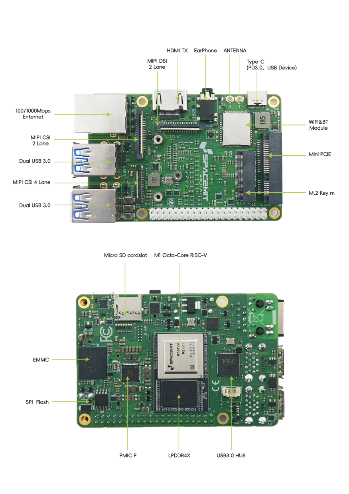

# 1.1.1 MUSE-Pi-Pro

MUSE Pi Pro 单板计算机将 RISC-V 八核处理器、存储硬盘、通用接口部件和扩展接口布置在同一块电路板上，支持 UEFI 启动以及多种操作系统和应用的运行，是一款完整的计算机系统产品。MUSE Pi Pro 为 1.8 寸单板，能够满足大语言模型应用、机器人、教育科研和物联网等场景中低功耗、空间紧凑情况下的算力需求，为 AI 新时代提供计算能力和丰富的接口扩展。

详细说明参考：[MUSE Pi Pro 用户使用指南](https://developer.spacemit.com/documentation?token=EIk1wVY9NinD95kMsw0cFM89npd#muse-pi-pro-%E7%94%A8%E6%88%B7%E4%BD%BF%E7%94%A8%E6%8C%87%E5%8D%97)

