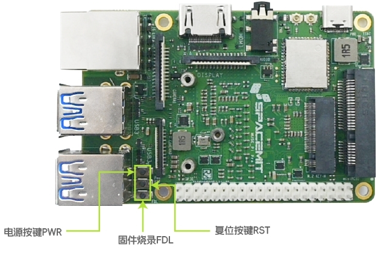

# 1.2.1 MUSE-Pi-Pro

## 按键说明

Muse Pi Pro 开发板配备多个按键，其中固件烧录时主要使用 **FDL（固件下载）按键** 和 **RST（复位）按键**。各按键在板上的具体位置如下图所示：

## Type-C 数据线烧录

本节介绍如何通过 Type-C 数据线将 PC 上已下载的固件烧录至 Muse Pi Pro 开发板。

### 固件下载

获取 ROS2_LXQT 最新版固件：[ROS2_LXQT 固件下载](https://archive.spacemit.com/ros2/bianbu-ros-images/v1.5/ROS2_LXQT-v1.5-20251216.zip)

### 刷机模式设置

请按照以下步骤将开发板切换至刷机模式：

1. 准备一根 Type-C 数据线，一端连接至上位机 PC，另一端连接至 Muse Pi Pro 的 Type-C 接口；
2. 长按 FDL 按键不松手；
3. 短按一次 RST 按键；
4. 松开 FDL 按键。

设备将进入刷机模式。

### 固件烧录工具

开发板进入刷机模式之后，请参考 [进迭时空官方刷机工具使用手册](https://developer.spacemit.com/documentation?token=O6wlwlXcoiBZUikVNh2cczhin5d) 使用刷机工具完成固件烧录。

刷机完成后，按下 RST 按键重启设备，即可启动系统。
