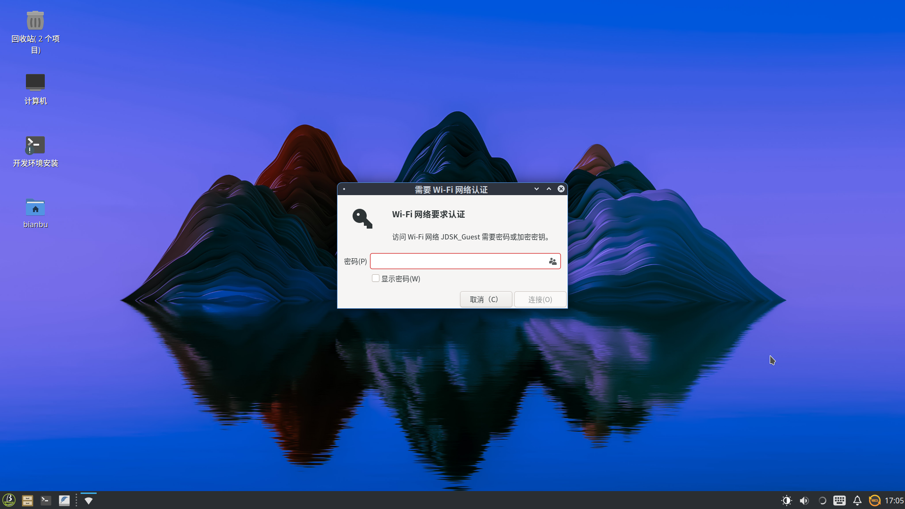

# 1.3 入门配置

本章节介绍开发者在首次启动 ROS2_LXQT 系统时需要完成的基本配置，包括网络连接、远程访问设置等内容。

## 联网设置

ROS2_LXQT 支持通过 **有线以太网** 或 **Wi-Fi 无线网络** 接入局域网，建议开发者优先完成联网配置，以便后续远程管理和系统更新。

### 连接以太网

将网线插入开发板的以太网接口，系统默认使用 DHCP 自动获取 IP 地址。通过以下命令查看当前网络状态：

```bash
ip addr
```

在输出结果中，接口名一般为 `end*`（如 `end0`），其下的 `inet` 字段即为当前 IP 地址。

### 连接 Wi-Fi

ROS2_LXQT 支持通过命令行或图形界面配置无线网络。

**方法1：命令行连接**

1）查看可用 Wi-Fi 列表

```text
nmcli device wifi list
```

该命令将列出当前可用的 Wi-Fi 网络，包括 SSID、信号强度和加密方式等信息。

2）连接到指定 Wi-Fi 网络

```bash
nmcli device wifi connect <SSID> password <your_wifi_password>
```

- `<SSID>`：目标 Wi-Fi 的网络名称；
- `<your_wifi_password>`：对应的连接密码。

连接成功后，系统会自动保存配置，并在下次启动时自动连接。

**方法2：图形界面连接**

1）鼠标右键点击系统托盘的 **网络图标**，打开网络设置选项：


2）选择 “可用网络”，在弹出的网络列表中，点击目标网络名称：


3）输入密码后，点击连接：



## 启用 SSH 服务

系统默认已启用 SSH 服务。可通过以下命令验证服务状态：

```bash
systemctl status ssh
```

若 SSH 服务未启动，可手动启动：

```bash
sudo systemctl start ssh
sudo systemctl enable ssh
```

完成配置后，可通过 PC 使用 SSH 工具远程登录，详见：[1.4 SSH 登录](1.4-远程连接.md#ssh-登录)

## 启用 VNC 服务

ROS2_LXQT 支持通过 **VNC** 协议进行图形桌面远程访问，适用于桌面操作、调试与可视化应用。

### 启动 VNC 服务

打开终端，执行以下命令以启动 VNC 服务并允许局域网访问：

```bash
wayvnc 0.0.0.0
```

上述命令将监听所有网络接口，允许局域网任意主机连接访问当前桌面。

### 限制指定主机访问

若仅希望特定客户端访问桌面，可指定其 IP 地址。例如：

```bash
wayvnc 192.168.9.109
```

仅 IP 为 `192.168.9.109` 的主机可连接访问桌面，其它设备将被拒绝。

远程桌面登录方式详见：[1.4 VNC 登录](1.4-远程连接.md#vnc-登录)
