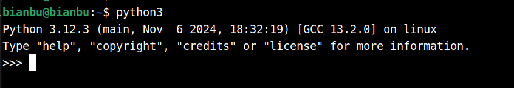
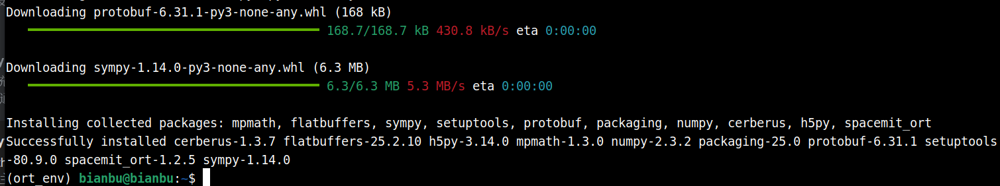

# 2.4 Python-使用

本章节主要介绍在 ROS2_LXQT 系统上使用 Python 时的一些核心要点

## 常用命令汇总

|     **作用**     |                           **命令**                           |
| :--------------: | :----------------------------------------------------------: |
| 安装虚拟环境工具 |         `sudo apt install python3-venv python3-pip`          |
|   创建虚拟环境   |                   `python3 -m venv myenv`                    |
|   激活虚拟环境   |                 `source myenv/bin/activate`                  |
| 升级 pip (重要)  |                 `pip install --upgrade pip`                  |
|   设置 pypi 源   | `pip config set global.index-url https://mirrors.aliyun.com/pypi/simple`<br />`pip config set global.extra-index-url https://git.spacemit.com/api/v4/projects/33/packages/pypi/simple` |
|   退出虚拟环境   |                         `deactivate`                         |

## 系统环境使用Python

当打开终端时，就进入了系统的默认环境，该环境内置了一个 Python 解释器，可以在终端输入 `python3` 进入解释器



按 `ctrl + D` 可以退出解释器。

`which python3` 查看 Python 解释器位置：

```text
bianbu@bianbu:~$ which python3
/usr/bin/python3
```

系统环境的 Python 包使用 `apt` 来管理而非 `pip` ，例如，要安装 Python 的科学计算库 scipy，请运行以下命令：

```text
sudo apt install python3-scipy
```

要查找使用 `apt` 发布的 Python 包，请使用 `apt search` 。在大多数情况下，Python 包使用前缀 `python3-`，例如，`python3-numpy` 对应于 Python 的 `numpy` 包。

**注意**：请不要在系统环境使用 `pip` 安装包，这是不推荐且不安全的行为。


## 使用虚拟环境

要使用虚拟环境，请创建一个容器来存储 Python 环境。您可以通过多种方法来完成此操作，具体取决于您想要使用 Python 的方式。这里以 `venv` 工具为例。

1. 在系统的 Python 环境安装 `venv` ：

   ```shell
   sudo apt install python3-venv python3-pip
   ```

2. 运行以下命令创建虚拟环境配置文件夹（其中的 `myenv` 可以替换成任何您喜欢的名字）：

   ```shell
   python3 -m venv myenv
   ```

3. 执行虚拟环境配置文件夹中的 `bin/activate` 脚本，进入虚拟环境：

   ```shell
   source myenv/bin/activate
   ```

   然后您应该会看到类似于以下内容的提示：

   ```shell
   (myenv) ➜  ~
   ```

   `myenv` 命令提示符前缀表示当前终端会话位于名为 `myenv` 虚拟环境中。

4. 检查您是否处于虚拟环境中，请使用 `pip list` 查看已安装软件包的列表：

   ```shell
   (myenv) ➜  ~ pip list
   Package Version
   ------- -------
   pip     24.0
   ```

   该列表应该比系统 Python 中安装的包列表短得多。

5. 您现在可以使用 `pip` 安全地安装软件包。
   在虚拟环境中使用 `pip` 安装的任何软件包都只会安装到该虚拟环境中。在虚拟环境中， `python` 或 `python3` 命令会自动使用虚拟环境下的 Python 软件包，而不是系统环境的 Python 包。

   为了保证 `pip` 的正常使用，请更新 `pip`

   ```text
   pip install --upgrade pip
   ```

   例如使用 `pip` 安装 `wheel` 包：

   ```shell
   (myenv) ➜  ~ pip install wheel
   Collecting wheel
     Downloading wheel-0.44.0-py3-none-any.whl.metadata (2.3 kB)
   Downloading wheel-0.44.0-py3-none-any.whl (67 kB)
      ━━━━━━━━━━━━━━━━━━━━━━━━━━━━━━━━━━━━━━━━ 67.1/67.1 kB 27.9 kB/s eta 0:00:00
   Installing collected packages: wheel
   Successfully installed wheel-0.44.0
   ```

   您可以通过执行 `python3`，然后 `import` 安装的模块来验证安装是否成功。

   ```shell
   (myenv) ➜  ~ python3
   Python 3.12.3 (main, Apr 10 2024, 05:33:47) [GCC 13.2.0] on linux
   Type "help", "copyright", "credits" or "license" for more information.
   >>> import wheel
   ```

6. 您可以使用 `sys` 模块来验证当前的解释器路径是否符合预期：

   ```shell
   >>> import sys
   >>> print("当前Python解释器路径:", sys.executable)
   当前Python解释器路径: /home/zq-card/myenv/bin/python3
   ```

7. 使用 `exit()` 退出交互式模式：

   ```shell
   >>> exit()
   (myenv) ➜  ~
   ```

8. 要离开虚拟环境，请运行以下命令：

   ```shell
   (myenv) ➜  ~ deactivate
   ```

## 设置进迭时空 PyPI 源

当您在虚拟环境中使用 pip 安装某些 Python 包时，如果这些包未提供适配于 RISC-V 架构的预编译 `whl` 安装文件，则 `pip` 会拉取包的源码在本地进行构建，对于底层依赖于 C/C++ 的 python 包而言，这个过程通常非常耗时且容易出现编译时的依赖问题。

为了提高开发效率，进迭时空为 RISC-V 架构构建了一些常用的 Python 包（如 `numpy`），这些包已经打包为 `.whl` 文件，供开发者在 RISC-V 平台上使用。本教程将指导您如何在 RISC-V 环境下安装并使用这些 Python 包。

1. 配置成额外源

   `pip` 默认支持一个主要的 `index-url`，但是您可以通过配置多个 `extra-index-url` 来添加额外的源。

   ```shell
   pip config set global.index-url https://mirrors.aliyun.com/pypi/simple/
   pip config set global.extra-index-url https://git.spacemit.com/api/v4/projects/33/packages/pypi/simple
   ```

   可以通过 `pip config list` 查看是否成功，如果成功，可以看到以下信息。

   ```shell
   global.extra-index-url='https://git.spacemit.com/api/v4/projects/33/packages/pypi/simple'
   global.index-url='https://mirrors.aliyun.com/pypi/simple/'
   ```

2. 安装 PyPI 包

   `<package_name>` 是包名。

   ```shell
   pip install --index-url https://git.spacemit.com/api/v4/projects/33/packages/pypi/simple <package_name>
   ```

## 使用 ONNX Runtime

请确保你已经完成前面章节的学习。

1. **创建虚拟环境**

   ```text
   python3 -m venv ort_env
   ```

2. **安装 `spacemit_ort`**

   ```text
   source ort_env/bin/activate
   pip install spacemit_ort
   ```

   终端输出如下：

   

3. **验证是否安装成功**

   ```shell
   python
   >>> import onnxruntime as ort
   >>> import spacemit_ort
   >>> available_providers = ort.get_available_providers()
   >>> print(available_providers)
   ['SpaceMITExecutionProvider', 'CPUExecutionProvider']
   ```

   最后输出 `['SpaceMITExecutionProvider', 'CPUExecutionProvider']` 表示安装成功。

   `Ctrl + D` 退出

4. **安装 demo 依赖**

   ```shell
   source ort_env/bin/activate
   pip install opencv-python pillow matplotlib onnx
   ```

5. **下载模型、标签和图片**

   我们提供量化好的开源模型，可从 [ModelZoo](https://archive.spacemit.com/spacemit-ai/ModelZoo/) 下载。理论上，onnx 的模型都可以推理，但性能比我们量化的差点。

   ```shell
   wget https://archive.spacemit.com/spacemit-ai/ModelZoo/classification.tar.gz
   tar -zxf classification.tar.gz
   wget -P classification https://archive.spacemit.com/spacemit-ai/ModelZoo/classification/kitten.jpg
   wget -P classification https://archive.spacemit.com/spacemit-ai/ModelZoo/classification/synset.txt
   ```

6. **运行 demo 脚本**

   生成 demo 文件
   ```text
   vim demo.py
   ```

   拷贝以下脚本到 `demo.py`里，并保存。

   ```python
   import onnx
   import numpy as np
   import onnxruntime as ort
   import spacemit_ort
   from PIL import Image
   import cv2
   import matplotlib.pyplot as plt
   import time

   # 读图片
   def get_image(path, show=False):
      with Image.open(path) as img:
        img = np.array(img.convert('RGB'))
      if show:
        plt.imshow(img)
        plt.axis('off')
      return img

   # 图片预处理
   # 预处理推理图像 -> 缩放到0~1，调整大小到256x256，取224x224的中心裁剪，标准化图像，转置为NCHW格式，转换为float32并添加一个维度以批处理图像。
   def preprocess(img):
    img = img / 255.
    img = cv2.resize(img, (256, 256))
    h, w = img.shape[0], img.shape[1]
    y0 = (h - 224) // 2
    x0 = (w - 224) // 2
    img = img[y0 : y0+224, x0 : x0+224, :]
    img = (img - [0.485, 0.456, 0.406]) / [0.229, 0.224, 0.225]
    img = np.transpose(img, axes=[2, 0, 1])
    img = img.astype(np.float32)
    img = np.expand_dims(img, axis=0)
    return img

   # 预测
   def predict(path):
    img = get_image(path, show=True)
    img = preprocess(img)
    ort_inputs = {session.get_inputs()[0].name: img}
    start = time.time()
    preds = session.run(None, ort_inputs)[0]
    end = time.time()
    preds = np.squeeze(preds)
    a = np.argsort(preds)[::-1]
    print('time=%.2fms; class=%s; probability=%f' % (round((end-start) * 1000, 2), labels[a[0]], preds[a[0]]))


   #导入模型、标签并推理
   with open('classification/synset.txt', 'r') as f:
     labels = [l.rstrip() for l in f]

   # Set the number of inference threads
   session_options = ort.SessionOptions()
   session_options.intra_op_num_threads = 2

   # IMPORTANT: Specified SpaceMITExecutionProvider providers
   session = ort.InferenceSession('classification/resnet50/resnet50.q.onnx', sess_options=session_options, providers=["SpaceMITExecutionProvider"])

   img_path = 'classification/kitten.jpg'
   predict(img_path)
   ```

   执行 demo

   ```text
   source ort_env/bin/activate
   python demo.py
   ```

   结果：

   ```shell
   time=95.15ms; class=n02123045 tabby, tabby cat; probability=13.498201
   ```

### API

更多 API 请查阅官方 [API Overview](https://onnxruntime.ai/docs/api/python/api_summary.html)。


## 使用 gpiozero

python `gpiozero` 库可用于控制板子上的引脚，实现基本输入输出、PWM 等功能

1. **系统环境安装**

   ```text
   sudo apt install python3-gpiozero
   ```

   这一步是必需的，它会开启 GPIO 的设备权限

2. **虚拟环境安装**

   ```text
   python3 -m venv gpioenv
   source gpioenv/bin/activate
   pip install gpiozero --index-url https://git.spacemit.com/api/v4/projects/33/packages/pypi/simple
   ```

   详细使用教程参考：[从 Python 使用 GPIO](https://bianbu.spacemit.com/development/python#%E4%BB%8E-python-%E4%BD%BF%E7%94%A8-gpio)
