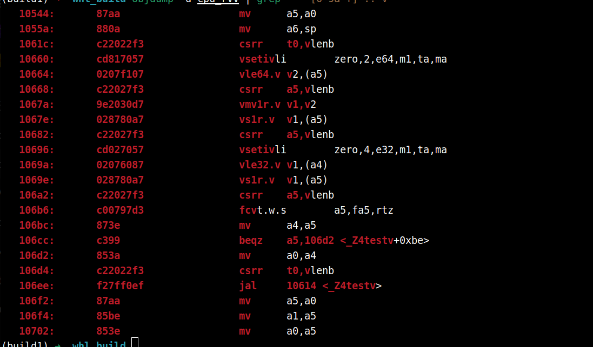
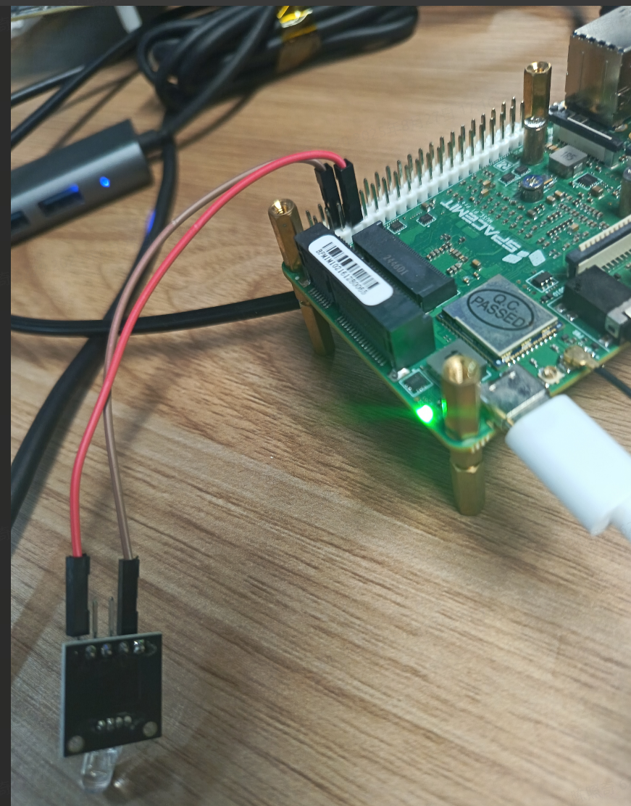

# 2.5 C++-使用指南

## 前言

### 文档目的

本文档旨在为开发者提供在 **SpacemiT RISC-V64** 原生机器上进行 C++ 开发的完整使用说明。内容涵盖从开发环境准备、编译与构建方法、常见库的使用，到面向 RISC-V64 平台的性能优化与调试技巧。
 本说明文档的目标是：

- 帮助开发者快速搭建并验证 C++ 开发环境；
- 指导开发者在 RISC-V64 平台上正确编译、运行、调试 C++ 程序；
- 提供 RISC-V64 平台相关的编译选项、指令集优化和常见问题解决方案；
- 为后续进行高性能计算、系统编程、AI/机器人开发等提供基础支撑。

### 适用环境

本说明适用于运行在 **SpacemiT RISC-V64 架构处理器** 上的原生 Linux 操作系统环境，推荐使用 ROS2_LXQT 和其他类似发行版：

- **ROS2_LXQT (推荐)**
- **Bianbu RISC-V (24.04 及以上)**
- 其他兼容 RISC-V64 的 Linux 发行版（如 Fedora RISC-V、openEuler RISC-V、Arch RISC-V 等）

运行环境的一般要求：

- 系统已预装或可通过包管理器安装 `g++`、`make`、`cmake` 等常用构建工具
- 系统提供标准 C 库（glibc 或 musl）和 C++ 标准库（libstdc++）
- 网络连接正常，以便通过 `apt`、`dnf`、`pacman` 等工具安装依赖库

------

## 开发环境准备

### 编译器

#### GCC/G++ for ROS2_LXQT

- **状态**：GCC 在 ROS2_LXQT上已经有成熟支持，其他 Bianbu 系统的使用方法相同。

- **安装**：

  ```bash
  sudo apt update
  sudo apt install build-essential g++ gcc
  ```

- **常用编译参数**：

  - `-O2/-O3/-Ofast` → 优化等级
  - `-march=rv64gc` → 指定 RISC-V 基础指令集
  - `-march=rv64gcv` → 启用向量扩展

#### Clang/LLVM 支持情况

- Clang/LLVM 的支持已进入主线，但某些优化/扩展可能不如 GCC 完善。

- 可通过包管理器安装：

  ```bash
  sudo apt install clang
  ```

- 使用时可通过 `clang++` 替代 `g++` 进行编译。

#### 验证编译器版本

```bash
g++ --version
clang++ --version
```

确认输出中包含 `riscv64` 或正确的版本号。

------

### 标准库

#### libstdc++ 状态

- `libstdc++` 是 **GNU 提供的 C++ 标准库**。它主要用于支持 C++ 语言的标准特性和库函数， 包括： 容器类、算法、 字符串类、 流和IO 、智能指针、 异常处理、 线程和并发。

- 确认方法：

  ```bash
  dpkg -L libstdc++6
  ```

#### glibc 情况

- **glibc** 是 **GNU C Library**，也就是 **GNU 提供的 C 标准库**，它和 `libstdc++` 类似，但针对 **C 语言**，同时为 C++ 提供底层支持

- **ROS2_LXQT** 使用 glibc

- 查看信息：

  ```bash
  ldd --version
  ```

#### 常用开发头文件路径

- 系统标准路径：
  - `/usr/include/`
  - `/usr/lib/riscv64-linux-gnu/` （库文件）
  - `/usr/include/c++/<版本号>/` （C++ 头文件）

------

### 构建工具

#### make

- 最常见的构建工具。

- 安装：

  ```bash
  sudo apt install make
  ```

#### cmake

- 常用的跨平台构建系统生成器。

- 安装：

  ```bash
  sudo apt install cmake
  ```

#### ninja

- 更高效的构建工具，常与 CMake 配合使用（`cmake -G Ninja`）。

- 安装：

  ```bash
  sudo apt install ninja-build
  ```

------

### 调试与性能工具

#### gdb

- GNU Debugger，支持 ROS2_LXQT。

- 安装：

  ```bash
  sudo apt install gdb
  ```

- 常用命令：`break`、`run`、`next`、`print`、`info registers`

#### perf

- Linux 的性能分析工具，可分析 CPU 指令、缓存、分支预测等。

- 安装：

  ```text
  sudo apt install linux-tools-common linux-tools-$(uname -r)
  ```

- 检查是否可用：

  ```bash
  perf stat ls
  ```

使用教程见：[perf 使用教程](https://bianbu.spacemit.com/en/brdk/Advanced_development/7.2_perf)

------

## C++ 基础使用

### Hello World 程序

最基础的 C++ 示例程序，可以验证编译器和环境是否正常工作。

```cpp
#include <iostream>

int main() {
    std::cout << "Hello, SpacemiT RISC-V64!" << std::endl;
    return 0;
}
```

#### 编译与运行

在 ROS2_LXQT 上，使用 GCC 编译：

```bash
g++ hello.cpp -o hello
./hello
```

输出应为：

```text
Hello, SpacemiT RISC-V64!
```

> 💡 提示：如果出现 `g++: command not found`，请先确认 GCC/G++ 已安装，并在 `$PATH` 中。

------

### 语言标准选择

C++ 语言标准影响可用特性和库函数。GCC/Clang 在 ROS2_LXQT 上对以下标准支持较好：

- `-std=c++11`：基础语法、lambda、智能指针等。
- `-std=c++14`：更灵活的 lambda、泛型编程改进。
- `-std=c++17`：结构化绑定、if 初始化语句、文件系统库。
- `-std=c++20`：概念（concept）、协程（coroutine）、ranges 库。
- `-std=c++23`：最新标准，部分特性仍在编译器实现中。

**使用示例**

```bash
g++ -std=c++17 hello.cpp -o hello
```

> ⚠️ 注意：SpacemiT RISC-V64 平台对新标准的支持取决于 GCC/Clang 版本，较旧发行版可能不完全支持 C++20/23。

------

### 编译优化

编译优化影响程序性能和大小，可根据需求选择不同选项。

#### 常用优化等级

| 选项     | 含义                                    |
| -------- | --------------------------------------- |
| `-O0`    | 不优化，便于调试                        |
| `-O2`    | 常用优化，平衡编译时间和性能            |
| `-O3`    | 激进优化，可能增加代码大小              |
| `-Ofast` | 激进优化 + 不完全遵守标准，追求最高性能 |

#### RISC-V 特定选项

- `-march=rv64gc`：启用 RISC-V 64 位基本整数 + 压缩 + 浮点 + 原子指令集
- `-march=rv64gcv`：启用向量扩展（RVV）

#### 链接时优化

- `-flto`（Link Time Optimization）：在链接阶段进一步优化整个程序。

```bash
g++ -O3 -march=rv64gc -flto hello.cpp -o hello
```

> 💡 提示：激进优化可能改变程序行为或使调试困难，调试阶段建议使用 `-O0`。

------

### 常见编译错误与解决方法

在  SpacemiT RISC-V64 平台上开发 C++ 程序时，可能会遇到以下常见编译错误：

#### `g++: command not found`

**原因**：系统未安装 GCC/G++。
 **解决方法**：

```bash
sudo apt update
sudo apt install build-essential g++
```

#### `error: unrecognized command line option '-march=...'`

**原因**：当前 GCC 版本不支持指定的 RISC-V 指令集扩展。
 **解决方法**：

- 查看支持的 `-march` 选项：

```bash
riscv64-linux-gnu-g++ -march=rv64g -E -v -
```

- 使用发行版提供的默认支持指令集（如 `-march=rv64gc`）。
- 必要时升级 GCC 或使用 RISC-V 官方工具链。

#### `undefined reference to 'std::...'`

**原因**：C++ 标准库未正确链接或头文件路径不匹配。
 **解决方法**：

- 确认安装了 `libstdc++`：

```bash
dpkg -L libstdc++6
```

- 确认编译器使用的标准库路径正确：

```bash
g++ -v hello.cpp
```

#### 标准不兼容错误

**示例**：

```text
error: 'concept' requires C++20
```

**原因**：使用的语言特性高于编译器默认标准。
 **解决方法**：

- 指定正确的标准：

```bash
g++ -std=c++20 hello.cpp -o hello
```

- 如果编译器版本过旧，不支持新标准，则升级 GCC 或 Clang。

#### 性能优化导致行为异常

**示例**：`-Ofast` 编译后程序输出异常或崩溃。
 **原因**：`-Ofast` 可能放宽了标准约束，浮点运算、未定义行为可能受影响。
 **解决方法**：

- 调试阶段使用 `-O0` 或 `-O2`
- 仔细检查指针、数组越界、未初始化变量等潜在问题

#### 提示(编译错误与解决方法)

- 出现错误时先确认编译器版本和平台指令集支持
- RISC-V64 平台相比 x86，某些优化或库函数行为可能略有不同
- 对于复杂项目，建议使用 CMake 或 Makefile 管理编译选项，统一标准和优化等级

------

## RISC-V64 特性与优化

### 指令集扩展

RISC-V64 平台的性能和功能很大程度上依赖于所启用的指令集扩展。

#### 常用扩展

- **RV64G** (`-march=rv64gc`)
  - 基础整数指令（I）
  - 原子指令（A）
  - 浮点指令（F/D）
  - 压缩指令（C）
  - 这是最常用的通用扩展组合，适合大多数应用
- **向量扩展（RVV）**
  - 扩展标记 `v`，可用 `-march=rv64gcv` 启用
  - 支持 SIMD 风格的向量运算，适合矩阵运算、AI 推理等高性能计算
  - 注意：硬件和工具链必须支持 RVV

#### 编译器参数示例

```bash
g++ -march=rv64gcv -O3 vec_test.cpp -o vec_test
```

- `-O3`：激进优化
- `-march=rv64gcv`：启用通用 + 压缩 + 向量扩展

#### RVV测试实例

在使用 RVV 前，建议将 GCC 升级到 14 及以上，粘贴并执行以下命令：

```bash
GCC_MAJOR=$(gcc -dumpfullversion | cut -d. -f1)

if [ "$GCC_MAJOR" -lt 14 ]; then
    echo "当前 GCC 版本为 $GCC_MAJOR，小于 14，开始安装 gcc-14 和 g++-14..."

    sudo apt install -y gcc-14 g++-14

    # 设置 update-alternatives
    sudo update-alternatives --install /usr/bin/gcc gcc /usr/bin/gcc-14 100
    sudo update-alternatives --install /usr/bin/g++ g++ /usr/bin/g++-14 100
    sudo update-alternatives --set gcc /usr/bin/gcc-14
    sudo update-alternatives --set g++ /usr/bin/g++-14

    sudo update-alternatives --install /usr/bin/riscv64-linux-gnu-gcc riscv64-linux-gnu-gcc /usr/bin/riscv64-linux-gnu-gcc-14 100
    sudo update-alternatives --install /usr/bin/riscv64-linux-gnu-g++ riscv64-linux-gnu-g++ /usr/bin/riscv64-linux-gnu-g++-14 100
    sudo update-alternatives --set riscv64-linux-gnu-gcc /usr/bin/riscv64-linux-gnu-gcc-14
    sudo update-alternatives --set riscv64-linux-gnu-g++ /usr/bin/riscv64-linux-gnu-g++-14

    echo "✅ GCC/G++ 已切换为 14"
else
    echo "✅ 当前 GCC 版本为 $GCC_MAJOR，已满足 ≥ 14，无需切换"
fi
```

**测试程序：**

```cpp
#include <stdio.h>

#if !defined(__riscv) || !defined(__riscv_v)
#error "RISC-V or vector extension(RVV) is not supported by the compiler"
#endif

#if !defined(__THEAD_VERSION__) && defined(__riscv_v_intrinsic) && __riscv_v_intrinsic < 12000
#error "Wrong intrinsics version, v0.12 or higher is required for gcc or clang"
#endif

#include <riscv_vector.h>

#ifdef __THEAD_VERSION__
int test()
{
    const float src[] = { 0.0f, 0.0f, 0.0f, 0.0f };
    uint64_t ptr[2] = {0x0908060504020100, 0xFFFFFFFF0E0D0C0A};
    vuint8m1_t a = vreinterpret_v_u64m1_u8m1(vle64_v_u64m1(ptr, 2));
    vfloat32m1_t val = vle32_v_f32m1((const float*)(src), 4);
    return (int)vfmv_f_s_f32m1_f32(val);
}
#else
int test()
{
    const float src[] = { 0.0f, 0.0f, 0.0f, 0.0f };
    uint64_t ptr[2] = {0x0908060504020100, 0xFFFFFFFF0E0D0C0A};
    vuint8m1_t a = __riscv_vreinterpret_v_u64m1_u8m1(__riscv_vle64_v_u64m1(ptr, 2));
    vfloat32m1_t val = __riscv_vle32_v_f32m1((const float*)(src), 4);
    return (int)__riscv_vfmv_f_s_f32m1_f32(val);
}
#endif

int main()
{
  printf("%d\n", test());
  return 0;
}
```

保存为 `cpu_rvv.cpp`

执行编译：

```bash
g++ -march=rv64gcv -mabi=lp64d cpu_rvv.cpp -o cpu_rvv
```

反汇编：

```CMake
objdump -d cpu_rvv | grep '^ *[0-9a-f]*:.*v'
```



带`.v` 的即为 v 指令

------

## 工程管理

在 ROS2_LXQT 平台进行 C++ 开发时，使用合适的构建系统可以有效管理源文件、依赖库和编译选项，提高开发效率。常用构建工具包括 **Makefile** 和 **CMake**。

------

### Makefile 示例

#### 简单单文件工程

Makefile

```makefile
# 变量定义
CXX = g++
CXXFLAGS = -O2 -march=rv64gc -std=c++17
TARGET = hello
SRCS = hello.cpp

# 默认目标
all: $(TARGET)

# 链接目标
$(TARGET): $(SRCS)
	$(CXX) $(CXXFLAGS) $^ -o $@

# 清理
clean:
	rm -f $(TARGET)
```

**说明**：

- `$^`：表示所有依赖文件
- `$@`：表示目标文件
- `CXXFLAGS`：可以包含优化等级、语言标准和 RISC-V 特定指令集

**使用：**

```bash
make        # 编译
make clean  # 删除生成文件
```

#### 多文件工程

```makefile
CXX = g++
CXXFLAGS = -O2 -march=rv64gc -std=c++17
TARGET = my_app
SRCS = main.cpp utils.cpp
OBJS = $(SRCS:.cpp=.o)

all: $(TARGET)

$(TARGET): $(OBJS)
	$(CXX) $(CXXFLAGS) $^ -o $@

%.o: %.cpp
	$(CXX) $(CXXFLAGS) -c $< -o $@

clean:
	rm -f $(OBJS) $(TARGET)
```

> 💡 提示：Makefile 的依赖关系可以根据头文件变化自动更新，保证增量编译高效。

------

### CMake 示例

CMake 是跨平台构建工具，更适合大型或多目录工程。

#### 单文件工程

**`CMakeLists.txt`**

```cmake
cmake_minimum_required(VERSION 3.16)
project(HelloRISCVDemo CXX)

set(CMAKE_CXX_STANDARD 17)
set(CMAKE_CXX_FLAGS "-O2 -march=rv64gc")

add_executable(hello hello.cpp)
```

**构建：**

```bash
mkdir build && cd build
cmake ..
make
./hello
```

#### 多目录工程

目录结构：

```text
my_app/
├── CMakeLists.txt
├── src/
│   ├── main.cpp
│   └── utils.cpp
└── include/
    └── utils.h
```

**顶层 `CMakeLists.txt`**

```cmake
cmake_minimum_required(VERSION 3.16)
project(MyApp CXX)

set(CMAKE_CXX_STANDARD 17)
set(CMAKE_CXX_FLAGS "-O2 -march=rv64gc")

add_subdirectory(src)
include_directories(include)
```

**`src/CMakeLists.txt`**

```cmake
add_executable(my_app main.cpp utils.cpp)
```

构建同样在 `build` 目录下执行：

```bash
cmake ..
make
```

#### 与 pkg-config 配合

如果使用外部库（如 `glib`、`SDL2`）：

```cmake
find_package(PkgConfig REQUIRED)
pkg_check_modules(GLIB REQUIRED glib-2.0)
include_directories(${GLIB_INCLUDE_DIRS})
link_directories(${GLIB_LIBRARY_DIRS})
add_executable(my_app main.cpp)
target_link_libraries(my_app ${GLIB_LIBRARIES})
```

#### CMake 提示

- CMake 支持多平台，可轻松切换 RISC-V64 或 x86 构建选项
- 使用 `pkg-config` 可以方便管理第三方库依赖

------

## 常用库

本章节示例多数直接使用 `g++` 编译，在实际项目中，你也可以使用 cmake 等来管理编译流程。

### 系统库

#### pthread

示例代码 `pthread_test.cpp`：

```cpp
#include <pthread.h>
#include <iostream>

void* thread_func(void* arg) {
    std::cout << "Hello from thread!" << std::endl;
    return nullptr;
}

int main() {
    pthread_t tid;
    pthread_create(&tid, nullptr, thread_func, nullptr);
    pthread_join(tid, nullptr);
}
```

**编译与运行**：

```bash
g++ -std=c++17 -O2 -march=rv64gc pthread_test.cpp -o pthread_test -lpthread
./pthread_test
```

------

#### dlopen / dlsym

示例代码 `dl_test.cpp`：

```cpp
#include <dlfcn.h>
#include <iostream>

int main() {
    void* handle = dlopen("libm.so", RTLD_LAZY);
    if (!handle) { std::cerr << dlerror(); return 1; }
    double (*cos_func)(double) = (double(*)(double))dlsym(handle, "cos");
    std::cout << cos_func(0.0) << std::endl;
    dlclose(handle);
}
```

**编译与运行**：

```bash
g++ -std=c++17 -O2 -march=rv64gc dl_test.cpp -o dl_test -ldl
./dl_test
```

------

### 数学 / 科学计算库

#### OpenBLAS

```text
sudo apt install libopenblas-dev
```

示例代码 `blas_test.cpp`：

```cpp
#include <cblas.h>
#include <iostream>

int main() {
    double A[4] = {1,2,3,4};
    double B[4] = {5,6,7,8};
    double C[4];
    cblas_dgemm(CblasRowMajor, CblasNoTrans, CblasNoTrans, 2, 2, 2, 1.0, A, 2, B, 2, 0.0, C, 2);
    std::cout << "C[0] = " << C[0] << std::endl;
}
```

**编译与运行**：

```bash
g++ -std=c++17 -O3 -march=rv64gcv blas_test.cpp -o blas_test -lopenblas
./blas_test
```

------

#### Eigen

```text
sudo apt install libeigen3-dev
```

示例代码 `eigen_test.cpp`：

```cpp
#include <Eigen/Dense>
#include <iostream>

int main() {
    Eigen::Matrix2d A;
    A << 1,2,3,4;
    std::cout << A << std::endl;
}
```

**编译与运行**：

```bash
g++ -std=c++17 -O2 -march=rv64gc -I/usr/include/eigen3 eigen_test.cpp -o eigen_test
./eigen_test
```

> Eigen 是头文件库，无需额外链接库

------

### 网络与系统编程

#### POSIX Socket

示例代码 `socket_test.cpp`：

```cpp
#include <sys/socket.h>
#include <netinet/in.h>
#include <iostream>

int main() {
    int sock = socket(AF_INET, SOCK_STREAM, 0);
    if (sock < 0) std::cerr << "Socket creation failed" << std::endl;
    else std::cout << "Socket created successfully" << std::endl;
}
```

**编译与运行**：

```bash
g++ -std=c++17 -O2 -march=rv64gc socket_test.cpp -o socket_test
./socket_test
```

#### Boost (Asio 示例)

```text
sudo apt install libboost-system-dev libboost-thread-dev
```

示例代码 `boost_test.cpp`：

```cpp
#include <boost/asio.hpp>
#include <iostream>

int main() {
    boost::asio::io_context io;
    std::cout << "Boost Asio io_context created" << std::endl;
}
```

**编译与运行**：

```bash
g++ -std=c++17 -O2 -march=rv64gc boost_test.cpp -o boost_test -lboost_system -pthread
./boost_test
```

------

### 图形 / 界面

#### Qt5

```text
sudo apt install qtbase5-dev
```

示例代码 `qt_test.cpp`：

```cpp
#include <QApplication>
#include <QPushButton>

int main(int argc, char** argv) {
    QApplication app(argc, argv);
    QPushButton button("Hello RISC-V Qt");
    button.show();
    return app.exec();
}
```

**编译与运行**：

注意：在本机上接入屏幕才可成功运行，ssh远程终端无法显示

```bash
g++ -std=c++17 -O2 -march=rv64gc qt_test.cpp -o qt_test $(pkg-config --cflags --libs Qt5Widgets)
./qt_test
```

------

#### SDL2

示例代码 `sdl_test.cpp`：

```cpp
#include <SDL2/SDL.h>
#include <iostream>

int main() {
    if (SDL_Init(SDL_INIT_VIDEO) != 0) {
        std::cerr << "SDL_Init Error: " << SDL_GetError() << std::endl;
        return 1;
    }
    std::cout << "SDL initialized successfully" << std::endl;
    SDL_Quit();
}
```

**编译与运行**：

注意：在本机上接入屏幕才可成功运行

```bash
g++ -std=c++17 -O2 -march=rv64gc sdl_test.cpp -o sdl_test $(sdl2-config --cflags --libs)
./sdl_test
```


## 更多使用示例

### C/C++使用GPIO

引脚定义参考：[引脚定义](https://bianbu.spacemit.com/development/python#%E8%AE%BE%E5%A4%87%E5%BC%95%E8%84%9A%E5%B8%83%E5%B1%80)

主要使用 lgpio 的 C 库来完成相应功能，官方文档：https://abyz.me.uk/lg/lgpio.html

#### 安装依赖

```text
sudo apt install liblgpio-dev python3-gpiozero
```

#### 控制LED灯

硬件连接（使用 SpacemiT MUSE Pi 开发板 70 号引脚）：



示例代码

```c++
#include <stdio.h>
#include <unistd.h>
#include <lgpio.h>

int main(void)
{
    int h;       // 芯片句柄
    int line = 70; // 你要控制的 GPIO 引脚号
    int lh;      // line handle
    int i;

    // 打开 /dev/gpiochip0
    h = lgGpiochipOpen(0);
    if (h < 0)
    {
        printf("无法打开 gpiochip0: %d\n", h);
        return 1;
    }

    // 申请 GPIO70 输出
    lh = lgGpioClaimOutput(h, 0, line, 0); // 初始为低电平
    if (lh < 0)
    {
        printf("无法申请 GPIO%d 输出: %d\n", line, lh);
        lgGpiochipClose(h);
        return 1;
    }

    // 闪烁 10 次
    for (i = 0; i < 10; i++)
    {
        lgGpioWrite(h, line, 1); // 高电平
        usleep(500000);          // 延时 0.5 秒
        lgGpioWrite(h, line, 0); // 低电平
        usleep(500000);
    }

    // 释放 GPIO
    lgGpioFree(h, line);
    lgGpiochipClose(h);

    return 0;
}

```

保存为：blink.c

编译

```text
gcc -o blink blink.c -llgpio
```

执行程序

```text
./blink
```
