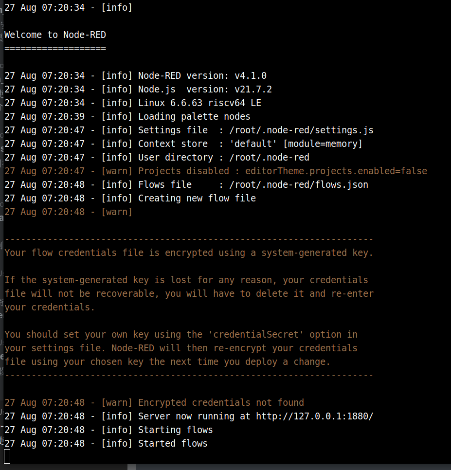
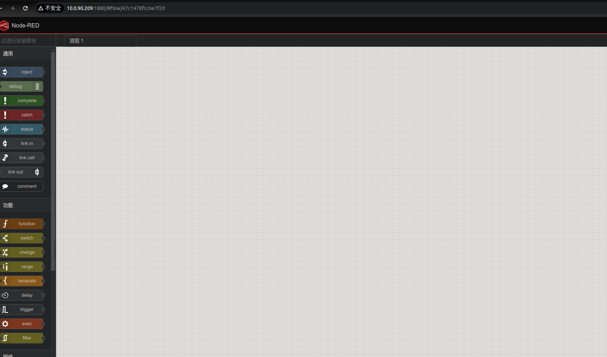

# 2.6.2 Node-RED-使用指南

## 简介

Node-RED 是一个 **基于流程（Flow-based）的可视化编程工具**，最早由 IBM 的工程师开发，现在由开源社区（JS 基金会支持）维护。它主要用于 **事件驱动的应用集成、物联网 (IoT) 开发、API 调度和自动化**。

### ✨ 核心特点

1. **低代码 / 可视化编程**

   * 使用 **拖拽式的节点（Node）** 和连线（Wire）来构建数据流（Flow）。
   * 开发者无需大量写代码，就能快速实现逻辑。

2. **基于 Node.js**

   * Node-RED 运行在 Node.js 之上。
   * 轻量化，适合嵌入式设备和云端。

3. **内置与扩展节点**

   * 自带大量节点：HTTP、MQTT、WebSocket、文件系统、函数处理等。
   * 可以通过 npm 安装第三方节点，社区贡献丰富（比如数据库、AI 服务、机器人、Slack、Telegram 集成等）。

4. **适合 IoT 场景**

   * 能够轻松接入 **传感器、设备、云服务**，比如 MQTT 消息、REST API、Modbus 协议。
   * 常用于智能家居、工业物联网。

5. **可扩展性**

   * 支持写 **JavaScript 函数节点**，自定义复杂逻辑。
   * 可与数据库（MongoDB、MySQL、Redis）、消息系统（Kafka、RabbitMQ）、AI 服务（TensorFlow\.js、OpenAI API）集成。


## 拉取镜像

运行以下命令下载最新的 Node-RED Docker 镜像：

```bash
sudo docker pull harbor.spacemit.com/bianbu-robot/node-red-image:latest
```

## 启动 Node-RED 服务

使用以下命令启动 Node-RED 服务：
```text
sudo docker run -it \
  -p 1880:1880 \
  -v node_red_data:/data \
  --name node-red-test \
  harbor.spacemit.com/bianbu-robot/node-red-image:latest
```

**命令解析:**

- `docker run` —— 运行这个容器，如果本地没有镜像，会先在本地构建镜像。
- `-it` —— 附加一个终端会话，这样你可以实时看到容器里的输出。
- `-p 1880:1880` —— 将本地主机的 1880 端口映射到容器内部的 1880 端口。
- `-v node_red_data:/data` —— 将一个名为 `node_red_data` 的 Docker 卷挂载到容器的 `/data` 目录，这样对 flow 的修改可以持久保存； 也可以直接使用本地路径代替`node_red_data`。
- `--name node-red-test` —— 给这个容器起一个本地可识别的名字。
- ` harbor.spacemit.com/bianbu-robot/node-red-image:latest` —— 使用这个镜像作为基础镜像。

**终端打印：**



## 访问 Node-RED 界面

在 X86 PC 上访问：http://board_ip:1880/

其中 `board_ip` 是开发板的 IP 地址。

打开后，页面如下：



## 容器管理

- 可以分离终端，先 **Ctrl+p** 后 **Ctrl+q**，容器将继续在**后台运行**

- 要**重新连接**到终端（查看日志），可以运行：

   ```bash
   docker attach node-red-test
   ```

- 如果需要**重启容器**（例如系统重启或 Docker 服务重启后），可以运行：

   ```bash
   docker start node-red-test
   ```

- 需要**停止容器**时，运行：

   ```bash
   docker stop node-red-test
   ```

## 学习更多

现在，你可以参考[Node-RED 官方教程](https://nodered.org/docs/tutorials/first-flow)完成更多功能
