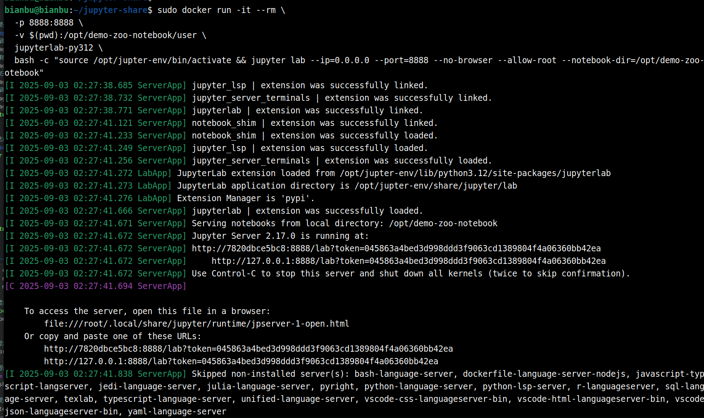
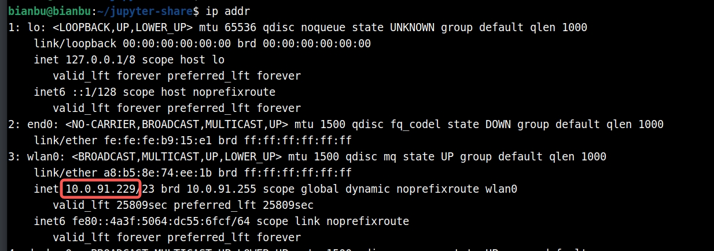
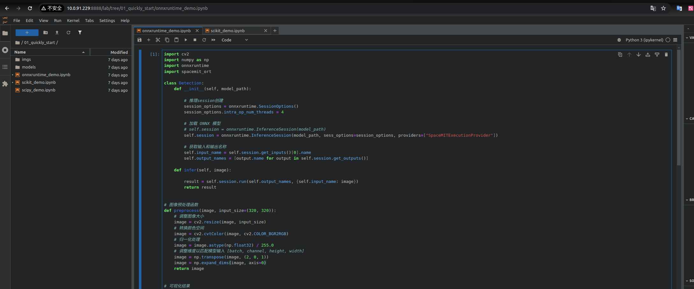
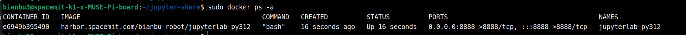
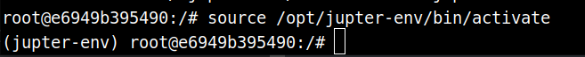

# 2.6.3 JupyterLab-使用指南

本指南介绍如何在边部系统中通过 Docker 容器运行 **JupyterLab**。

## 拉取基础镜像

下载最新的 JupyterLab 镜像
```text
sudo docker pull harbor.spacemit.com/bianbu-robot/jupyterlab-py312:latest
```

## 启动 JupyterLab 服务

### 方法一：快速开始

此方法启动一个临时容器，停止后会自动删除。

首先，创建一个共享笔记本的文件夹：

```bash
mkdir jupyter-share && cd jupyter-share/
```

然后，运行容器：

```bash
sudo docker run -it --rm \
  -p 8888:8888 \
  -v $(pwd):/opt/demo-zoo-notebook/user \
  harbor.spacemit.com/bianbu-robot/jupyterlab-py312 \
  bash -c "source /opt/jupter-env/bin/activate && jupyter lab --ip=0.0.0.0 --port=8888 --no-browser --allow-root --notebook-dir=/opt/demo-zoo-notebook"
```

**命令解析**

- `docker run` —— 运行这个容器，如果本地没有镜像，会先在本地构建镜像。
- `-it` —— 附加一个终端会话，这样你可以实时看到容器里的输出。
- `--rm` —— 退出后直接删除容器，适合进行快速尝试的场景。
- `-p 8888:8888` —— 将本地主机的 8888 端口映射到容器内部的 8888 端口。
- `-v $(pwd):/opt/demo-zoo-notebook/user` —— 将当前目录挂载到容器的 `/opt/user` 目录，这样可以方便地拷贝文件。
- `harbor.spacemit.com/bianbu-robot/jupyterlab-py312` —— 使用这个镜像作为基础镜像。
- `bash -c ...` —— jupyter服务的启动命令，如果你需要基于容器进行定制，可以进入容器执行完相应操作后再执行此命令。

**终端输出示例：**



**访问 JupyterLab：**

1. 复制 URL：
   `http://127.0.0.1:8888/lab?token=045863a4bed3d998ddd3f9063cd1389804f4a06360bb42ea`

2. 将 `127.0.0.1` 替换为你的开发板 IP 地址。例如：
   


   如果开发板 IP 是 `10.0.91.229`，URL 变为：

   `http://10.0.91.229:8888/lab?token=045863a4bed3d998ddd3f9063cd1389804f4a06360bb42ea`

3. 从 X86 PC 访问：
   `http://10.0.91.229:8888/lab?token=045863a4bed3d998ddd3f9063cd1389804f4a06360bb42ea`

   JupyterLab 界面如下：
   

**注意：** 当你结束当前终端后，启动的容器也将被删除。

如上图所示，容器内有一些**快速开始示例**，你可以运行他们来体验功能。

### 方法二：后台容器（用于定制）

如果需要修改容器或需要持续运行，请使用此方法。

1. **在后台创建容器**

   ```bash
   sudo docker run -itd \
     -p 8888:8888 \
     -v $(pwd):/opt/demo-zoo-notebook/user \
     --name jupyterlab-py312 \
     harbor.spacemit.com/bianbu-robot/jupyterlab-py312
   ```

   验证容器是否运行：

   ```bash
   sudo docker ps -a
   ```

   输出示例：
   

2. **在容器内启动 JupyterLab 服务**

   ```bash
   sudo docker exec -it jupyterlab-py312 bash
   ```

   激活虚拟环境：

   ```bash
   source /opt/jupter-env/bin/activate
   ```

   输出示例：

   

   启动 JupyterLab：

   ```bash
   jupyter lab --ip=0.0.0.0 --port=8888 --no-browser --allow-root --notebook-dir=/opt/demo-zoo-notebook
   ```

## 访问 JupyterLab（两种方法相同）

无论使用哪种方法启动 JupyterLab，访问方式都是一样的：

1. **从终端输出获取访问 URL**
2. **将 `127.0.0.1` 替换为开发板的实际 IP 地址**
3. **在 PC 的网页浏览器中打开 URL**

你可以参考 [Jupyter 官方文档](https://docs.jupyter.org/en/latest/start/index.html) 学习更多功能。
