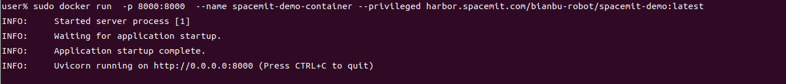
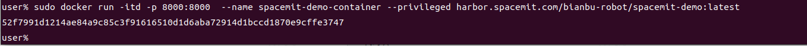
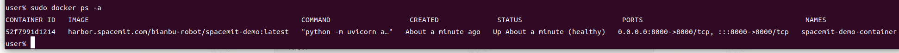
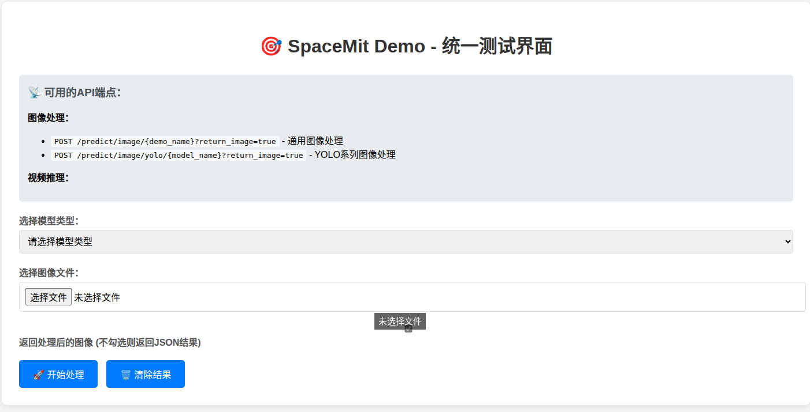
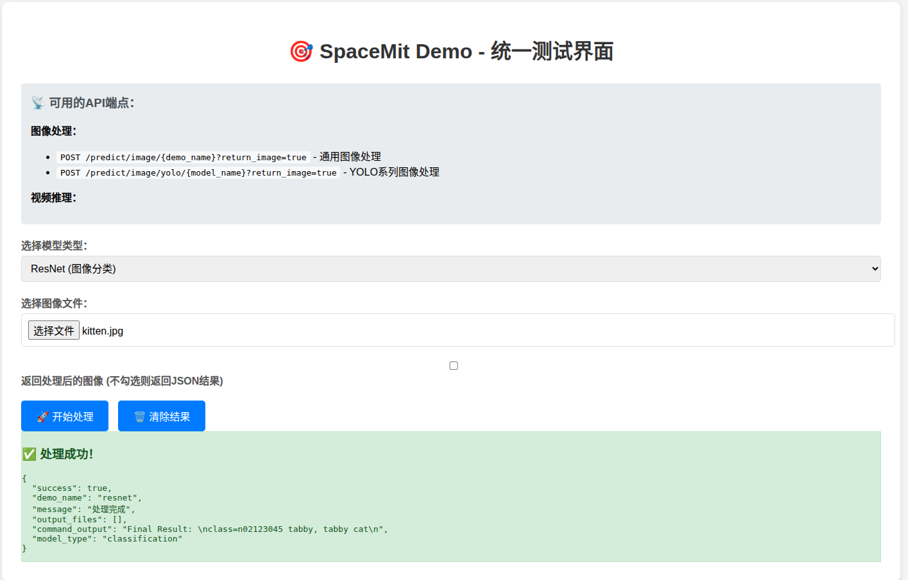
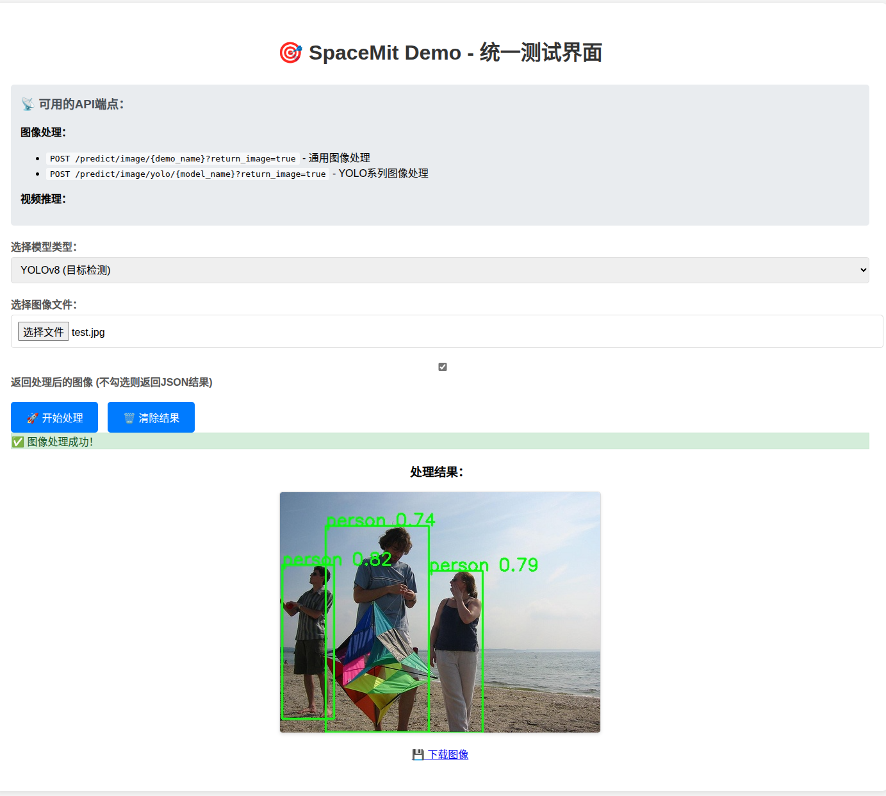

# 2.6.4 DemoZoo-容器使用指南

```text
最新版本：2025/09/25
```

本指南将介绍如何在 Bianbu 系统中使用 Docker 容器运行 **DemoZoo**，并演示常见模型的调用方法。

## DemoZoo 支持的模型

### 图像分类模型 (6个)

- **EfficientNet** - 高效图像分类
- **ResNet** - 深度残差网络分类
- **MobileNetV2** - 轻量级图像分类
- **InceptionV1** - Inception 网络分类
- **InceptionV3** - 改进的 Inception 网络分类
- **Swin-Tiny** - 基于 Swin Transformer 的分类

### 图像分割模型 (5个)

- **CLIP** - 基于文本提示的图像分割
- **FCN** - 全卷积网络语义分割
- **UNet** - U 型网络图像分割
- **SAM** - 分割一切模型
- **YOLOv8-Seg** - YOLO 实例分割

### 目标检测模型 (6个)

- **YOLOv8** - 最新 YOLO 目标检测
- **YOLOv8-Pose** - 姿态检测
- **YOLOv5** - YOLO 第五代
- **YOLOv5-Face** - 人脸检测
- **YOLOv6** - YOLO 第六代
- **YOLOv11** - YOLO 第十一代

### 人脸识别模型 (1个)

- **ArcFace** - 人脸识别相似度计算

## 拉取镜像

```shell
sudo docker pull harbor.spacemit.com/bianbu-robot/spacemit-demo:latest
```

## 启动方法

### 方法一：直接启动

```shell
sudo docker run  -p 8000:8000  --name spacemit-demo-container --privileged harbor.spacemit.com/bianbu-robot/spacemit-demo:latest
```

运行情况如下图：


### 方法二：后台启动

```shell
sudo docker run -itd -p 8000:8000  --name spacemit-demo-container --privileged harbor.spacemit.com/bianbu-robot/spacemit-demo:latest
```

运行情况如下图：



此时容器运行在后台，可使用以下命令查看容器运行情况

```shell
sudo docker ps -a
```

容器后台运行如图：



**注意：** 如果使用直接启动，关闭终端后容器会自动停止。后台运行的容器则需要手动停止，否则会一直占用系统资源。

## 调用 DemoZoo

### 检查命令

```shell
# 检查所有模型文件状态
curl http://localhost:8000/models/status

# 获取模型列表
curl http://localhost:8000/models

# 容器健康检查
curl http://localhost:8000/health
```

### 在终端调用模型

```bash
# ResNet图像分类
curl -X POST "http://localhost:8000/predict/resnet" \
  -F "image=@test_image.jpg"

# EfficientNet图像分类
curl -X POST "http://localhost:8000/predict/efficientnet" \
  -F "image=@test_image.jpg"

# InceptionV3图像分类
curl -X POST "http://localhost:8000/predict/inception_v3" \
  -F "image=@test_image.jpg"

# ArcFace人脸相似度计算
curl -X POST "http://localhost:8000/predict/arcface" \
  -F "image1=@face1.jpg" \
  -F "image2=@face2.jpg"

# CLIP文本提示分割
curl -X POST "http://localhost:8000/predict/clip" \
  -F "image=@test_image.jpg" \
  -F "text=dog"

# FCN语义分割
curl -X POST "http://localhost:8000/predict/fcn" \
  -F "image=@test_image.jpg"

# UNet图像分割
curl -X POST "http://localhost:8000/predict/unet" \
  -F "image=@test_image.jpg"

# SAM图像分割
curl -X POST "http://localhost:8000/predict/sam" \
  -F "image=@test_image.jpg"

# YOLOv8实例分割
curl -X POST "http://localhost:8000/predict/yolov8_seg" \
  -F "image=@test_image.jpg"

# YOLOv8目标检测
curl -X POST "http://localhost:8000/predict/yolov8" \
  -F "image=@test_image.jpg"

# YOLOv8姿态检测
curl -X POST "http://localhost:8000/predict/yolov8_pose" \
  -F "image=@test_image.jpg"

# YOLOv5目标检测
curl -X POST "http://localhost:8000/predict/yolov5" \
  -F "image=@test_image.jpg"

# YOLOv5人脸检测
curl -X POST "http://localhost:8000/predict/yolov5_face" \
  -F "image=@test_image.jpg"

```

终端调用后通常返回 JSON 格式的结果，例如：

```json
{
  "success": true,
  "predicted_class": "tabby cat",
  "output": "Final Result: \nclass=tabby cat"
}
```

### 网页调用

在浏览器地址栏输入 [http://localhost:8000/](http://localhost:8000/) 即可访问 DemoZoo 页面：



分类模型结果：



检测模型结果：


