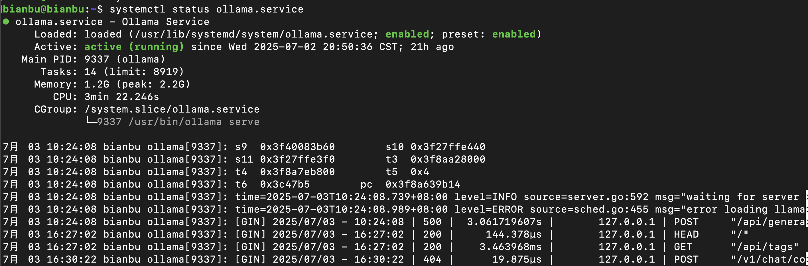

# 2.7 开机自启

本节介绍如何将你的程序设置为开机自启服务。以 systemd 用户服务为例，适用于 bianbu 系统。

## 步骤一：准备你的自启程序

假设你有程序需要开机自启，如：
- Python 脚本：`python demo.py`
- Bash 脚本：`bash executable_file`
- Node.js 项目：`npm run xxx`

请确保这些程序在命令行下可以正常运行。

## 步骤二：编写 systemd 服务文件

在你的工作目录下新建一个 `demo.service` 文件，内容如下：

```ini
[Unit]
Description=Demo Service

[Service]
Type=simple
WorkingDirectory=/path/to/your/workspace
ExecStart=/bin/bash -c 'exec /path/to/your/workspace/executable_file'
Restart=on-failure
StandardOutput=journal
StandardError=journal
Environment=SYSTEMD_LOG_LEVEL=debug
Environment=PYTHONPATH=/if/you/need

[Install]
WantedBy=default.target
```

> **注意：**
> - `WorkingDirectory` 填写你的工作目录路径。
> - `ExecStart` 填写你的启动命令或可执行文件路径。
> - 如需设置环境变量，可在 `Environment` 行添加。

## 步骤三：安装服务文件

将 `demo.service` 文件复制到 `~/.config/systemd/user/` 或 `/usr/lib/systemd/user/` 目录下（推荐使用前者，用户级服务无需 root 权限）。

```bash
mkdir -p ~/.config/systemd/user
cp demo.service ~/.config/systemd/user/
```

## 步骤四：激活并启动服务

1. 使服务开机自启：
   ```bash
   systemctl --user enable demo.service
   ```
2. 启动服务：
   ```bash
   systemctl --user start demo.service
   ```
3. 查看服务状态：
   ```bash
   systemctl --user status demo.service
   ```

running表示服务正在运行：




## 步骤五：验证开机自启

重启电脑后，服务会自动启动。你可以通过 `systemctl --user status demo.service` 查看服务运行情况。

## 常见问题
- 如遇权限问题，请确保你的用户已启用 systemd 用户实例。
- 日志可通过 `journalctl --user -u demo.service` 查看。
- 若服务未自动启动，请检查服务文件路径、权限及 ExecStart 命令是否正确。
