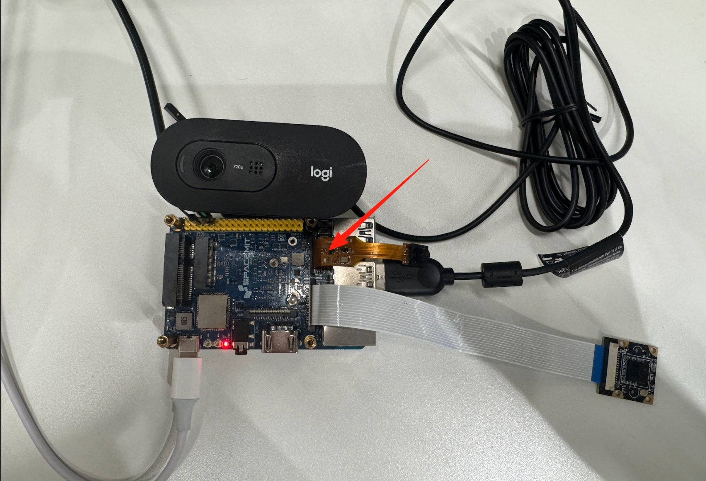
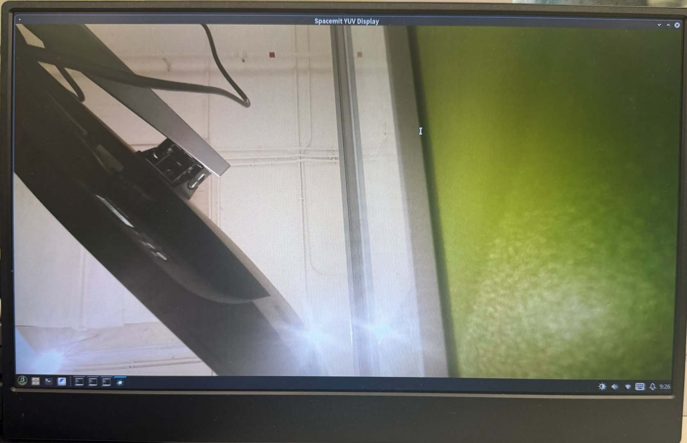

# 3.1.1 MIPI-相机使用说明

## 环境准备

### 硬件连接

请将 MIPI 摄像头模组连接至开发板的 MIPI CSI 接口。具体连接方式可参考下图所示：



同时，开发板与显示器之间请使用 HDMI 线缆进行连接，以便输出图像画面。

## 设备测试

### 自动识别摄像头类型

首先确认摄像头所连接的 MIPI CSI 接口编号。例如若连接至 CSI1，则运行以下命令：

```bash
cam-test /usr/share/camera_json/csi1_camera_detect.json
```

若摄像头为已支持型号，系统将自动识别，并输出如下日志，同时在 `/tmp/` 目录下生成配置文件：

```text
...
I: ./sensors/cam_sensors_module.c(239): "detect imx219_spm sensors in csi3: success, set 1920x1080 to 1920x1080"
I: auto_detect_camera(1430): "auto detect sensor ===================== finish "
E: update_json_file(709): "Open /usr/share/camera_json/csi3_camera_auto.json file fail"
E: update_json_file(709): "Open /usr/share/csi3_camera_auto.json file fail"
I: update_json_file(723): "save json to /tmp/csi1_camera_auto.json success"
```

> ⚠️ 若无法确认 CSI 接口编号，请参考 [MUSE 系列开发板用户手册](https://developer.spacemit.com/documentation?token=FpxwwKJc8iGvTdkuLihcxQZMnle) 或尝试 CSI1 ~ CSI3 接口逐个测试。若均无法识别，可能为硬件故障或未适配的摄像头，后者情况下，建议参考官方文档 [Camera 快速点亮导览](https://bianbu-linux.spacemit.com/camera/camera_development_guide/#camera-快速点亮导览) 进行适配操作。

### 配置 Virtuall Camera 模型

将自动生成的摄像头配置文件复制至指定路径，并重命名为 `svivi_cam1.json`：

```bash
sudo cp /tmp/csi1_camera_auto.json /root/svivi_cam1.json
```

打开该 JSON 文件，在顶层添加如下字段以启用 Virtual Camera 模式：

```bash
"use_v4l": 1
```

### 使用 V4L2 出图测试验证

使用调试工具 `v4l2_test_spacemit` 进行图像采集测试。

下载安装与编译：

```bash
mkdir v4l2_test_spacemit
wget https://archive.spacemit.com/ros2/code/v4l2_test_spacemit.tar.gz
tar xvzf v4l2_test_spacemit.tar.gz
gcc v4l2_capture.c v4l2_main.c v4l2_output.c v4l2_stream.c v4l2_common.c -o v4l2_test_spacemit --static
```

执行采图命令：

```bash
./v4l2_test_spacemit \
  --device /dev/video50 \
  --set-fmt-video width=1920,height=1080,pixelformat=NV12 \
  --verbose \
  --stream-dmabuf \
  --stream-loop \
  --stream-save 10 \
  --stream-to=test.yuv
```

正常输出示例：

```bash
...
VIDIOC_DQBUF: ok, type:9
VIDIOC_QBUF: ok, type:9
do_handle_cap:723 [INFO]m2m capture dequeue----------------: 15
...
```

> 使用 `Ctrl+C` 可中断采集
>
> ⚠️ 注意事项：
>
> - 最大支持分辨率为 **1920×1080（1080p）**
> - 仅支持图像格式：**NV12**
> - 内存类型要求：**dmabuf**

至此，说明 MIPI 摄像头可用，可以进行后续流程。

### <!--virtual camera 驱动适配-->

<!--若应用需接入 virtual camera 驱动，请参考 [v4l2_test_spacemit](https://archive.spacemit.com/ros2/code/v4l2_test_spacemit.tar.gz) 的 DMABUF 使用方式，完成如下适配：-->

<!--1. 遵循标准 ioctl 图像采集流程-->

<!--2. 使用 `/dev/dma_heap/` 节点申请 DMABUF，申请时需设置：`heap_flags = 0xf0` -->

<!--如果使用的应用框架已完成对 virtual camera 驱动的适配，仅需直接指定 `/dev/video50` 进行图像采集。-->

## 高级开发：C++ SDK 使用示例

使用JDK 提供的 SDK 实例更高级别控制和图像处理功能

### C++样例代码

```c++
auto camera = JdkCamera::create("/dev/video50", 1920, 1080, V4L2_PIX_FMT_NV12);
auto jdkvo = std::make_shared<JdkVo>(1920, 1080, PIXEL_FORMAT_NV12);
auto frame = camera->getFrame();
auto ret = jdkvo->sendFrame(frame);
```

## 快速集成：JDK 摄像头采集 SDK

### JDK SDK 下载与安装

```shell
wget https://archive.spacemit.com/ros2/code/jdk_sdk.tar.gz
sudo tar xvf jdk_sdk.tar.gz -C /opt/
mv /opt/jdk_sdk /opt/jdk
```

目录结构如下：

```shell
/opt/jdk
├── include
├── jdk_examples
├── ko
├── lib
├── Makefile
└── README.md
```

### 下载与解压 jdk_cam

```text
wget https://archive.spacemit.com/ros2/code/jdk_cam.tar
tar xvf jdk_cam.tar
```

目录结构如下：

```shell
jdk_cam/
├── Makefile
├── src/main.cpp
└── workspace/
```

### 编译运行

~~~shell
cd jdk_cam
make all
insmod /opt/jdk/ko/jdk_dma.ko
./workspace/jdk_cam /dev/video50
~~~

### 启动日志示例

~~~shell
start buffer preprocessing
start buffer queue
VIDIOC_STREAMON succeeded
[MPP-DEBUG] 10419:VO_CreateChannel:43 create VO Channel success!
[MPP-DEBUG] 10419:module_init:159 +++++++++++++++ module init, module type = 101
[MPP-DEBUG] 10419:check_vo_sdl2:121 yeah! have vo_sdl2---------------
[MPP-DEBUG] 10419:find_vo_sdl2_plugin:86 yeah! we have vo_sdl2_plugin plugin---------------
[MPP-DEBUG] 10419:module_init:207 ++++++++++ VO_SDL2 (/usr/lib/libvo_sdl2_plugin.so)
[MPP-DEBUG] 10419:module_init:207 ++++++++++ open (/usr/lib/libvo_sdl2_plugin.so) success !
[MPP-ERROR] 10419:al_vo_init:93 SDL could not initialize! SDL_Error: wayland not available
[MPP-ERROR] 10419:al_vo_init:128 k1 vo_sdl2 init fail
[MPP-DEBUG] 10419:VO_Init:66 init VO Channel, ret = -400
[MPP-ERROR] 10419:JdkVo:32 VO_init failed, please check!
[MPP-DEBUG] 10419:VO_Process:82 vo one packet, ret = 0
index:0,dma_fd:12 width:1920,height:1080,size:3110400
~~~

## 运行效果

程序运行后，摄像头采集到的图像将在显示器上实时呈现，如下图所示：




## 常见问题与建议

| 问题           | 说明                                            |
| -------------- | ----------------------------------------------- |
| 检测不到摄像头 | 检查 CSI 接口连接、尝试其他端口、确认摄像头型号 |
| 配置文件未生成 | 可能摄像头未被识别，或驱动不支持                |
| SDL 报错       | 系统图形库依赖缺失，不影响摄像头采集功能        |
| 图像不显示     | 检查 vo 初始化日志、确认使用的显示通道和权限    |
