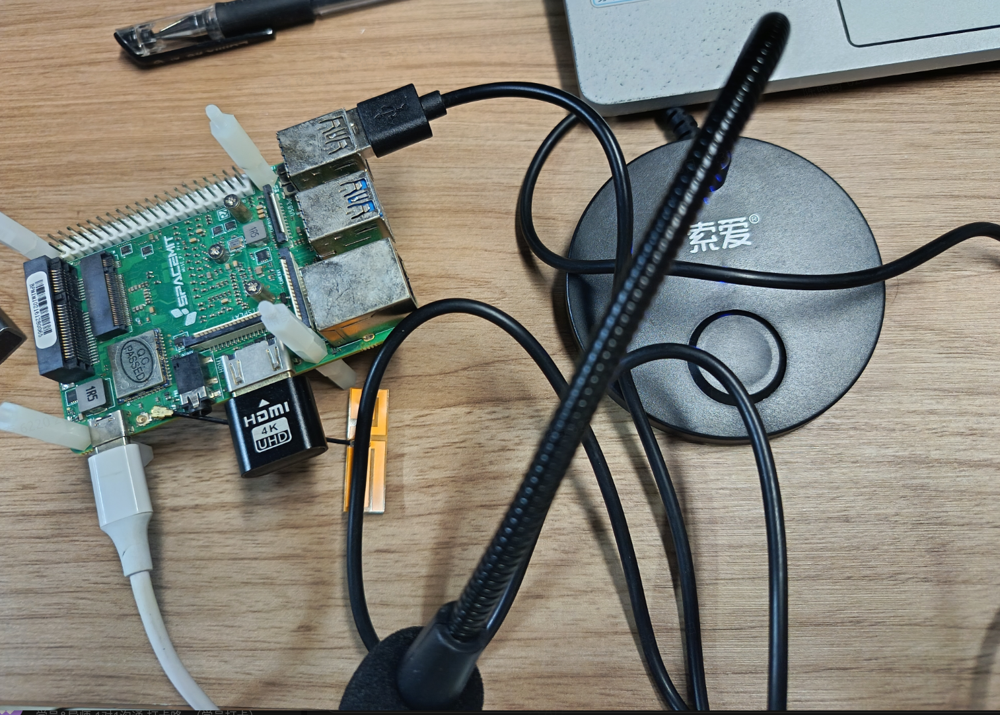
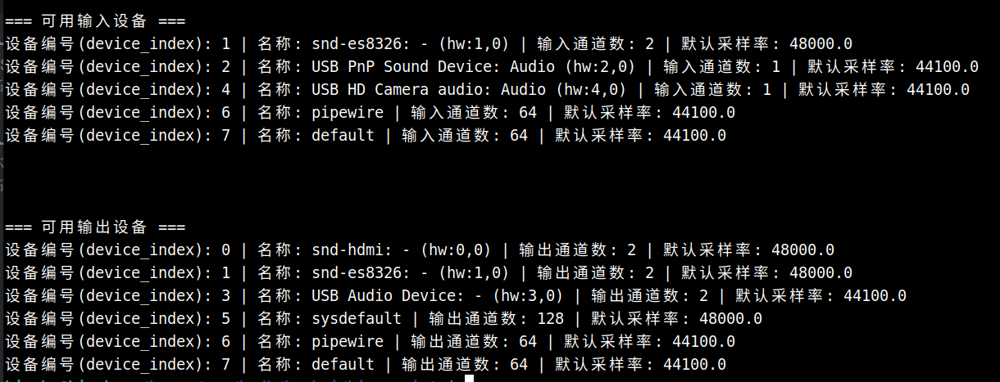

# 1. 麦克风硬件调试说明

## 支持的硬件与协议

- **硬件接口**：
  - USB 麦克风
  - USB 声卡
  - 板载 I²S 麦克风（部分板子没有）
- **协议**：
  - ALSA (Advanced Linux Sound Architecture)
  - PulseAudio（可选，主要用于开发/调试）

## 软硬件环境

- **操作系统**：ROS2_LXQT 系统
- **推荐硬件**：SpacemiT **MUSE Pi Pro** 开发板
- **依赖工具（开发/调试阶段常用）**：
  - `audioscan` （打印所有可用的录音和播放设备的信息）
  - `arecord` （ALSA 命令行录音工具）
  - `aplay` （ALSA 命令行播放工具）
  - `alsamixer` （命令行音量控制）

## 系统依赖

```text
sudo apt install python3-pyaudio python3-scipy libfftw3-dev \
portaudio19-dev libsndfile1-dev libcurl4-openssl-dev espeak-ng
```


## 麦克风连接示意

- 将 USB 麦克风插入 **MUSE Pi Pro** 的 USB 接口



## 添加到音频组

普通用户默认可能没有访问音频设备权限，需要加入 **audio** 用户组：

```bash
sudo usermod -aG audio $USER
```

执行后需要重新登录终端，才能生效。

## 确认音频设备号

使用 `audioscan` 查询系统中可用的音频设备：

```bash
audioscan
```

示例输出：



录音设备为输入设备，请忽略输出设备

说明：

- `device_index` 为 2 的是这里的 USB 麦克风（可以插拔设备对比确认）
- 完整设备号为 **hw:2,0**

## 确认支持频率

```text
arecord -D hw:2,0 --dump-hw-params
```

**示例输出**


意义解释

```text
--------------------
ACCESS:  MMAP_INTERLEAVED RW_INTERLEAVED # 数据访问方式，RW_INTERLEAVED：常见方式，多个声道的数据交错存储（如 L,R,L,R...）;MMAP_INTERLEAVED：内存映射方式，性能更好，但使用更复杂。
FORMAT:  S16_LE               # S16_LE：16 位有符号整型，小端字节序（常用）。
SUBFORMAT:  STD               # 标准 PCM（脉冲编码调制），常规音频格式。
SAMPLE_BITS: 16               # 每个采样点占用的比特数（这里 16 bit）。
FRAME_BITS: 16                # 每帧占用的比特数（因为是单声道，这里和 SAMPLE_BITS 一样也是 16）。
CHANNELS: 1                   # 声道数
RATE: [44100 48000]           # 支持的采样率范围,这里表示 支持 44.1 kHz 和 48 kHz。
PERIOD_TIME: [1000 1000000]   # 每个周期的时间长度（单位：微秒 us）。
PERIOD_SIZE: [45 48000]       # 每个周期的采样点数，最小 45 点，最大 48000 点
PERIOD_BYTES: [90 96000]      # 每个周期对应的字节数，因为是 16bit 单声道，所以等于 PERIOD_SIZE × 2
PERIODS: [2 1024]             # 环形缓冲区由多少个周期组成，至少 2 个，最多 1024 个。
BUFFER_TIME: [1875 2000000]   # 总缓冲区时间长度（us），这里表示缓冲时间最小 1.875ms，最大 2000ms。
BUFFER_SIZE: [90 96000]       # 缓冲区能容纳的采样点数
BUFFER_BYTES: [180 192000]    # 缓冲区字节数，因为是单声道 16bit，所以等于 BUFFER_SIZE × 2
TICK_TIME: ALL                # 定时粒度，ALL 表示不限制，通常由驱动决定
--------------------
```

**这里选择采样率为 48000**，44100 也可以

测试录音：

```bash
arecord -D hw:2,0 -f S16_LE -r 48000 -c 1 test.wav
```
