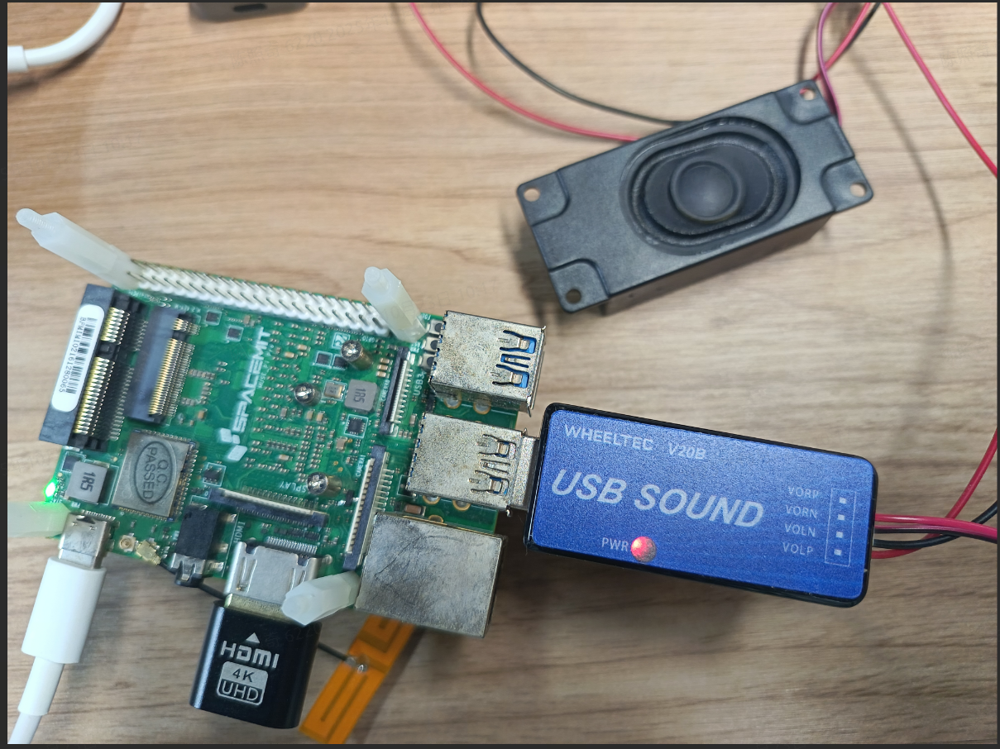
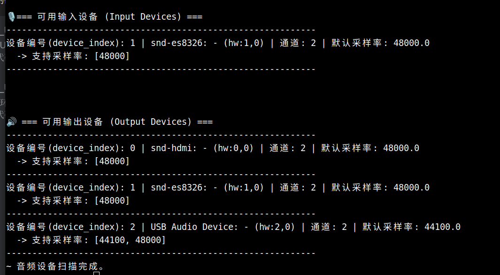
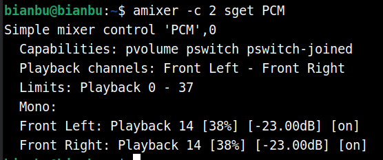
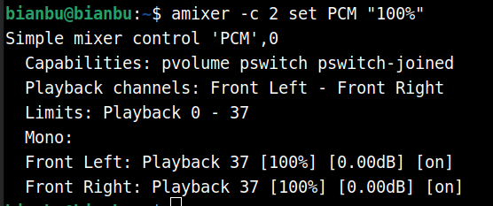

# 2. 扬声器硬件调试说明

## 支持的硬件与协议

- **硬件接口**：
  - USB 扬声器
  - USB 声卡
  - HDMI 扬声器
- **协议**：
  - ALSA (Advanced Linux Sound Architecture)
  - PulseAudio（可选，主要用于开发/调试）

## 软硬件环境

- **操作系统**：ROS2_LXQT 系统
- **推荐硬件**：SpacemiT **MUSE Pi Pro** 开发板
- **依赖工具（开发/调试阶段常用）**：
  - `audioscan` （打印所有可用的录音和播放设备的信息）
  - `aplay` （ALSA 命令行播放工具）
  - `amixer` （命令行音量控制）

## 系统依赖

```text
sudo apt install python3-pyaudio python3-scipy libfftw3-dev \
portaudio19-dev libsndfile1-dev libcurl4-openssl-dev espeak-ng
```


## 扬声器连接示意

- 将 USB 麦克风插入 **MUSE Pi Pro** 的 USB 接口
- 可以选用其他可在 linux 下工作的 USB 扬声器



## 添加到音频组

普通用户默认可能没有访问音频设备权限，需要加入 **audio** 用户组：

```bash
sudo usermod -aG audio $USER
```

执行后需要重新登录终端，才能生效。

## 确认音频设备号

使用 `audioscan` 查询系统中可用的音频设备：

```bash
audioscan
```

示例输出：



请忽略输入设备

说明：

- `device_index` 为 2 的是这里的 USB 扬声器（可以插拔设备对比确认）
- 完整设备号为 **hw:2,0**

**这里选择采样率为 48000**，44100 也可以

测试播放：

```bash
aplay -D "plughw:2,0" test.wav
```


## 播放音量设置

查看指定声卡的音量

```text
amixer -c 2 sget PCM
```

通过 `-c` 参数指定声卡编号

终端打印：



**设置音量**

```text
amixer -c 2 set PCM "100%"
```

打印如下：


