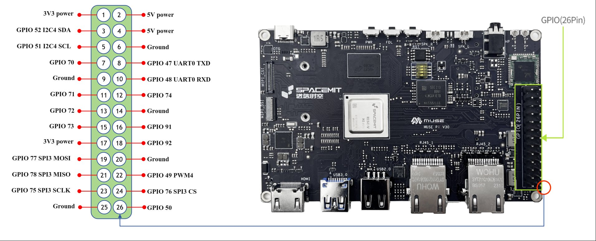
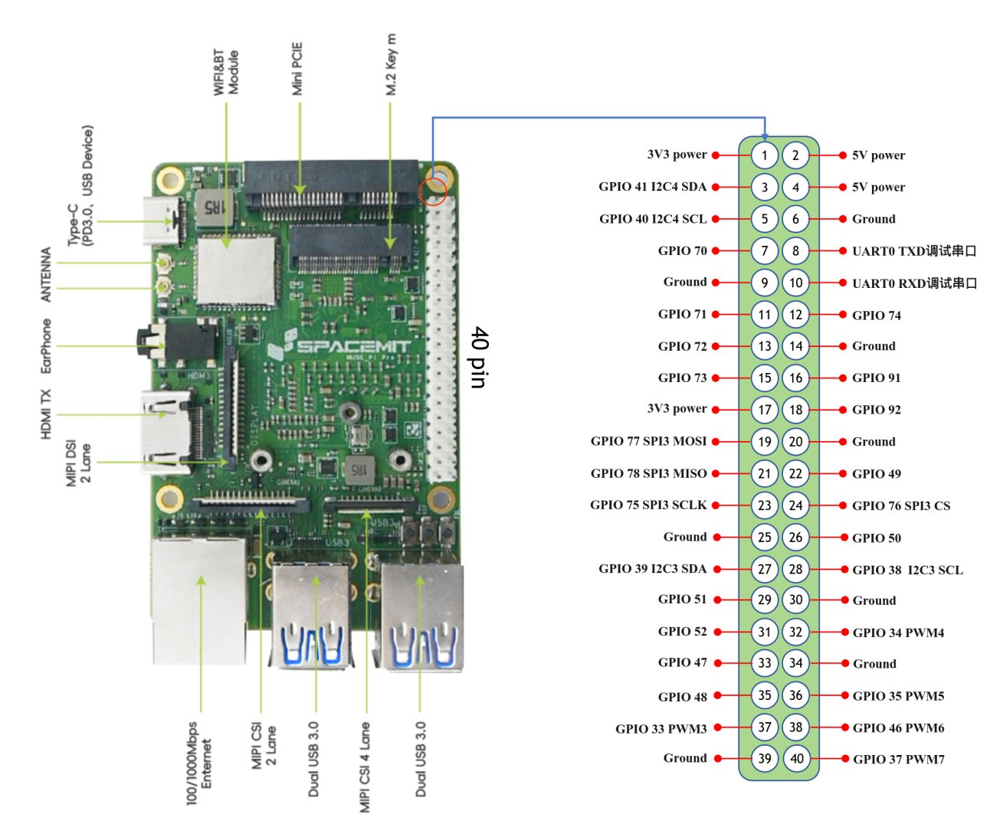
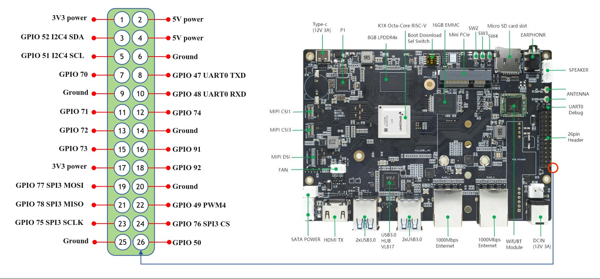
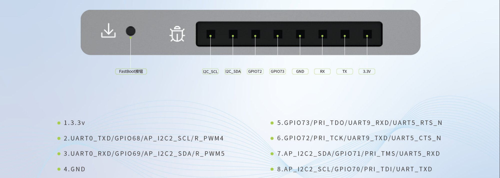
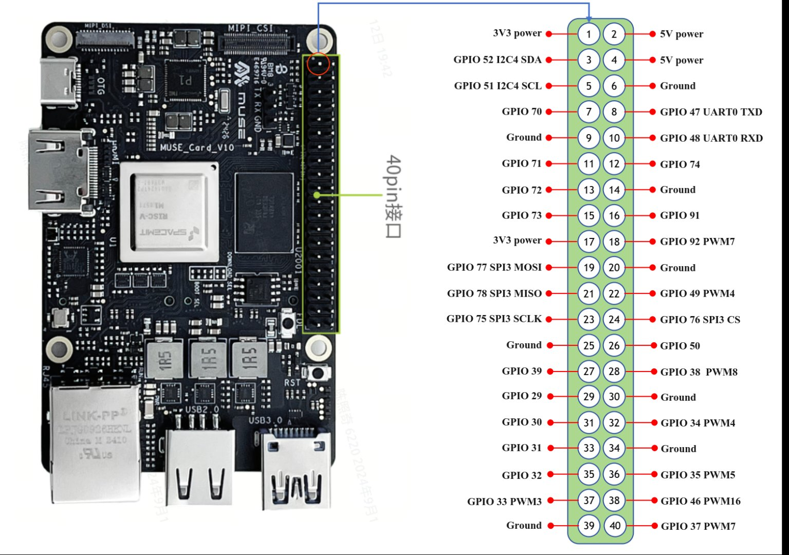
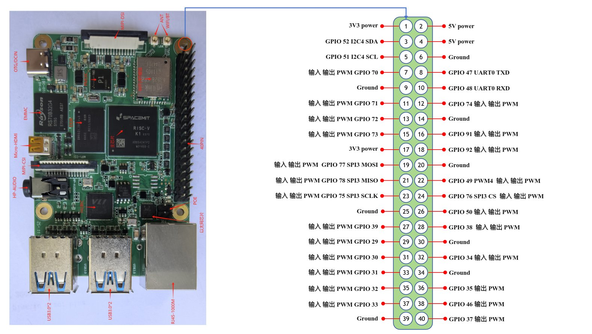

# 3.3.1 引脚定义说明

```text
最新版本：2025/09/26
```

AI Robot 支持多种主控板型，均提供标准化引脚接口，便于用户连接外设并进行功能扩展。各主控板的引脚定义如下所示：

## MUSE Pi



## MUSE Pi Pro




## BPI-F3



## MUSE BOOK



## MUSE Card



## RV4B



**引脚功能说明：**

- 输入（Input）：表示引脚可接收电平信号，常用于通过 `gpiozero` 等库读取按钮等外设状态。
- 输出（Output）：表示引脚可输出高低电平（0V 或 3.3V），通常用于控制 LED 灯、继电器等设备。
- PWM（Pulse Width Modulation）：表示引脚支持 PWM 波形输出，可用于控制舵机、电机，或实现呼吸灯等渐变光效。
