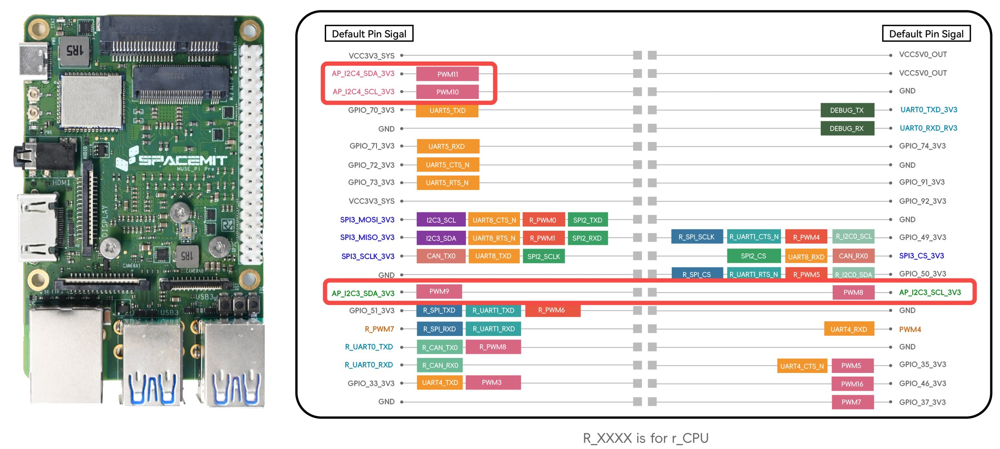

# 3.3.4 I2C-使用说明

本文档介绍如何使用 I2C（Inter-Integrated Circuit）通信协议，并通过 Python 的 `smbus2` 库访问 I2C 外设设备。

## I2C 工具准备

执行以下命令克隆 I2C 调试工具代码：

```bash
git clone https://gitee.com/cookieee/blue-bridge-cup-hardware.git ~
```

工具位于 `~/blue-bridge-cup-hardware/dev-tools/i2ctools` 目录，包含 `i2cdetect`、`i2cget`、`i2cset` 等调试工具，用于检测与操作 I2C 总线。

## I2C 引脚说明

使用 I2C 通信前，请参考[《引脚定义说明》](3.3.1-引脚定义说明.md)，确认所用开发板支持的 I2C 引脚。

以 MUSE Pi Pro 为例，支持 I2C 的引脚示意图如下：



对应可用的 I2C 总线为 `i2c-3` 和 `i2c-4`。

## 查看可用 I2C 总线

进入工具目录后，执行以下命令查看系统中所有可识别的 I2C 总线：

```bash
cd ~/blue-bridge-cup-hardware/dev-tools/i2ctools
sudo ./i2cdetect -l
```

示例输出：

```bash
i2c-3	i2c       	spacemit-i2c-adapter            	I2C adapter
i2c-1	i2c       	spacemit-i2c-adapter            	I2C adapter
i2c-8	i2c       	spacemit-i2c-adapter            	I2C adapter
i2c-4	i2c       	spacemit-i2c-adapter            	I2C adapter
i2c-2	i2c       	spacemit-i2c-adapter            	I2C adapter
i2c-0	i2c       	spacemit-i2c-adapter            	I2C adapter
i2c-9	i2c       	spacemit-i2c-adapter            	I2C adapter
i2c-5	i2c       	spacemit-i2c-adapter            	I2C adapter
```

## 硬件连接与设备扫描

### 硬件连接

请按如下方式连接 I2C 外设：

| 外设引脚 | 主板引脚     |
| -------- | ------------ |
| SDA      | I2C 数据引脚 |
| SCL      | I2C 时钟引脚 |
| VCC      | 电源         |
| GND      | 地线         |

### 设备扫描

连接完成后，使用以下命令扫描指定总线上的 I2C 设备：

```bash
sudo ./i2cdetect -yr 4
```

参数说明：

- `-y`：跳过交互确认
- `-r`：只读扫描
- `4`：指定扫描总线编号 `i2c-4`

示例输出：

```text
     0  1  2  3  4  5  6  7  8  9  a  b  c  d  e  f
00:          -- -- -- -- -- -- -- -- -- -- -- -- --
10: -- -- -- -- -- -- -- -- -- -- -- -- -- -- -- --
20: -- -- -- -- -- -- -- -- -- -- -- -- -- -- -- --
30: -- -- -- -- -- -- -- -- -- -- -- -- -- -- -- --
40: -- -- -- -- -- -- -- -- -- -- -- -- -- -- -- --
50: -- -- -- -- -- -- -- -- -- -- -- -- -- -- -- --
60: -- -- -- -- -- -- -- -- 68 -- -- -- -- -- -- --
70: -- -- -- -- -- -- -- --
```

其中，地址 `0x68` 处检测到有效设备。

## Python 控制示例

推荐使用 `smbus2` 库，安装命令：

```bash
pip install smbus2
```

以下示例展示如何通过 Python 读取设备寄存器数据：

```python
from smbus2 import SMBus

bus_number = 4           # 对应 i2c-4
device_address = 0x68    # 设备地址
register_address = 0x00  # 寄存器地址

with SMBus(bus_number) as bus:
    data = bus.read_byte_data(device_address, register_address)
    print(f"读取寄存器 {register_address:#02x} 的值为: {data:#02x}")
```

请确保对 i2c 设备节点具备读写权限：

```bash
sudo chmod a+rw /dev/i2c-4
```

运行结果示例：

```bash
读取寄存器 0x0 的值为: 0xcf
```

## 注意事项

- 确保所有 I2C 设备地址唯一，避免地址冲突。
- 部分外设需初始化配置，详见芯片或模块手册。
- 推荐使用 `smbus2` 替代旧版 `smbus`，提高兼容性与性能。
