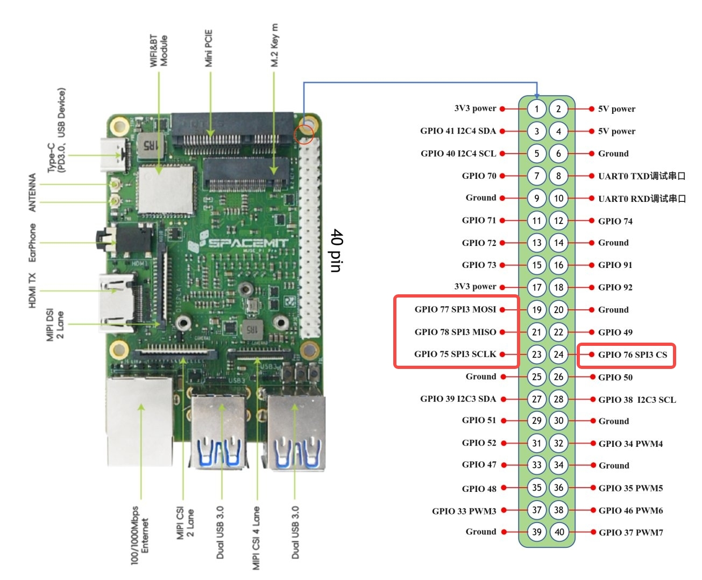

# 3.3.5 SPI-使用说明

```text
最新版本：2025/09/26
```

本文档介绍如何在开发板上配置和使用 SPI 接口。

## 模块介绍

SPI（Serial Peripheral Interface） 是一种 SoC 与外设之间的串行通信接口，仅支持单通道模式（x1 模式）。SPI 有 **主设备（Master）** 和 **从设备（Slave）** 两种模式，通常为一个主设备控制一个或多个从设备进行通信。

主设备通过拉低片选线选择一个从设备进行通信，完成数据交互。主设备负责提供时钟，并发起读写操作。

> **注:** K1 SPI 当前仅支持主设备模式。

**引脚功能：**

引脚                                 | 功能说明
-------------------------------------|-------------------------------|
SCLK (Serial Clock)                  | 时钟信号线
MISO (Master In Slave Out)           | 从主通信 (从设备 → 主设备数据)
MOSI (Master Out Slave In)           | 主从通信 (主设备 → 从设备数据)
CS/SS (Chip Select / Slave Select)   | 从设备片选信号线

## 引脚说明

请参考[《引脚定义说明》](https://bianbu.spacemit.com/brdk/Basic_applications/3.3_Pin_Applications/3.3.1_Pin_Definitions)，确认开发板支持的 SPI 引脚。

以 **MUSE-Pi-Pro** 为例，支持的 SPI 引脚如下：


## 查看设备信息

- **查看系统 SPI 总线设备和驱动信息**

   ```bash
   ls /sys/bus/spi
   ```

   输出示例：

   ```text
    spi--
       |-- devices         //SPI 总线上的设备
       |-- drivers         //SPI 总线上注册的设备驱动
       |-- drivers_autoprobe
       |-- drivers_probe
   ```

- **查看指定 SPI 总线设备的信息**

   ```bash
   ls -la /sys/bus/spi/devices/spi3.0
   ```

- **查看指定 SPI 设备的模态（设备名称）**

   ```bash
   cat /sys/bus/spi/devices/spi3.0/modalias
   ```

- **查看 SPI 设备的速度模式**

   ```bash
   cat /sys/bus/spi/devices/spi3.0/of_node/spi-max-frequency
   ```

## 启用 SPI

SPI 引脚（GPIO75、76、77、78）与其他功能复用，使用前需要在 dts
中禁用其他冲突的设备

我们提供两种方法（二选一即可）：

- **方法 A：直接下载预编译的 dtb 文件**
- **方法 B：手动修改编译 dts**

### 方法 A：直接下载预编译的 dtb 文件

- 下载预配置的 dtb 文件

   ```bash
   wget https://archive.spacemit.com/ros2/prebuilt/brdk_libs/spi/k1-x_MUSE-Pi-Pro.dtb
   ```

- 将文件保存到 `/boot/spacemit/6.6.63/`，以替换原有 dtb 文件。

### 方法 B：手动修改编译 dts

1. **获取开发板设备树 dts 文件**

   ```bash
   cd /boot/spacemit/6.6.63/       //设备树所在分区

   sudo apt update
   sudo apt install device-tree-compiler      //编译工具

   sudo dtc -I dtb -O dts -o k1-x_MUSE-Pi-Pro.dts k1-x_MUSE-Pi-Pro.dtb            // 反编译 dtb 为 dts

   ls
   //若出现 k1-x_MUSE-Pi-Pro.dts，即反编译成功
   ```

2. **修改设备树**
   编辑 `k1-x_MUSE-Pi-Pro.dts`，找到以下两个 SPI 节点并进行修改：

   - **修改 spi@d420c000 节点：**
     - 禁用原有节点和 flash 子节点：设置 `status = "disabled"`
     - 添加 spi@3 子节点

   - **修改 spi@d401c000 节点：**
     - 添加 spi@3 子节点

   具体修改内容如下：

   ```C
   // 修改 spi@d420c000 节点
   spi@d420c000 {
                        compatible = "spacemit,k1x-qspi";
                        #address-cells = <0x01>;
                        #size-cells = <0x00>;
                        reg = <0x00 0xd420c000 0x00 0x1000 0x00 0xb8000000 0x00 0xc00000>;
                        reg-names = "qspi-base\0qspi-mmap";
                        k1x,qspi-sfa1ad = <0x4000000>;
                        k1x,qspi-sfa2ad = <0x100000>;
                        k1x,qspi-sfb1ad = <0x100000>;
                        k1x,qspi-sfb2ad = <0x100000>;
                        clocks = <0x03 0x8f 0x03 0x90>;
                        clock-names = "qspi_clk\0qspi_bus_clk";
                        resets = <0x1d 0x4e 0x1d 0x4f>;
                        reset-names = "qspi_reset\0qspi_bus_reset";
                        k1x,qspi-pmuap-reg = <0xd4282860>;
                        k1x,qspi-mpmu-acgr-reg = <0xd4051024>;
                        k1x,qspi-freq = <0x1945ba0>;
                        k1x,qspi-id = <0x04>;
                        power-domains = <0x20 0x00>;
                        cpuidle,pm-runtime,sleep;
                        interrupts = <0x75>;
                        interrupt-parent = <0x1e>;
                        k1x,qspi-tx-dma = <0x01>;
                        k1x,qspi-rx-dma = <0x01>;
                        dmas = <0x21 0x2d 0x01>;
                        dma-names = "tx-dma";
                        interconnects = <0x22>;
                        interconnect-names = "dma-mem";
                        status = "disabled"; // 禁用该节点
                        pinctrl-names = "default";
                        pinctrl-0 = <0x5b>;

                        flash@0 {
                                compatible = "jedec,spi-nor";
                                reg = <0x00>;
                                spi-max-frequency = <0x1945ba0>;
                                m25p,fast-read;
                                broken-flash-reset;
                                status = "disabled"; // 禁用 flash 子节点
                        };
                        // 添加 spi@3 子节点
                        spi@3 {
                                compatible = "cisco,spi-petra";
                                reg = <0x0>;
                                spi-max-frequency = <6400000>;
                                status = "okay";
                        };
                };

   ```

   ```bash
   // 修改 spi@d401c000 节点
   spi@d401c000 {
                        compatible = "spacemit,k1x-spi";
                        reg = <0x00 0xd401c000 0x00 0x34>;
                        k1x,ssp-id = <0x03>;
                        k1x,ssp-clock-rate = <0x186a000>;
                        dmas = <0x21 0x14 0x01 0x21 0x13 0x01>;
                        dma-names = "rx\0tx";
                        power-domains = <0x20 0x00>;
                        cpuidle,pm-runtime,sleep;
                        interrupt-parent = <0x1e>;
                        interrupts = <0x37>;
                        clocks = <0x03 0x58>;
                        resets = <0x1d 0x18>;
                        #address-cells = <0x01>;
                        #size-cells = <0x00>;
                        interconnects = <0x22>;
                        interconnect-names = "dma-mem";
                        status = "okay";
                        pinctrl-names = "default";
                        pinctrl-0 = <0x2e>;
                        k1x,ssp-disable-dma;

                        // 添加 spi@3 子节点
                        spi@3 {
                                compatible = "cisco,spi-petra";
                                reg = <0x0>;
                                spi-max-frequency = <6400000>;
                                status = "okay";
                        };

                };
   ```

3. **编译新设备树**

   ```bash
   sudo dtc -I dts -O dtb -o k1-x_MUSE-Pi-Pro.dtb k1-x_MUSE-Pi-Pro.dts
   ```


### 替换内核镜像文件
 **替换镜像文件**

   ```bash
   // 获取
   wget https://archive.spacemit.com/ros2/prebuilt/brdk_libs/spi/vmlinuz-6.6.63

   // 移动或复制到 /boot/ 目录下，覆盖旧的镜像 vmlinuz-6.6.63
   ```

**重启开发板**使更改生效

   ```bash
   sudo reboot
   ```

   重启后在 `/dev/` 下可查看 spi3.0 设备

## 使用示例

- **连接任意一款 SPI 设备到开发板**

   ```bash
   连接方式
   主设备 (Master)         <===>         从设备 (Slave)
       SCK          -------------->          SCK
       MOSI         -------------->          MOSI (或 SDI)
       MISO         <--------------          MISO (或 SDO)
       CS0          -------------->          CS (或 nSS)
   ```

- **查看设备**

   ```bash
   ls /dev/spi*

   //输出示例
   spi3
   ```

- **SPI 主设备示例代码**

```bash
//spi_master.c

#include <stdio.h>
#include <stdlib.h>
#include <fcntl.h>
#include <unistd.h>
#include <sys/ioctl.h>
#include <linux/spi/spidev.h>
#include <string.h>
#include <stdint.h>

#define SPI_DEV "/dev/spidev3.0"
#define BUF_SIZE 32

static uint32_t mode = SPI_MODE_0;
static uint8_t bits = 8;
static uint32_t speed = 1000000;

int spi_init()
{
    int fd = open(SPI_DEV, O_RDWR);
    if (fd < 0) {
        perror("无法打开SPI设备");
        return -1;
    }

    if (ioctl(fd, SPI_IOC_WR_MODE, &mode) < 0) {
        perror("无法设置SPI模式");
        goto error;
    }

    if (ioctl(fd, SPI_IOC_WR_BITS_PER_WORD, &bits) < 0) {
        perror("无法设置字长");
        goto error;
    }

    if (ioctl(fd, SPI_IOC_WR_MAX_SPEED_HZ, &speed) < 0) {
        perror("无法设置SPI速度");
        goto error;
    }

    return fd;

error:
    close(fd);
    return -1;
}

int spi_transfer(int fd, uint8_t *tx_buf, uint8_t *rx_buf, int len)
{
    struct spi_ioc_transfer tr =
    {
        .tx_buf = (unsigned long)tx_buf,
        .rx_buf = (unsigned long)rx_buf,
        .len = len,
        .speed_hz = speed,
        .bits_per_word = bits,
        .delay_usecs = 0,
    };

    if (ioctl(fd, SPI_IOC_MESSAGE(1), &tr) < 1) {
        perror("SPI传输失败");
        return -1;
    }

    return 0;
}

int main()
{
    int fd = spi_init();
    if (fd < 0) return 1;

    uint8_t tx_buf[BUF_SIZE] = {0};
    uint8_t rx_buf[BUF_SIZE] = {0};

    tx_buf[0] = 0x9f;
    spi_transfer(fd, tx_buf, rx_buf, strlen((char *)tx_buf) + 3);
    printf("从设备响应: %x%x%x%x\n", rx_buf[0], rx_buf[1], rx_buf[2], rx_buf[3]);


    while (1)
    {
        printf("Master> ");
        fgets((char *)tx_buf, BUF_SIZE, stdin);


        if (strncmp((char *)tx_buf, "quit", 4) == 0) break;


        if (spi_transfer(fd, tx_buf, rx_buf, strlen((char *)tx_buf) + 3) == 0) {
            printf("从设备响应: %x%x%x%x\n", rx_buf[0], rx_buf[1], rx_buf[2], rx_buf[3]);
        }

        memset(tx_buf, 0, BUF_SIZE);
        memset(rx_buf, 0, BUF_SIZE);
    }

    close(fd);
    return 0;
}
```

- **在主机上交叉编译此文件**

   ```bash
   riscv64-unknown-linux-gnu-gcc -O2 -mcpu=spacemit-x60 -march=rv64gc_zba_zbb_zbc_zbs spi_master.c -o spi_master
   ```

   编译工具下载及使用方法见[交叉编译工具手册](https://developer.spacemit.com/documentation?token=S66mw1ouRio4dUkqGvkcw7LEnJh)

- **复制可执行文件到开发板**

   ```bash
   scp spi_master bianbu@10.0.91.35:/home/bianbu
   ```

   **说明：**

  - `scp` - SSH 远程复制命令
  - `spi_master` - 可执行文件名
  - `bianbu` - 开发板用户名
  - `10.0.91.35` - 开发板 IP 地址（可 使用 `hostname -I` 查看板子的 IP 地址）
  - `/home/bianbu` -  存储路径（自定义）

   > **注意：** 使用 `scp` 命令时，需要确保开发板和主机在同一局域网下

- **在开发板上运行该程序**

   ```bash
   sudo ./spi_master
   ```

   示例输出：

   ```text
   从设备响应: 0000
   Master> 9f
   从设备响应: 0000
   ```
