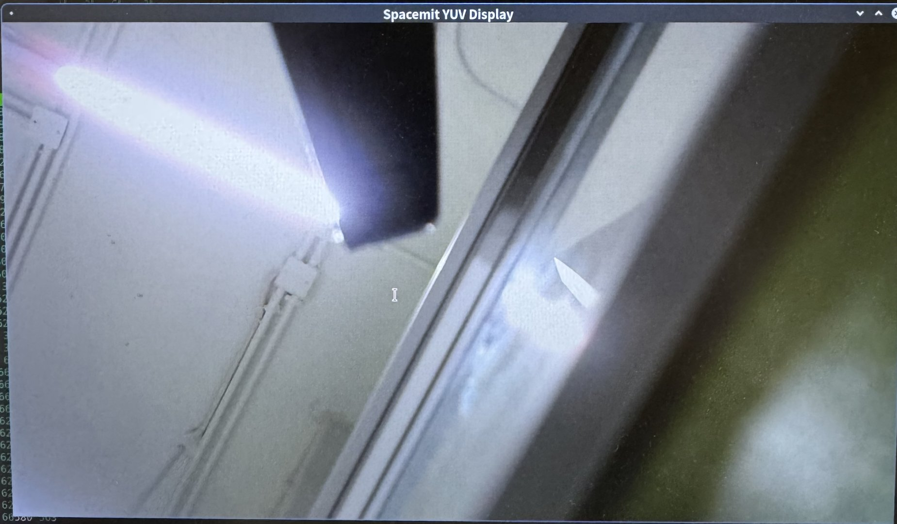

# 3.4.1 JDK-简介

JDK 是针对 SpacemiT **K系列** 平台封装的简洁高效的上层**多媒体处理库（MPP）**。该库封装了对摄像头（`JdkCamera`）、视频编码（`JdkEncoder`）、解码（`JdkDecoder`）、视频输出（`JdkVo`）等硬件功能的访问接口，方便开发者快速调用硬件能力。

## 环境准备

- 操作系统：Bianbu 2.2
- 编译器：GCC 9 及以上版本（推荐使用开发板自带原生编译器）

**必备依赖库安装命令：**

```bash
sudo apt install build-essential cmake libv4l-dev libdrm-dev libjpeg-dev uuid-dev
```

## 项目结构总览

```bash
jdk_examples
├── jdk_cam       # 摄像头模块
├── jdk_client    # 客户端模块
├── jdk_drm       # DRM 相关模块
├── jdk_frame     # 帧处理模块
├── jdk_infer     # 推理模块
├── jdk_server    # 服务端模块
├── jdk_v2d       # 视频二维模块
├── jdk_vdec      # 视频解码模块
├── jdk_venc      # 视频编码模块
└── jdk_vo        # 视频输出模块
```

## 编译指南

### JDK SDK 下载与安装

```bash
wget https://archive.spacemit.com/ros2/code/jdk_sdk.tar.gz
sudo tar xvf jdk_sdk.tar.gz
```

目录结构如下：

```shell
jdk_sdk
├── include
│   ├── data_type.hpp
│   ├── IConver.hpp
│   ├── IEngine.hpp
│   ├── IPlugin.hpp
│   ├── ITensor.hpp
│   ├── JdkCamera.hpp
│   ├── JdkDecoder.hpp
│   ├── JdkDma.hpp
│   ├── JdkDrm.hpp
│   ├── JdkEncoder.hpp
│   ├── JdkFrame.hpp
│   ├── jdk_log.h
│   ├── JdkUsbCam.hpp
│   ├── jdkV2d.hpp
│   ├── JdkVo.hpp
│   ├── json.hpp
│   └── Tensor.hpp
├── jdk_examples
│   ├── jdk_cam
│   ├── jdk_client
│   ├── jdk_drm
│   ├── jdk_frame
│   ├── jdk_infer
│   ├── jdk_infer@rtsp
│   ├── jdk_server
│   ├── jdk_usbcam
│   ├── jdk_v2d
│   ├── jdk_vdec
│   ├── jdk_venc
│   └── jdk_vo
├── ko
│   └── jdk_dma.ko
├── lib
│   ├── libengine.so
│   ├── libjdk_cam.so
│   ├── libjdk_dma.so
│   ├── libjdk_drm.so
│   ├── libjdk_frame.so
│   ├── libjdk_usbcam.so
│   ├── libjdk_v2d.so
│   ├── libjdk_vdec.so
│   ├── libjdk_venc.so
│   ├── libjdk_vo.so
│   ├── libnet_client.so
│   └── libnet_server.so
├── Makefile
└── README.md
```

### 编译示例程序

进入摄像头模块目录并编译示例：

```bash
cd jdk_sdk
make all
```

示例编译输出：

```bash
make -C jdk_examples/jdk_cam all
make[1]: Entering directory '/home/work/jdk_sdk/jdk_examples/jdk_cam'
Compile depends C++ src/main.cpp
Compile CXX src/main.cpp
Link workspace/jdk_cam
```

### 运行示例

在运行 jdk 示例前，需要先安装 jdk dma 驱动。

```shel
insmod ./ko/jdk_dma.ko
cd jdk_examples/jdk_usbcam
./workspace/jdk_usbcam /dev/video20
```

> 🚨 提示：请根据实际情况确认设备节点路径，如 `/dev/video20`。可通过 `v4l2-ctl --list-devices` 命令查看设备信息。

运行后终端将输出模块初始化与图像采集的日志信息。

### 启动日志示例

~~~shell
VIDIOC_STREAMON succeeded
[MPP-DEBUG] 10800:module_init:159 +++++++++++++++ module init, module type = 9
[MPP-DEBUG] 10800:find_v4l2_linlonv5v7_plugin:83 yeah! we have v4l2_linlonv5v7_codec plugin---------------
[MPP-DEBUG] 10800:module_init:199 ++++++++++ V4L2_LINLONV5V7 (/usr/lib/libv4l2_linlonv5v7_codec.so)
[MPP-DEBUG] 10800:module_init:199 ++++++++++ open (/usr/lib/libv4l2_linlonv5v7_codec.so) success !
[MPP-DEBUG] 10800:al_dec_create:337 init create
[MPP-DEBUG] 10800:al_dec_init:398 input para check: foramt:0x4745504a output format:0x3231564e input buffer num:12 output buffer num:8
[MPP-DEBUG] 10800:al_dec_init:421 video fd = 4, device path = '/dev/video0'
[MPP-DEBUG] 10800:createCodec:115 create a codec, width=1280 height=720 align=1 inputtype=2 outputtype=9 inputformat=4745504a outputformat=3231564e inputbufnum=12 outputbufnum=8
[MPP-DEBUG] 10800:createPort:80 create a port, type=2 format_fourcc=1195724874
[MPP-DEBUG] 10800:createPort:80 create a port, type=9 format_fourcc=842094158
[MPP-DEBUG] 10800:getTrySetFormat:196 width=1280 height=720 align=1 pixel_format=4745504a
[MPP-DEBUG] 10800:printFormat:294 PRINTFORMAT ===== type: 2, format: 1195724874, width: 1280, height: 720, bytesperline: 0, sizeimage: 1048576
[MPP-DEBUG] 10800:getTrySetFormat:196 width=1280 height=720 align=1 pixel_format=3231564e
[MPP-DEBUG] 10800:printFormat:283 PRINTFORMAT ===== type: 9, format: 842094158, width: 1280, height: 720, nplanes: 2, bytesperline: [1280 1280 0], sizeimage: [921600 460800 0]
[MPP-DEBUG] 10800:allocateBuffers:340 Request buffers. type:2 count:12(12) memory:1
[MPP-DEBUG] 10800:allocateBuffers:340 Request buffers. type:9 count:8(8) memory:4
[MPP-DEBUG] 10800:streamon:558 Stream on 1751956058513
[MPP-DEBUG] 10800:streamon:558 Stream on 1751956058513
[MPP-DEBUG] 10800:al_dec_init:449 init finish
[MPP-DEBUG] 10800:VO_CreateChannel:43 create VO Channel success!
[MPP-DEBUG] 10800:module_init:159 +++++++++++++++ module init, module type = 101
[MPP-DEBUG] 10800:check_vo_sdl2:121 yeah! have vo_sdl2---------------
[MPP-DEBUG] 10800:find_vo_sdl2_plugin:86 yeah! we have vo_sdl2_plugin plugin---------------
[MPP-DEBUG] 10800:module_init:207 ++++++++++ VO_SDL2 (/usr/lib/libvo_sdl2_plugin.so)
[MPP-DEBUG] 10800:module_init:207 ++++++++++ open (/usr/lib/libvo_sdl2_plugin.so) success !
[MPP-ERROR] 10800:al_vo_init:93 SDL could not initialize! SDL_Error: wayland not available
[MPP-ERROR] 10800:al_vo_init:128 k1 vo_sdl2 init fail
[MPP-DEBUG] 10800:VO_Init:66 init VO Channel, ret = -400
[MPP-ERROR] 10800:JdkVo:32 VO_init failed, please check!
[MPP-INFO] 10801:runpoll:321 Now k1 hardware decoding ...
select: Resource temporarily unavailable
Failed to capture frame 0
NO data, return.
[MPP-DEBUG] 10801:handleEvent:453 get V4L2_EVENT_SOURCE_CHANGE event, do notify!
[MPP-DEBUG] 10800:handleOutputBuffer:1509 Resolution changed:0 new size: 1280 x 720
[MPP-DEBUG] 10800:streamoff:571 Stream off 1751956060839
[MPP-DEBUG] 10800:allocateBuffers:340 Request buffers. type:9 count:0(0) memory:4
[MPP-DEBUG] 10800:getTrySetFormat:196 width=1280 height=720 align=1 pixel_format=3231564e
[MPP-DEBUG] 10800:printFormat:283 PRINTFORMAT ===== type: 9, format: 842094158, width: 1280, height: 720, nplanes: 2, bytesperline: [1280 1280 0], sizeimage: [921600 460800 0]
[MPP-DEBUG] 10800:allocateBuffers:340 Request buffers. type:9 count:12(12) memory:4
[MPP-DEBUG] 10800:streamon:558 Stream on 1751956060850
[MPP-ERROR] 10800:queueBuffer:461 Failed to queue buffer. type = 9 (Invalid argument)
[MPP-ERROR] 10800:al_dec_return_output_frame:652 queueBuffer failed, this should not happen, please check!
[MPP-DEBUG] 10800:VO_Process:82 vo one packet, ret = 0
index:1,dma_fd:33 width:1280,height:720,size:1382400
[MPP-DEBUG] 10800:VO_Process:82 vo one packet, ret = 0
index:2,dma_fd:33 width:1280,height:720,size:1382400
[MPP-DEBUG] 10800:VO_Process:82 vo one packet, ret = 0
index:3,dma_fd:33 width:1280,height:720,size:1382400
~~~

## 运行效果

程序运行后，摄像头采集的图像将在显示器上实时显示，如图所示：



## 常见问题与建议

| 问题           | 说明                                            |
| -------------- | ----------------------------------------------- |
| 检测不到摄像头 | 检查 USB 接口连接、尝试其他端口、确认摄像头型号 |
| 摄像头打不开   | 可能摄像头未被识别，或驱动不支持                |
| SDL 报错       | 系统图形库依赖缺失，不影响摄像头采集功能        |
| 图像不显示     | 检查 vo 初始化日志、确认使用的显示通道和权限    |
