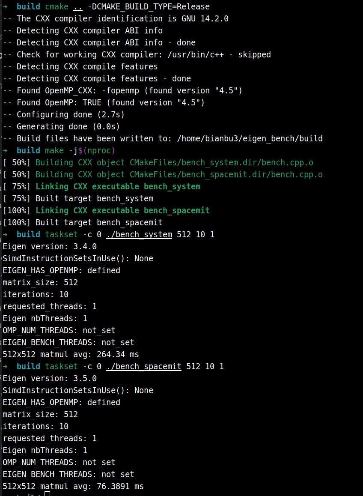
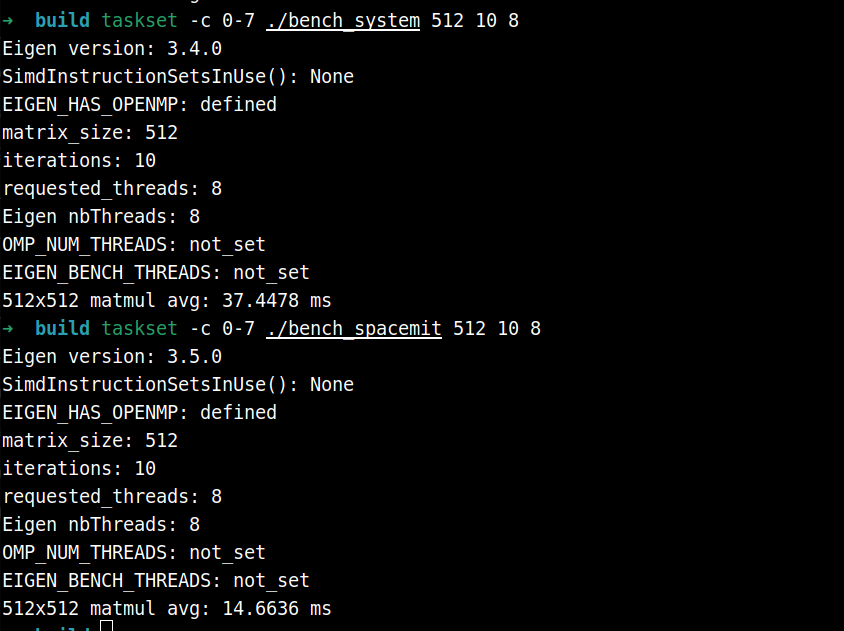
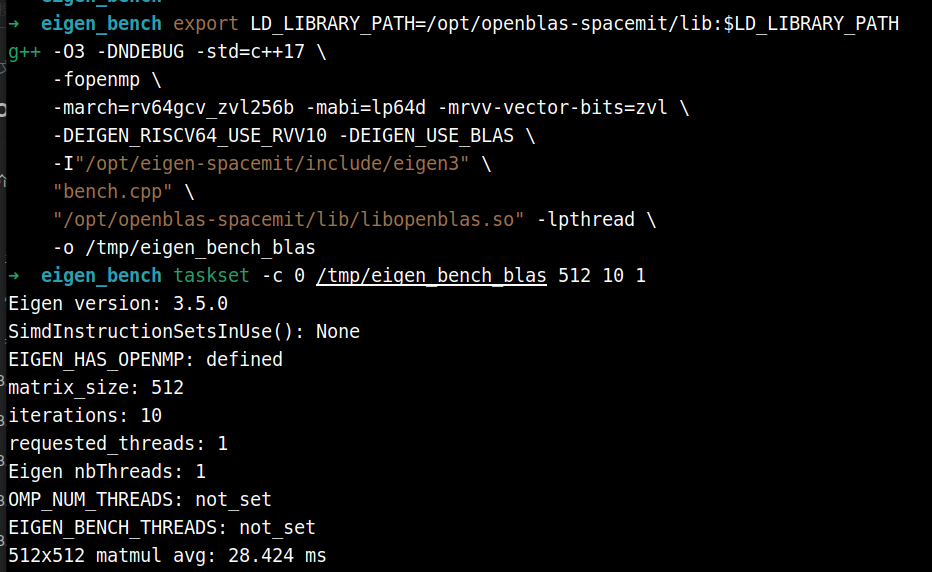
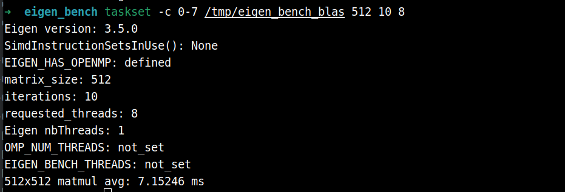

# 3.5.2 Eigen-RVV-使用

## Eigen 简介

[Eigen](https://eigen.tuxfamily.org) 是一个高性能的 C++ 模板库，专用于线性代数运算，涵盖矩阵、向量、数值求解及相关算法。它被广泛应用于机器人、计算机视觉、数值仿真等领域，是 ROS、OpenCV、PCL 等主流框架的核心依赖之一。

**主要特点：**

- **纯头文件**：无需编译，直接 `#include` 即可使用
- **高性能**：通过表达式模板（expression templates）消除临时变量，自动向量化（SIMD）
- **功能丰富**：支持稠密矩阵、稀疏矩阵、几何变换（旋转矩阵、四元数）、线性求解器等
- **跨平台**：支持 x86、ARM、RISC-V 等主流架构

## RVV 加速

RVV（RISC-V Vector Extension）是 RISC-V 架构的向量扩展指令集，可对矩阵运算进行 SIMD 加速。K1 搭载的 SpacemiT X60 8 核处理器原生支持 RVV 1.0（含 `zve64d`、`zvfh` 等向量子扩展）。

针对 K1 平台，我们提供了专为 RVV 优化的定制 Eigen 库 `eigen-spacemit`，相比系统默认的 Eigen 有显著差异：

| 对比项 | 系统 Eigen（`libeigen3-dev`） | eigen-spacemit |
|:-:|:-:|:-:|
| 安装路径 | `/usr/include/eigen3` | `/opt/eigen-spacemit` |
| RVV 加速 | 未启用 | 针对 RVV 1.0 优化 |
| 适用平台 | 通用（x86/ARM/RISC-V） | 专为 SpacemiT X60 定制 |
| 安装方式 | `apt install libeigen3-dev` | `apt install eigen-spacemit` |

在 k1 上进行高性能线性代数运算（如点云处理、SLAM、卡尔曼滤波）时，推荐优先使用 `eigen-spacemit` 以充分发挥 RVV 硬件能力。

## 使用示例

以下示例对比系统 libeigen3-dev 与 `eigen-spacemit` 在 512×512 矩阵乘法上的性能差异。

### 设置编译器

```text
sudo apt install gfortran-14 gcc-14 g++-14
```

为了更好地适配 RVV ，建议使用 gcc 14 、gfortran-14

```text
sudo update-alternatives --install /usr/bin/gcc gcc /usr/bin/gcc-14 100
sudo update-alternatives --install /usr/bin/g++ g++ /usr/bin/g++-14 100
sudo update-alternatives --set gcc /usr/bin/gcc-14
sudo update-alternatives --set g++ /usr/bin/g++-14

sudo update-alternatives --install /usr/bin/riscv64-linux-gnu-gcc riscv64-linux-gnu-gcc /usr/bin/riscv64-linux-gnu-gcc-14 100
sudo update-alternatives --install /usr/bin/riscv64-linux-gnu-g++ riscv64-linux-gnu-g++ /usr/bin/riscv64-linux-gnu-g++-14 100
sudo update-alternatives --set riscv64-linux-gnu-gcc /usr/bin/riscv64-linux-gnu-gcc-14
sudo update-alternatives --set riscv64-linux-gnu-g++ /usr/bin/riscv64-linux-gnu-g++-14
```

```text
sudo update-alternatives --install /usr/bin/gfortran gfortran /usr/bin/gfortran-14 140
sudo update-alternatives --set gfortran /usr/bin/gfortran-14

sudo update-alternatives --install /usr/bin/riscv64-linux-gnu-gfortran riscv64-linux-gnu-gfortran /usr/bin/riscv64-linux-gnu-gfortran-14 140
sudo update-alternatives --set riscv64-linux-gnu-gfortran /usr/bin/riscv64-linux-gnu-gfortran-14
```

### **安装必要依赖**

```text
sudo apt update
sudo apt install eigen-spacemit libeigen3-dev
```

### 测试代码

**目录结构：**

```text
eigen_bench/
├── CMakeLists.txt
└── bench.cpp
```

**CMakeLists.txt：**

```cmake
cmake_minimum_required(VERSION 3.16)
project(eigen_bench LANGUAGES CXX)

# OpenMP 让 Eigen 支持的单个算子（主要是大矩阵乘法）可以使用多线程。
option(EIGEN_BENCH_ENABLE_OPENMP "Enable OpenMP so Eigen can parallelize supported operators" ON)

# RVV 编译参数。
set(RVV_MARCH "rv64gcv_zvl256b" CACHE STRING "RISC-V architecture flags for RVV builds")
set(RVV_MABI  "lp64d"           CACHE STRING "RISC-V ABI flags for RVV builds")

# 系统 Eigen 对照组保持无 RVV，需显式指定标量目标架构和 ABI。
set(SCALAR_MARCH "rv64gc" CACHE STRING "RISC-V architecture flags for scalar non-RVV builds")
set(SCALAR_MABI  "lp64d"  CACHE STRING "RISC-V ABI flags for scalar non-RVV builds")

if(EIGEN_BENCH_ENABLE_OPENMP)
  find_package(OpenMP)
endif()


# 统一创建 benchmark 目标：传入不同 Eigen include 路径即可对比不同实现。
function(add_bench target eigen_include)
  add_executable(${target} bench.cpp)
  target_include_directories(${target} PRIVATE "${eigen_include}")
  target_compile_options(${target} PRIVATE -O3 -DNDEBUG -std=c++17)
  if(EIGEN_BENCH_ENABLE_OPENMP AND OpenMP_CXX_FOUND)
    target_link_libraries(${target} PRIVATE OpenMP::OpenMP_CXX)
  endif()
endfunction()

# SpacemiT Eigen（RVV 加速）
add_bench(bench_spacemit /opt/eigen-spacemit/include/eigen3)
target_compile_options(bench_spacemit PRIVATE -march=${RVV_MARCH} -mabi=${RVV_MABI} -mrvv-vector-bits=zvl)
target_compile_definitions(bench_spacemit PRIVATE EIGEN_RISCV64_USE_RVV10)

# 系统 Eigen（无 RVV）
add_bench(bench_system /usr/include/eigen3)
target_compile_options(bench_system PRIVATE -march=${SCALAR_MARCH} -mabi=${SCALAR_MABI})
```

**bench.cpp：**

```cpp
#include <Eigen/Dense>
#include <chrono>
#include <cstdlib>
#include <iostream>
#include <stdexcept>
#include <string>

namespace {

int parsePositiveInt(const char* value, const std::string& name) {
    const int parsed = std::stoi(value);
    if (parsed <= 0) {
        throw std::runtime_error(name + " must be positive");
    }
    return parsed;
}

std::string envOrUnset(const char* name) {
    const char* value = std::getenv(name);
    return value ? value : "not_set";
}

}  // namespace

int main(int argc, char** argv) {
    try {
    const int N = argc > 1 ? parsePositiveInt(argv[1], "matrix_size") : 512;
    const int iters = argc > 2 ? parsePositiveInt(argv[2], "iterations") : 10;
    const char* threads_env = std::getenv("EIGEN_BENCH_THREADS");
    const int threads = argc > 3 ? parsePositiveInt(argv[3], "threads") : (threads_env ? parsePositiveInt(threads_env, "EIGEN_BENCH_THREADS") : 8);
    Eigen::setNbThreads(threads);

    Eigen::MatrixXf A = Eigen::MatrixXf::Random(N, N);
    Eigen::MatrixXf B = Eigen::MatrixXf::Random(N, N);
    Eigen::MatrixXf C(N, N);

    C.noalias() = A * B; // warmup

    auto t0 = std::chrono::high_resolution_clock::now();
    for (int i = 0; i < iters; ++i)
        C.noalias() = A * B;
    auto t1 = std::chrono::high_resolution_clock::now();

    double ms = std::chrono::duration<double, std::milli>(t1 - t0).count() / iters;
    std::cout << "Eigen version: " << EIGEN_WORLD_VERSION << '.' << EIGEN_MAJOR_VERSION << '.' << EIGEN_MINOR_VERSION << '\n';
    std::cout << "SimdInstructionSetsInUse(): " << Eigen::SimdInstructionSetsInUse() << '\n';
#ifdef EIGEN_HAS_OPENMP
    std::cout << "EIGEN_HAS_OPENMP: defined\n";
#else
    std::cout << "EIGEN_HAS_OPENMP: not_defined\n";
#endif
    std::cout << "matrix_size: " << N << '\n';
    std::cout << "iterations: " << iters << '\n';
    std::cout << "requested_threads: " << threads << '\n';
    std::cout << "Eigen nbThreads: " << Eigen::nbThreads() << '\n';
    std::cout << "OMP_NUM_THREADS: " << envOrUnset("OMP_NUM_THREADS") << '\n';
    std::cout << "EIGEN_BENCH_THREADS: " << envOrUnset("EIGEN_BENCH_THREADS") << '\n';
    std::cout << N << "x" << N << " matmul avg: " << ms << " ms\n";
    return 0;
    } catch (const std::exception& error) {
        std::cerr << "error: " << error.what() << '\n';
        return 1;
    }
}
```

### **编译与运行：**

```bash
mkdir build && cd build
cmake .. -DCMAKE_BUILD_TYPE=Release
make -j$(nproc)

./bench_system    # 系统 Eigen
./bench_spacemit  # SpacemiT Eigen（RVV）
```

### **单核对比**



可以看出，RVV加速后的矩阵乘法性能有明显提升（264ms -> 76ms）

### **八核对比**




## 使用 openblas-spacemit 作为后端

Eigen 默认使用自身的模板实现完成矩阵运算，而 [OpenBLAS](https://www.openblas.net/) 是一个经过高度优化的 BLAS（Basic Linear Algebra Subprograms）数值库。通过在编译时添加 `-DEIGEN_USE_BLAS` 宏，Eigen 会将底层的矩阵乘法（`gemm`）等关键运算委托给 OpenBLAS 执行，从而利用其针对特定硬件深度调优的实现。

`openblas-spacemit` 是专为 SpacemiT k1 平台定制的 OpenBLAS 版本，充分利用了 RVV 1.0 向量扩展及平台特性。与单独使用 `eigen-spacemit`（RVV 向量化）相比，通过 `openblas-spacemit` 后端可以进一步将大规模矩阵乘法性能提升。

### **安装必要依赖**

```text
sudo apt install openblas-spacemit
```

### **编译与运行**

仍使用上一节的bench.cpp

```text
export LD_LIBRARY_PATH=/opt/openblas-spacemit/lib:$LD_LIBRARY_PATH
g++ -O3 -DNDEBUG -std=c++17 \
    -fopenmp \
    -march=rv64gcv_zvl256b -mabi=lp64d -mrvv-vector-bits=zvl \
    -DEIGEN_RISCV64_USE_RVV10 -DEIGEN_USE_BLAS \
    -I"/opt/eigen-spacemit/include/eigen3" \
    "bench.cpp" \
    "/opt/openblas-spacemit/lib/libopenblas.so" -lpthread \
    -o /tmp/eigen_bench_blas
```

```text
/tmp/eigen_bench_blas
```

### **单核性能：**



使用 openblas-spacemit 作为 eigen 后端，矩阵乘法的性能还有进一步的提升（76ms -> 28 ms）

### **八核性能：**




## 更多性能测试数据

**多核测试说明**

- 多核测试编译需要 `target_link_libraries(${target_name} PRIVATE OpenMP::OpenMP_CXX)`
- 多核测试代码需要 `Eigen::setNbThreads(threads)`，`threads` 建议与测试时限制的核数一致
- 以下测试 `threads` 与核数均取一致

## eigen-spacemit VS libeigen3-dev

- 使用 taskset -c 限制核数
- 单次测试的计时策略是每个算子跑 50 次取平均值，预热10次。本测试重复10次单次测试，取其指标的平均值并计算标准差
- mean 表示 10 次测试的均值，sd 为标准差

### **单核对比**

taskset -c 0

threads：1

|  module  |           function            |              api               |  dtype  | input_size | output_size | libeigen3-dev avg_ms mean±sd | eigen-spacemit avg_ms mean±sd | libeigen3-dev avg_gflops mean±sd | eigen-spacemit avg_gflops mean±sd | speedup mean±sd | improvement mean±sd |
| :------: | :---------------------------: | :----------------------------: | :-----: | :--------: | :---------: | :--------------------------: | :---------------------------: | :------------------------------: | :-------------------------------: | :-------------: | :-----------------: |
|  array   |          vector_abs           |        abs(a - scalar)         | float32 |  262144x1  |  262144x1   |       2.4077 ± 0.0065        |        0.5599 ± 0.0089        |         0.1089 ± 0.0003          |          0.4683 ± 0.0076          |  4.30x ± 0.07x  |   330.14% ± 7.13%   |
|  array   |          vector_abs           |        abs(a - scalar)         | float64 |  262144x1  |  262144x1   |       2.5995 ± 0.0079        |        1.1284 ± 0.0056        |         0.1008 ± 0.0003          |          0.2323 ± 0.0012          |  2.30x ± 0.01x  |   130.38% ± 0.89%   |
|  array   |       vector_add_scalar       |           a + scalar           | float32 |  262144x1  |  262144x1   |       1.7429 ± 0.0055        |        0.5638 ± 0.0160        |         0.1504 ± 0.0005          |          0.4653 ± 0.0133          |  3.09x ± 0.09x  |   209.35% ± 8.66%   |
|  array   |       vector_add_scalar       |           a + scalar           | float64 |  262144x1  |  262144x1   |       1.8285 ± 0.0055        |        1.1166 ± 0.0117        |         0.1434 ± 0.0004          |          0.2348 ± 0.0025          |  1.64x ± 0.02x  |   63.77% ± 1.71%    |
|  array   |       vector_add_vector       |             a + b              | float32 |  262144x1  |  262144x1   |       1.7691 ± 0.0062        |        0.9894 ± 0.0267        |         0.1482 ± 0.0005          |          0.2651 ± 0.0068          |  1.79x ± 0.05x  |   78.92% ± 4.55%    |
|  array   |       vector_add_vector       |             a + b              | float64 |  262144x1  |  262144x1   |       2.4611 ± 0.0589        |        1.9898 ± 0.0125        |         0.1066 ± 0.0025          |          0.1317 ± 0.0008          |  1.24x ± 0.03x  |   23.69% ± 3.15%    |
|  array   |         vector_clamp          |      cwiseMax + cwiseMin       | float32 |  262144x1  |  262144x1   |       3.0926 ± 0.0223        |        0.7299 ± 0.0050        |         0.1695 ± 0.0012          |          0.7184 ± 0.0049          |  4.24x ± 0.05x  |   323.72% ± 4.65%   |
|  array   |         vector_clamp          |      cwiseMax + cwiseMin       | float64 |  262144x1  |  262144x1   |       3.1667 ± 0.0094        |        1.4828 ± 0.0368        |         0.1656 ± 0.0005          |          0.3538 ± 0.0084          |  2.14x ± 0.05x  |   113.67% ± 5.03%   |
|  array   |          vector_cos           |             cos(a)             | float32 |  262144x1  |  262144x1   |       9.2401 ± 0.0656        |        3.6055 ± 0.0395        |         0.0284 ± 0.0002          |          0.0727 ± 0.0008          |  2.56x ± 0.04x  |   156.31% ± 3.90%   |
|  array   |          vector_cos           |             cos(a)             | float64 |  262144x1  |  262144x1   |       18.6906 ± 0.0522       |       18.3138 ± 0.2422        |         0.0140 ± 0.0001          |          0.0143 ± 0.0002          |  1.02x ± 0.01x  |    2.07% ± 1.31%    |
|  array   |       vector_div_scalar       |           a / scalar           | float32 |  262144x1  |  262144x1   |       3.7571 ± 0.0392        |        0.9856 ± 0.0055        |         0.0698 ± 0.0007          |          0.2660 ± 0.0015          |  3.81x ± 0.05x  |   281.22% ± 5.11%   |
|  array   |       vector_div_scalar       |           a / scalar           | float64 |  262144x1  |  262144x1   |       5.1378 ± 0.0093        |        2.0541 ± 0.0056        |         0.0510 ± 0.0001          |          0.1276 ± 0.0004          |  2.50x ± 0.01x  |   150.12% ± 1.06%   |
|  array   |       vector_div_vector       |        a / (b + scalar)        | float32 |  262144x1  |  262144x1   |       3.7561 ± 0.0145        |        1.0823 ± 0.0066        |         0.1396 ± 0.0006          |          0.4845 ± 0.0030          |  3.47x ± 0.03x  |   247.07% ± 2.74%   |
|  array   |       vector_div_vector       |        a / (b + scalar)        | float64 |  262144x1  |  262144x1   |       5.1904 ± 0.0518        |        2.2693 ± 0.0150        |         0.1010 ± 0.0010          |          0.2311 ± 0.0015          |  2.29x ± 0.03x  |   128.74% ± 3.06%   |
|  array   |          vector_dot           |             dot()              | float32 |  262144x1  |     1x1     |       0.8520 ± 0.0042        |        0.4330 ± 0.0089        |         0.6154 ± 0.0030          |          1.2114 ± 0.0252          |  1.97x ± 0.04x  |   96.86% ± 4.43%    |
|  array   |          vector_dot           |             dot()              | float64 |  262144x1  |     1x1     |       1.0733 ± 0.0359        |        0.8600 ± 0.0164        |         0.4889 ± 0.0152          |          0.6098 ± 0.0115          |  1.25x ± 0.05x  |   24.85% ± 4.99%    |
|  array   |          vector_exp           |        exp(a * scalar)         | float32 |  262144x1  |  262144x1   |       11.4588 ± 0.0201       |        3.7511 ± 0.0292        |         0.0457 ± 0.0001          |          0.1398 ± 0.0011          |  3.05x ± 0.02x  |   205.49% ± 2.45%   |
|  array   |          vector_exp           |        exp(a * scalar)         | float64 |  262144x1  |  262144x1   |       13.4692 ± 0.0330       |        9.0441 ± 0.0381        |         0.0389 ± 0.0001          |          0.0580 ± 0.0002          |  1.49x ± 0.01x  |   48.93% ± 0.59%    |
|  array   |          vector_fma           |           a * b + c            | float32 |  262144x1  |  262144x1   |       2.1349 ± 0.0130        |        1.2518 ± 0.0247        |         0.2456 ± 0.0015          |          0.4190 ± 0.0083          |  1.71x ± 0.04x  |   70.62% ± 4.02%    |
|  array   |          vector_fma           |           a * b + c            | float64 |  262144x1  |  262144x1   |       3.1611 ± 0.0522        |        2.6735 ± 0.0661        |         0.1659 ± 0.0028          |          0.1962 ± 0.0049          |  1.18x ± 0.04x  |   18.31% ± 3.99%    |
|  array   |          vector_log           |        log(a + scalar)         | float32 |  262144x1  |  262144x1   |       10.4932 ± 0.0387       |        3.7040 ± 0.0291        |         0.0500 ± 0.0002          |          0.1416 ± 0.0011          |  2.83x ± 0.02x  |   183.31% ± 2.24%   |
|  array   |          vector_log           |        log(a + scalar)         | float64 |  262144x1  |  262144x1   |       13.1482 ± 0.0379       |        8.7084 ± 0.0262        |         0.0399 ± 0.0001          |          0.0602 ± 0.0002          |  1.51x ± 0.01x  |   50.98% ± 0.53%    |
|  array   |          vector_max           |           max(a, b)            | float32 |  262144x1  |  262144x1   |       2.9458 ± 0.0271        |        0.9878 ± 0.0085        |         0.0890 ± 0.0008          |          0.2654 ± 0.0023          |  2.98x ± 0.04x  |   198.25% ± 4.17%   |
|  array   |          vector_max           |           max(a, b)            | float64 |  262144x1  |  262144x1   |       3.0429 ± 0.0086        |        1.9993 ± 0.0114        |         0.0862 ± 0.0002          |          0.1311 ± 0.0007          |  1.52x ± 0.01x  |   52.20% ± 1.09%    |
|  array   |          vector_min           |           min(a, b)            | float32 |  262144x1  |  262144x1   |       2.7692 ± 0.0242        |        0.9889 ± 0.0047        |         0.0947 ± 0.0008          |          0.2651 ± 0.0013          |  2.80x ± 0.03x  |   180.04% ± 3.13%   |
|  array   |          vector_min           |           min(a, b)            | float64 |  262144x1  |  262144x1   |       2.8812 ± 0.0102        |        2.0076 ± 0.0116        |         0.0910 ± 0.0003          |          0.1306 ± 0.0008          |  1.44x ± 0.01x  |   43.52% ± 1.21%    |
|  array   |       vector_mul_scalar       |           a * scalar           | float32 |  262144x1  |  262144x1   |       1.7510 ± 0.0207        |        0.5571 ± 0.0058        |         0.1497 ± 0.0017          |          0.4706 ± 0.0049          |  3.14x ± 0.04x  |   214.30% ± 3.78%   |
|  array   |       vector_mul_scalar       |           a * scalar           | float64 |  262144x1  |  262144x1   |       1.9874 ± 0.0040        |        1.1226 ± 0.0159        |         0.1319 ± 0.0003          |          0.2335 ± 0.0033          |  1.77x ± 0.03x  |   77.06% ± 2.56%    |
|  array   |       vector_mul_vector       |             a * b              | float32 |  262144x1  |  262144x1   |       1.7754 ± 0.0350        |        0.9866 ± 0.0074        |         0.1477 ± 0.0028          |          0.2657 ± 0.0020          |  1.80x ± 0.04x  |   79.97% ± 3.56%    |
|  array   |       vector_mul_vector       |             a * b              | float64 |  262144x1  |  262144x1   |       2.4787 ± 0.0375        |        1.9897 ± 0.0148        |         0.1058 ± 0.0015          |          0.1317 ± 0.0010          |  1.25x ± 0.02x  |   24.59% ± 2.39%    |
|  array   |          vector_norm          |             norm()             | float32 |  262144x1  |     1x1     |       0.8403 ± 0.0256        |        0.1562 ± 0.0051        |         0.6244 ± 0.0177          |          3.3585 ± 0.1068          |  5.38x ± 0.27x  |  438.45% ± 27.05%   |
|  array   |          vector_norm          |             norm()             | float64 |  262144x1  |     1x1     |       1.0038 ± 0.0044        |        0.3140 ± 0.0033        |         0.5223 ± 0.0022          |          1.6701 ± 0.0172          |  3.20x ± 0.03x  |   219.76% ± 3.24%   |
|  array   |       vector_normalize        |          normalize()           | float32 |  262144x1  |  262144x1   |       4.8754 ± 0.0110        |        1.6525 ± 0.0094        |         0.1613 ± 0.0004          |          0.4759 ± 0.0027          |  2.95x ± 0.02x  |   195.03% ± 1.52%   |
|  array   |       vector_normalize        |          normalize()           | float64 |  262144x1  |  262144x1   |       6.8417 ± 0.0396        |        3.3050 ± 0.0183        |         0.1149 ± 0.0007          |          0.2379 ± 0.0013          |  2.07x ± 0.02x  |   107.02% ± 2.10%   |
|  array   |        vector_segment         |           segment()            | float32 |  262144x1  |  131072x1   |       0.5527 ± 0.0044        |        0.2851 ± 0.0095        |         0.0000 ± 0.0000          |          0.0000 ± 0.0000          |  1.94x ± 0.06x  |   94.06% ± 5.54%    |
|  array   |        vector_segment         |           segment()            | float64 |  262144x1  |  131072x1   |       0.7866 ± 0.0357        |        0.5511 ± 0.0090        |         0.0000 ± 0.0000          |          0.0000 ± 0.0000          |  1.43x ± 0.05x  |   42.71% ± 5.23%    |
|  array   |         vector_select         |       mask.select(a, b)        | float32 |  262144x1  |  262144x1   |       2.3422 ± 0.0075        |        0.9986 ± 0.0359        |         0.1119 ± 0.0004          |          0.2628 ± 0.0087          |  2.35x ± 0.08x  |   134.78% ± 7.52%   |
|  array   |         vector_select         |       mask.select(a, b)        | float64 |  262144x1  |  262144x1   |       2.4546 ± 0.0076        |        2.0072 ± 0.0109        |         0.1068 ± 0.0003          |          0.1306 ± 0.0007          |  1.22x ± 0.01x  |   22.30% ± 0.91%    |
|  array   |          vector_sin           |             sin(a)             | float32 |  262144x1  |  262144x1   |       10.3717 ± 0.0337       |        3.5877 ± 0.0384        |         0.0253 ± 0.0001          |          0.0731 ± 0.0008          |  2.89x ± 0.03x  |   189.12% ± 3.27%   |
|  array   |          vector_sin           |             sin(a)             | float64 |  262144x1  |  262144x1   |       19.9595 ± 0.0393       |       19.6490 ± 0.1684        |         0.0131 ± 0.0001          |          0.0133 ± 0.0001          |  1.02x ± 0.01x  |    1.59% ± 0.77%    |
|  array   |          vector_sqrt          |      (a + scalar).sqrt()       | float32 |  262144x1  |  262144x1   |       7.4933 ± 0.0322        |        1.0484 ± 0.0057        |         0.0700 ± 0.0003          |          0.5001 ± 0.0027          |  7.15x ± 0.03x  |   614.78% ± 3.37%   |
|  array   |          vector_sqrt          |      (a + scalar).sqrt()       | float64 |  262144x1  |  262144x1   |       9.0363 ± 0.0614        |        2.1751 ± 0.0085        |         0.0580 ± 0.0004          |          0.2411 ± 0.0009          |  4.15x ± 0.02x  |   315.45% ± 2.41%   |
|  array   |       vector_sub_scalar       |           a - scalar           | float32 |  262144x1  |  262144x1   |       1.7449 ± 0.0046        |        0.5547 ± 0.0089        |         0.1502 ± 0.0004          |          0.4727 ± 0.0076          |  3.15x ± 0.05x  |   214.61% ± 5.11%   |
|  array   |       vector_sub_scalar       |           a - scalar           | float64 |  262144x1  |  262144x1   |       1.9471 ± 0.0066        |        1.1182 ± 0.0084        |         0.1346 ± 0.0005          |          0.2344 ± 0.0018          |  1.74x ± 0.02x  |   74.13% ± 1.53%    |
|  array   |       vector_sub_vector       |             a - b              | float32 |  262144x1  |  262144x1   |       1.7683 ± 0.0081        |        0.9806 ± 0.0107        |         0.1482 ± 0.0007          |          0.2673 ± 0.0029          |  1.80x ± 0.02x  |   80.33% ± 1.83%    |
|  array   |       vector_sub_vector       |             a - b              | float64 |  262144x1  |  262144x1   |       2.4622 ± 0.0377        |        1.9950 ± 0.0374        |         0.1065 ± 0.0016          |          0.1314 ± 0.0024          |  1.23x ± 0.03x  |   23.46% ± 3.24%    |
|  array   |          vector_sum           |             sum()              | float32 |  262144x1  |     1x1     |       0.7372 ± 0.0033        |        0.1439 ± 0.0021        |         0.3556 ± 0.0016          |          1.8217 ± 0.0263          |  5.12x ± 0.09x  |   412.28% ± 8.80%   |
|  array   |          vector_sum           |             sum()              | float64 |  262144x1  |     1x1     |       0.7919 ± 0.0034        |        0.2855 ± 0.0021        |         0.3310 ± 0.0014          |          0.9184 ± 0.0066          |  2.77x ± 0.03x  |   177.44% ± 2.61%   |
|  array   |          vector_tanh          |        tanh(a * scalar)        | float32 |  262144x1  |  262144x1   |       12.5455 ± 0.0470       |        2.3117 ± 0.0266        |         0.0418 ± 0.0002          |          0.2268 ± 0.0026          |  5.43x ± 0.08x  |   442.76% ± 7.54%   |
|  array   |          vector_tanh          |        tanh(a * scalar)        | float64 |  262144x1  |  262144x1   |       30.1997 ± 0.1621       |       29.7617 ± 0.0927        |         0.0174 ± 0.0001          |          0.0176 ± 0.0001          |  1.01x ± 0.01x  |    1.47% ± 0.69%    |
| geometry |      quaternion_inverse       |     Quaternion::inverse()      | float32 |    3x1     |     3x1     |       0.0001 ± 0.0000        |        0.0001 ± 0.0000        |         0.0704 ± 0.0017          |          0.0717 ± 0.0010          |  1.00x ± 0.00x  |    0.00% ± 0.00%    |
| geometry |      quaternion_inverse       |     Quaternion::inverse()      | float64 |    3x1     |     3x1     |       0.0002 ± 0.0000        |        0.0002 ± 0.0000        |         0.0596 ± 0.0107          |          0.0640 ± 0.0006          |  1.05x ± 0.16x  |   5.00% ± 15.81%    |
| geometry |     quaternion_normalize      |    Quaternion::normalize()     | float32 |    3x1     |     3x1     |       0.0001 ± 0.0000        |        0.0001 ± 0.0000        |         0.0807 ± 0.0016          |          0.0815 ± 0.0007          |  1.30x ± 0.48x  |   30.00% ± 48.30%   |
| geometry |     quaternion_normalize      |    Quaternion::normalize()     | float64 |    3x1     |     3x1     |       0.0002 ± 0.0001        |        0.0002 ± 0.0000        |         0.0662 ± 0.0115          |          0.0772 ± 0.0021          |  1.10x ± 0.32x  |   10.00% ± 31.62%   |
| geometry | quaternion_to_rotation_matrix | Quaternion::toRotationMatrix() | float32 |    3x1     |     3x3     |       0.0001 ± 0.0000        |        0.0001 ± 0.0000        |         0.2416 ± 0.0066          |          0.2034 ± 0.0076          |  1.00x ± 0.00x  |    0.00% ± 0.00%    |
| geometry | quaternion_to_rotation_matrix | Quaternion::toRotationMatrix() | float64 |    3x1     |     3x3     |       0.0001 ± 0.0002        |        0.0001 ± 0.0000        |         0.2199 ± 0.0605          |          0.1958 ± 0.0063          |  1.50x ± 1.58x  |  50.00% ± 158.11%   |
| geometry |         vector_cross          |            cross()             | float32 |    3x1     |     3x1     |       0.0001 ± 0.0000        |        0.0001 ± 0.0000        |         0.0797 ± 0.0028          |          0.0815 ± 0.0038          |  1.00x ± 0.00x  |    0.00% ± 0.00%    |
| geometry |         vector_cross          |            cross()             | float64 |    3x1     |     3x1     |       0.0001 ± 0.0000        |        0.0001 ± 0.0000        |         0.0781 ± 0.0047          |          0.0796 ± 0.0036          |  1.00x ± 0.00x  |    0.00% ± 0.00%    |
|  matrix  |          matrix_add           |             A + B              | float32 |  512x512   |   512x512   |       1.7718 ± 0.0118        |        0.9794 ± 0.0080        |         0.1480 ± 0.0010          |          0.2676 ± 0.0022          |  1.81x ± 0.02x  |   80.91% ± 2.02%    |
|  matrix  |          matrix_add           |             A + B              | float64 |  512x512   |   512x512   |       2.4472 ± 0.0084        |        1.9714 ± 0.0122        |         0.1071 ± 0.0004          |          0.1330 ± 0.0008          |  1.24x ± 0.01x  |   24.14% ± 0.82%    |
|  matrix  |         matrix_block          |            block()             | float32 |  512x512   |   256x256   |       0.7617 ± 0.1995        |        0.2397 ± 0.0041        |         0.0000 ± 0.0000          |          0.0000 ± 0.0000          |  3.18x ± 0.84x  |  218.21% ± 84.31%   |
|  matrix  |         matrix_block          |            block()             | float64 |  512x512   |   256x256   |       0.9840 ± 0.0093        |        1.0620 ± 0.0099        |         0.0000 ± 0.0000          |          0.0000 ± 0.0000          |  0.93x ± 0.01x  |   -7.34% ± 1.09%    |
|  matrix  |      matrix_colwise_sum       |        colwise().sum()         | float32 |  512x512   |    1x512    |       0.7531 ± 0.0072        |        0.1564 ± 0.0024        |         0.3474 ± 0.0033          |          1.6728 ± 0.0249          |  4.81x ± 0.05x  |   381.50% ± 5.05%   |
|  matrix  |      matrix_colwise_sum       |        colwise().sum()         | float64 |  512x512   |    1x512    |       0.8007 ± 0.0042        |        0.3148 ± 0.0209        |         0.3268 ± 0.0017          |          0.8341 ± 0.0500          |  2.55x ± 0.15x  |  155.28% ± 15.47%   |
|  matrix  |     matrix_cwise_product      |          cwiseProduct          | float32 |  512x512   |   512x512   |       1.7781 ± 0.0299        |        0.9774 ± 0.0078        |         0.1474 ± 0.0024          |          0.2682 ± 0.0021          |  1.82x ± 0.03x  |   81.94% ± 3.17%    |
|  matrix  |     matrix_cwise_product      |          cwiseProduct          | float64 |  512x512   |   512x512   |       2.4806 ± 0.0345        |        1.9744 ± 0.0134        |         0.1057 ± 0.0014          |          0.1328 ± 0.0009          |  1.26x ± 0.01x  |   25.63% ± 1.17%    |
|  matrix  |      matrix_determinant       |         determinant()          | float32 |  512x512   |     1x1     |      186.7459 ± 4.3480       |       50.0736 ± 0.2786        |         0.4794 ± 0.0112          |          1.7870 ± 0.0099          |  3.73x ± 0.09x  |   272.96% ± 9.10%   |
|  matrix  |      matrix_determinant       |         determinant()          | float64 |  512x512   |     1x1     |      334.4457 ± 1.3341       |       137.4301 ± 0.7724       |         0.2675 ± 0.0011          |          0.6511 ± 0.0036          |  2.43x ± 0.02x  |   143.36% ± 1.59%   |
|  matrix  |          matrix_gemv          |             A * x              | float32 |  512x512   |    512x1    |       2.4670 ± 0.4230        |        0.5859 ± 0.0543        |         0.2169 ± 0.0296          |          0.9010 ± 0.0850          |  4.22x ± 0.67x  |  322.35% ± 66.82%   |
|  matrix  |          matrix_gemv          |             A * x              | float64 |  512x512   |    512x1    |       6.9304 ± 0.0437        |        1.9733 ± 0.0805        |         0.0756 ± 0.0005          |          0.2658 ± 0.0112          |  3.52x ± 0.16x  |  251.80% ± 16.22%   |
|  matrix  |        matrix_identity        |           Identity()           | float32 |    1x1     |   512x512   |       1.2501 ± 0.0057        |        1.2700 ± 0.0071        |         0.0000 ± 0.0000          |          0.0000 ± 0.0000          |  0.98x ± 0.01x  |   -1.56% ± 0.89%    |
|  matrix  |        matrix_identity        |           Identity()           | float64 |    1x1     |   512x512   |       1.3606 ± 0.0066        |        1.3221 ± 0.0061        |         0.0000 ± 0.0000          |          0.0000 ± 0.0000          |  1.03x ± 0.01x  |    2.91% ± 0.81%    |
|  matrix  |        matrix_inverse         |           inverse()            | float32 |  512x512   |   512x512   |      692.9954 ± 16.8117      |       215.6281 ± 3.0806       |         0.3876 ± 0.0095          |          1.2451 ± 0.0178          |  3.21x ± 0.10x  |   221.46% ± 9.62%   |
|  matrix  |        matrix_inverse         |           inverse()            | float64 |  512x512   |   512x512   |      1143.0767 ± 2.1416      |       507.6916 ± 1.9568       |         0.2348 ± 0.0004          |          0.5287 ± 0.0021          |  2.25x ± 0.01x  |   125.15% ± 0.66%   |
|  matrix  |       matrix_ldlt_solve       |         LDLT::solve(x)         | float32 |  512x512   |    512x1    |       1.2197 ± 0.0758        |        0.7784 ± 0.0657        |         0.4313 ± 0.0263          |          0.6776 ± 0.0538          |  1.57x ± 0.13x  |   57.41% ± 12.92%   |
|  matrix  |       matrix_ldlt_solve       |         LDLT::solve(x)         | float64 |  512x512   |    512x1    |       4.2868 ± 0.0442        |        3.4205 ± 0.2698        |         0.1223 ± 0.0013          |          0.1541 ± 0.0114          |  1.26x ± 0.10x  |   26.02% ± 9.82%    |
|  matrix  |       matrix_llt_solve        |         LLT::solve(x)          | float32 |  512x512   |    512x1    |       1.3657 ± 0.0158        |        0.8215 ± 0.0675        |         0.3839 ± 0.0044          |          0.6423 ± 0.0559          |  1.67x ± 0.14x  |   67.24% ± 13.59%   |
|  matrix  |       matrix_llt_solve        |         LLT::solve(x)          | float64 |  512x512   |    512x1    |       5.3463 ± 0.0874        |        3.5447 ± 0.2344        |         0.0981 ± 0.0016          |          0.1485 ± 0.0104          |  1.51x ± 0.11x  |   51.46% ± 10.95%   |
|  matrix  |         matrix_matmul         |             A * B              | float32 |  512x512   |   512x512   |      271.8593 ± 3.4825       |       75.7326 ± 0.1988        |         0.9866 ± 0.0125          |          3.5411 ± 0.0093          |  3.59x ± 0.05x  |   258.97% ± 4.65%   |
|  matrix  |         matrix_matmul         |             A * B              | float64 |  512x512   |   512x512   |      444.2409 ± 1.3360       |       181.8331 ± 0.5701       |         0.6037 ± 0.0018          |          1.4748 ± 0.0046          |  2.44x ± 0.01x  |   144.31% ± 1.04%   |
|  matrix  |      matrix_rowwise_sum       |        rowwise().sum()         | float32 |  512x512   |    512x1    |       16.2477 ± 3.6436       |        4.9952 ± 2.3500        |         0.0169 ± 0.0040          |          0.0777 ± 0.0600          |  4.90x ± 4.09x  |  389.79% ± 408.75%  |
|  matrix  |      matrix_rowwise_sum       |        rowwise().sum()         | float64 |  512x512   |    512x1    |       55.6037 ± 0.2790       |       13.9894 ± 0.0547        |         0.0047 ± 0.0000          |          0.0187 ± 0.0001          |  3.97x ± 0.03x  |   297.48% ± 2.83%   |
|  matrix  |          matrix_sub           |             A - B              | float32 |  512x512   |   512x512   |       1.7702 ± 0.0091        |        0.9799 ± 0.0108        |         0.1481 ± 0.0008          |          0.2676 ± 0.0030          |  1.81x ± 0.02x  |   80.68% ± 2.08%    |
|  matrix  |          matrix_sub           |             A - B              | float64 |  512x512   |   512x512   |       2.4543 ± 0.0375        |        1.9960 ± 0.0455        |         0.1068 ± 0.0016          |          0.1314 ± 0.0029          |  1.23x ± 0.03x  |   23.02% ± 3.47%    |
|  matrix  |         matrix_trace          |            trace()             | float32 |  512x512   |     1x1     |       0.0022 ± 0.0003        |        0.0022 ± 0.0000        |         0.2331 ± 0.0218          |          0.2299 ± 0.0047          |  1.00x ± 0.13x  |   0.08% ± 13.15%    |
|  matrix  |         matrix_trace          |            trace()             | float64 |  512x512   |     1x1     |       0.0028 ± 0.0000        |        0.0029 ± 0.0002        |         0.1812 ± 0.0026          |          0.1758 ± 0.0108          |  0.98x ± 0.07x  |   -2.32% ± 6.73%    |
|  matrix  |       matrix_transpose        |          transpose()           | float32 |  512x512   |   512x512   |       19.4898 ± 0.9395       |       12.3035 ± 0.4949        |         0.0000 ± 0.0000          |          0.0000 ± 0.0000          |  1.59x ± 0.11x  |   58.71% ± 11.18%   |
|  matrix  |       matrix_transpose        |          transpose()           | float64 |  512x512   |   512x512   |       56.8755 ± 0.2327       |       57.5783 ± 0.2613        |         0.0000 ± 0.0000          |          0.0000 ± 0.0000          |  0.99x ± 0.01x  |   -1.22% ± 0.61%    |
|  matrix  |          matrix_zero          |             Zero()             | float32 |    1x1     |   512x512   |       0.8478 ± 0.0048        |        0.3629 ± 0.0032        |         0.0000 ± 0.0000          |          0.0000 ± 0.0000          |  2.34x ± 0.02x  |   133.67% ± 2.05%   |
|  matrix  |          matrix_zero          |             Zero()             | float64 |    1x1     |   512x512   |       1.1344 ± 0.0094        |        0.7023 ± 0.0401        |         0.0000 ± 0.0000          |          0.0000 ± 0.0000          |  1.62x ± 0.09x  |   61.99% ± 8.93%    |


### **四核对比**

taskset -c 0-3

threads：4

|  module  |           function            |              api               |  dtype  | input_size | output_size | libeigen3-dev avg_ms mean±sd | eigen-spacemit avg_ms mean±sd | libeigen3-dev avg_gflops mean±sd | eigen-spacemit avg_gflops mean±sd | speedup mean±sd | improvement mean±sd |
| :------: | :---------------------------: | :----------------------------: | :-----: | :--------: | :---------: | :--------------------------: | :---------------------------: | :------------------------------: | :-------------------------------: | :-------------: | :-----------------: |
|  array   |          vector_abs           |        abs(a - scalar)         | float32 |  262144x1  |  262144x1   |       2.3984 ± 0.0114        |        0.5578 ± 0.0137        |         0.1093 ± 0.0005          |          0.4702 ± 0.0116          |  4.30x ± 0.10x  |   330.17% ± 9.88%   |
|  array   |          vector_abs           |        abs(a - scalar)         | float64 |  262144x1  |  262144x1   |       2.5891 ± 0.0121        |        1.0491 ± 0.0072        |         0.1013 ± 0.0005          |          0.2499 ± 0.0017          |  2.47x ± 0.02x  |   146.79% ± 1.83%   |
|  array   |       vector_add_scalar       |           a + scalar           | float32 |  262144x1  |  262144x1   |       1.7440 ± 0.0309        |        0.5576 ± 0.0129        |         0.1503 ± 0.0025          |          0.4703 ± 0.0108          |  3.13x ± 0.11x  |  212.96% ± 11.34%   |
|  array   |       vector_add_scalar       |           a + scalar           | float64 |  262144x1  |  262144x1   |       1.8162 ± 0.0140        |        1.0543 ± 0.0181        |         0.1443 ± 0.0011          |          0.2487 ± 0.0042          |  1.72x ± 0.04x  |   72.31% ± 3.63%    |
|  array   |       vector_add_vector       |             a + b              | float32 |  262144x1  |  262144x1   |       1.7561 ± 0.0086        |        0.9742 ± 0.0113        |         0.1493 ± 0.0007          |          0.2691 ± 0.0031          |  1.80x ± 0.02x  |   80.28% ± 1.80%    |
|  array   |       vector_add_vector       |             a + b              | float64 |  262144x1  |  262144x1   |       2.5019 ± 0.0369        |        1.9394 ± 0.0122        |         0.1048 ± 0.0015          |          0.1352 ± 0.0008          |  1.29x ± 0.02x  |   29.01% ± 2.16%    |
|  array   |         vector_clamp          |      cwiseMax + cwiseMin       | float32 |  262144x1  |  262144x1   |       3.0740 ± 0.0153        |        0.7254 ± 0.0080        |         0.1706 ± 0.0008          |          0.7229 ± 0.0079          |  4.24x ± 0.04x  |   323.80% ± 3.81%   |
|  array   |         vector_clamp          |      cwiseMax + cwiseMin       | float64 |  262144x1  |  262144x1   |       3.1752 ± 0.0184        |        1.4401 ± 0.0077        |         0.1651 ± 0.0010          |          0.3641 ± 0.0020          |  2.20x ± 0.02x  |   120.50% ± 1.93%   |
|  array   |          vector_cos           |             cos(a)             | float32 |  262144x1  |  262144x1   |       9.2280 ± 0.0521        |        3.6201 ± 0.0334        |         0.0284 ± 0.0002          |          0.0724 ± 0.0007          |  2.55x ± 0.03x  |   154.93% ± 3.02%   |
|  array   |          vector_cos           |             cos(a)             | float64 |  262144x1  |  262144x1   |       18.6382 ± 0.0517       |       18.3013 ± 0.1826        |         0.0141 ± 0.0001          |          0.0143 ± 0.0001          |  1.02x ± 0.01x  |    1.85% ± 0.96%    |
|  array   |       vector_div_scalar       |           a / scalar           | float32 |  262144x1  |  262144x1   |       3.7218 ± 0.0146        |        0.9858 ± 0.0170        |         0.0704 ± 0.0003          |          0.2660 ± 0.0045          |  3.78x ± 0.07x  |   277.64% ± 6.81%   |
|  array   |       vector_div_scalar       |           a / scalar           | float64 |  262144x1  |  262144x1   |       5.1226 ± 0.0288        |        2.0442 ± 0.0126        |         0.0512 ± 0.0003          |          0.1282 ± 0.0008          |  2.51x ± 0.03x  |   150.60% ± 2.51%   |
|  array   |       vector_div_vector       |        a / (b + scalar)        | float32 |  262144x1  |  262144x1   |       3.7308 ± 0.0151        |        1.0786 ± 0.0081        |         0.1405 ± 0.0006          |          0.4861 ± 0.0036          |  3.46x ± 0.03x  |   245.91% ± 2.51%   |
|  array   |       vector_div_vector       |        a / (b + scalar)        | float64 |  262144x1  |  262144x1   |       5.1339 ± 0.0290        |        2.2837 ± 0.0152        |         0.1021 ± 0.0006          |          0.2296 ± 0.0015          |  2.25x ± 0.02x  |   124.82% ± 2.43%   |
|  array   |          vector_dot           |             dot()              | float32 |  262144x1  |     1x1     |       0.8470 ± 0.0081        |        0.4320 ± 0.0089        |         0.6190 ± 0.0058          |          1.2140 ± 0.0247          |  1.96x ± 0.05x  |   96.13% ± 5.02%    |
|  array   |          vector_dot           |             dot()              | float64 |  262144x1  |     1x1     |       1.0646 ± 0.0067        |        0.8583 ± 0.0108        |         0.4924 ± 0.0031          |          0.6109 ± 0.0077          |  1.24x ± 0.02x  |   24.05% ± 1.79%    |
|  array   |          vector_exp           |        exp(a * scalar)         | float32 |  262144x1  |  262144x1   |       11.4444 ± 0.0607       |        3.7387 ± 0.0281        |         0.0458 ± 0.0002          |          0.1402 ± 0.0010          |  3.06x ± 0.03x  |   206.12% ± 3.10%   |
|  array   |          vector_exp           |        exp(a * scalar)         | float64 |  262144x1  |  262144x1   |       13.5172 ± 0.0374       |        9.0253 ± 0.0549        |         0.0388 ± 0.0001          |          0.0581 ± 0.0004          |  1.50x ± 0.01x  |   49.78% ± 0.94%    |
|  array   |          vector_fma           |           a * b + c            | float32 |  262144x1  |  262144x1   |       2.1181 ± 0.0082        |        1.2415 ± 0.0291        |         0.2475 ± 0.0010          |          0.4225 ± 0.0098          |  1.71x ± 0.04x  |   70.69% ± 4.28%    |
|  array   |          vector_fma           |           a * b + c            | float64 |  262144x1  |  262144x1   |       3.9277 ± 0.0859        |        2.6064 ± 0.0386        |         0.1335 ± 0.0029          |          0.2012 ± 0.0030          |  1.51x ± 0.04x  |   50.73% ± 4.42%    |
|  array   |          vector_log           |        log(a + scalar)         | float32 |  262144x1  |  262144x1   |       10.4570 ± 0.0305       |        3.7021 ± 0.0280        |         0.0501 ± 0.0002          |          0.1416 ± 0.0011          |  2.82x ± 0.03x  |   182.48% ± 2.63%   |
|  array   |          vector_log           |        log(a + scalar)         | float64 |  262144x1  |  262144x1   |       13.1828 ± 0.0516       |        8.6970 ± 0.0452        |         0.0398 ± 0.0002          |          0.0603 ± 0.0003          |  1.52x ± 0.01x  |   51.58% ± 1.11%    |
|  array   |          vector_max           |           max(a, b)            | float32 |  262144x1  |  262144x1   |       2.9241 ± 0.0126        |        0.9804 ± 0.0157        |         0.0896 ± 0.0004          |          0.2675 ± 0.0042          |  2.98x ± 0.05x  |   198.32% ± 4.64%   |
|  array   |          vector_max           |           max(a, b)            | float64 |  262144x1  |  262144x1   |       3.0365 ± 0.0183        |        1.9293 ± 0.0113        |         0.0863 ± 0.0005          |          0.1359 ± 0.0008          |  1.57x ± 0.02x  |   57.40% ± 1.51%    |
|  array   |          vector_min           |           min(a, b)            | float32 |  262144x1  |  262144x1   |       2.7454 ± 0.0149        |        0.9785 ± 0.0175        |         0.0955 ± 0.0005          |          0.2680 ± 0.0047          |  2.81x ± 0.04x  |   180.63% ± 4.21%   |
|  array   |          vector_min           |           min(a, b)            | float64 |  262144x1  |  262144x1   |       2.9090 ± 0.0119        |        1.9364 ± 0.0322        |         0.0901 ± 0.0004          |          0.1354 ± 0.0022          |  1.50x ± 0.03x  |   50.27% ± 2.64%    |
|  array   |       vector_mul_scalar       |           a * scalar           | float32 |  262144x1  |  262144x1   |       1.7330 ± 0.0067        |        0.5522 ± 0.0110        |         0.1513 ± 0.0006          |          0.4749 ± 0.0096          |  3.14x ± 0.06x  |   213.92% ± 5.59%   |
|  array   |       vector_mul_scalar       |           a * scalar           | float64 |  262144x1  |  262144x1   |       1.9737 ± 0.0140        |        1.0506 ± 0.0142        |         0.1328 ± 0.0009          |          0.2496 ± 0.0033          |  1.88x ± 0.03x  |   87.90% ± 3.28%    |
|  array   |       vector_mul_vector       |             a * b              | float32 |  262144x1  |  262144x1   |       1.7559 ± 0.0091        |        0.9773 ± 0.0190        |         0.1493 ± 0.0008          |          0.2683 ± 0.0051          |  1.80x ± 0.03x  |   79.72% ± 3.38%    |
|  array   |       vector_mul_vector       |             a * b              | float64 |  262144x1  |  262144x1   |       2.4786 ± 0.0134        |        1.9402 ± 0.0099        |         0.1058 ± 0.0006          |          0.1351 ± 0.0007          |  1.28x ± 0.01x  |   27.75% ± 1.17%    |
|  array   |          vector_norm          |             norm()             | float32 |  262144x1  |     1x1     |       0.8321 ± 0.0041        |        0.1550 ± 0.0061        |         0.6301 ± 0.0031          |          3.3865 ± 0.1209          |  5.37x ± 0.19x  |  437.47% ± 19.39%   |
|  array   |          vector_norm          |             norm()             | float64 |  262144x1  |     1x1     |       0.9985 ± 0.0044        |        0.3120 ± 0.0056        |         0.5251 ± 0.0023          |          1.6809 ± 0.0292          |  3.20x ± 0.06x  |   220.13% ± 5.98%   |
|  array   |       vector_normalize        |          normalize()           | float32 |  262144x1  |  262144x1   |       4.8735 ± 0.0416        |        1.6514 ± 0.0172        |         0.1614 ± 0.0014          |          0.4763 ± 0.0049          |  2.95x ± 0.04x  |   195.14% ± 3.62%   |
|  array   |       vector_normalize        |          normalize()           | float64 |  262144x1  |  262144x1   |       6.8249 ± 0.0369        |        3.2221 ± 0.0187        |         0.1152 ± 0.0006          |          0.2441 ± 0.0014          |  2.12x ± 0.02x  |   111.82% ± 1.89%   |
|  array   |        vector_segment         |           segment()            | float32 |  262144x1  |  131072x1   |       0.5492 ± 0.0043        |        0.2836 ± 0.0086        |         0.0000 ± 0.0000          |          0.0000 ± 0.0000          |  1.94x ± 0.05x  |   93.76% ± 5.19%    |
|  array   |        vector_segment         |           segment()            | float64 |  262144x1  |  131072x1   |       0.7694 ± 0.0035        |        0.5494 ± 0.0103        |         0.0000 ± 0.0000          |          0.0000 ± 0.0000          |  1.40x ± 0.02x  |   40.08% ± 2.46%    |
|  array   |         vector_select         |       mask.select(a, b)        | float32 |  262144x1  |  262144x1   |       2.3282 ± 0.0071        |        0.9808 ± 0.0147        |         0.1126 ± 0.0004          |          0.2673 ± 0.0040          |  2.37x ± 0.03x  |   137.43% ± 3.31%   |
|  array   |         vector_select         |       mask.select(a, b)        | float64 |  262144x1  |  262144x1   |       2.4358 ± 0.0126        |        1.9448 ± 0.0144        |         0.1076 ± 0.0005          |          0.1348 ± 0.0010          |  1.25x ± 0.01x  |   25.25% ± 1.03%    |
|  array   |          vector_sin           |             sin(a)             | float32 |  262144x1  |  262144x1   |       10.3419 ± 0.0411       |        3.5719 ± 0.0403        |         0.0253 ± 0.0001          |          0.0734 ± 0.0008          |  2.90x ± 0.03x  |   189.57% ± 3.39%   |
|  array   |          vector_sin           |             sin(a)             | float64 |  262144x1  |  262144x1   |       19.9569 ± 0.0640       |       19.5698 ± 0.1300        |         0.0132 ± 0.0001          |          0.0134 ± 0.0001          |  1.02x ± 0.01x  |    1.98% ± 0.87%    |
|  array   |          vector_sqrt          |      (a + scalar).sqrt()       | float32 |  262144x1  |  262144x1   |       7.4910 ± 0.0239        |        1.0425 ± 0.0058        |         0.0700 ± 0.0002          |          0.5029 ± 0.0028          |  7.19x ± 0.06x  |   618.56% ± 5.69%   |
|  array   |          vector_sqrt          |      (a + scalar).sqrt()       | float64 |  262144x1  |  262144x1   |       9.0786 ± 0.0495        |        2.1664 ± 0.0150        |         0.0578 ± 0.0003          |          0.2420 ± 0.0017          |  4.19x ± 0.03x  |   319.08% ± 2.59%   |
|  array   |       vector_sub_scalar       |           a - scalar           | float32 |  262144x1  |  262144x1   |       1.7384 ± 0.0166        |        0.5536 ± 0.0148        |         0.1508 ± 0.0014          |          0.4738 ± 0.0125          |  3.14x ± 0.07x  |   214.20% ± 7.34%   |
|  array   |       vector_sub_scalar       |           a - scalar           | float64 |  262144x1  |  262144x1   |       1.9332 ± 0.0127        |        1.0512 ± 0.0118        |         0.1356 ± 0.0009          |          0.2494 ± 0.0028          |  1.84x ± 0.03x  |   83.92% ± 2.54%    |
|  array   |       vector_sub_vector       |             a - b              | float32 |  262144x1  |  262144x1   |       1.7595 ± 0.0119        |        0.9736 ± 0.0161        |         0.1490 ± 0.0010          |          0.2693 ± 0.0044          |  1.81x ± 0.03x  |   80.77% ± 2.88%    |
|  array   |       vector_sub_vector       |             a - b              | float64 |  262144x1  |  262144x1   |       2.4915 ± 0.0245        |        1.9474 ± 0.0242        |         0.1052 ± 0.0010          |          0.1346 ± 0.0016          |  1.28x ± 0.02x  |   27.96% ± 2.31%    |
|  array   |          vector_sum           |             sum()              | float32 |  262144x1  |     1x1     |       0.7346 ± 0.0071        |        0.1438 ± 0.0044        |         0.3569 ± 0.0034          |          1.8239 ± 0.0523          |  5.11x ± 0.11x  |  410.97% ± 10.96%   |
|  array   |          vector_sum           |             sum()              | float64 |  262144x1  |     1x1     |       0.7907 ± 0.0066        |        0.2848 ± 0.0030        |         0.3315 ± 0.0027          |          0.9207 ± 0.0097          |  2.78x ± 0.02x  |   177.70% ± 2.11%   |
|  array   |          vector_tanh          |        tanh(a * scalar)        | float32 |  262144x1  |  262144x1   |       12.4768 ± 0.0446       |        2.3233 ± 0.0323        |         0.0420 ± 0.0001          |          0.2257 ± 0.0031          |  5.37x ± 0.07x  |   437.10% ± 6.78%   |
|  array   |          vector_tanh          |        tanh(a * scalar)        | float64 |  262144x1  |  262144x1   |       30.0543 ± 0.1309       |       29.6748 ± 0.1625        |         0.0174 ± 0.0001          |          0.0177 ± 0.0001          |  1.01x ± 0.01x  |    1.28% ± 0.83%    |
| geometry |      quaternion_inverse       |     Quaternion::inverse()      | float32 |    3x1     |     3x1     |       0.0001 ± 0.0000        |        0.0001 ± 0.0000        |         0.0711 ± 0.0008          |          0.0719 ± 0.0010          |  1.00x ± 0.00x  |    0.00% ± 0.00%    |
| geometry |      quaternion_inverse       |     Quaternion::inverse()      | float64 |    3x1     |     3x1     |       0.0002 ± 0.0000        |        0.0002 ± 0.0000        |         0.0630 ± 0.0016          |          0.0642 ± 0.0009          |  1.00x ± 0.00x  |    0.00% ± 0.00%    |
| geometry |     quaternion_normalize      |    Quaternion::normalize()     | float32 |    3x1     |     3x1     |       0.0001 ± 0.0000        |        0.0001 ± 0.0000        |         0.0817 ± 0.0008          |          0.0812 ± 0.0007          |  1.00x ± 0.00x  |    0.00% ± 0.00%    |
| geometry |     quaternion_normalize      |    Quaternion::normalize()     | float64 |    3x1     |     3x1     |       0.0002 ± 0.0000        |        0.0002 ± 0.0000        |         0.0699 ± 0.0005          |          0.0779 ± 0.0016          |  1.10x ± 0.32x  |   10.00% ± 31.62%   |
| geometry | quaternion_to_rotation_matrix | Quaternion::toRotationMatrix() | float32 |    3x1     |     3x3     |       0.0001 ± 0.0000        |        0.0001 ± 0.0000        |         0.2390 ± 0.0052          |          0.2039 ± 0.0089          |  1.00x ± 0.00x  |    0.00% ± 0.00%    |
| geometry | quaternion_to_rotation_matrix | Quaternion::toRotationMatrix() | float64 |    3x1     |     3x3     |       0.0002 ± 0.0003        |        0.0001 ± 0.0000        |         0.2172 ± 0.0687          |          0.1961 ± 0.0067          |  2.10x ± 3.48x  |  110.00% ± 347.85%  |
| geometry |         vector_cross          |            cross()             | float32 |    3x1     |     3x1     |       0.0001 ± 0.0000        |        0.0001 ± 0.0000        |         0.0811 ± 0.0028          |          0.0803 ± 0.0028          |  1.00x ± 0.00x  |    0.00% ± 0.00%    |
| geometry |         vector_cross          |            cross()             | float64 |    3x1     |     3x1     |       0.0001 ± 0.0000        |        0.0001 ± 0.0000        |         0.0831 ± 0.0026          |          0.0783 ± 0.0038          |  1.00x ± 0.00x  |    0.00% ± 0.00%    |
|  matrix  |          matrix_add           |             A + B              | float32 |  512x512   |   512x512   |       1.7616 ± 0.0086        |        0.9796 ± 0.0086        |         0.1488 ± 0.0007          |          0.2676 ± 0.0023          |  1.80x ± 0.02x  |   79.85% ± 1.66%    |
|  matrix  |          matrix_add           |             A + B              | float64 |  512x512   |   512x512   |       2.4777 ± 0.0125        |        1.9370 ± 0.0157        |         0.1058 ± 0.0005          |          0.1353 ± 0.0011          |  1.28x ± 0.01x  |   27.92% ± 0.90%    |
|  matrix  |         matrix_block          |            block()             | float32 |  512x512   |   256x256   |       0.6892 ± 0.1493        |        0.2445 ± 0.0021        |         0.0000 ± 0.0000          |          0.0000 ± 0.0000          |  2.82x ± 0.63x  |  182.18% ± 62.57%   |
|  matrix  |         matrix_block          |            block()             | float64 |  512x512   |   256x256   |       0.9843 ± 0.0097        |        1.0665 ± 0.0169        |         0.0000 ± 0.0000          |          0.0000 ± 0.0000          |  0.92x ± 0.01x  |   -7.69% ± 1.49%    |
|  matrix  |      matrix_colwise_sum       |        colwise().sum()         | float32 |  512x512   |    1x512    |       0.7440 ± 0.0044        |        0.1573 ± 0.0019        |         0.3517 ± 0.0020          |          1.6640 ± 0.0203          |  4.73x ± 0.06x  |   373.16% ± 6.44%   |
|  matrix  |      matrix_colwise_sum       |        colwise().sum()         | float64 |  512x512   |    1x512    |       0.7998 ± 0.0060        |        0.3047 ± 0.0053        |         0.3271 ± 0.0024          |          0.8589 ± 0.0146          |  2.63x ± 0.06x  |   162.58% ± 5.58%   |
|  matrix  |     matrix_cwise_product      |          cwiseProduct          | float32 |  512x512   |   512x512   |       1.7619 ± 0.0067        |        0.9780 ± 0.0095        |         0.1488 ± 0.0006          |          0.2681 ± 0.0026          |  1.80x ± 0.02x  |   80.17% ± 1.60%    |
|  matrix  |     matrix_cwise_product      |          cwiseProduct          | float64 |  512x512   |   512x512   |       2.4631 ± 0.0119        |        1.9332 ± 0.0162        |         0.1064 ± 0.0005          |          0.1356 ± 0.0011          |  1.27x ± 0.01x  |   27.42% ± 1.28%    |
|  matrix  |      matrix_determinant       |         determinant()          | float32 |  512x512   |     1x1     |       99.3266 ± 1.2966       |       42.8184 ± 1.3110        |         0.9010 ± 0.0117          |          2.0914 ± 0.0627          |  2.32x ± 0.07x  |   132.14% ± 6.78%   |
|  matrix  |      matrix_determinant       |         determinant()          | float64 |  512x512   |     1x1     |      163.9401 ± 1.1929       |       101.9976 ± 0.6389       |         0.5458 ± 0.0039          |          0.8773 ± 0.0055          |  1.61x ± 0.02x  |   60.74% ± 1.66%    |
|  matrix  |          matrix_gemv          |             A * x              | float32 |  512x512   |    512x1    |       2.2304 ± 0.1937        |        0.5765 ± 0.0458        |         0.2366 ± 0.0225          |          0.9139 ± 0.0746          |  3.91x ± 0.59x  |  290.68% ± 58.68%   |
|  matrix  |          matrix_gemv          |             A * x              | float64 |  512x512   |    512x1    |       7.0375 ± 0.1307        |        2.0022 ± 0.0692        |         0.0745 ± 0.0014          |          0.2619 ± 0.0097          |  3.52x ± 0.11x  |  251.79% ± 11.26%   |
|  matrix  |        matrix_identity        |           Identity()           | float32 |    1x1     |   512x512   |       1.2473 ± 0.0079        |        1.2718 ± 0.0069        |         0.0000 ± 0.0000          |          0.0000 ± 0.0000          |  0.98x ± 0.01x  |   -1.92% ± 0.76%    |
|  matrix  |        matrix_identity        |           Identity()           | float64 |    1x1     |   512x512   |       1.3546 ± 0.0092        |        1.3203 ± 0.0085        |         0.0000 ± 0.0000          |          0.0000 ± 0.0000          |  1.03x ± 0.01x  |    2.60% ± 0.87%    |
|  matrix  |        matrix_inverse         |           inverse()            | float32 |  512x512   |   512x512   |      564.1837 ± 16.7108      |       205.8698 ± 2.3977       |         0.4762 ± 0.0140          |          1.3041 ± 0.0152          |  2.74x ± 0.08x  |   174.06% ± 7.74%   |
|  matrix  |        matrix_inverse         |           inverse()            | float64 |  512x512   |   512x512   |      955.9461 ± 4.5366       |       464.3210 ± 1.7432       |         0.2808 ± 0.0013          |          0.5781 ± 0.0022          |  2.06x ± 0.01x  |   105.88% ± 1.14%   |
|  matrix  |       matrix_ldlt_solve       |         LDLT::solve(x)         | float32 |  512x512   |    512x1    |       1.2552 ± 0.1246        |        0.7521 ± 0.0701        |         0.4214 ± 0.0422          |          0.7016 ± 0.0540          |  1.68x ± 0.24x  |   68.47% ± 24.34%   |
|  matrix  |       matrix_ldlt_solve       |         LDLT::solve(x)         | float64 |  512x512   |    512x1    |       4.5477 ± 0.5441        |        3.2918 ± 0.1503        |         0.1167 ± 0.0127          |          0.1595 ± 0.0067          |  1.39x ± 0.19x  |   38.53% ± 18.71%   |
|  matrix  |       matrix_llt_solve        |         LLT::solve(x)          | float32 |  512x512   |    512x1    |       1.2831 ± 0.1243        |        0.8509 ± 0.0413        |         0.4124 ± 0.0433          |          0.6176 ± 0.0329          |  1.51x ± 0.18x  |   51.30% ± 18.20%   |
|  matrix  |       matrix_llt_solve        |         LLT::solve(x)          | float64 |  512x512   |    512x1    |       5.0136 ± 0.5236        |        3.6063 ± 0.1443        |         0.1057 ± 0.0121          |          0.1456 ± 0.0064          |  1.39x ± 0.17x  |   39.38% ± 17.11%   |
|  matrix  |         matrix_matmul         |             A * B              | float32 |  512x512   |   512x512   |       78.0812 ± 1.9720       |       20.5258 ± 0.1615        |         3.4365 ± 0.0851          |         13.0659 ± 0.1030          |  3.80x ± 0.10x  |  280.43% ± 10.14%   |
|  matrix  |         matrix_matmul         |             A * B              | float64 |  512x512   |   512x512   |      110.7080 ± 1.4038       |       49.1272 ± 0.2651        |         2.4227 ± 0.0308          |          5.4589 ± 0.0296          |  2.25x ± 0.03x  |   125.35% ± 2.86%   |
|  matrix  |      matrix_rowwise_sum       |        rowwise().sum()         | float32 |  512x512   |    512x1    |       12.0952 ± 0.4921       |        5.9481 ± 1.5706        |         0.0216 ± 0.0009          |          0.0542 ± 0.0430          |  2.51x ± 1.99x  |  150.51% ± 198.79%  |
|  matrix  |      matrix_rowwise_sum       |        rowwise().sum()         | float64 |  512x512   |    512x1    |       55.4516 ± 0.3347       |       13.9352 ± 0.1121        |         0.0047 ± 0.0000          |          0.0188 ± 0.0001          |  3.98x ± 0.03x  |   297.94% ± 3.21%   |
|  matrix  |          matrix_sub           |             A - B              | float32 |  512x512   |   512x512   |       1.7617 ± 0.0087        |        0.9804 ± 0.0129        |         0.1488 ± 0.0007          |          0.2674 ± 0.0035          |  1.80x ± 0.02x  |   79.71% ± 2.32%    |
|  matrix  |          matrix_sub           |             A - B              | float64 |  512x512   |   512x512   |       2.4791 ± 0.0118        |        1.9329 ± 0.0177        |         0.1057 ± 0.0005          |          0.1356 ± 0.0012          |  1.28x ± 0.01x  |   28.27% ± 1.38%    |
|  matrix  |         matrix_trace          |            trace()             | float32 |  512x512   |     1x1     |       0.0022 ± 0.0001        |        0.0023 ± 0.0001        |         0.2307 ± 0.0054          |          0.2245 ± 0.0066          |  0.97x ± 0.04x  |   -2.53% ± 4.17%    |
|  matrix  |         matrix_trace          |            trace()             | float64 |  512x512   |     1x1     |       0.0028 ± 0.0001        |        0.0031 ± 0.0009        |         0.1793 ± 0.0038          |          0.1700 ± 0.0275          |  0.94x ± 0.15x  |   -6.20% ± 14.95%   |
|  matrix  |       matrix_transpose        |          transpose()           | float32 |  512x512   |   512x512   |       19.7106 ± 2.9125       |       11.8437 ± 0.3557        |         0.0000 ± 0.0000          |          0.0000 ± 0.0000          |  1.66x ± 0.21x  |   66.16% ± 20.90%   |
|  matrix  |       matrix_transpose        |          transpose()           | float64 |  512x512   |   512x512   |       56.7755 ± 0.2816       |       57.3423 ± 0.3068        |         0.0000 ± 0.0000          |          0.0000 ± 0.0000          |  0.99x ± 0.01x  |   -0.99% ± 0.58%    |
|  matrix  |          matrix_zero          |             Zero()             | float32 |    1x1     |   512x512   |       0.8436 ± 0.0064        |        0.3644 ± 0.0072        |         0.0000 ± 0.0000          |          0.0000 ± 0.0000          |  2.32x ± 0.04x  |   131.60% ± 4.16%   |
|  matrix  |          matrix_zero          |             Zero()             | float64 |    1x1     |   512x512   |       1.1308 ± 0.0094        |        0.6822 ± 0.0051        |         0.0000 ± 0.0000          |          0.0000 ± 0.0000          |  1.66x ± 0.02x  |   65.76% ± 1.72%    |


### 八核对比

taskset -c 0-7

threads：8

|  module  |           function            |              api               |  dtype  | input_size | output_size | libeigen3-dev avg_ms mean±sd | eigen-spacemit avg_ms mean±sd | libeigen3-dev avg_gflops mean±sd | eigen-spacemit avg_gflops mean±sd | speedup mean±sd | improvement mean±sd |
| :------: | :---------------------------: | :----------------------------: | :-----: | :--------: | :---------: | :--------------------------: | :---------------------------: | :------------------------------: | :-------------------------------: | :-------------: | :-----------------: |
|  array   |          vector_abs           |        abs(a - scalar)         | float32 |  262144x1  |  262144x1   |       2.3962 ± 0.0106        |        0.5564 ± 0.0051        |         0.1094 ± 0.0005          |          0.4712 ± 0.0043          |  4.31x ± 0.04x  |   330.69% ± 4.40%   |
|  array   |          vector_abs           |        abs(a - scalar)         | float64 |  262144x1  |  262144x1   |       2.5892 ± 0.0131        |        1.0722 ± 0.0283        |         0.1012 ± 0.0005          |          0.2446 ± 0.0063          |  2.42x ± 0.06x  |   141.62% ± 6.41%   |
|  array   |       vector_add_scalar       |           a + scalar           | float32 |  262144x1  |  262144x1   |       1.7358 ± 0.0101        |        0.5538 ± 0.0045        |         0.1510 ± 0.0009          |          0.4734 ± 0.0038          |  3.13x ± 0.03x  |   213.48% ± 2.78%   |
|  array   |       vector_add_scalar       |           a + scalar           | float64 |  262144x1  |  262144x1   |       1.8305 ± 0.0230        |        1.0746 ± 0.0351        |         0.1432 ± 0.0018          |          0.2442 ± 0.0079          |  1.70x ± 0.04x  |   70.47% ± 4.48%    |
|  array   |       vector_add_vector       |             a + b              | float32 |  262144x1  |  262144x1   |       1.7540 ± 0.0035        |        0.9767 ± 0.0055        |         0.1494 ± 0.0003          |          0.2684 ± 0.0015          |  1.80x ± 0.01x  |   79.59% ± 1.03%    |
|  array   |       vector_add_vector       |             a + b              | float64 |  262144x1  |  262144x1   |       2.4762 ± 0.0558        |        1.9358 ± 0.0364        |         0.1059 ± 0.0024          |          0.1355 ± 0.0025          |  1.28x ± 0.04x  |   27.95% ± 3.57%    |
|  array   |         vector_clamp          |      cwiseMax + cwiseMin       | float32 |  262144x1  |  262144x1   |       3.0711 ± 0.0159        |        0.7242 ± 0.0023        |         0.1707 ± 0.0009          |          0.7239 ± 0.0023          |  4.24x ± 0.03x  |   324.05% ± 2.80%   |
|  array   |         vector_clamp          |      cwiseMax + cwiseMin       | float64 |  262144x1  |  262144x1   |       3.1606 ± 0.0182        |        1.4453 ± 0.0189        |         0.1659 ± 0.0009          |          0.3628 ± 0.0047          |  2.19x ± 0.03x  |   118.73% ± 3.40%   |
|  array   |          vector_cos           |             cos(a)             | float32 |  262144x1  |  262144x1   |       9.2105 ± 0.0308        |        3.6173 ± 0.0436        |         0.0285 ± 0.0001          |          0.0725 ± 0.0009          |  2.55x ± 0.03x  |   154.66% ± 3.20%   |
|  array   |          vector_cos           |             cos(a)             | float64 |  262144x1  |  262144x1   |       19.6041 ± 0.6619       |       18.8113 ± 0.6997        |         0.0134 ± 0.0005          |          0.0139 ± 0.0005          |  1.04x ± 0.07x  |    4.44% ± 6.91%    |
|  array   |       vector_div_scalar       |           a / scalar           | float32 |  262144x1  |  262144x1   |       3.7267 ± 0.0261        |        0.9788 ± 0.0014        |         0.0703 ± 0.0005          |          0.2678 ± 0.0004          |  3.81x ± 0.03x  |   280.74% ± 2.77%   |
|  array   |       vector_div_scalar       |           a / scalar           | float64 |  262144x1  |  262144x1   |       5.1145 ± 0.0211        |        2.0438 ± 0.0216        |         0.0512 ± 0.0002          |          0.1283 ± 0.0013          |  2.50x ± 0.03x  |   150.28% ± 3.14%   |
|  array   |       vector_div_vector       |        a / (b + scalar)        | float32 |  262144x1  |  262144x1   |       3.7288 ± 0.0130        |        1.0785 ± 0.0031        |         0.1406 ± 0.0005          |          0.4861 ± 0.0014          |  3.46x ± 0.01x  |   245.75% ± 1.37%   |
|  array   |       vector_div_vector       |        a / (b + scalar)        | float64 |  262144x1  |  262144x1   |       5.1241 ± 0.0252        |        2.2528 ± 0.0327        |         0.1023 ± 0.0005          |          0.2328 ± 0.0033          |  2.27x ± 0.04x  |   127.50% ± 3.51%   |
|  array   |          vector_dot           |             dot()              | float32 |  262144x1  |     1x1     |       0.8431 ± 0.0031        |        0.4264 ± 0.0046        |         0.6219 ± 0.0023          |          1.2296 ± 0.0132          |  1.98x ± 0.02x  |   97.72% ± 1.81%    |
|  array   |          vector_dot           |             dot()              | float64 |  262144x1  |     1x1     |       1.0635 ± 0.0040        |        0.8526 ± 0.0091        |         0.4930 ± 0.0018          |          0.6150 ± 0.0066          |  1.25x ± 0.01x  |   24.75% ± 1.35%    |
|  array   |          vector_exp           |        exp(a * scalar)         | float32 |  262144x1  |  262144x1   |       11.5290 ± 0.0575       |        3.7487 ± 0.0442        |         0.0455 ± 0.0002          |          0.1399 ± 0.0016          |  3.08x ± 0.04x  |   207.58% ± 3.76%   |
|  array   |          vector_exp           |        exp(a * scalar)         | float64 |  262144x1  |  262144x1   |       14.0645 ± 0.3763       |        9.0587 ± 0.0727        |         0.0373 ± 0.0010          |          0.0579 ± 0.0004          |  1.55x ± 0.05x  |   55.29% ± 5.00%    |
|  array   |          vector_fma           |           a * b + c            | float32 |  262144x1  |  262144x1   |       2.2606 ± 0.0896        |        1.2485 ± 0.0140        |         0.2323 ± 0.0096          |          0.4200 ± 0.0047          |  1.81x ± 0.07x  |   81.05% ± 6.52%    |
|  array   |          vector_fma           |           a * b + c            | float64 |  262144x1  |  262144x1   |       3.8742 ± 0.9118        |        2.5773 ± 0.0645        |         0.1418 ± 0.0306          |          0.2036 ± 0.0051          |  1.50x ± 0.36x  |   50.49% ± 36.06%   |
|  array   |          vector_log           |        log(a + scalar)         | float32 |  262144x1  |  262144x1   |       10.4640 ± 0.0274       |        3.7271 ± 0.0315        |         0.0501 ± 0.0001          |          0.1407 ± 0.0012          |  2.81x ± 0.03x  |   180.77% ± 2.61%   |
|  array   |          vector_log           |        log(a + scalar)         | float64 |  262144x1  |  262144x1   |       13.1860 ± 0.0369       |        8.6860 ± 0.0391        |         0.0398 ± 0.0001          |          0.0604 ± 0.0003          |  1.52x ± 0.01x  |   51.81% ± 0.92%    |
|  array   |          vector_max           |           max(a, b)            | float32 |  262144x1  |  262144x1   |       2.9249 ± 0.0126        |        0.9828 ± 0.0057        |         0.0896 ± 0.0004          |          0.2667 ± 0.0015          |  2.98x ± 0.02x  |   197.62% ± 1.74%   |
|  array   |          vector_max           |           max(a, b)            | float64 |  262144x1  |  262144x1   |       3.0338 ± 0.0084        |        1.9467 ± 0.0376        |         0.0864 ± 0.0003          |          0.1347 ± 0.0026          |  1.56x ± 0.03x  |   55.89% ± 2.85%    |
|  array   |          vector_min           |           min(a, b)            | float32 |  262144x1  |  262144x1   |       2.7420 ± 0.0106        |        0.9827 ± 0.0056        |         0.0956 ± 0.0004          |          0.2667 ± 0.0015          |  2.79x ± 0.02x  |   179.03% ± 1.68%   |
|  array   |          vector_min           |           min(a, b)            | float64 |  262144x1  |  262144x1   |       2.8874 ± 0.0190        |        1.9489 ± 0.0368        |         0.0908 ± 0.0006          |          0.1346 ± 0.0025          |  1.48x ± 0.03x  |   48.20% ± 2.82%    |
|  array   |       vector_mul_scalar       |           a * scalar           | float32 |  262144x1  |  262144x1   |       1.7346 ± 0.0104        |        0.5531 ± 0.0055        |         0.1511 ± 0.0009          |          0.4740 ± 0.0047          |  3.14x ± 0.03x  |   213.65% ± 3.33%   |
|  array   |       vector_mul_scalar       |           a * scalar           | float64 |  262144x1  |  262144x1   |       1.9786 ± 0.0180        |        1.0666 ± 0.0273        |         0.1325 ± 0.0012          |          0.2459 ± 0.0061          |  1.86x ± 0.05x  |   85.61% ± 4.76%    |
|  array   |       vector_mul_vector       |             a * b              | float32 |  262144x1  |  262144x1   |       1.7546 ± 0.0048        |        0.9770 ± 0.0058        |         0.1494 ± 0.0004          |          0.2683 ± 0.0016          |  1.80x ± 0.01x  |   79.59% ± 1.11%    |
|  array   |       vector_mul_vector       |             a * b              | float64 |  262144x1  |  262144x1   |       2.5002 ± 0.0531        |        1.9338 ± 0.0390        |         0.1049 ± 0.0022          |          0.1356 ± 0.0027          |  1.29x ± 0.03x  |   29.33% ± 3.47%    |
|  array   |          vector_norm          |             norm()             | float32 |  262144x1  |     1x1     |       0.8313 ± 0.0034        |        0.1522 ± 0.0010        |         0.6307 ± 0.0025          |          3.4454 ± 0.0220          |  5.46x ± 0.05x  |   446.30% ± 4.66%   |
|  array   |          vector_norm          |             norm()             | float64 |  262144x1  |     1x1     |       0.9979 ± 0.0024        |        0.3095 ± 0.0013        |         0.5254 ± 0.0013          |          1.6939 ± 0.0070          |  3.22x ± 0.01x  |   222.40% ± 1.39%   |
|  array   |       vector_normalize        |          normalize()           | float32 |  262144x1  |  262144x1   |       4.8537 ± 0.0218        |        1.6423 ± 0.0068        |         0.1620 ± 0.0007          |          0.4789 ± 0.0020          |  2.96x ± 0.02x  |   195.54% ± 1.87%   |
|  array   |       vector_normalize        |          normalize()           | float64 |  262144x1  |  262144x1   |       6.7875 ± 0.0552        |        3.2398 ± 0.0292        |         0.1158 ± 0.0009          |          0.2428 ± 0.0022          |  2.10x ± 0.02x  |   109.52% ± 2.23%   |
|  array   |        vector_segment         |           segment()            | float32 |  262144x1  |  131072x1   |       0.5508 ± 0.0062        |        0.2793 ± 0.0031        |         0.0000 ± 0.0000          |          0.0000 ± 0.0000          |  1.97x ± 0.03x  |   97.25% ± 2.81%    |
|  array   |        vector_segment         |           segment()            | float64 |  262144x1  |  131072x1   |       0.7675 ± 0.0046        |        0.5467 ± 0.0052        |         0.0000 ± 0.0000          |          0.0000 ± 0.0000          |  1.40x ± 0.02x  |   40.40% ± 1.90%    |
|  array   |         vector_select         |       mask.select(a, b)        | float32 |  262144x1  |  262144x1   |       2.3297 ± 0.0105        |        0.9838 ± 0.0071        |         0.1125 ± 0.0005          |          0.2665 ± 0.0019          |  2.37x ± 0.02x  |   136.82% ± 1.58%   |
|  array   |         vector_select         |       mask.select(a, b)        | float64 |  262144x1  |  262144x1   |       2.4540 ± 0.0179        |        1.9585 ± 0.0488        |         0.1069 ± 0.0008          |          0.1339 ± 0.0033          |  1.25x ± 0.03x  |   25.37% ± 3.22%    |
|  array   |          vector_sin           |             sin(a)             | float32 |  262144x1  |  262144x1   |       11.1260 ± 0.5166       |        3.5860 ± 0.0361        |         0.0236 ± 0.0011          |          0.0731 ± 0.0007          |  3.10x ± 0.15x  |  210.30% ± 14.91%   |
|  array   |          vector_sin           |             sin(a)             | float64 |  262144x1  |  262144x1   |       21.0177 ± 0.7294       |       20.1536 ± 0.7723        |         0.0125 ± 0.0005          |          0.0130 ± 0.0005          |  1.05x ± 0.07x  |    4.52% ± 7.08%    |
|  array   |          vector_sqrt          |      (a + scalar).sqrt()       | float32 |  262144x1  |  262144x1   |       7.4969 ± 0.0177        |        1.0389 ± 0.0012        |         0.0699 ± 0.0002          |          0.5046 ± 0.0006          |  7.22x ± 0.02x  |   621.59% ± 1.92%   |
|  array   |          vector_sqrt          |      (a + scalar).sqrt()       | float64 |  262144x1  |  262144x1   |       9.1017 ± 0.0432        |        2.1650 ± 0.0163        |         0.0576 ± 0.0003          |          0.2422 ± 0.0018          |  4.20x ± 0.04x  |   320.42% ± 3.94%   |
|  array   |       vector_sub_scalar       |           a - scalar           | float32 |  262144x1  |  262144x1   |       1.7358 ± 0.0115        |        0.5527 ± 0.0052        |         0.1510 ± 0.0010          |          0.4743 ± 0.0044          |  3.14x ± 0.03x  |   214.09% ± 3.18%   |
|  array   |       vector_sub_scalar       |           a - scalar           | float64 |  262144x1  |  262144x1   |       1.9435 ± 0.0197        |        1.0704 ± 0.0269        |         0.1349 ± 0.0013          |          0.2451 ± 0.0060          |  1.82x ± 0.05x  |   81.66% ± 4.58%    |
|  array   |       vector_sub_vector       |             a - b              | float32 |  262144x1  |  262144x1   |       1.7554 ± 0.0056        |        0.9750 ± 0.0066        |         0.1493 ± 0.0005          |          0.2689 ± 0.0018          |  1.80x ± 0.01x  |   80.05% ± 1.31%    |
|  array   |       vector_sub_vector       |             a - b              | float64 |  262144x1  |  262144x1   |       2.4898 ± 0.0546        |        1.9405 ± 0.0398        |         0.1053 ± 0.0023          |          0.1351 ± 0.0027          |  1.28x ± 0.04x  |   28.35% ± 3.72%    |
|  array   |          vector_sum           |             sum()              | float32 |  262144x1  |     1x1     |       0.7361 ± 0.0053        |        0.1436 ± 0.0010        |         0.3561 ± 0.0026          |          1.8255 ± 0.0126          |  5.13x ± 0.04x  |   412.53% ± 4.30%   |
|  array   |          vector_sum           |             sum()              | float64 |  262144x1  |     1x1     |       0.7888 ± 0.0021        |        0.2880 ± 0.0102        |         0.3323 ± 0.0009          |          0.9112 ± 0.0298          |  2.74x ± 0.09x  |   174.16% ± 9.11%   |
|  array   |          vector_tanh          |        tanh(a * scalar)        | float32 |  262144x1  |  262144x1   |       12.4735 ± 0.0538       |        2.3329 ± 0.0386        |         0.0420 ± 0.0002          |          0.2248 ± 0.0037          |  5.35x ± 0.10x  |   434.82% ± 9.55%   |
|  array   |          vector_tanh          |        tanh(a * scalar)        | float64 |  262144x1  |  262144x1   |       30.7137 ± 0.4766       |       30.0998 ± 0.5639        |         0.0171 ± 0.0003          |          0.0175 ± 0.0003          |  1.02x ± 0.03x  |    2.09% ± 3.27%    |
| geometry |      quaternion_inverse       |     Quaternion::inverse()      | float32 |    3x1     |     3x1     |       0.0001 ± 0.0000        |        0.0001 ± 0.0000        |         0.0708 ± 0.0016          |          0.0711 ± 0.0021          |  0.95x ± 0.16x  |   -5.00% ± 15.81%   |
| geometry |      quaternion_inverse       |     Quaternion::inverse()      | float64 |    3x1     |     3x1     |       0.0002 ± 0.0000        |        0.0002 ± 0.0000        |         0.0621 ± 0.0021          |          0.0644 ± 0.0009          |  1.00x ± 0.00x  |    0.00% ± 0.00%    |
| geometry |     quaternion_normalize      |    Quaternion::normalize()     | float32 |    3x1     |     3x1     |       0.0001 ± 0.0000        |        0.0001 ± 0.0000        |         0.0813 ± 0.0017          |          0.0817 ± 0.0012          |  1.05x ± 0.37x  |   5.00% ± 36.89%    |
| geometry |     quaternion_normalize      |    Quaternion::normalize()     | float64 |    3x1     |     3x1     |       0.0002 ± 0.0000        |        0.0002 ± 0.0000        |         0.0699 ± 0.0006          |          0.0765 ± 0.0020          |  1.00x ± 0.00x  |    0.00% ± 0.00%    |
| geometry | quaternion_to_rotation_matrix | Quaternion::toRotationMatrix() | float32 |    3x1     |     3x3     |       0.0001 ± 0.0000        |        0.0001 ± 0.0000        |         0.2493 ± 0.0258          |          0.2067 ± 0.0058          |  1.00x ± 0.00x  |    0.00% ± 0.00%    |
| geometry | quaternion_to_rotation_matrix | Quaternion::toRotationMatrix() | float64 |    3x1     |     3x3     |       0.0001 ± 0.0000        |        0.0001 ± 0.0000        |         0.2410 ± 0.0131          |          0.2009 ± 0.0034          |  1.00x ± 0.00x  |    0.00% ± 0.00%    |
| geometry |         vector_cross          |            cross()             | float32 |    3x1     |     3x1     |       0.0001 ± 0.0000        |        0.0001 ± 0.0000        |         0.0805 ± 0.0024          |          0.0826 ± 0.0024          |  1.00x ± 0.00x  |    0.00% ± 0.00%    |
| geometry |         vector_cross          |            cross()             | float64 |    3x1     |     3x1     |       0.0001 ± 0.0000        |        0.0001 ± 0.0000        |         0.0821 ± 0.0033          |          0.0802 ± 0.0021          |  1.00x ± 0.00x  |    0.00% ± 0.00%    |
|  matrix  |          matrix_add           |             A + B              | float32 |  512x512   |   512x512   |       1.7643 ± 0.0173        |        0.9732 ± 0.0051        |         0.1486 ± 0.0014          |          0.2694 ± 0.0014          |  1.81x ± 0.02x  |   81.30% ± 2.27%    |
|  matrix  |          matrix_add           |             A + B              | float64 |  512x512   |   512x512   |       2.4822 ± 0.0570        |        1.9343 ± 0.0432        |         0.1057 ± 0.0024          |          0.1356 ± 0.0030          |  1.28x ± 0.03x  |   28.36% ± 3.27%    |
|  matrix  |         matrix_block          |            block()             | float32 |  512x512   |   256x256   |       0.6814 ± 0.1465        |        0.2438 ± 0.0069        |         0.0000 ± 0.0000          |          0.0000 ± 0.0000          |  2.80x ± 0.60x  |  179.64% ± 60.33%   |
|  matrix  |         matrix_block          |            block()             | float64 |  512x512   |   256x256   |       0.9755 ± 0.0120        |        1.0574 ± 0.0055        |         0.0000 ± 0.0000          |          0.0000 ± 0.0000          |  0.92x ± 0.01x  |   -7.74% ± 1.06%    |
|  matrix  |      matrix_colwise_sum       |        colwise().sum()         | float32 |  512x512   |    1x512    |       0.7478 ± 0.0097        |        0.1575 ± 0.0014        |         0.3499 ± 0.0044          |          1.6608 ± 0.0146          |  4.75x ± 0.07x  |   374.68% ± 6.83%   |
|  matrix  |      matrix_colwise_sum       |        colwise().sum()         | float64 |  512x512   |    1x512    |       0.7987 ± 0.0032        |        0.3059 ± 0.0017        |         0.3276 ± 0.0013          |          0.8554 ± 0.0047          |  2.61x ± 0.01x  |   161.13% ± 1.27%   |
|  matrix  |     matrix_cwise_product      |          cwiseProduct          | float32 |  512x512   |   512x512   |       1.7695 ± 0.0291        |        0.9752 ± 0.0060        |         0.1482 ± 0.0024          |          0.2688 ± 0.0016          |  1.81x ± 0.03x  |   81.45% ± 2.93%    |
|  matrix  |     matrix_cwise_product      |          cwiseProduct          | float64 |  512x512   |   512x512   |       2.5022 ± 0.0553        |        1.9324 ± 0.0429        |         0.1048 ± 0.0023          |          0.1357 ± 0.0030          |  1.30x ± 0.03x  |   29.53% ± 3.38%    |
|  matrix  |      matrix_determinant       |         determinant()          | float32 |  512x512   |     1x1     |       97.5928 ± 0.7638       |       42.4075 ± 0.6902        |         0.9169 ± 0.0072          |          2.1105 ± 0.0343          |  2.30x ± 0.04x  |   130.18% ± 4.07%   |
|  matrix  |      matrix_determinant       |         determinant()          | float64 |  512x512   |     1x1     |      145.6885 ± 2.4886       |       98.0899 ± 0.3569        |         0.6144 ± 0.0105          |          0.9122 ± 0.0033          |  1.49x ± 0.02x  |   48.53% ± 2.48%    |
|  matrix  |          matrix_gemv          |             A * x              | float32 |  512x512   |    512x1    |       2.1863 ± 0.1573        |        0.5965 ± 0.0272        |         0.2408 ± 0.0192          |          0.8797 ± 0.0423          |  3.67x ± 0.27x  |  266.88% ± 27.24%   |
|  matrix  |          matrix_gemv          |             A * x              | float64 |  512x512   |    512x1    |       6.8958 ± 0.2297        |        2.0111 ± 0.0428        |         0.0760 ± 0.0026          |          0.2606 ± 0.0055          |  3.43x ± 0.12x  |  242.98% ± 12.50%   |
|  matrix  |        matrix_identity        |           Identity()           | float32 |    1x1     |   512x512   |       1.2550 ± 0.0307        |        1.2657 ± 0.0057        |         0.0000 ± 0.0000          |          0.0000 ± 0.0000          |  0.99x ± 0.02x  |   -0.84% ± 2.39%    |
|  matrix  |        matrix_identity        |           Identity()           | float64 |    1x1     |   512x512   |       1.3570 ± 0.0028        |        1.3202 ± 0.0064        |         0.0000 ± 0.0000          |          0.0000 ± 0.0000          |  1.03x ± 0.01x  |    2.79% ± 0.63%    |
|  matrix  |        matrix_inverse         |           inverse()            | float32 |  512x512   |   512x512   |      564.1186 ± 7.0405       |       204.0284 ± 3.0724       |         0.4759 ± 0.0060          |          1.3159 ± 0.0200          |  2.77x ± 0.07x  |   176.58% ± 7.01%   |
|  matrix  |        matrix_inverse         |           inverse()            | float64 |  512x512   |   512x512   |      955.0513 ± 5.4612       |       470.1039 ± 3.2017       |         0.2811 ± 0.0016          |          0.5710 ± 0.0039          |  2.03x ± 0.01x  |   103.16% ± 1.47%   |
|  matrix  |       matrix_ldlt_solve       |         LDLT::solve(x)         | float32 |  512x512   |    512x1    |       1.2463 ± 0.1151        |        0.7278 ± 0.0112        |         0.4239 ± 0.0391          |          0.7206 ± 0.0111          |  1.71x ± 0.16x  |   71.32% ± 16.45%   |
|  matrix  |       matrix_ldlt_solve       |         LDLT::solve(x)         | float64 |  512x512   |    512x1    |       4.5366 ± 0.4471        |        3.2427 ± 0.0257        |         0.1165 ± 0.0101          |          0.1617 ± 0.0013          |  1.40x ± 0.14x  |   39.94% ± 14.25%   |
|  matrix  |       matrix_llt_solve        |         LLT::solve(x)          | float32 |  512x512   |    512x1    |       1.3120 ± 0.1007        |        0.8764 ± 0.0192        |         0.4020 ± 0.0344          |          0.5985 ± 0.0127          |  1.50x ± 0.12x  |   49.73% ± 11.54%   |
|  matrix  |       matrix_llt_solve        |         LLT::solve(x)          | float64 |  512x512   |    512x1    |       5.0430 ± 0.3771        |        3.7443 ± 0.0251        |         0.1046 ± 0.0087          |          0.1400 ± 0.0009          |  1.35x ± 0.10x  |   34.67% ± 9.80%    |
|  matrix  |         matrix_matmul         |             A * B              | float32 |  512x512   |   512x512   |       39.8175 ± 0.9925       |       11.5643 ± 0.1315        |         6.7389 ± 0.1682          |         23.1925 ± 0.2621          |  3.44x ± 0.11x  |  244.39% ± 10.78%   |
|  matrix  |         matrix_matmul         |             A * B              | float64 |  512x512   |   512x512   |       60.8779 ± 1.5824       |       26.6157 ± 0.1878        |         4.4078 ± 0.1134          |         10.0762 ± 0.0714          |  2.29x ± 0.06x  |   128.73% ± 5.92%   |
|  matrix  |      matrix_rowwise_sum       |        rowwise().sum()         | float32 |  512x512   |    512x1    |       11.9408 ± 0.4344       |        6.4275 ± 0.0552        |         0.0220 ± 0.0008          |          0.0407 ± 0.0004          |  1.86x ± 0.07x  |   85.80% ± 7.23%    |
|  matrix  |      matrix_rowwise_sum       |        rowwise().sum()         | float64 |  512x512   |    512x1    |       54.7371 ± 0.3760       |       13.7937 ± 0.1125        |         0.0048 ± 0.0000          |          0.0190 ± 0.0002          |  3.97x ± 0.03x  |   296.84% ± 3.31%   |
|  matrix  |          matrix_sub           |             A - B              | float32 |  512x512   |   512x512   |       1.7673 ± 0.0045        |        0.9731 ± 0.0046        |         0.1484 ± 0.0004          |          0.2694 ± 0.0013          |  1.82x ± 0.01x  |   81.62% ± 0.97%    |
|  matrix  |          matrix_sub           |             A - B              | float64 |  512x512   |   512x512   |       2.4854 ± 0.0572        |        1.9367 ± 0.0429        |         0.1055 ± 0.0024          |          0.1354 ± 0.0030          |  1.28x ± 0.03x  |   28.36% ± 3.06%    |
|  matrix  |         matrix_trace          |            trace()             | float32 |  512x512   |     1x1     |       0.0023 ± 0.0004        |        0.0023 ± 0.0002        |         0.2211 ± 0.0244          |          0.2193 ± 0.0170          |  1.00x ± 0.19x  |   0.45% ± 19.32%    |
|  matrix  |         matrix_trace          |            trace()             | float64 |  512x512   |     1x1     |       0.0029 ± 0.0001        |        0.0029 ± 0.0000        |         0.1775 ± 0.0030          |          0.1747 ± 0.0029          |  0.99x ± 0.02x  |   -1.01% ± 2.26%    |
|  matrix  |       matrix_transpose        |          transpose()           | float32 |  512x512   |   512x512   |       20.1426 ± 3.5557       |       12.3002 ± 0.3586        |         0.0000 ± 0.0000          |          0.0000 ± 0.0000          |  1.64x ± 0.26x  |   63.51% ± 26.24%   |
|  matrix  |       matrix_transpose        |          transpose()           | float64 |  512x512   |   512x512   |       56.1693 ± 0.3449       |       56.8190 ± 0.3236        |         0.0000 ± 0.0000          |          0.0000 ± 0.0000          |  0.99x ± 0.01x  |   -1.14% ± 0.65%    |
|  matrix  |          matrix_zero          |             Zero()             | float32 |    1x1     |   512x512   |       0.8422 ± 0.0020        |        0.3631 ± 0.0057        |         0.0000 ± 0.0000          |          0.0000 ± 0.0000          |  2.32x ± 0.03x  |   131.98% ± 3.44%   |
|  matrix  |          matrix_zero          |             Zero()             | float64 |    1x1     |   512x512   |       1.1278 ± 0.0038        |        0.6832 ± 0.0055        |         0.0000 ± 0.0000          |          0.0000 ± 0.0000          |  1.65x ± 0.01x  |   65.07% ± 1.44%    |


## eigen-sapcemit USE BLAS VS Without BLAS

- 对比 eigen-sapcemit 使用 openblas-spacemit 作为后端和不使用之间的性能差异
- 使用 taskset -c 限制核数
- 单次测试的计时策略是每个算子跑 50 次取平均值，预热10次。本测试重复10次单次测试，取其指标的平均值并计算标准差
- mean 表示 10 次测试的均值，sd 为标准差
- no_blas 表示直接使用 eigen-spacemit 的 API
- blas 表示 eigen-spacemit  使用 openblas-spacemit 作为后端


### 单核对比

taskset -c 0

threads：1

|  module  |           function            |              api               |  dtype  | input_size | output_size | no_blas avg_ms mean±sd | blas avg_ms mean±sd | no_blas avg_gflops mean±sd | blas avg_gflops mean±sd | speedup mean±sd | improvement mean±sd |
| :------: | :---------------------------: | :----------------------------: | :-----: | :--------: | :---------: | :--------------------: | :-----------------: | :------------------------: | :---------------------: | :-------------: | :-----------------: |
|  array   |          vector_abs           |        abs(a - scalar)         | float32 |  262144x1  |  262144x1   |    0.5630 ± 0.0084     |   0.5479 ± 0.0106   |      0.4657 ± 0.0069       |     0.4786 ± 0.0092     |  1.03x ± 0.03x  |    2.79% ± 2.85%    |
|  array   |          vector_abs           |        abs(a - scalar)         | float64 |  262144x1  |  262144x1   |    1.1338 ± 0.0116     |   1.1077 ± 0.0402   |      0.2312 ± 0.0024       |     0.2369 ± 0.0079     |  1.02x ± 0.03x  |    2.46% ± 3.42%    |
|  array   |       vector_add_scalar       |           a + scalar           | float32 |  262144x1  |  262144x1   |    0.5707 ± 0.0380     |   0.5559 ± 0.0346   |      0.4609 ± 0.0268       |     0.4730 ± 0.0261     |  1.03x ± 0.09x  |    2.98% ± 8.82%    |
|  array   |       vector_add_scalar       |           a + scalar           | float64 |  262144x1  |  262144x1   |    1.1176 ± 0.0076     |   1.0814 ± 0.0140   |      0.2346 ± 0.0016       |     0.2425 ± 0.0031     |  1.03x ± 0.01x  |    3.36% ± 1.14%    |
|  array   |       vector_add_vector       |             a + b              | float32 |  262144x1  |  262144x1   |    0.9836 ± 0.0106     |   0.9604 ± 0.0079   |      0.2666 ± 0.0029       |     0.2730 ± 0.0023     |  1.02x ± 0.01x  |    2.42% ± 1.23%    |
|  array   |       vector_add_vector       |             a + b              | float64 |  262144x1  |  262144x1   |    1.9931 ± 0.0126     |   1.9466 ± 0.0121   |      0.1315 ± 0.0008       |     0.1347 ± 0.0008     |  1.02x ± 0.01x  |    2.39% ± 0.68%    |
|  array   |         vector_clamp          |      cwiseMax + cwiseMin       | float32 |  262144x1  |  262144x1   |    0.7291 ± 0.0065     |   0.7238 ± 0.0071   |      0.7191 ± 0.0064       |     0.7244 ± 0.0070     |  1.01x ± 0.02x  |    0.75% ± 1.70%    |
|  array   |         vector_clamp          |      cwiseMax + cwiseMin       | float64 |  262144x1  |  262144x1   |    1.4962 ± 0.0478     |   1.4669 ± 0.0386   |      0.3507 ± 0.0108       |     0.3576 ± 0.0089     |  1.02x ± 0.05x  |    2.08% ± 4.59%    |
|  array   |          vector_cos           |             cos(a)             | float32 |  262144x1  |  262144x1   |    3.5812 ± 0.0217     |   3.5954 ± 0.0322   |      0.0732 ± 0.0004       |     0.0729 ± 0.0007     |  1.00x ± 0.01x  |   -0.39% ± 1.27%    |
|  array   |          vector_cos           |             cos(a)             | float64 |  262144x1  |  262144x1   |    18.2687 ± 0.0364    |  18.2805 ± 0.0500   |      0.0144 ± 0.0001       |     0.0143 ± 0.0001     |  1.00x ± 0.00x  |   -0.06% ± 0.16%    |
|  array   |       vector_div_scalar       |           a / scalar           | float32 |  262144x1  |  262144x1   |    0.9843 ± 0.0073     |   0.9833 ± 0.0082   |      0.2663 ± 0.0020       |     0.2666 ± 0.0022     |  1.00x ± 0.01x  |    0.10% ± 0.79%    |
|  array   |       vector_div_scalar       |           a / scalar           | float64 |  262144x1  |  262144x1   |    2.0539 ± 0.0074     |   2.0532 ± 0.0227   |      0.1276 ± 0.0005       |     0.1277 ± 0.0014     |  1.00x ± 0.01x  |    0.05% ± 1.22%    |
|  array   |       vector_div_vector       |        a / (b + scalar)        | float32 |  262144x1  |  262144x1   |    1.0843 ± 0.0079     |   1.0780 ± 0.0089   |      0.4835 ± 0.0035       |     0.4864 ± 0.0040     |  1.01x ± 0.01x  |    0.59% ± 1.28%    |
|  array   |       vector_div_vector       |        a / (b + scalar)        | float64 |  262144x1  |  262144x1   |    2.2623 ± 0.0099     |   2.2675 ± 0.0392   |      0.2318 ± 0.0010       |     0.2313 ± 0.0038     |  1.00x ± 0.02x  |   -0.20% ± 1.79%    |
|  array   |          vector_dot           |             dot()              | float32 |  262144x1  |     1x1     |    0.4461 ± 0.0214     |   0.4374 ± 0.0153   |      1.1777 ± 0.0554       |     1.2000 ± 0.0407     |  1.02x ± 0.05x  |    2.07% ± 5.35%    |
|  array   |          vector_dot           |             dot()              | float64 |  262144x1  |     1x1     |    0.8656 ± 0.0171     |   0.8693 ± 0.0090   |      0.6059 ± 0.0117       |     0.6032 ± 0.0063     |  1.00x ± 0.03x  |   -0.41% ± 2.53%    |
|  array   |          vector_exp           |        exp(a * scalar)         | float32 |  262144x1  |  262144x1   |    3.7452 ± 0.0329     |   3.7475 ± 0.0311   |      0.1400 ± 0.0012       |     0.1399 ± 0.0011     |  1.00x ± 0.01x  |   -0.05% ± 1.44%    |
|  array   |          vector_exp           |        exp(a * scalar)         | float64 |  262144x1  |  262144x1   |    9.0458 ± 0.0393     |   9.0361 ± 0.0301   |      0.0580 ± 0.0003       |     0.0580 ± 0.0002     |  1.00x ± 0.00x  |    0.11% ± 0.36%    |
|  array   |          vector_fma           |           a * b + c            | float32 |  262144x1  |  262144x1   |    1.2711 ± 0.0410     |   1.2538 ± 0.0321   |      0.4128 ± 0.0127       |     0.4184 ± 0.0102     |  1.01x ± 0.04x  |    1.45% ± 4.39%    |
|  array   |          vector_fma           |           a * b + c            | float64 |  262144x1  |  262144x1   |    2.6432 ± 0.0620     |   2.6127 ± 0.0513   |      0.1984 ± 0.0048       |     0.2007 ± 0.0040     |  1.01x ± 0.02x  |    1.18% ± 2.20%    |
|  array   |          vector_log           |        log(a + scalar)         | float32 |  262144x1  |  262144x1   |    3.7151 ± 0.0486     |   3.6981 ± 0.0127   |      0.1411 ± 0.0018       |     0.1418 ± 0.0005     |  1.00x ± 0.01x  |    0.46% ± 1.27%    |
|  array   |          vector_log           |        log(a + scalar)         | float64 |  262144x1  |  262144x1   |    8.7367 ± 0.0336     |   8.7344 ± 0.0412   |      0.0600 ± 0.0002       |     0.0600 ± 0.0003     |  1.00x ± 0.01x  |    0.03% ± 0.60%    |
|  array   |          vector_max           |           max(a, b)            | float32 |  262144x1  |  262144x1   |    0.9899 ± 0.0121     |   0.9619 ± 0.0048   |      0.2649 ± 0.0032       |     0.2725 ± 0.0014     |  1.03x ± 0.01x  |    2.91% ± 1.26%    |
|  array   |          vector_max           |           max(a, b)            | float64 |  262144x1  |  262144x1   |    2.0107 ± 0.0174     |   1.9548 ± 0.0146   |      0.1304 ± 0.0011       |     0.1341 ± 0.0010     |  1.03x ± 0.01x  |    2.86% ± 1.07%    |
|  array   |          vector_min           |           min(a, b)            | float32 |  262144x1  |  262144x1   |    0.9879 ± 0.0108     |   0.9611 ± 0.0099   |      0.2654 ± 0.0029       |     0.2728 ± 0.0028     |  1.03x ± 0.01x  |    2.79% ± 1.41%    |
|  array   |          vector_min           |           min(a, b)            | float64 |  262144x1  |  262144x1   |    2.0039 ± 0.0108     |   1.9561 ± 0.0128   |      0.1308 ± 0.0007       |     0.1340 ± 0.0009     |  1.02x ± 0.01x  |    2.45% ± 0.95%    |
|  array   |       vector_mul_scalar       |           a * scalar           | float32 |  262144x1  |  262144x1   |    0.5562 ± 0.0063     |   0.5398 ± 0.0051   |      0.4714 ± 0.0054       |     0.4857 ± 0.0046     |  1.03x ± 0.02x  |    3.04% ± 1.71%    |
|  array   |       vector_mul_scalar       |           a * scalar           | float64 |  262144x1  |  262144x1   |    1.1268 ± 0.0103     |   1.0857 ± 0.0110   |      0.2326 ± 0.0021       |     0.2415 ± 0.0024     |  1.04x ± 0.01x  |    3.80% ± 1.50%    |
|  array   |       vector_mul_vector       |             a * b              | float32 |  262144x1  |  262144x1   |    0.9896 ± 0.0221     |   0.9655 ± 0.0220   |      0.2650 ± 0.0057       |     0.2716 ± 0.0059     |  1.03x ± 0.03x  |    2.54% ± 3.24%    |
|  array   |       vector_mul_vector       |             a * b              | float64 |  262144x1  |  262144x1   |    2.0050 ± 0.0260     |   1.9824 ± 0.0581   |      0.1308 ± 0.0017       |     0.1323 ± 0.0038     |  1.01x ± 0.03x  |    1.21% ± 3.03%    |
|  array   |          vector_norm          |             norm()             | float32 |  262144x1  |     1x1     |    0.1538 ± 0.0029     |   0.1542 ± 0.0029   |      3.4091 ± 0.0625       |     3.4013 ± 0.0635     |  1.00x ± 0.03x  |   -0.19% ± 2.76%    |
|  array   |          vector_norm          |             norm()             | float64 |  262144x1  |     1x1     |    0.3082 ± 0.0021     |   0.3125 ± 0.0051   |      1.7013 ± 0.0116       |     1.6781 ± 0.0266     |  0.99x ± 0.02x  |   -1.36% ± 1.96%    |
|  array   |       vector_normalize        |          normalize()           | float32 |  262144x1  |  262144x1   |    1.6494 ± 0.0092     |   1.6401 ± 0.0127   |      0.4768 ± 0.0026       |     0.4795 ± 0.0037     |  1.01x ± 0.01x  |    0.57% ± 0.74%    |
|  array   |       vector_normalize        |          normalize()           | float64 |  262144x1  |  262144x1   |    3.3141 ± 0.0369     |   3.2879 ± 0.0360   |      0.2373 ± 0.0026       |     0.2392 ± 0.0026     |  1.01x ± 0.01x  |    0.81% ± 1.21%    |
|  array   |        vector_segment         |           segment()            | float32 |  262144x1  |  131072x1   |    0.2824 ± 0.0079     |   0.2768 ± 0.0103   |      0.0000 ± 0.0000       |     0.0000 ± 0.0000     |  1.02x ± 0.05x  |    2.16% ± 4.95%    |
|  array   |        vector_segment         |           segment()            | float64 |  262144x1  |  131072x1   |    0.5489 ± 0.0072     |   0.5343 ± 0.0054   |      0.0000 ± 0.0000       |     0.0000 ± 0.0000     |  1.03x ± 0.02x  |    2.75% ± 1.69%    |
|  array   |         vector_select         |       mask.select(a, b)        | float32 |  262144x1  |  262144x1   |    0.9908 ± 0.0103     |   0.9757 ± 0.0340   |      0.2646 ± 0.0027       |     0.2689 ± 0.0087     |  1.02x ± 0.04x  |    1.65% ± 3.51%    |
|  array   |         vector_select         |       mask.select(a, b)        | float64 |  262144x1  |  262144x1   |    2.0061 ± 0.0180     |   1.9852 ± 0.0555   |      0.1307 ± 0.0012       |     0.1321 ± 0.0036     |  1.01x ± 0.03x  |    1.13% ± 3.01%    |
|  array   |          vector_sin           |             sin(a)             | float32 |  262144x1  |  262144x1   |    3.5589 ± 0.0427     |   3.5732 ± 0.0232   |      0.0737 ± 0.0009       |     0.0734 ± 0.0005     |  1.00x ± 0.01x  |   -0.40% ± 1.02%    |
|  array   |          vector_sin           |             sin(a)             | float64 |  262144x1  |  262144x1   |    19.6193 ± 0.0447    |  19.6165 ± 0.0656   |      0.0134 ± 0.0001       |     0.0134 ± 0.0000     |  1.00x ± 0.00x  |    0.01% ± 0.35%    |
|  array   |          vector_sqrt          |      (a + scalar).sqrt()       | float32 |  262144x1  |  262144x1   |    1.0431 ± 0.0058     |   1.0531 ± 0.0316   |      0.5026 ± 0.0028       |     0.4982 ± 0.0139     |  0.99x ± 0.03x  |   -0.88% ± 2.76%    |
|  array   |          vector_sqrt          |      (a + scalar).sqrt()       | float64 |  262144x1  |  262144x1   |    2.1814 ± 0.0270     |   2.1708 ± 0.0086   |      0.2404 ± 0.0029       |     0.2415 ± 0.0010     |  1.00x ± 0.01x  |    0.49% ± 1.36%    |
|  array   |       vector_sub_scalar       |           a - scalar           | float32 |  262144x1  |  262144x1   |    0.5560 ± 0.0068     |   0.5404 ± 0.0058   |      0.4715 ± 0.0057       |     0.4851 ± 0.0052     |  1.03x ± 0.01x  |    2.90% ± 0.97%    |
|  array   |       vector_sub_scalar       |           a - scalar           | float64 |  262144x1  |  262144x1   |    1.1193 ± 0.0086     |   1.0868 ± 0.0097   |      0.2342 ± 0.0018       |     0.2412 ± 0.0021     |  1.03x ± 0.01x  |    3.00% ± 1.45%    |
|  array   |       vector_sub_vector       |             a - b              | float32 |  262144x1  |  262144x1   |    0.9904 ± 0.0255     |   0.9568 ± 0.0061   |      0.2648 ± 0.0065       |     0.2740 ± 0.0018     |  1.04x ± 0.03x  |    3.51% ± 2.67%    |
|  array   |       vector_sub_vector       |             a - b              | float64 |  262144x1  |  262144x1   |    2.0207 ± 0.0612     |   1.9624 ± 0.0338   |      0.1298 ± 0.0038       |     0.1336 ± 0.0022     |  1.03x ± 0.04x  |    3.02% ± 4.26%    |
|  array   |          vector_sum           |             sum()              | float32 |  262144x1  |     1x1     |    0.1432 ± 0.0024     |   0.1436 ± 0.0026   |      1.8310 ± 0.0301       |     1.8264 ± 0.0332     |  1.00x ± 0.03x  |   -0.21% ± 2.73%    |
|  array   |          vector_sum           |             sum()              | float64 |  262144x1  |     1x1     |    0.3034 ± 0.0458     |   0.2866 ± 0.0055   |      0.8789 ± 0.1089       |     0.9149 ± 0.0172     |  1.06x ± 0.17x  |   5.95% ± 16.74%    |
|  array   |          vector_tanh          |        tanh(a * scalar)        | float32 |  262144x1  |  262144x1   |    2.3072 ± 0.0141     |   2.3160 ± 0.0354   |      0.2273 ± 0.0014       |     0.2264 ± 0.0034     |  1.00x ± 0.01x  |   -0.36% ± 1.46%    |
|  array   |          vector_tanh          |        tanh(a * scalar)        | float64 |  262144x1  |  262144x1   |    29.7337 ± 0.0537    |  29.7505 ± 0.0610   |      0.0176 ± 0.0001       |     0.0176 ± 0.0000     |  1.00x ± 0.00x  |   -0.06% ± 0.23%    |
| geometry |      quaternion_inverse       |     Quaternion::inverse()      | float32 |    3x1     |     3x1     |    0.0001 ± 0.0000     |   0.0001 ± 0.0000   |      0.0708 ± 0.0016       |     0.0705 ± 0.0014     |  1.00x ± 0.00x  |    0.00% ± 0.00%    |
| geometry |      quaternion_inverse       |     Quaternion::inverse()      | float64 |    3x1     |     3x1     |    0.0002 ± 0.0000     |   0.0002 ± 0.0000   |      0.0634 ± 0.0020       |     0.0627 ± 0.0012     |  1.00x ± 0.00x  |    0.00% ± 0.00%    |
| geometry |     quaternion_normalize      |    Quaternion::normalize()     | float32 |    3x1     |     3x1     |    0.0001 ± 0.0000     |   0.0001 ± 0.0000   |      0.0818 ± 0.0005       |     0.0807 ± 0.0014     |  0.85x ± 0.24x  |  -15.00% ± 24.15%   |
| geometry |     quaternion_normalize      |    Quaternion::normalize()     | float64 |    3x1     |     3x1     |    0.0002 ± 0.0000     |   0.0002 ± 0.0000   |      0.0770 ± 0.0031       |     0.0769 ± 0.0015     |  1.00x ± 0.00x  |    0.00% ± 0.00%    |
| geometry | quaternion_to_rotation_matrix | Quaternion::toRotationMatrix() | float32 |    3x1     |     3x3     |    0.0001 ± 0.0000     |   0.0001 ± 0.0000   |      0.2001 ± 0.0090       |     0.2063 ± 0.0065     |  1.00x ± 0.00x  |    0.00% ± 0.00%    |
| geometry | quaternion_to_rotation_matrix | Quaternion::toRotationMatrix() | float64 |    3x1     |     3x3     |    0.0001 ± 0.0000     |   0.0001 ± 0.0000   |      0.2026 ± 0.0110       |     0.2001 ± 0.0038     |  1.10x ± 0.32x  |   10.00% ± 31.62%   |
| geometry |         vector_cross          |            cross()             | float32 |    3x1     |     3x1     |    0.0001 ± 0.0000     |   0.0001 ± 0.0000   |      0.0820 ± 0.0028       |     0.0794 ± 0.0039     |  1.00x ± 0.00x  |    0.00% ± 0.00%    |
| geometry |         vector_cross          |            cross()             | float64 |    3x1     |     3x1     |    0.0001 ± 0.0000     |   0.0001 ± 0.0000   |      0.0819 ± 0.0022       |     0.0798 ± 0.0046     |  1.00x ± 0.00x  |    0.00% ± 0.00%    |
|  matrix  |          matrix_add           |             A + B              | float32 |  512x512   |   512x512   |    0.9750 ± 0.0096     |   0.9546 ± 0.0074   |      0.2689 ± 0.0026       |     0.2746 ± 0.0021     |  1.02x ± 0.01x  |    2.14% ± 1.12%    |
|  matrix  |          matrix_add           |             A + B              | float64 |  512x512   |   512x512   |    1.9761 ± 0.0201     |   1.9374 ± 0.0147   |      0.1327 ± 0.0013       |     0.1353 ± 0.0010     |  1.02x ± 0.02x  |    2.00% ± 1.58%    |
|  matrix  |         matrix_block          |            block()             | float32 |  512x512   |   256x256   |    0.2440 ± 0.0031     |   0.2325 ± 0.0041   |      0.0000 ± 0.0000       |     0.0000 ± 0.0000     |  1.05x ± 0.02x  |    4.98% ± 2.25%    |
|  matrix  |         matrix_block          |            block()             | float64 |  512x512   |   256x256   |    1.0677 ± 0.0265     |   1.0777 ± 0.0352   |      0.0000 ± 0.0000       |     0.0000 ± 0.0000     |  0.99x ± 0.04x  |   -0.82% ± 4.45%    |
|  matrix  |      matrix_colwise_sum       |        colwise().sum()         | float32 |  512x512   |    1x512    |    0.1603 ± 0.0095     |   0.1967 ± 0.0379   |      1.6361 ± 0.0862       |     1.3730 ± 0.2514     |  0.85x ± 0.19x  |  -15.43% ± 18.67%   |
|  matrix  |      matrix_colwise_sum       |        colwise().sum()         | float64 |  512x512   |    1x512    |    0.3042 ± 0.0072     |   0.3040 ± 0.0041   |      0.8606 ± 0.0193       |     0.8607 ± 0.0114     |  1.00x ± 0.03x  |    0.06% ± 2.98%    |
|  matrix  |     matrix_cwise_product      |          cwiseProduct          | float32 |  512x512   |   512x512   |    0.9781 ± 0.0111     |   0.9546 ± 0.0049   |      0.2680 ± 0.0030       |     0.2746 ± 0.0014     |  1.02x ± 0.01x  |    2.47% ± 1.26%    |
|  matrix  |     matrix_cwise_product      |          cwiseProduct          | float64 |  512x512   |   512x512   |    1.9644 ± 0.0082     |   1.9388 ± 0.0137   |      0.1335 ± 0.0006       |     0.1352 ± 0.0010     |  1.01x ± 0.01x  |    1.32% ± 0.66%    |
|  matrix  |      matrix_determinant       |         determinant()          | float32 |  512x512   |     1x1     |    50.1290 ± 0.4524    |  49.9918 ± 0.3551   |      1.7851 ± 0.0160       |     1.7899 ± 0.0127     |  1.00x ± 0.01x  |    0.28% ± 1.28%    |
|  matrix  |      matrix_determinant       |         determinant()          | float64 |  512x512   |     1x1     |   137.6055 ± 0.8319    |  113.5369 ± 0.7688  |      0.6503 ± 0.0039       |     0.7882 ± 0.0053     |  1.21x ± 0.01x  |   21.20% ± 1.06%    |
|  matrix  |          matrix_gemv          |             A * x              | float32 |  512x512   |    512x1    |    0.5792 ± 0.0518     |   0.6199 ± 0.1045   |      0.9107 ± 0.0795       |     0.8729 ± 0.1896     |  0.97x ± 0.26x  |   -3.08% ± 25.79%   |
|  matrix  |          matrix_gemv          |             A * x              | float64 |  512x512   |    512x1    |    1.9781 ± 0.0869     |   3.4161 ± 0.0756   |      0.2652 ± 0.0120       |     0.1534 ± 0.0034     |  0.58x ± 0.03x  |   -42.07% ± 2.82%   |
|  matrix  |        matrix_identity        |           Identity()           | float32 |    1x1     |   512x512   |    1.2740 ± 0.0056     |   1.2766 ± 0.0162   |      0.0000 ± 0.0000       |     0.0000 ± 0.0000     |  1.00x ± 0.01x  |   -0.19% ± 1.19%    |
|  matrix  |        matrix_identity        |           Identity()           | float64 |    1x1     |   512x512   |    1.3308 ± 0.0097     |   1.3261 ± 0.0112   |      0.0000 ± 0.0000       |     0.0000 ± 0.0000     |  1.00x ± 0.01x  |    0.36% ± 1.06%    |
|  matrix  |        matrix_inverse         |           inverse()            | float32 |  512x512   |   512x512   |   215.3190 ± 3.3181    |  125.5836 ± 0.5237  |      1.2469 ± 0.0192       |     2.1375 ± 0.0089     |  1.71x ± 0.03x  |   71.46% ± 2.80%    |
|  matrix  |        matrix_inverse         |           inverse()            | float64 |  512x512   |   512x512   |   506.9653 ± 1.6278    |  303.5442 ± 1.9067  |      0.5295 ± 0.0017       |     0.8843 ± 0.0055     |  1.67x ± 0.01x  |   67.02% ± 1.29%    |
|  matrix  |       matrix_ldlt_solve       |         LDLT::solve(x)         | float32 |  512x512   |    512x1    |    0.7616 ± 0.0559     |   0.5660 ± 0.0078   |      0.6916 ± 0.0494       |     0.9265 ± 0.0132     |  1.35x ± 0.11x  |   34.63% ± 10.61%   |
|  matrix  |       matrix_ldlt_solve       |         LDLT::solve(x)         | float64 |  512x512   |    512x1    |    3.3812 ± 0.2204     |   1.6816 ± 0.0597   |      0.1556 ± 0.0096       |     0.3121 ± 0.0114     |  2.02x ± 0.19x  |  101.60% ± 19.27%   |
|  matrix  |       matrix_llt_solve        |         LLT::solve(x)          | float32 |  512x512   |    512x1    |    0.8328 ± 0.0638     |   0.5504 ± 0.0132   |      0.6332 ± 0.0528       |     0.9531 ± 0.0221     |  1.51x ± 0.13x  |   51.45% ± 12.71%   |
|  matrix  |       matrix_llt_solve        |         LLT::solve(x)          | float64 |  512x512   |    512x1    |    3.4919 ± 0.2164     |   1.5396 ± 0.0543   |      0.1507 ± 0.0098       |     0.3409 ± 0.0117     |  2.27x ± 0.19x  |  127.27% ± 18.80%   |
|  matrix  |         matrix_matmul         |             A * B              | float32 |  512x512   |   512x512   |    75.5094 ± 0.2930    |  30.2592 ± 1.6337   |      3.5516 ± 0.0138       |     8.8849 ± 0.4599     |  2.50x ± 0.12x  |  150.15% ± 12.49%   |
|  matrix  |         matrix_matmul         |             A * B              | float64 |  512x512   |   512x512   |   181.5967 ± 0.6026    |  101.9197 ± 1.0090  |      1.4768 ± 0.0049       |     2.6315 ± 0.0259     |  1.78x ± 0.02x  |   78.19% ± 1.69%    |
|  matrix  |      matrix_rowwise_sum       |        rowwise().sum()         | float32 |  512x512   |    512x1    |    5.0051 ± 2.3048     |   6.0905 ± 1.2433   |      0.0756 ± 0.0563       |     0.0466 ± 0.0196     |  0.81x ± 0.31x  |  -18.91% ± 31.03%   |
|  matrix  |      matrix_rowwise_sum       |        rowwise().sum()         | float64 |  512x512   |    512x1    |    14.0289 ± 0.0690    |  14.0334 ± 0.0575   |      0.0186 ± 0.0001       |     0.0186 ± 0.0001     |  1.00x ± 0.01x  |   -0.03% ± 0.60%    |
|  matrix  |          matrix_sub           |             A - B              | float32 |  512x512   |   512x512   |    0.9913 ± 0.0372     |   0.9648 ± 0.0319   |      0.2647 ± 0.0093       |     0.2720 ± 0.0084     |  1.03x ± 0.05x  |    2.86% ± 5.37%    |
|  matrix  |          matrix_sub           |             A - B              | float64 |  512x512   |   512x512   |    1.9771 ± 0.0104     |   1.9360 ± 0.0140   |      0.1326 ± 0.0007       |     0.1354 ± 0.0010     |  1.02x ± 0.01x  |    2.13% ± 0.62%    |
|  matrix  |         matrix_trace          |            trace()             | float32 |  512x512   |     1x1     |    0.0026 ± 0.0012     |   0.0022 ± 0.0001   |      0.2188 ± 0.0467       |     0.2363 ± 0.0052     |  1.19x ± 0.52x  |   19.22% ± 52.48%   |
|  matrix  |         matrix_trace          |            trace()             | float64 |  512x512   |     1x1     |    0.0028 ± 0.0000     |   0.0028 ± 0.0001   |      0.1804 ± 0.0018       |     0.1796 ± 0.0018     |  0.99x ± 0.03x  |   -0.67% ± 2.76%    |
|  matrix  |       matrix_transpose        |          transpose()           | float32 |  512x512   |   512x512   |    12.5995 ± 0.2949    |  12.2088 ± 0.5895   |      0.0000 ± 0.0000       |     0.0000 ± 0.0000     |  1.03x ± 0.05x  |    3.38% ± 4.75%    |
|  matrix  |       matrix_transpose        |          transpose()           | float64 |  512x512   |   512x512   |    57.8038 ± 0.2202    |  57.7667 ± 0.1602   |      0.0000 ± 0.0000       |     0.0000 ± 0.0000     |  1.00x ± 0.00x  |    0.06% ± 0.39%    |
|  matrix  |          matrix_zero          |             Zero()             | float32 |    1x1     |   512x512   |    0.3634 ± 0.0041     |   0.3613 ± 0.0030   |      0.0000 ± 0.0000       |     0.0000 ± 0.0000     |  1.01x ± 0.02x  |    0.58% ± 1.67%    |
|  matrix  |          matrix_zero          |             Zero()             | float64 |    1x1     |   512x512   |    0.6916 ± 0.0127     |   0.6787 ± 0.0121   |      0.0000 ± 0.0000       |     0.0000 ± 0.0000     |  1.02x ± 0.03x  |    1.95% ± 3.20%    |


### **四核对比**

taskset -c 0-3

threads：4

|  module  |           function            |              api               |  dtype  | input_size | output_size | no_blas avg_ms mean±sd | blas avg_ms mean±sd | no_blas avg_gflops mean±sd | blas avg_gflops mean±sd | speedup mean±sd | improvement mean±sd |
| :------: | :---------------------------: | :----------------------------: | :-----: | :--------: | :---------: | :--------------------: | :-----------------: | :------------------------: | :---------------------: | :-------------: | :-----------------: |
|  array   |          vector_abs           |        abs(a - scalar)         | float32 |  262144x1  |  262144x1   |    0.5582 ± 0.0133     |   0.5283 ± 0.0096   |      0.4699 ± 0.0111       |     0.4963 ± 0.0087     |  1.06x ± 0.02x  |    5.65% ± 1.89%    |
|  array   |          vector_abs           |        abs(a - scalar)         | float64 |  262144x1  |  262144x1   |    1.0531 ± 0.0090     |   1.0540 ± 0.0173   |      0.2489 ± 0.0021       |     0.2488 ± 0.0040     |  1.00x ± 0.02x  |   -0.05% ± 1.91%    |
|  array   |       vector_add_scalar       |           a + scalar           | float32 |  262144x1  |  262144x1   |    0.5509 ± 0.0109     |   0.5233 ± 0.0031   |      0.4760 ± 0.0093       |     0.5010 ± 0.0030     |  1.05x ± 0.02x  |    5.27% ± 1.98%    |
|  array   |       vector_add_scalar       |           a + scalar           | float64 |  262144x1  |  262144x1   |    1.0453 ± 0.0084     |   1.0449 ± 0.0088   |      0.2508 ± 0.0020       |     0.2509 ± 0.0021     |  1.00x ± 0.01x  |    0.04% ± 1.02%    |
|  array   |       vector_add_vector       |             a + b              | float32 |  262144x1  |  262144x1   |    0.9755 ± 0.0108     |   0.9455 ± 0.0083   |      0.2688 ± 0.0029       |     0.2773 ± 0.0024     |  1.03x ± 0.02x  |    3.18% ± 1.54%    |
|  array   |       vector_add_vector       |             a + b              | float64 |  262144x1  |  262144x1   |    1.9420 ± 0.0164     |   1.9169 ± 0.0131   |      0.1350 ± 0.0011       |     0.1368 ± 0.0009     |  1.01x ± 0.01x  |    1.31% ± 0.99%    |
|  array   |         vector_clamp          |      cwiseMax + cwiseMin       | float32 |  262144x1  |  262144x1   |    0.7242 ± 0.0094     |   0.7130 ± 0.0053   |      0.7241 ± 0.0093       |     0.7354 ± 0.0054     |  1.02x ± 0.02x  |    1.58% ± 1.73%    |
|  array   |         vector_clamp          |      cwiseMax + cwiseMin       | float64 |  262144x1  |  262144x1   |    1.4352 ± 0.0087     |   1.4315 ± 0.0067   |      0.3653 ± 0.0022       |     0.3663 ± 0.0017     |  1.00x ± 0.01x  |    0.27% ± 0.79%    |
|  array   |          vector_cos           |             cos(a)             | float32 |  262144x1  |  262144x1   |    3.6008 ± 0.0234     |   3.5878 ± 0.0385   |      0.0728 ± 0.0005       |     0.0731 ± 0.0008     |  1.00x ± 0.01x  |    0.37% ± 0.86%    |
|  array   |          vector_cos           |             cos(a)             | float64 |  262144x1  |  262144x1   |    18.2499 ± 0.0957    |  18.2248 ± 0.0592   |      0.0144 ± 0.0001       |     0.0144 ± 0.0000     |  1.00x ± 0.01x  |    0.14% ± 0.69%    |
|  array   |       vector_div_scalar       |           a / scalar           | float32 |  262144x1  |  262144x1   |    0.9798 ± 0.0043     |   0.9788 ± 0.0067   |      0.2676 ± 0.0011       |     0.2678 ± 0.0018     |  1.00x ± 0.01x  |    0.10% ± 0.78%    |
|  array   |       vector_div_scalar       |           a / scalar           | float64 |  262144x1  |  262144x1   |    2.0443 ± 0.0121     |   2.0338 ± 0.0076   |      0.1282 ± 0.0007       |     0.1289 ± 0.0005     |  1.01x ± 0.01x  |    0.52% ± 0.76%    |
|  array   |       vector_div_vector       |        a / (b + scalar)        | float32 |  262144x1  |  262144x1   |    1.0810 ± 0.0099     |   1.0690 ± 0.0056   |      0.4851 ± 0.0044       |     0.4905 ± 0.0026     |  1.01x ± 0.01x  |    1.12% ± 0.76%    |
|  array   |       vector_div_vector       |        a / (b + scalar)        | float64 |  262144x1  |  262144x1   |    2.2854 ± 0.0120     |   2.2335 ± 0.0182   |      0.2294 ± 0.0012       |     0.2347 ± 0.0019     |  1.02x ± 0.01x  |    2.33% ± 1.15%    |
|  array   |          vector_dot           |             dot()              | float32 |  262144x1  |     1x1     |    0.4381 ± 0.0079     |   0.4403 ± 0.0214   |      1.1971 ± 0.0217       |     1.1932 ± 0.0566     |  1.00x ± 0.05x  |   -0.29% ± 5.02%    |
|  array   |          vector_dot           |             dot()              | float64 |  262144x1  |     1x1     |    0.8589 ± 0.0062     |   0.8503 ± 0.0068   |      0.6105 ± 0.0044       |     0.6166 ± 0.0049     |  1.01x ± 0.01x  |    1.02% ± 1.28%    |
|  array   |          vector_exp           |        exp(a * scalar)         | float32 |  262144x1  |  262144x1   |    3.7353 ± 0.0175     |   3.7395 ± 0.0186   |      0.1404 ± 0.0007       |     0.1402 ± 0.0007     |  1.00x ± 0.01x  |   -0.11% ± 0.72%    |
|  array   |          vector_exp           |        exp(a * scalar)         | float64 |  262144x1  |  262144x1   |    9.0097 ± 0.0523     |   8.9988 ± 0.0339   |      0.0582 ± 0.0003       |     0.0583 ± 0.0002     |  1.00x ± 0.01x  |    0.12% ± 0.76%    |
|  array   |          vector_fma           |           a * b + c            | float32 |  262144x1  |  262144x1   |    1.2534 ± 0.0192     |   1.2129 ± 0.0379   |      0.4184 ± 0.0065       |     0.4326 ± 0.0134     |  1.03x ± 0.04x  |    3.45% ± 4.24%    |
|  array   |          vector_fma           |           a * b + c            | float64 |  262144x1  |  262144x1   |    2.5918 ± 0.0685     |   2.5583 ± 0.0664   |      0.2024 ± 0.0054       |     0.2051 ± 0.0054     |  1.01x ± 0.03x  |    1.36% ± 3.21%    |
|  array   |          vector_log           |        log(a + scalar)         | float32 |  262144x1  |  262144x1   |    3.7010 ± 0.0166     |   3.7011 ± 0.0225   |      0.1417 ± 0.0006       |     0.1417 ± 0.0009     |  1.00x ± 0.01x  |   -0.00% ± 0.76%    |
|  array   |          vector_log           |        log(a + scalar)         | float64 |  262144x1  |  262144x1   |    8.6786 ± 0.0475     |   8.6927 ± 0.0562   |      0.0604 ± 0.0003       |     0.0603 ± 0.0004     |  1.00x ± 0.01x  |   -0.16% ± 0.94%    |
|  array   |          vector_max           |           max(a, b)            | float32 |  262144x1  |  262144x1   |    0.9846 ± 0.0181     |   0.9470 ± 0.0063   |      0.2663 ± 0.0048       |     0.2768 ± 0.0018     |  1.04x ± 0.02x  |    3.97% ± 1.84%    |
|  array   |          vector_max           |           max(a, b)            | float64 |  262144x1  |  262144x1   |    1.9263 ± 0.0097     |   1.9223 ± 0.0101   |      0.1361 ± 0.0007       |     0.1364 ± 0.0007     |  1.00x ± 0.01x  |    0.21% ± 0.66%    |
|  array   |          vector_min           |           min(a, b)            | float32 |  262144x1  |  262144x1   |    0.9835 ± 0.0124     |   0.9469 ± 0.0070   |      0.2666 ± 0.0034       |     0.2768 ± 0.0021     |  1.04x ± 0.02x  |    3.87% ± 1.82%    |
|  array   |          vector_min           |           min(a, b)            | float64 |  262144x1  |  262144x1   |    1.9267 ± 0.0093     |   1.9188 ± 0.0059   |      0.1361 ± 0.0007       |     0.1366 ± 0.0004     |  1.00x ± 0.01x  |    0.42% ± 0.65%    |
|  array   |       vector_mul_scalar       |           a * scalar           | float32 |  262144x1  |  262144x1   |    0.5494 ± 0.0118     |   0.5239 ± 0.0060   |      0.4774 ± 0.0101       |     0.5004 ± 0.0056     |  1.05x ± 0.03x  |    4.88% ± 2.70%    |
|  array   |       vector_mul_scalar       |           a * scalar           | float64 |  262144x1  |  262144x1   |    1.0611 ± 0.0321     |   1.0512 ± 0.0147   |      0.2472 ± 0.0072       |     0.2494 ± 0.0034     |  1.01x ± 0.04x  |    0.96% ± 3.55%    |
|  array   |       vector_mul_vector       |             a * b              | float32 |  262144x1  |  262144x1   |    0.9734 ± 0.0095     |   0.9447 ± 0.0056   |      0.2693 ± 0.0026       |     0.2775 ± 0.0016     |  1.03x ± 0.01x  |    3.04% ± 1.23%    |
|  array   |       vector_mul_vector       |             a * b              | float64 |  262144x1  |  262144x1   |    1.9456 ± 0.0220     |   1.9130 ± 0.0060   |      0.1347 ± 0.0015       |     0.1370 ± 0.0004     |  1.02x ± 0.01x  |    1.70% ± 1.13%    |
|  array   |          vector_norm          |             norm()             | float32 |  262144x1  |     1x1     |    0.1529 ± 0.0037     |   0.1518 ± 0.0013   |      3.4317 ± 0.0792       |     3.4533 ± 0.0297     |  1.01x ± 0.03x  |    0.70% ± 2.51%    |
|  array   |          vector_norm          |             norm()             | float64 |  262144x1  |     1x1     |    0.3091 ± 0.0025     |   0.3115 ± 0.0037   |      1.6964 ± 0.0136       |     1.6834 ± 0.0199     |  0.99x ± 0.02x  |   -0.76% ± 1.65%    |
|  array   |       vector_normalize        |          normalize()           | float32 |  262144x1  |  262144x1   |    1.6492 ± 0.0142     |   1.6206 ± 0.0129   |      0.4769 ± 0.0041       |     0.4853 ± 0.0038     |  1.02x ± 0.01x  |    1.77% ± 1.14%    |
|  array   |       vector_normalize        |          normalize()           | float64 |  262144x1  |  262144x1   |    3.2196 ± 0.0166     |   3.2170 ± 0.0162   |      0.2443 ± 0.0012       |     0.2445 ± 0.0012     |  1.00x ± 0.01x  |    0.08% ± 0.59%    |
|  array   |        vector_segment         |           segment()            | float32 |  262144x1  |  131072x1   |    0.2802 ± 0.0071     |   0.2690 ± 0.0031   |      0.0000 ± 0.0000       |     0.0000 ± 0.0000     |  1.04x ± 0.04x  |    4.20% ± 3.58%    |
|  array   |        vector_segment         |           segment()            | float64 |  262144x1  |  131072x1   |    0.5493 ± 0.0082     |   0.5191 ± 0.0053   |      0.0000 ± 0.0000       |     0.0000 ± 0.0000     |  1.06x ± 0.02x  |    5.84% ± 2.14%    |
|  array   |         vector_select         |       mask.select(a, b)        | float32 |  262144x1  |  262144x1   |    0.9837 ± 0.0142     |   0.9557 ± 0.0149   |      0.2665 ± 0.0038       |     0.2744 ± 0.0042     |  1.03x ± 0.02x  |    2.95% ± 1.69%    |
|  array   |         vector_select         |       mask.select(a, b)        | float64 |  262144x1  |  262144x1   |    1.9417 ± 0.0142     |   1.9371 ± 0.0398   |      0.1350 ± 0.0010       |     0.1354 ± 0.0027     |  1.00x ± 0.02x  |    0.27% ± 1.92%    |
|  array   |          vector_sin           |             sin(a)             | float32 |  262144x1  |  262144x1   |    3.5608 ± 0.0307     |   3.5758 ± 0.0281   |      0.0736 ± 0.0006       |     0.0733 ± 0.0006     |  1.00x ± 0.01x  |   -0.41% ± 1.36%    |
|  array   |          vector_sin           |             sin(a)             | float64 |  262144x1  |  262144x1   |    19.5527 ± 0.0793    |  19.5294 ± 0.0543   |      0.0134 ± 0.0001       |     0.0134 ± 0.0000     |  1.00x ± 0.01x  |    0.12% ± 0.51%    |
|  array   |          vector_sqrt          |      (a + scalar).sqrt()       | float32 |  262144x1  |  262144x1   |    1.0410 ± 0.0054     |   1.0408 ± 0.0054   |      0.5037 ± 0.0026       |     0.5038 ± 0.0026     |  1.00x ± 0.01x  |    0.02% ± 0.85%    |
|  array   |          vector_sqrt          |      (a + scalar).sqrt()       | float64 |  262144x1  |  262144x1   |    2.1648 ± 0.0161     |   2.1601 ± 0.0114   |      0.2422 ± 0.0018       |     0.2427 ± 0.0013     |  1.00x ± 0.01x  |    0.22% ± 0.87%    |
|  array   |       vector_sub_scalar       |           a - scalar           | float32 |  262144x1  |  262144x1   |    0.5518 ± 0.0127     |   0.5346 ± 0.0354   |      0.4753 ± 0.0109       |     0.4920 ± 0.0281     |  1.04x ± 0.06x  |    3.57% ± 6.25%    |
|  array   |       vector_sub_scalar       |           a - scalar           | float64 |  262144x1  |  262144x1   |    1.0501 ± 0.0178     |   1.0486 ± 0.0088   |      0.2497 ± 0.0041       |     0.2500 ± 0.0021     |  1.00x ± 0.01x  |    0.14% ± 1.44%    |
|  array   |       vector_sub_vector       |             a - b              | float32 |  262144x1  |  262144x1   |    0.9774 ± 0.0147     |   0.9450 ± 0.0070   |      0.2682 ± 0.0040       |     0.2774 ± 0.0020     |  1.03x ± 0.02x  |    3.43% ± 1.72%    |
|  array   |       vector_sub_vector       |             a - b              | float64 |  262144x1  |  262144x1   |    1.9385 ± 0.0113     |   1.9262 ± 0.0384   |      0.1353 ± 0.0008       |     0.1361 ± 0.0026     |  1.01x ± 0.02x  |    0.67% ± 1.84%    |
|  array   |          vector_sum           |             sum()              | float32 |  262144x1  |     1x1     |    0.1442 ± 0.0034     |   0.1423 ± 0.0015   |      1.8188 ± 0.0414       |     1.8420 ± 0.0189     |  1.01x ± 0.02x  |    1.29% ± 1.80%    |
|  array   |          vector_sum           |             sum()              | float64 |  262144x1  |     1x1     |    0.2848 ± 0.0022     |   0.2861 ± 0.0043   |      0.9206 ± 0.0071       |     0.9164 ± 0.0133     |  1.00x ± 0.01x  |   -0.45% ± 1.48%    |
|  array   |          vector_tanh          |        tanh(a * scalar)        | float32 |  262144x1  |  262144x1   |    2.3044 ± 0.0148     |   2.3083 ± 0.0198   |      0.2275 ± 0.0015       |     0.2272 ± 0.0020     |  1.00x ± 0.01x  |   -0.16% ± 0.87%    |
|  array   |          vector_tanh          |        tanh(a * scalar)        | float64 |  262144x1  |  262144x1   |    29.6347 ± 0.1362    |  29.6227 ± 0.1313   |      0.0177 ± 0.0001       |     0.0177 ± 0.0001     |  1.00x ± 0.01x  |    0.04% ± 0.75%    |
| geometry |      quaternion_inverse       |     Quaternion::inverse()      | float32 |    3x1     |     3x1     |    0.0001 ± 0.0000     |   0.0001 ± 0.0000   |      0.0702 ± 0.0023       |     0.0707 ± 0.0014     |  1.00x ± 0.00x  |    0.00% ± 0.00%    |
| geometry |      quaternion_inverse       |     Quaternion::inverse()      | float64 |    3x1     |     3x1     |    0.0002 ± 0.0000     |   0.0002 ± 0.0000   |      0.0656 ± 0.0048       |     0.0638 ± 0.0016     |  0.95x ± 0.16x  |   -5.00% ± 15.81%   |
| geometry |     quaternion_normalize      |    Quaternion::normalize()     | float32 |    3x1     |     3x1     |    0.0001 ± 0.0000     |   0.0001 ± 0.0001   |      0.0817 ± 0.0003       |     0.0805 ± 0.0015     |  0.80x ± 0.26x  |  -20.00% ± 25.82%   |
| geometry |     quaternion_normalize      |    Quaternion::normalize()     | float64 |    3x1     |     3x1     |    0.0002 ± 0.0000     |   0.0002 ± 0.0000   |      0.0771 ± 0.0008       |     0.0746 ± 0.0034     |  1.00x ± 0.00x  |    0.00% ± 0.00%    |
| geometry | quaternion_to_rotation_matrix | Quaternion::toRotationMatrix() | float32 |    3x1     |     3x3     |    0.0001 ± 0.0000     |   0.0001 ± 0.0000   |      0.2026 ± 0.0084       |     0.1995 ± 0.0068     |  1.00x ± 0.00x  |    0.00% ± 0.00%    |
| geometry | quaternion_to_rotation_matrix | Quaternion::toRotationMatrix() | float64 |    3x1     |     3x3     |    0.0001 ± 0.0000     |   0.0001 ± 0.0000   |      0.2080 ± 0.0032       |     0.2005 ± 0.0048     |  1.00x ± 0.00x  |    0.00% ± 0.00%    |
| geometry |         vector_cross          |            cross()             | float32 |    3x1     |     3x1     |    0.0001 ± 0.0000     |   0.0001 ± 0.0000   |      0.0799 ± 0.0045       |     0.0811 ± 0.0035     |  1.00x ± 0.00x  |    0.00% ± 0.00%    |
| geometry |         vector_cross          |            cross()             | float64 |    3x1     |     3x1     |    0.0001 ± 0.0000     |   0.0001 ± 0.0000   |      0.0797 ± 0.0029       |     0.0812 ± 0.0029     |  1.00x ± 0.00x  |    0.00% ± 0.00%    |
|  matrix  |          matrix_add           |             A + B              | float32 |  512x512   |   512x512   |    0.9760 ± 0.0101     |   0.9454 ± 0.0078   |      0.2686 ± 0.0028       |     0.2773 ± 0.0023     |  1.03x ± 0.01x  |    3.24% ± 1.45%    |
|  matrix  |          matrix_add           |             A + B              | float64 |  512x512   |   512x512   |    1.9237 ± 0.0088     |   1.9068 ± 0.0115   |      0.1363 ± 0.0006       |     0.1375 ± 0.0008     |  1.01x ± 0.01x  |    0.89% ± 0.79%    |
|  matrix  |         matrix_block          |            block()             | float32 |  512x512   |   256x256   |    0.2432 ± 0.0058     |   0.2392 ± 0.0057   |      0.0000 ± 0.0000       |     0.0000 ± 0.0000     |  1.02x ± 0.04x  |    1.74% ± 4.24%    |
|  matrix  |         matrix_block          |            block()             | float64 |  512x512   |   256x256   |    1.0671 ± 0.0271     |   1.1381 ± 0.0508   |      0.0000 ± 0.0000       |     0.0000 ± 0.0000     |  0.94x ± 0.05x  |   -6.07% ± 4.61%    |
|  matrix  |      matrix_colwise_sum       |        colwise().sum()         | float32 |  512x512   |    1x512    |    0.1570 ± 0.0020     |   0.2444 ± 0.0232   |      1.6673 ± 0.0214       |     1.0800 ± 0.1123     |  0.65x ± 0.07x  |   -35.22% ± 6.71%   |
|  matrix  |      matrix_colwise_sum       |        colwise().sum()         | float64 |  512x512   |    1x512    |    0.3038 ± 0.0064     |   0.3077 ± 0.0079   |      0.8616 ± 0.0177       |     0.8508 ± 0.0209     |  0.99x ± 0.04x  |   -1.20% ± 3.57%    |
|  matrix  |     matrix_cwise_product      |          cwiseProduct          | float32 |  512x512   |   512x512   |    0.9786 ± 0.0128     |   0.9541 ± 0.0355   |      0.2679 ± 0.0035       |     0.2751 ± 0.0094     |  1.03x ± 0.04x  |    2.68% ± 3.76%    |
|  matrix  |     matrix_cwise_product      |          cwiseProduct          | float64 |  512x512   |   512x512   |    1.9212 ± 0.0085     |   1.9067 ± 0.0113   |      0.1364 ± 0.0006       |     0.1375 ± 0.0008     |  1.01x ± 0.01x  |    0.76% ± 0.75%    |
|  matrix  |      matrix_determinant       |         determinant()          | float32 |  512x512   |     1x1     |    42.1168 ± 1.0220    |  35.0788 ± 0.5088   |      2.1257 ± 0.0515       |     2.5513 ± 0.0367     |  1.20x ± 0.03x  |   20.07% ± 2.85%    |
|  matrix  |      matrix_determinant       |         determinant()          | float64 |  512x512   |     1x1     |   101.6273 ± 1.3071    |  82.0662 ± 0.5382   |      0.8806 ± 0.0111       |     1.0904 ± 0.0071     |  1.24x ± 0.02x  |   23.84% ± 2.08%    |
|  matrix  |          matrix_gemv          |             A * x              | float32 |  512x512   |    512x1    |    0.5753 ± 0.0544     |   0.4601 ± 0.0528   |      0.9179 ± 0.0880       |     1.1504 ± 0.1166     |  1.27x ± 0.20x  |   26.77% ± 19.89%   |
|  matrix  |          matrix_gemv          |             A * x              | float64 |  512x512   |    512x1    |    2.0018 ± 0.0537     |   3.2367 ± 0.2592   |      0.2618 ± 0.0074       |     0.1628 ± 0.0132     |  0.62x ± 0.05x  |   -37.83% ± 4.71%   |
|  matrix  |        matrix_identity        |           Identity()           | float32 |    1x1     |   512x512   |    1.2666 ± 0.0091     |   1.2790 ± 0.0277   |      0.0000 ± 0.0000       |     0.0000 ± 0.0000     |  0.99x ± 0.02x  |   -0.93% ± 2.01%    |
|  matrix  |        matrix_identity        |           Identity()           | float64 |    1x1     |   512x512   |    1.3189 ± 0.0043     |   1.3234 ± 0.0046   |      0.0000 ± 0.0000       |     0.0000 ± 0.0000     |  1.00x ± 0.01x  |   -0.34% ± 0.57%    |
|  matrix  |        matrix_inverse         |           inverse()            | float32 |  512x512   |   512x512   |   205.5768 ± 3.2722    |  87.2054 ± 0.6524   |      1.3061 ± 0.0209       |     3.0783 ± 0.0229     |  2.36x ± 0.04x  |   135.75% ± 4.29%   |
|  matrix  |        matrix_inverse         |           inverse()            | float64 |  512x512   |   512x512   |   463.4427 ± 1.3097    |  199.4156 ± 0.9663  |      0.5792 ± 0.0016       |     1.3461 ± 0.0065     |  2.32x ± 0.01x  |   132.40% ± 0.86%   |
|  matrix  |       matrix_ldlt_solve       |         LDLT::solve(x)         | float32 |  512x512   |    512x1    |    0.7454 ± 0.0402     |   0.7568 ± 0.2144   |      0.7050 ± 0.0339       |     0.7468 ± 0.2119     |  1.06x ± 0.29x  |   5.68% ± 28.56%    |
|  matrix  |       matrix_ldlt_solve       |         LDLT::solve(x)         | float64 |  512x512   |    512x1    |    3.2493 ± 0.1489     |   1.6067 ± 0.0518   |      0.1616 ± 0.0067       |     0.3266 ± 0.0103     |  2.02x ± 0.12x  |  102.44% ± 11.78%   |
|  matrix  |       matrix_llt_solve        |         LLT::solve(x)          | float32 |  512x512   |    512x1    |    0.8572 ± 0.0419     |   0.7244 ± 0.1966   |      0.6130 ± 0.0321       |     0.7711 ± 0.1949     |  1.27x ± 0.35x  |   26.70% ± 34.60%   |
|  matrix  |       matrix_llt_solve        |         LLT::solve(x)          | float64 |  512x512   |    512x1    |    3.5871 ± 0.1331     |   1.6228 ± 0.0619   |      0.1464 ± 0.0059       |     0.3235 ± 0.0126     |  2.21x ± 0.13x  |  121.41% ± 13.29%   |
|  matrix  |         matrix_matmul         |             A * B              | float32 |  512x512   |   512x512   |    20.4811 ± 0.0846    |  14.4340 ± 2.1446   |      13.0939 ± 0.0541      |    18.9959 ± 3.1318     |  1.45x ± 0.24x  |   45.05% ± 23.75%   |
|  matrix  |         matrix_matmul         |             A * B              | float64 |  512x512   |   512x512   |    49.1206 ± 0.1665    |  33.2218 ± 0.4036   |      5.4595 ± 0.0185       |     8.0733 ± 0.0978     |  1.48x ± 0.02x  |   47.88% ± 1.97%    |
|  matrix  |      matrix_rowwise_sum       |        rowwise().sum()         | float32 |  512x512   |    512x1    |    5.9225 ± 1.5230     |   3.7031 ± 1.8660   |      0.0532 ± 0.0391       |     0.0843 ± 0.0300     |  1.87x ± 0.83x  |   86.74% ± 82.89%   |
|  matrix  |      matrix_rowwise_sum       |        rowwise().sum()         | float64 |  512x512   |    512x1    |    13.9207 ± 0.0752    |  13.9353 ± 0.0892   |      0.0188 ± 0.0001       |     0.0188 ± 0.0001     |  1.00x ± 0.01x  |   -0.10% ± 0.68%    |
|  matrix  |          matrix_sub           |             A - B              | float32 |  512x512   |   512x512   |    0.9764 ± 0.0126     |   0.9498 ± 0.0141   |      0.2685 ± 0.0035       |     0.2760 ± 0.0040     |  1.03x ± 0.02x  |    2.82% ± 2.16%    |
|  matrix  |          matrix_sub           |             A - B              | float64 |  512x512   |   512x512   |    1.9295 ± 0.0162     |   1.9096 ± 0.0173   |      0.1359 ± 0.0011       |     0.1373 ± 0.0012     |  1.01x ± 0.02x  |    1.06% ± 1.52%    |
|  matrix  |         matrix_trace          |            trace()             | float32 |  512x512   |     1x1     |    0.0022 ± 0.0000     |   0.0022 ± 0.0000   |      0.2297 ± 0.0046       |     0.2336 ± 0.0020     |  1.01x ± 0.02x  |    0.91% ± 1.92%    |
|  matrix  |         matrix_trace          |            trace()             | float64 |  512x512   |     1x1     |    0.0029 ± 0.0002     |   0.0035 ± 0.0017   |      0.1762 ± 0.0094       |     0.1597 ± 0.0372     |  0.91x ± 0.23x  |   -8.60% ± 22.83%   |
|  matrix  |       matrix_transpose        |          transpose()           | float32 |  512x512   |   512x512   |    12.1791 ± 0.3387    |  12.5267 ± 0.3500   |      0.0000 ± 0.0000       |     0.0000 ± 0.0000     |  0.97x ± 0.04x  |   -2.71% ± 3.83%    |
|  matrix  |       matrix_transpose        |          transpose()           | float64 |  512x512   |   512x512   |    57.4577 ± 0.2645    |  57.4007 ± 0.3470   |      0.0000 ± 0.0000       |     0.0000 ± 0.0000     |  1.00x ± 0.01x  |    0.10% ± 0.80%    |
|  matrix  |          matrix_zero          |             Zero()             | float32 |    1x1     |   512x512   |    0.3641 ± 0.0038     |   0.3650 ± 0.0098   |      0.0000 ± 0.0000       |     0.0000 ± 0.0000     |  1.00x ± 0.03x  |   -0.20% ± 2.86%    |
|  matrix  |          matrix_zero          |             Zero()             | float64 |    1x1     |   512x512   |    0.6843 ± 0.0075     |   0.6811 ± 0.0037   |      0.0000 ± 0.0000       |     0.0000 ± 0.0000     |  1.00x ± 0.01x  |    0.47% ± 1.21%    |

### 八核对比

taskset -c 0-7

threads：8

|  module  |           function            |              api               |  dtype  | input_size | output_size | no_blas avg_ms mean±sd | blas avg_ms mean±sd | no_blas avg_gflops mean±sd | blas avg_gflops mean±sd | speedup mean±sd | improvement mean±sd |
| :------: | :---------------------------: | :----------------------------: | :-----: | :--------: | :---------: | :--------------------: | :-----------------: | :------------------------: | :---------------------: | :-------------: | :-----------------: |
|  array   |          vector_abs           |        abs(a - scalar)         | float32 |  262144x1  |  262144x1   |    0.5598 ± 0.0104     |   0.5258 ± 0.0020   |      0.4685 ± 0.0086       |     0.4986 ± 0.0019     |  1.06x ± 0.02x  |    6.46% ± 2.11%    |
|  array   |          vector_abs           |        abs(a - scalar)         | float64 |  262144x1  |  262144x1   |    1.0984 ± 0.0505     |   1.0527 ± 0.0055   |      0.2391 ± 0.0108       |     0.2490 ± 0.0013     |  1.04x ± 0.05x  |    4.35% ± 4.88%    |
|  array   |       vector_add_scalar       |           a + scalar           | float32 |  262144x1  |  262144x1   |    0.5564 ± 0.0086     |   0.5236 ± 0.0021   |      0.4713 ± 0.0073       |     0.5006 ± 0.0020     |  1.06x ± 0.02x  |    6.26% ± 1.80%    |
|  array   |       vector_add_scalar       |           a + scalar           | float64 |  262144x1  |  262144x1   |    1.0906 ± 0.0495     |   1.0473 ± 0.0046   |      0.2408 ± 0.0106       |     0.2503 ± 0.0011     |  1.04x ± 0.04x  |    4.13% ± 4.44%    |
|  array   |       vector_add_vector       |             a + b              | float32 |  262144x1  |  262144x1   |    0.9809 ± 0.0084     |   0.9426 ± 0.0041   |      0.2673 ± 0.0023       |     0.2781 ± 0.0012     |  1.04x ± 0.01x  |    4.06% ± 1.00%    |
|  array   |       vector_add_vector       |             a + b              | float64 |  262144x1  |  262144x1   |    1.9342 ± 0.0439     |   1.9126 ± 0.0091   |      0.1356 ± 0.0031       |     0.1371 ± 0.0007     |  1.01x ± 0.02x  |    1.13% ± 2.28%    |
|  array   |         vector_clamp          |      cwiseMax + cwiseMin       | float32 |  262144x1  |  262144x1   |    0.7270 ± 0.0049     |   0.7117 ± 0.0030   |      0.7212 ± 0.0049       |     0.7368 ± 0.0031     |  1.02x ± 0.01x  |    2.16% ± 0.68%    |
|  array   |         vector_clamp          |      cwiseMax + cwiseMin       | float64 |  262144x1  |  262144x1   |    1.4432 ± 0.0187     |   1.4273 ± 0.0013   |      0.3633 ± 0.0047       |     0.3673 ± 0.0003     |  1.01x ± 0.01x  |    1.12% ± 1.28%    |
|  array   |          vector_cos           |             cos(a)             | float32 |  262144x1  |  262144x1   |    3.6306 ± 0.0282     |   3.6340 ± 0.0482   |      0.0722 ± 0.0006       |     0.0721 ± 0.0009     |  1.00x ± 0.02x  |   -0.07% ± 1.73%    |
|  array   |          vector_cos           |             cos(a)             | float64 |  262144x1  |  262144x1   |    18.9698 ± 0.7817    |  19.0579 ± 0.7282   |      0.0138 ± 0.0006       |     0.0138 ± 0.0005     |  1.00x ± 0.05x  |   -0.34% ± 5.50%    |
|  array   |       vector_div_scalar       |           a / scalar           | float32 |  262144x1  |  262144x1   |    0.9801 ± 0.0026     |   0.9768 ± 0.0015   |      0.2675 ± 0.0007       |     0.2684 ± 0.0004     |  1.00x ± 0.00x  |    0.34% ± 0.31%    |
|  array   |       vector_div_scalar       |           a / scalar           | float64 |  262144x1  |  262144x1   |    2.0334 ± 0.0090     |   2.0319 ± 0.0045   |      0.1289 ± 0.0006       |     0.1290 ± 0.0003     |  1.00x ± 0.00x  |    0.08% ± 0.49%    |
|  array   |       vector_div_vector       |        a / (b + scalar)        | float32 |  262144x1  |  262144x1   |    1.0813 ± 0.0052     |   1.0661 ± 0.0029   |      0.4849 ± 0.0023       |     0.4918 ± 0.0013     |  1.01x ± 0.00x  |    1.43% ± 0.48%    |
|  array   |       vector_div_vector       |        a / (b + scalar)        | float64 |  262144x1  |  262144x1   |    2.2375 ± 0.0131     |   2.2251 ± 0.0027   |      0.2343 ± 0.0014       |     0.2356 ± 0.0003     |  1.01x ± 0.01x  |    0.56% ± 0.59%    |
|  array   |          vector_dot           |             dot()              | float32 |  262144x1  |     1x1     |    0.4358 ± 0.0182     |   0.4266 ± 0.0086   |      1.2048 ± 0.0472       |     1.2293 ± 0.0247     |  1.02x ± 0.05x  |    2.19% ± 4.77%    |
|  array   |          vector_dot           |             dot()              | float64 |  262144x1  |     1x1     |    0.8495 ± 0.0052     |   0.8508 ± 0.0076   |      0.6172 ± 0.0038       |     0.6162 ± 0.0055     |  1.00x ± 0.01x  |   -0.15% ± 1.14%    |
|  array   |          vector_exp           |        exp(a * scalar)         | float32 |  262144x1  |  262144x1   |    3.7447 ± 0.0252     |   3.7433 ± 0.0421   |      0.1400 ± 0.0009       |     0.1401 ± 0.0015     |  1.00x ± 0.01x  |    0.05% ± 1.34%    |
|  array   |          vector_exp           |        exp(a * scalar)         | float64 |  262144x1  |  262144x1   |    9.0241 ± 0.0467     |   9.0299 ± 0.0339   |      0.0581 ± 0.0003       |     0.0581 ± 0.0002     |  1.00x ± 0.01x  |   -0.06% ± 0.77%    |
|  array   |          vector_fma           |           a * b + c            | float32 |  262144x1  |  262144x1   |    1.2621 ± 0.0200     |   1.2190 ± 0.0212   |      0.4155 ± 0.0066       |     0.4302 ± 0.0076     |  1.04x ± 0.02x  |    3.56% ± 2.33%    |
|  array   |          vector_fma           |           a * b + c            | float64 |  262144x1  |  262144x1   |    2.6044 ± 0.0454     |   2.5480 ± 0.0677   |      0.2014 ± 0.0035       |     0.2059 ± 0.0054     |  1.02x ± 0.04x  |    2.30% ± 4.01%    |
|  array   |          vector_log           |        log(a + scalar)         | float32 |  262144x1  |  262144x1   |    3.7177 ± 0.0271     |   3.7246 ± 0.0349   |      0.1410 ± 0.0010       |     0.1408 ± 0.0013     |  1.00x ± 0.01x  |   -0.18% ± 1.10%    |
|  array   |          vector_log           |        log(a + scalar)         | float64 |  262144x1  |  262144x1   |    8.6836 ± 0.0348     |   8.7001 ± 0.0434   |      0.0604 ± 0.0002       |     0.0602 ± 0.0003     |  1.00x ± 0.01x  |   -0.19% ± 0.59%    |
|  array   |          vector_max           |           max(a, b)            | float32 |  262144x1  |  262144x1   |    0.9877 ± 0.0094     |   0.9427 ± 0.0042   |      0.2654 ± 0.0025       |     0.2781 ± 0.0013     |  1.05x ± 0.01x  |    4.78% ± 1.10%    |
|  array   |          vector_max           |           max(a, b)            | float64 |  262144x1  |  262144x1   |    1.9468 ± 0.0439     |   1.9174 ± 0.0082   |      0.1347 ± 0.0030       |     0.1367 ± 0.0006     |  1.02x ± 0.02x  |    1.53% ± 2.25%    |
|  array   |          vector_min           |           min(a, b)            | float32 |  262144x1  |  262144x1   |    0.9864 ± 0.0083     |   0.9435 ± 0.0043   |      0.2658 ± 0.0022       |     0.2779 ± 0.0013     |  1.05x ± 0.01x  |    4.56% ± 0.95%    |
|  array   |          vector_min           |           min(a, b)            | float64 |  262144x1  |  262144x1   |    1.9545 ± 0.0439     |   1.9172 ± 0.0058   |      0.1342 ± 0.0030       |     0.1367 ± 0.0004     |  1.02x ± 0.03x  |    1.95% ± 2.50%    |
|  array   |       vector_mul_scalar       |           a * scalar           | float32 |  262144x1  |  262144x1   |    0.5553 ± 0.0078     |   0.5253 ± 0.0043   |      0.4722 ± 0.0067       |     0.4991 ± 0.0040     |  1.06x ± 0.02x  |    5.72% ± 1.89%    |
|  array   |       vector_mul_scalar       |           a * scalar           | float64 |  262144x1  |  262144x1   |    1.0961 ± 0.0537     |   1.0570 ± 0.0127   |      0.2397 ± 0.0116       |     0.2480 ± 0.0029     |  1.04x ± 0.06x  |    3.73% ± 5.62%    |
|  array   |       vector_mul_vector       |             a * b              | float32 |  262144x1  |  262144x1   |    0.9815 ± 0.0075     |   0.9425 ± 0.0056   |      0.2671 ± 0.0020       |     0.2781 ± 0.0017     |  1.04x ± 0.01x  |    4.14% ± 0.92%    |
|  array   |       vector_mul_vector       |             a * b              | float64 |  262144x1  |  262144x1   |    1.9345 ± 0.0447     |   1.9104 ± 0.0048   |      0.1356 ± 0.0031       |     0.1372 ± 0.0004     |  1.01x ± 0.02x  |    1.27% ± 2.39%    |
|  array   |          vector_norm          |             norm()             | float32 |  262144x1  |     1x1     |    0.1529 ± 0.0030     |   0.1527 ± 0.0009   |      3.4298 ± 0.0653       |     3.4342 ± 0.0194     |  1.00x ± 0.02x  |    0.18% ± 2.09%    |
|  array   |          vector_norm          |             norm()             | float64 |  262144x1  |     1x1     |    0.3099 ± 0.0010     |   0.3135 ± 0.0097   |      1.6921 ± 0.0056       |     1.6735 ± 0.0483     |  0.99x ± 0.03x  |   -1.09% ± 2.86%    |
|  array   |       vector_normalize        |          normalize()           | float32 |  262144x1  |  262144x1   |    1.6490 ± 0.0093     |   1.6116 ± 0.0046   |      0.4769 ± 0.0027       |     0.4880 ± 0.0014     |  1.02x ± 0.00x  |    2.32% ± 0.46%    |
|  array   |       vector_normalize        |          normalize()           | float64 |  262144x1  |  262144x1   |    3.2563 ± 0.0543     |   3.2090 ± 0.0035   |      0.2416 ± 0.0040       |     0.2451 ± 0.0003     |  1.01x ± 0.02x  |    1.47% ± 1.68%    |
|  array   |        vector_segment         |           segment()            | float32 |  262144x1  |  131072x1   |    0.2831 ± 0.0078     |   0.2679 ± 0.0025   |      0.0000 ± 0.0000       |     0.0000 ± 0.0000     |  1.06x ± 0.03x  |    5.69% ± 2.71%    |
|  array   |        vector_segment         |           segment()            | float64 |  262144x1  |  131072x1   |    0.5494 ± 0.0064     |   0.5171 ± 0.0007   |      0.0000 ± 0.0000       |     0.0000 ± 0.0000     |  1.06x ± 0.01x  |    6.25% ± 1.27%    |
|  array   |         vector_select         |       mask.select(a, b)        | float32 |  262144x1  |  262144x1   |    0.9873 ± 0.0056     |   0.9446 ± 0.0042   |      0.2655 ± 0.0015       |     0.2775 ± 0.0012     |  1.05x ± 0.01x  |    4.52% ± 0.74%    |
|  array   |         vector_select         |       mask.select(a, b)        | float64 |  262144x1  |  262144x1   |    1.9449 ± 0.0393     |   1.9151 ± 0.0049   |      0.1348 ± 0.0027       |     0.1369 ± 0.0004     |  1.02x ± 0.02x  |    1.56% ± 2.21%    |
|  array   |          vector_sin           |             sin(a)             | float32 |  262144x1  |  262144x1   |    3.5896 ± 0.0341     |   3.5980 ± 0.0456   |      0.0730 ± 0.0007       |     0.0728 ± 0.0009     |  1.00x ± 0.02x  |   -0.22% ± 1.93%    |
|  array   |          vector_sin           |             sin(a)             | float64 |  262144x1  |  262144x1   |    20.3055 ± 0.8466    |  20.4549 ± 0.8130   |      0.0129 ± 0.0005       |     0.0128 ± 0.0005     |  0.99x ± 0.06x  |   -0.59% ± 5.77%    |
|  array   |          vector_sqrt          |      (a + scalar).sqrt()       | float32 |  262144x1  |  262144x1   |    1.0416 ± 0.0042     |   1.0400 ± 0.0012   |      0.5033 ± 0.0020       |     0.5041 ± 0.0006     |  1.00x ± 0.00x  |    0.15% ± 0.32%    |
|  array   |          vector_sqrt          |      (a + scalar).sqrt()       | float64 |  262144x1  |  262144x1   |    2.1557 ± 0.0081     |   2.1537 ± 0.0036   |      0.2432 ± 0.0009       |     0.2434 ± 0.0004     |  1.00x ± 0.00x  |    0.10% ± 0.37%    |
|  array   |       vector_sub_scalar       |           a - scalar           | float32 |  262144x1  |  262144x1   |    0.5541 ± 0.0092     |   0.5235 ± 0.0032   |      0.4732 ± 0.0078       |     0.5008 ± 0.0030     |  1.06x ± 0.02x  |    5.86% ± 2.17%    |
|  array   |       vector_sub_scalar       |           a - scalar           | float64 |  262144x1  |  262144x1   |    1.0952 ± 0.0494     |   1.0499 ± 0.0045   |      0.2398 ± 0.0107       |     0.2497 ± 0.0011     |  1.04x ± 0.05x  |    4.32% ± 4.73%    |
|  array   |       vector_sub_vector       |             a - b              | float32 |  262144x1  |  262144x1   |    0.9795 ± 0.0089     |   0.9421 ± 0.0050   |      0.2677 ± 0.0024       |     0.2783 ± 0.0015     |  1.04x ± 0.01x  |    3.97% ± 0.92%    |
|  array   |       vector_sub_vector       |             a - b              | float64 |  262144x1  |  262144x1   |    1.9355 ± 0.0476     |   1.9107 ± 0.0043   |      0.1355 ± 0.0033       |     0.1372 ± 0.0003     |  1.01x ± 0.03x  |    1.30% ± 2.59%    |
|  array   |          vector_sum           |             sum()              | float32 |  262144x1  |     1x1     |    0.1426 ± 0.0011     |   0.1446 ± 0.0028   |      1.8378 ± 0.0138       |     1.8142 ± 0.0336     |  0.99x ± 0.02x  |   -1.29% ± 1.75%    |
|  array   |          vector_sum           |             sum()              | float64 |  262144x1  |     1x1     |    0.2848 ± 0.0019     |   0.2863 ± 0.0039   |      0.9205 ± 0.0062       |     0.9159 ± 0.0123     |  1.00x ± 0.01x  |   -0.49% ± 1.39%    |
|  array   |          vector_tanh          |        tanh(a * scalar)        | float32 |  262144x1  |  262144x1   |    2.3262 ± 0.0307     |   2.3484 ± 0.0346   |      0.2254 ± 0.0030       |     0.2233 ± 0.0033     |  0.99x ± 0.02x  |   -0.92% ± 2.31%    |
|  array   |          vector_tanh          |        tanh(a * scalar)        | float64 |  262144x1  |  262144x1   |    30.1663 ± 0.6333    |  30.2821 ± 0.6355   |      0.0174 ± 0.0004       |     0.0173 ± 0.0004     |  1.00x ± 0.03x  |   -0.34% ± 2.99%    |
| geometry |      quaternion_inverse       |     Quaternion::inverse()      | float32 |    3x1     |     3x1     |    0.0001 ± 0.0000     |   0.0001 ± 0.0000   |      0.0716 ± 0.0015       |     0.0715 ± 0.0011     |  1.00x ± 0.00x  |    0.00% ± 0.00%    |
| geometry |      quaternion_inverse       |     Quaternion::inverse()      | float64 |    3x1     |     3x1     |    0.0002 ± 0.0000     |   0.0002 ± 0.0000   |      0.0632 ± 0.0017       |     0.0616 ± 0.0034     |  1.00x ± 0.00x  |    0.00% ± 0.00%    |
| geometry |     quaternion_normalize      |    Quaternion::normalize()     | float32 |    3x1     |     3x1     |    0.0001 ± 0.0000     |   0.0001 ± 0.0000   |      0.0812 ± 0.0008       |     0.0807 ± 0.0015     |  0.95x ± 0.44x  |   -5.00% ± 43.78%   |
| geometry |     quaternion_normalize      |    Quaternion::normalize()     | float64 |    3x1     |     3x1     |    0.0002 ± 0.0000     |   0.0002 ± 0.0000   |      0.0767 ± 0.0019       |     0.0762 ± 0.0023     |  1.00x ± 0.00x  |    0.00% ± 0.00%    |
| geometry | quaternion_to_rotation_matrix | Quaternion::toRotationMatrix() | float32 |    3x1     |     3x3     |    0.0001 ± 0.0000     |   0.0001 ± 0.0000   |      0.2086 ± 0.0056       |     0.2004 ± 0.0071     |  1.00x ± 0.00x  |    0.00% ± 0.00%    |
| geometry | quaternion_to_rotation_matrix | Quaternion::toRotationMatrix() | float64 |    3x1     |     3x3     |    0.0001 ± 0.0000     |   0.0001 ± 0.0000   |      0.2077 ± 0.0034       |     0.2021 ± 0.0051     |  1.00x ± 0.00x  |    0.00% ± 0.00%    |
| geometry |         vector_cross          |            cross()             | float32 |    3x1     |     3x1     |    0.0001 ± 0.0000     |   0.0001 ± 0.0000   |      0.0816 ± 0.0024       |     0.0809 ± 0.0041     |  1.00x ± 0.00x  |    0.00% ± 0.00%    |
| geometry |         vector_cross          |            cross()             | float64 |    3x1     |     3x1     |    0.0001 ± 0.0000     |   0.0001 ± 0.0000   |      0.0790 ± 0.0038       |     0.0810 ± 0.0028     |  1.00x ± 0.00x  |    0.00% ± 0.00%    |
|  matrix  |          matrix_add           |             A + B              | float32 |  512x512   |   512x512   |    0.9799 ± 0.0100     |   0.9406 ± 0.0028   |      0.2675 ± 0.0027       |     0.2787 ± 0.0008     |  1.04x ± 0.01x  |    4.18% ± 1.08%    |
|  matrix  |          matrix_add           |             A + B              | float64 |  512x512   |   512x512   |    1.9405 ± 0.0380     |   1.9099 ± 0.0059   |      0.1351 ± 0.0026       |     0.1373 ± 0.0004     |  1.02x ± 0.02x  |    1.60% ± 2.03%    |
|  matrix  |         matrix_block          |            block()             | float32 |  512x512   |   256x256   |    0.2442 ± 0.0042     |   0.2437 ± 0.0034   |      0.0000 ± 0.0000       |     0.0000 ± 0.0000     |  1.00x ± 0.02x  |    0.20% ± 2.05%    |
|  matrix  |         matrix_block          |            block()             | float64 |  512x512   |   256x256   |    1.0594 ± 0.0120     |   1.0567 ± 0.0031   |      0.0000 ± 0.0000       |     0.0000 ± 0.0000     |  1.00x ± 0.01x  |    0.25% ± 1.31%    |
|  matrix  |      matrix_colwise_sum       |        colwise().sum()         | float32 |  512x512   |    1x512    |    0.1577 ± 0.0017     |   0.2420 ± 0.0212   |      1.6593 ± 0.0180       |     1.0889 ± 0.1002     |  0.66x ± 0.06x  |   -34.37% ± 6.09%   |
|  matrix  |      matrix_colwise_sum       |        colwise().sum()         | float64 |  512x512   |    1x512    |    0.3075 ± 0.0047     |   0.3054 ± 0.0011   |      0.8509 ± 0.0126       |     0.8566 ± 0.0031     |  1.01x ± 0.02x  |    0.69% ± 1.63%    |
|  matrix  |     matrix_cwise_product      |          cwiseProduct          | float32 |  512x512   |   512x512   |    0.9790 ± 0.0083     |   0.9408 ± 0.0034   |      0.2678 ± 0.0023       |     0.2787 ± 0.0010     |  1.04x ± 0.01x  |    4.06% ± 0.95%    |
|  matrix  |     matrix_cwise_product      |          cwiseProduct          | float64 |  512x512   |   512x512   |    1.9343 ± 0.0397     |   1.9094 ± 0.0051   |      0.1356 ± 0.0028       |     0.1373 ± 0.0004     |  1.01x ± 0.02x  |    1.30% ± 2.12%    |
|  matrix  |      matrix_determinant       |         determinant()          | float32 |  512x512   |     1x1     |    42.3845 ± 0.6480    |  30.2147 ± 0.3694   |      2.1115 ± 0.0323       |     2.9618 ± 0.0365     |  1.40x ± 0.03x  |   40.30% ± 2.88%    |
|  matrix  |      matrix_determinant       |         determinant()          | float64 |  512x512   |     1x1     |    98.0734 ± 0.2936    |  78.1173 ± 0.5896   |      0.9124 ± 0.0027       |     1.1455 ± 0.0087     |  1.26x ± 0.01x  |   25.55% ± 0.94%    |
|  matrix  |          matrix_gemv          |             A * x              | float32 |  512x512   |    512x1    |    0.5758 ± 0.0347     |   0.5762 ± 0.1406   |      0.9127 ± 0.0563       |     0.9589 ± 0.2283     |  1.05x ± 0.25x  |   5.31% ± 25.23%    |
|  matrix  |          matrix_gemv          |             A * x              | float64 |  512x512   |    512x1    |    2.0017 ± 0.0658     |   3.2961 ± 0.2191   |      0.2619 ± 0.0088       |     0.1596 ± 0.0110     |  0.61x ± 0.04x  |   -39.08% ± 3.74%   |
|  matrix  |        matrix_identity        |           Identity()           | float32 |    1x1     |   512x512   |    1.2699 ± 0.0059     |   1.2653 ± 0.0026   |      0.0000 ± 0.0000       |     0.0000 ± 0.0000     |  1.00x ± 0.00x  |    0.36% ± 0.46%    |
|  matrix  |        matrix_identity        |           Identity()           | float64 |    1x1     |   512x512   |    1.3193 ± 0.0086     |   1.3206 ± 0.0065   |      0.0000 ± 0.0000       |     0.0000 ± 0.0000     |  1.00x ± 0.01x  |   -0.09% ± 0.75%    |
|  matrix  |        matrix_inverse         |           inverse()            | float32 |  512x512   |   512x512   |   203.2488 ± 2.8590    |  75.9334 ± 0.4242   |      1.3210 ± 0.0187       |     3.5352 ± 0.0198     |  2.68x ± 0.04x  |   167.67% ± 3.81%   |
|  matrix  |        matrix_inverse         |           inverse()            | float64 |  512x512   |   512x512   |   467.6015 ± 4.5747    |  184.1467 ± 0.8019  |      0.5741 ± 0.0056       |     1.4577 ± 0.0064     |  2.54x ± 0.03x  |   153.94% ± 2.92%   |
|  matrix  |       matrix_ldlt_solve       |         LDLT::solve(x)         | float32 |  512x512   |    512x1    |    0.7525 ± 0.0440     |   0.9275 ± 0.1395   |      0.6986 ± 0.0357       |     0.5816 ± 0.1217     |  0.83x ± 0.17x  |  -16.63% ± 17.24%   |
|  matrix  |       matrix_ldlt_solve       |         LDLT::solve(x)         | float64 |  512x512   |    512x1    |    3.3350 ± 0.1736     |   1.6891 ± 0.0526   |      0.1575 ± 0.0074       |     0.3107 ± 0.0097     |  1.98x ± 0.15x  |   97.79% ± 14.90%   |
|  matrix  |       matrix_llt_solve        |         LLT::solve(x)          | float32 |  512x512   |    512x1    |    0.8655 ± 0.0481     |   0.8895 ± 0.1845   |      0.6076 ± 0.0383       |     0.6232 ± 0.1814     |  1.03x ± 0.31x  |   3.10% ± 31.49%    |
|  matrix  |       matrix_llt_solve        |         LLT::solve(x)          | float64 |  512x512   |    512x1    |    3.6658 ± 0.1726     |   1.6446 ± 0.0456   |      0.1433 ± 0.0075       |     0.3190 ± 0.0088     |  2.23x ± 0.13x  |  123.11% ± 13.07%   |
|  matrix  |         matrix_matmul         |             A * B              | float32 |  512x512   |   512x512   |    11.5927 ± 0.1305    |   9.6086 ± 0.2277   |      23.1356 ± 0.2596      |    27.9238 ± 0.6674     |  1.21x ± 0.03x  |   20.70% ± 2.86%    |
|  matrix  |         matrix_matmul         |             A * B              | float64 |  512x512   |   512x512   |    26.5588 ± 0.2343    |  21.3130 ± 0.2402   |      10.0980 ± 0.0890      |    12.5841 ± 0.1410     |  1.25x ± 0.01x  |   24.62% ± 1.22%    |
|  matrix  |      matrix_rowwise_sum       |        rowwise().sum()         | float32 |  512x512   |    512x1    |    5.9303 ± 1.5343     |   4.4927 ± 2.0018   |      0.0534 ± 0.0400       |     0.0709 ± 0.0316     |  1.55x ± 0.81x  |   55.35% ± 80.77%   |
|  matrix  |      matrix_rowwise_sum       |        rowwise().sum()         | float64 |  512x512   |    512x1    |    13.7809 ± 0.0481    |  13.7604 ± 0.0288   |      0.0190 ± 0.0001       |     0.0190 ± 0.0001     |  1.00x ± 0.00x  |    0.15% ± 0.46%    |
|  matrix  |          matrix_sub           |             A - B              | float32 |  512x512   |   512x512   |    0.9769 ± 0.0069     |   0.9417 ± 0.0019   |      0.2684 ± 0.0019       |     0.2784 ± 0.0006     |  1.04x ± 0.01x  |    3.74% ± 0.85%    |
|  matrix  |          matrix_sub           |             A - B              | float64 |  512x512   |   512x512   |    1.9413 ± 0.0432     |   1.9107 ± 0.0071   |      0.1351 ± 0.0030       |     0.1372 ± 0.0005     |  1.02x ± 0.02x  |    1.60% ± 2.22%    |
|  matrix  |         matrix_trace          |            trace()             | float32 |  512x512   |     1x1     |    0.0023 ± 0.0001     |   0.0022 ± 0.0000   |      0.2257 ± 0.0061       |     0.2324 ± 0.0029     |  1.03x ± 0.03x  |    3.18% ± 3.07%    |
|  matrix  |         matrix_trace          |            trace()             | float64 |  512x512   |     1x1     |    0.0030 ± 0.0002     |   0.0029 ± 0.0001   |      0.1733 ± 0.0099       |     0.1760 ± 0.0030     |  1.03x ± 0.09x  |    2.56% ± 8.68%    |
|  matrix  |       matrix_transpose        |          transpose()           | float32 |  512x512   |   512x512   |    12.2867 ± 0.5169    |  12.4925 ± 0.2983   |      0.0000 ± 0.0000       |     0.0000 ± 0.0000     |  0.98x ± 0.05x  |   -1.60% ± 4.58%    |
|  matrix  |       matrix_transpose        |          transpose()           | float64 |  512x512   |   512x512   |    56.7323 ± 0.1431    |  56.6620 ± 0.1351   |      0.0000 ± 0.0000       |     0.0000 ± 0.0000     |  1.00x ± 0.00x  |    0.12% ± 0.33%    |
|  matrix  |          matrix_zero          |             Zero()             | float32 |    1x1     |   512x512   |    0.3672 ± 0.0079     |   0.3629 ± 0.0031   |      0.0000 ± 0.0000       |     0.0000 ± 0.0000     |  1.01x ± 0.03x  |    1.19% ± 2.66%    |
|  matrix  |          matrix_zero          |             Zero()             | float64 |    1x1     |   512x512   |    0.6792 ± 0.0048     |   0.6821 ± 0.0068   |      0.0000 ± 0.0000       |     0.0000 ± 0.0000     |  1.00x ± 0.01x  |   -0.43% ± 1.02%    |
