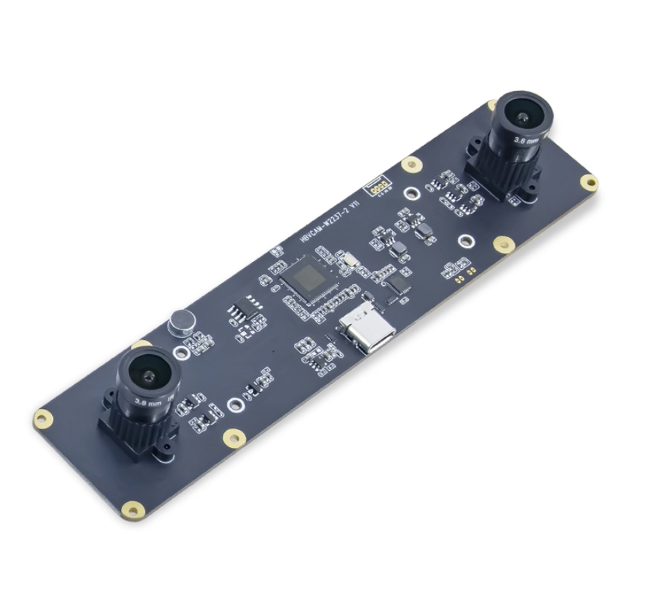
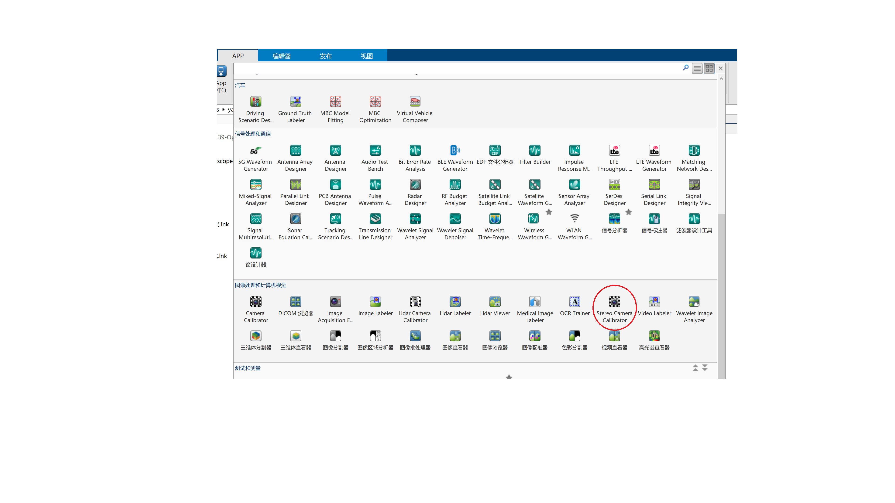
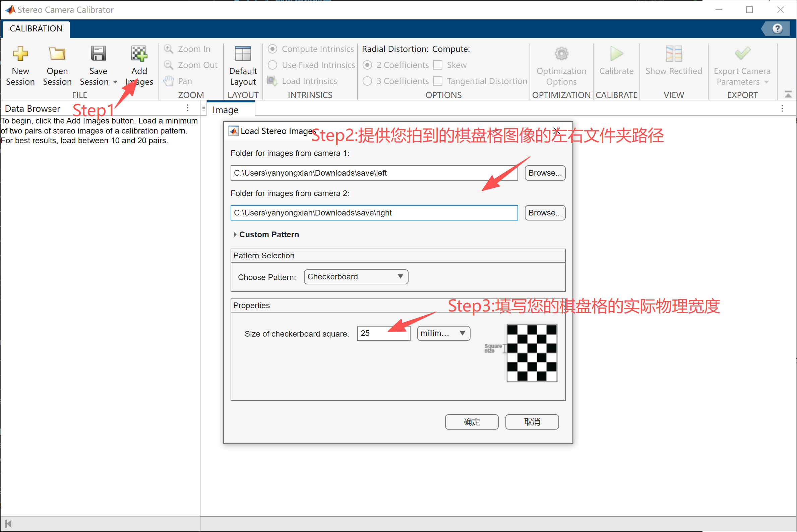
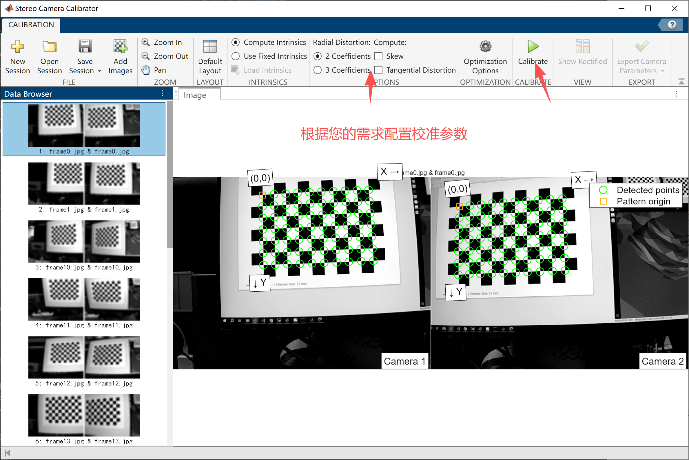
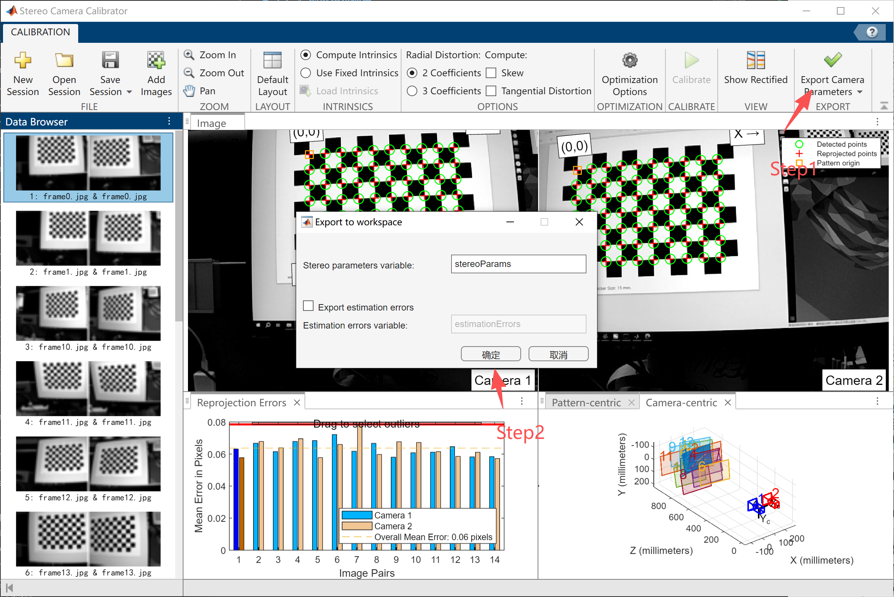
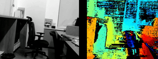

# 3.6.1 深度相机使用

## 简介

本文档适用于市面上常见的 **HBV 系列双目相机**，特别是双目、黑白、全局曝光、720P规格的双目相机。



## 软件安装

首先需要安装 **GStreamer**，安装步骤请参考：[GStreamer 使用指南](https://bianbu-linux.spacemit.com/media/gstreamer_user_guide)

## 使用指南

**重要提示：请确保相机连接到 USB 3.0 接口**

### 查看相机设备与支持格式

运行以下命令获取相机支持的分辨率与格式：

```bash
gst-device-monitor-1.0
```

命令输出中会显示相机的详细信息：

```text
Device found:

        name  : USB Global Camera (V4L2)
        class : Video/Source
        caps  : image/jpeg, width=2560, height=720, framerate={ (fraction)60/1, (fraction)60/1 }
                image/jpeg, width=1600, height=600, framerate=100/1
                image/jpeg, width=1280, height=480, framerate=100/1
                image/jpeg, width=1280, height=400, framerate=120/1
                image/jpeg, width=1280, height=720, framerate=120/1
                image/jpeg, width=1280, height=712, framerate=120/1
                image/jpeg, width=800, height=600, framerate=120/1
                image/jpeg, width=800, height=592, framerate=120/1
                image/jpeg, width=640, height=480, framerate=120/1
                image/jpeg, width=640, height=472, framerate=120/1
                image/jpeg, width=640, height=400, framerate=120/1
                image/jpeg, width=640, height=392, framerate=120/1
                image/jpeg, width=640, height=240, framerate=100/1
                image/jpeg, width=320, height=240, framerate=120/1
                image/jpeg, width=320, height=232, framerate=120/1
                image/jpeg, width=2560, height=720, framerate={ (fraction)60/1, (fraction)60/1 }
                video/x-raw, format=YUY2, width=2560, height=720, framerate={ (fraction)60/1, (fraction)60/1 }
                video/x-raw, format=YUY2, width=1600, height=600, framerate=100/1
                video/x-raw, format=YUY2, width=1280, height=480, framerate=100/1
                video/x-raw, format=YUY2, width=1280, height=400, framerate=120/1
                video/x-raw, format=YUY2, width=1280, height=720, framerate=120/1
                video/x-raw, format=YUY2, width=1280, height=712, framerate=120/1
                video/x-raw, format=YUY2, width=800, height=600, framerate=120/1
                video/x-raw, format=YUY2, width=800, height=592, framerate=120/1
                video/x-raw, format=YUY2, width=640, height=480, framerate=120/1
                video/x-raw, format=YUY2, width=640, height=472, framerate=120/1
                video/x-raw, format=YUY2, width=640, height=400, framerate=120/1
                video/x-raw, format=YUY2, width=640, height=392, framerate=120/1
                video/x-raw, format=YUY2, width=640, height=240, framerate=100/1
                video/x-raw, format=YUY2, width=320, height=240, framerate=120/1
                video/x-raw, format=YUY2, width=320, height=232, framerate=120/1
                video/x-raw, format=YUY2, width=2560, height=720, framerate={ (fraction)60/1, (fraction)60/1 }
        properties:
                api.v4l2.cap.bus_info = usb-xhci-hcd.0.auto-1
                api.v4l2.cap.capabilities = 84a00001
                api.v4l2.cap.card = USB Global Camera: USB Global C
                api.v4l2.cap.device-caps = 04200001
                api.v4l2.cap.driver = uvcvideo
                api.v4l2.cap.version = 6.6.63
                api.v4l2.path = /dev/video20
                device.api = v4l2
                device.devids = 20785
                device.id = 80
                device.product.id = 0x155
                device.vendor.id = 0x15a
                factory.name = api.v4l2.source
                media.class = Video/Source
                node.description = USB Global Camera (V4L2)
                node.name = v4l2_input.platform-xhci-hcd.0.auto-usb-0_1_1.0
                node.nick = USB Global Camera
                node.pause-on-idle = false
                object.path = v4l2:/dev/video20
                priority.session = 800
                factory.id = 10
                client.id = 35
                clock.quantum-limit = 8192
                media.role = Camera
                node.driver = true
                object.id = 81
                object.serial = 90
        gst-launch-1.0 pipewiresrc target-object=90 ! ...
```

**说明：**

- **上半部分 (`caps`)：** 列出了相机支持的分辨率和帧率，包括 `image/jpeg` 和 `video/x-raw` 等格式。
- **下半部分 (`properties`)：** 显示设备的详细属性信息，其中 `api.v4l2.path`（如 `/dev/video20`）是后续操作中需要使用的设备号。

### 启动相机

相机支持两种模式：

**方式一：video/x-raw 模式（无解码，需 USB3.0 支持）**

```bash
gst-launch-1.0 v4l2src device=/dev/video20 io-mode=2 ! "video/x-raw, width=2560, height=720, framerate=60/1" ! videoconvert ! waylandsink
```

**方式二：image/jpeg 模式（含解码，无需 USB3.0）**

```bash
#如果上一次已经运行过该指令，并用 Ctrl+C 结束的话，需要运行两次指令即可正常显示
gst-launch-1.0 v4l2src device=/dev/video20 io-mode=2 ! "image/jpeg, width=2560, height=720, framerate=60/1" ! spacemitdec ! videoconvert ! video/x-raw, format=NV12 !  waylandsink
```

如果遇到错误如下：

```bash
[MPP-ERROR] 11672:dequeueBuffer:495 Failed to dequeue buffer. type=9, memory=1
[MPP-ERROR] 11672:handleOutputBuffer:1431 dequeueBuffer failed, this dequeueBuffer must successed, because it is after Poll, please check! maybe after EOS?
```

可以尝试多次运行指令，或者重新插拔相机即可

### 保存视频

**video/x-raw 模式：**

```bash
gst-launch-1.0 v4l2src device=/dev/video20 io-mode=2 ! "video/x-raw, width=2560, height=720, framerate=60/1" ! videoconvert ! video/x-raw, format=NV12 ! spacemith264enc ! filesink location=output.h264
```

**image/jpeg 模式：**

```bash
gst-launch-1.0 v4l2src device=/dev/video20 io-mode=2 ! "image/jpeg, width=2560, height=720, framerate=60/1" ! spacemitdec ! videoconvert ! video/x-raw, format=NV12 ! spacemith264enc ! filesink location=output.h264
```

### 在 OpenCV 中使用相机

**注意：** 编译 OpenCV 时需开启 **WITH\_GSTREAMER** 选项。

CMakeLists.txt：
```CMake
# ------------------------
# CMakeLists.txt
# put the file in the project root directory
# ~/project/CMakeLists.txt
# ------------------------
cmake_minimum_required(VERSION 3.10)
project(stereo_test)

set(CMAKE_CXX_STANDARD 11)
set(CMAKE_CXX_STANDARD_REQUIRED ON)
set(CMAKE_BUILD_TYPE Release)
find_package(OpenCV REQUIRED)

include_directories(${OpenCV_INCLUDE_DIRS})

add_executable(stereo_test main.cpp)

target_link_libraries(stereo_test ${OpenCV_LIBS} yaml-cpp)

```
main.cpp：
```c++
// ------------------------
// main.cpp
// put the file in the project root directory
// ~/project/main.cpp
// ------------------------
#include <chrono>
#include <csignal>
#include <atomic>
#include <chrono>
#include <opencv2/opencv.hpp>
std::atomic<bool> running(true);

void signal_handler(int signum) {
    std::cout << "\nCaught signal " << signum << ", exiting...\n";
    running = false;  // 设置标志，退出 while 循环
}
int main(int argc, char **argv){
    signal(SIGINT, signal_handler);  // 捕获 Ctrl-C 信号
    int video_idx = std::stoi(argv[1]);
    std::string gst_pipeline = "v4l2src device=/dev/video" + std::to_string(video_idx) + " io-mode=2 ! " +
        "video/x-raw,format=YUY2,width=2560,height=720,framerate=60/1 ! " +
        "appsink";

    cv::VideoCapture cap(gst_pipeline, cv::CAP_GSTREAMER);
    if (!cap.isOpened()) {
        std::cerr << "Failed to open camera" << std::endl;
        return -1;
    }
    auto t0 = std::chrono::steady_clock::now();
    cv::Mat frame;
    int frame_id = 0;
    while(running && cap.grab()){
        cap.retrieve(frame);
        frame_id += 1;
        if(frame_id % 100 == 0){
            auto t1 = std::chrono::steady_clock::now();
            auto duration = std::chrono::duration_cast<std::chrono::microseconds>(t1 - t0).count();
            printf("FPS %.2f Process \r\n", 100 / (duration / 1000000.0));
            t0 = t1;
        }
    }
    cap.release();
    return 0;
}
```
编译运行
```bash
    cd ~/project
    mkdir build && cd build
    cmake ..
    make
    ./stereo_test 20
```
### 双目校准流程

双目相机的校准流程如下：

1. **准备标定板**
   - 使用 [标定板生成网页](https://calib.io/pages/camera-calibration-pattern-generator) 创建棋盘格标定板。
   - 选择 **Checkerboard**, 页面长宽设置在 **297x210** (符合 A4 纸标准), 并打印。
   - 棋盘格数量大于 6X8，宽度大于 25mm。

2. **拍摄标定板图像**
   - 使用指定分辨率拍摄标定板图像，并用代码分开左右目，并分别存到两个文件夹中(`left` 和 `right` 文件夹)。
   - 拍摄要求：
     - 拍摄时双目必须同时看到棋盘格的全貌
     - 需要拍摄不同距离不同角度的棋盘格
     - 需要避免相机的大幅晃动，稳定时再拍照
     - 需要避免标定板的反光

    以下为**拍摄标定板图像的代码**：

    ```python3
    import cv2
    import numpy as np
    import os
    cap = cv2.VideoCapture("/dev/video0")#实际设备号
    cap.set(cv2.CAP_PROP_FRAME_WIDTH, 1280)#根据需要分辨率进行指定
    cap.set(cv2.CAP_PROP_FRAME_HEIGHT, 480)#根据需要分辨率进行指定

    if os.path.exists("save"):
        #directly remove the folder if it exists
        os.system("rm -r save")


    os.makedirs("save")
    os.mkdir("save/left")
    os.mkdir("save/right")

    left_dir = "save/left"
    right_dir = "save/right"

    assert cap.isOpened(), "Cannot capture source"
    cnt = 0
    while True:
        flag, frame = cap.read()
        if not flag:
            break
        cv2.imshow("frame", frame)
        left = frame[:, :frame.shape[1]//2]
        right = frame[:, frame.shape[1]//2:]
        key = cv2.waitKey(1)
        if key == ord('q'):
            break
        if key == ord('s'):
            cv2.imwrite(f"save/left/frame{cnt}.jpg", left)
            cv2.imwrite(f"save/right/frame{cnt}.jpg", right)
            cnt+=1
    cap.release()
    cv2.destroyAllWindows()
    ```

3. **Matlab 标定**
   MatLab中调用标定程序，生成标定文件。
   示例界面截图：
   
   
   
   

   **注意：** 误差必须控制在 **0.1** 以内。

4. **导出标定文件**

```matlab
% 提取左右相机的内参矩阵
K1 = stereoParams.CameraParameters1.IntrinsicMatrix';
K2 = stereoParams.CameraParameters2.IntrinsicMatrix';

% 提取左右相机的畸变系数
D1 = stereoParams.CameraParameters1.RadialDistortion;
D1 = [D1, stereoParams.CameraParameters1.TangentialDistortion];
D2 = stereoParams.CameraParameters2.RadialDistortion;
D2 = [D2, stereoParams.CameraParameters2.TangentialDistortion];

% 提取旋转矩阵和平移向量
R = stereoParams.RotationOfCamera2;
T = stereoParams.TranslationOfCamera2';

% 创建 YAML 文件内容
yaml_content = sprintf('Camera1:\n');
yaml_content = [yaml_content, sprintf('  K: [%f, %f, %f, %f, %f, %f, %f, %f, %f] \n', K1(:))];
yaml_content = [yaml_content, sprintf('  D: [%f, %f, %f, %f] \n', D1)];

yaml_content = [yaml_content, sprintf('Camera2:\n')];
yaml_content = [yaml_content, sprintf('  K: [%f, %f, %f, %f, %f, %f, %f, %f, %f]\n', K2(:))];
yaml_content = [yaml_content, sprintf('  D: [%f, %f, %f, %f] \n\r', D2)];

yaml_content = [yaml_content, sprintf('R: [%f, %f, %f, %f, %f, %f, %f, %f, %f]\n', R(:))];
yaml_content = [yaml_content, sprintf('T: [%f, %f, %f] \n', T)];

% 写入文件
fid = fopen('stereo_params.yaml', 'w');
fprintf(fid, yaml_content);
fclose(fid);

disp('YAML 文件已生成: stereo_params.yaml');
```

5. **OpenCV 中读取标定文件并进行双目配对**

   **安装环境:**

   ```bash
   sudo apt update
   sudo apt install libyaml-cpp-dev
   ```

CMakeLists.txt：
```CMake
# ------------------------
# CMakeLists.txt
# put the file in the project root directory
# ~/project/CMakeLists.txt
# ------------------------
cmake_minimum_required(VERSION 3.10)
project(stereo_test)

set(CMAKE_CXX_STANDARD 11)
set(CMAKE_CXX_STANDARD_REQUIRED ON)
set(CMAKE_BUILD_TYPE Release)
find_package(OpenCV REQUIRED)

include_directories(${OpenCV_INCLUDE_DIRS})

add_executable(stereo_test main.cpp)

target_link_libraries(stereo_test ${OpenCV_LIBS} yaml-cpp)

```

   **示例 C++ 代码：**
main.cpp：
```c++
// ------------------------
// main.cpp
// put the file in the project root directory
// ~/project/main.cpp
// ------------------------
#include <yaml-cpp/yaml.h>
#include <chrono>
#include <csignal>
#include <atomic>
#include <chrono>
#include <thread>
#include <opencv2/opencv.hpp>
std::atomic<bool> running(true);

void signal_handler(int signum) {
    std::cout << "\nCaught signal " << signum << ", exiting...\n";
    running = false;  // 设置标志，退出 while 循环
}
void readYaml(const std::string& filename, cv::Mat &K1, cv::Mat &D1, cv::Mat &K2, cv::Mat &D2, cv::Mat &R, cv::Mat &T) {
    try {
        YAML::Node config = YAML::LoadFile(filename);
        // 读取 Camera1 的参数
        std::vector<double> K1_vec = config["Camera1"]["K"].as<std::vector<double>>();
        std::vector<double> D1_vec = config["Camera1"]["D"].as<std::vector<double>>();
        // 读取 Camera2 的参数
        std::vector<double> K2_vec = config["Camera2"]["K"].as<std::vector<double>>();
        std::vector<double> D2_vec = config["Camera2"]["D"].as<std::vector<double>>();
        // 读取旋转矩阵 R 和平移向量 T
        std::vector<double> R_vec = config["R"].as<std::vector<double>>();
        std::vector<double> T_vec = config["T"].as<std::vector<double>>();

        K1 = cv::Mat(3, 3, CV_64F);
        D1 = cv::Mat(1, 4, CV_64F);
        K2 = cv::Mat(3, 3, CV_64F);
        D2 = cv::Mat(1, 4, CV_64F);
        R = cv::Mat(3, 3, CV_64F);
        T = cv::Mat(3, 1, CV_64F);

        for (int i = 0; i < 9; i++) {
            K1.at<double>(i / 3, i % 3) = K1_vec[i];
        }
        for (int i = 0; i < 4; i++) {
            D1.at<double>(0, i) = D1_vec[i];
        }
        for (int i = 0; i < 9; i++) {
            K2.at<double>(i / 3, i % 3) = K2_vec[i];
        }
        for (int i = 0; i < 4; i++) {
            D2.at<double>(0, i) = D2_vec[i];
        }
        for (int i = 0; i < 9; i++) {
            R.at<double>(i / 3, i % 3) = R_vec[i];
        }
        for (int i = 0; i < 3; i++) {
            T.at<double>(i, 0) = T_vec[i];
        }
        K1 = K1.t();
        K2 = K2.t();
    } catch (const YAML::Exception& e) {
        std::cerr << "Error reading YAML file: " << e.what() << std::endl;
    }
}

int main(int argc, char **argv){
    signal(SIGINT, signal_handler);
    cv::Mat K1, D1, K2, D2, R, T;
    readYaml(argv[1], K1, D1, K2, D2, R, T);
    std::cout << "K1: " << K1 << std::endl;
    std::cout << "D1: " << D1 << std::endl;
    std::cout << "K2: " << K2 << std::endl;
    std::cout << "D2: " << D2 << std::endl;
    std::cout << "R: " << R << std::endl;
    std::cout << "T: " << T << std::endl;
    T /= 1000.0; // 单位转换
    cv::Mat R1, R2, P1, P2, Q;
    cv::stereoRectify(K1, D1, K2, D2, cv::Size(640, 480), R, T, R1, R2, P1, P2, Q, cv::CALIB_ZERO_DISPARITY,0, cv::Size(640, 480));
    cv::Mat map1x, map1y;
    cv::initUndistortRectifyMap(K1, D1, R1, P1, cv::Size(640, 480), CV_16SC2, map1x, map1y);
    cv::Mat map2x, map2y;
    cv::initUndistortRectifyMap(K2, D2, R2, P2, cv::Size(640, 480), CV_16SC2, map2x, map2y);


    cv::Ptr<cv::StereoSGBM> sgbm = cv::StereoSGBM::create(
        0, 64, 1, 10, 150, 0, 3, 22, 3, 3, cv::StereoSGBM::MODE_SGBM_3WAY);
    int video_idx = std::stoi(argv[2]);
    std::string gst_pipeline = "v4l2src device=/dev/video" + std::to_string(video_idx) + " io-mode=2 ! " +
        "video/x-raw,format=YUY2,width=1280,height=480,framerate=100/1 ! " +
        "videoconvert ! " +
        "video/x-raw, format=BGR ! " +
        "appsink";
    cv::VideoCapture cap(gst_pipeline, cv::CAP_GSTREAMER);
    if (!cap.isOpened()) {
        std::cerr << "Failed to open camera" << std::endl;
        return -1;
    }
    auto save_vid = cv::VideoWriter("output.avi", cv::VideoWriter::fourcc('M', 'J', 'P', 'G'), 30, cv::Size(1280, 480));
    while(running && cap.grab()){
        cv::Mat frame;
        cap.retrieve(frame);
        cv::Mat left, right;
        left = frame.colRange(0, frame.cols / 2).clone();
        right = frame.colRange(frame.cols / 2, frame.cols).clone();
        cv::remap(left, left, map1x, map1y, cv::INTER_LINEAR);
        cv::remap(right, right, map2x, map2y, cv::INTER_LINEAR);
        cv::Mat disp;
        sgbm->compute(left, right, disp);
        //disp = disp / 16.0 * 4
        // disp.convertTo(disp, CV_16UC1);
        cv::Mat disp_invalid;
        disp_invalid = disp < 0;
        disp.convertTo(disp, CV_8U, 1.0 / 4, 0);
        cv::applyColorMap(disp, disp, cv::COLORMAP_JET);
        disp.setTo(0, disp_invalid);

        cv::Mat total;
        cv::hconcat(left, disp, total);
        save_vid.write(total);
    }
    save_vid.release();
    cap.release();
    return 0;
}
```
```bash
    cd ~/project
    #put the param.yaml in ~/project/
    mkdir build && cd build
    cmake ..
    make
    ./stereo_test ~/project/param.yaml 20
```
6. 效果图

   
