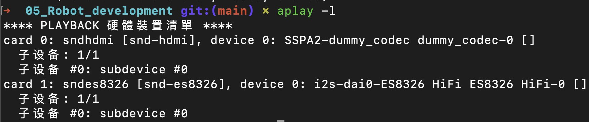
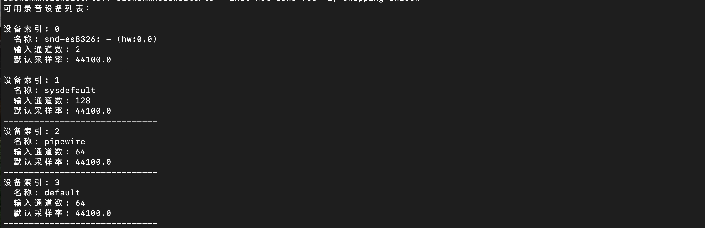

# 4.1.5.1 VAD

## 功能介绍

本节介绍如何使用语音活动检测（Voice Activity Detection, VAD）模型，实现对人声的自动检测并控制录音行为。系统将在检测到语音时启动录音，在检测到静音时自动停止。

项目代码仓库：[⭐ AI Demo Zoo | NLP](https://gitee.com/bianbu/spacemit-demo.git)

## 准备工作

### 下载模型文件

```bash
wget -O ~/.cache/sensevoice.tar.gz https://archive.spacemit.com/spacemit-ai/openwebui/sensevoice.tar.gz
tar -xzf ~/.cache/sensevoice.tar.gz -C ~/.cache
rm ~/.cache/sensevoice.tar.gz
```

### 克隆仓库代码

```bash
git clone https://gitee.com/bianbu/spacemit-demo.git
```

### 安装依赖环境

```bash
sudo apt update
sudo apt install onnxruntime python3-spacemit-ort
sudo apt install python3-numpy
sudo apt install python3-pyaudio
```

## 检测系统录音设备

### 方法1：使用 `arecord`

运行以下命令查看系统的录音设备列表：

```bash
arecord -l
```



记录下需要使用的设备索引编号。

### 方法2：运行脚本自动搜索

执行以下脚本以枚举系统中的录音设备：

```bash
python3 01_search_device.py
```


