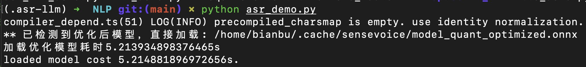

# 4.1.5.2 ASR

## 功能介绍

本节介绍语音转文本（Automatic Speech Recognition，ASR）的基本功能及其示例使用方法。用户通过麦克风输入语音后，系统可自动识别并转换为文本。

项目代码仓库：[⭐ AI Demo Zoo | NLP](https://gitee.com/bianbu/spacemit-demo.git)

## 准备工作

### 克隆代码

```bash
git clone https://gitee.com/bianbu/spacemit-demo.git
cd spacemit-demo/examples/NLP
```

### 安装环境依赖

建议使用虚拟环境进行依赖隔离：

```bash
sudo apt install python3-venv

python3 -m venv .venv
source .venv/bin/activate

pip install -r requirements.txt
```

### 检测系统录音设备

参考 [录音设备检测](4.1.5.1-VAD.md#检测系统录音设备) 章节查看系统可用的录音设备。

## 执行示例代码

运行 ASR 示例：

```bash
python 03_asr_demo.py
```



程序启动后，按下回车键即可开始录音。内部集成的 VAD 功能将自动判断是否有人声，并在静音时停止录音。

## 参数说明

| 参数名称       | 中文说明           | 用途说明                                                     |
| -------------- | ------------------ | ------------------------------------------------------------ |
| `sld`          | 静音长度阈值（秒） | 连续静音时间 ≥ `sld` 秒将被判定为语音结束；设为 `0` 表示禁用 |
| `max_time`     | 最长录音时间（秒） | 达到该时长自动终止录音，避免过长语音                         |
| `channels`     | 音频通道数         | 通常设为 `1`（单声道），语音识别推荐使用单声道输入           |
| `rate`         | 采样率（Hz）       | 每秒采样点数，如 `16000` 或 `48000`，需与模型输入匹配        |
| `device_index` | 输入设备索引       | 指定录音设备，可通过 `arecord` 或 `search_device.py` 获取    |
