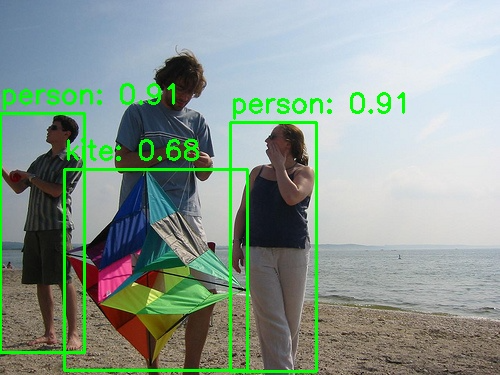

# 4.2.1 目标检测

## 1. 模块概述

- 主要功能：基于 YOLO 系列模型的通用目标检测，支持 COCO 80 类物体的实时检测，输出每个目标的边界框（bounding box）、置信度与类别标签。
- 规格或特性：
  - 支持模型：YOLOv5（n/s）、YOLOv8（n/s/m）、YOLOv11（n/s/m）、YOLO12（n/s）
  - 输入尺寸：`[1, 3, 640, 640]`
  - 量化类型：int8
  - 推理后端：ONNX Runtime + SpaceMITExecutionProvider
  - 接口形态：C++（`vision_service.h`）、Python（`spacemit_vision` wheel：`VisionServiceNative`）
- 相关目录结构：

```text
examples/yolov5/          # YOLOv5 示例
├── config/yolov5.yaml    # 配置文件
├── cpp/yolov5.cpp        # C++ 示例
├── python/yolov5.py      # Python 示例
└── scripts/              # 模型下载脚本
examples/yolov8/          # YOLOv8 示例（结构同上）
examples/yolov11/         # YOLOv11 示例（结构同上）
examples/yolo12/          # YOLO12 示例（结构同上）
src/deploy/yolov5/        # YOLOv5 部署实现
src/deploy/yolov8/        # YOLOv8 部署实现
src/deploy/yolov11/       # YOLOv11 部署实现
```

## 2. 环境准备

### 前置条件

SDK 源码获取和基础编译环境配置统一参考 2.3-构建编译。完成 SDK 初始化后，回到本文继续执行“构建编译”。

后续命令默认在 K1 设备的 `spacemit_robot` SDK 根目录执行。

### 构建编译

系统缺少依赖时先安装：
```bash
sudo apt install python3-spacemit-ort opencv-spacemit spacemit-onnxruntime \
    eigen-spacemit openblas-spacemit libeigen3-dev libyaml-cpp-dev \
    python3-venv python3-numpy libtesseract5
```

在 SDK 根目录加载构建环境，选择 K1 target，然后编译视觉组件：
```bash
cd /root/spacemit_robot
source build/envsetup.sh
lunch k1-muse-pipro-ai-cubpet

cd components/model_zoo/vision
mm
```

SDK 集成构建会把 `yolov8`、`yolov5`、`yolov11`、`yolo12` 等示例程序安装到 `output/staging/bin`。

### 安装 Python 接口

运行 Python 示例前，先创建并激活虚拟环境：
```bash
cd /root/spacemit_robot/components/model_zoo/vision
if [ ! -d /root/.comm-env ]; then
    /usr/bin/python3 -m venv /root/.comm-env
fi
source /root/.comm-env/bin/activate
```

安装 Python 构建工具和运行依赖：
```bash
python3 -m pip install -U pybind11 build setuptools wheel
python3 -m pip install pyyaml
```

K1 当前厂商 OpenCV 需配合 NumPy 1.x 使用。将系统 Python 包目录和厂商 OpenCV 加入搜索路径，优先使用系统提供的 NumPy：
```bash
export PYTHONPATH="/usr/lib/python3/dist-packages:/opt/opencv-spacemit/lib/python3.12/dist-packages/cv2/python-3${PYTHONPATH:+:$PYTHONPATH}"
```

构建并安装 `spacemit_vision` wheel：
```bash
cmake -S . -B build \
    -DPython3_EXECUTABLE=/root/.comm-env/bin/python3
cmake --build build -j4

python3 -m pip install --force-reinstall --no-deps src/python/dist/*.whl

python3 -c \
'import cv2, numpy, yaml; from spacemit_vision import VisionServiceNative; print("ok")'
```

输出 `ok` 表示 Python 接口安装及导入检查成功。每次新开终端运行 Python 示例时，需重新激活虚拟环境并执行上述 `export PYTHONPATH` 命令。

模型权重默认存放路径为 `~/.cache/models/vision/yolov8/`、`~/.cache/models/vision/yolov5/`、`~/.cache/models/vision/yolov11/`、`~/.cache/models/vision/yolo12/`。运行示例前须执行对应模型的下载脚本；模型缺失时程序会报错 `Model file not found`。

## 3. 示例使用（从 0 跑通）

示例配置默认使用 `num_threads: 8`。当前 K1 运行时报告可用 AI 核为 4，需将**推理线程数**改为 `4`；下面各示例均包含修改命令，Python 和 C++ 共用对应 YAML，无需重新编译。`sed -i.bak` 会将本次修改前的配置保存为同名 `.bak` 文件。

### 3.1 YOLOv8 目标检测（Python）

**前置**：见第 2 节，依赖和 Python 接口已安装。

**步骤 1**：下载模型

```bash
cd /root/spacemit_robot/components/model_zoo/vision
bash examples/yolov8/scripts/download_models.sh
```

预期现象：模型文件下载至 `~/.cache/models/vision/yolov8/yolov8n_no_dfl.q.onnx`；已有文件时显示 `Exists`。

**步骤 2**：下载测试素材

```bash
bash scripts/download_assets.sh
```

预期现象：测试图片下载至 `~/.cache/assets/image/` 目录。

**步骤 3**：修改推理线程数并运行推理

```bash
sed -i.bak 's/num_threads: 8/num_threads: 4/' examples/yolov8/config/yolov8.yaml

python3 examples/yolov8/python/yolov8.py --config examples/yolov8/config/yolov8.yaml
```

预期现象：加载模型并输出检测结果，结果图像保存到当前目录的 `result.jpg`。

**步骤 4**（可选）：使用摄像头实时检测

先确认摄像头设备号（`--camera-id` 为 `/dev/videoN` 中的 `N`）：

```bash
v4l2-ctl --list-devices
ls /dev/video*
```

摄像头窗口需要可用的图形显示环境。从开发电脑查看画面时，在**电脑本地桌面终端**建立 X11 转发连接，将 `K1_IP` 替换为 K1 的实际地址：

```bash
ssh -S none -Y root@K1_IP
```

电脑需有可用的 X11/XWayland 会话，K1 的 SSH 服务需支持 X11 转发。登录后在同一终端加载本节开头的运行环境，再执行下面的命令。`DISPLAY` 由 SSH 自动设置，保持该连接打开；单独 `export DISPLAY` 不会建立 X11 转发。

若 --camera-id 0 无法打开，请根据输出选择实际采集节点（例如 /dev/video20 对应 --camera-id 20）。需要时可执行 v4l2-ctl -d /dev/videoN --all 查看节点详情。

```bash
python3 examples/yolov8/python/yolov8.py \
    --config examples/yolov8/config/yolov8.yaml \
    --use-camera --camera-id 0
```

预期现象：终端持续输出检测结果，并出现实时视频窗口。在视频窗口内按 `q` 退出，按 `s` 保存当前帧。

### 3.2 YOLOv8 目标检测（C++）

**前置**：见第 2 节，C++ 编译完成，当前终端已加载 SDK 环境。

**步骤 1**：下载模型和测试素材（同第 3.1 节步骤 1、2）

**步骤 2**：修改推理线程数并运行推理

```bash
cd /root/spacemit_robot/components/model_zoo/vision
sed -i.bak 's/num_threads: 8/num_threads: 4/' examples/yolov8/config/yolov8.yaml

yolov8 examples/yolov8/config/yolov8.yaml
```

**步骤 3**（可选）：使用摄像头实时检测

图形显示环境和设备号确认方法见第 3.1 节步骤 4。以下以图像采集节点 `/dev/video20` 为例：

```bash
yolov8 examples/yolov8/config/yolov8.yaml --use-camera --camera-id 0
```

### 3.3 YOLOv5 目标检测

**步骤 1**：下载模型（测试素材同第 3.1 节步骤 2）

```bash
cd /root/spacemit_robot/components/model_zoo/vision
bash examples/yolov5/scripts/download_models.sh
```

**步骤 2**：修改推理线程数并运行推理

```bash
sed -i.bak 's/num_threads: 8/num_threads: 4/' examples/yolov5/config/yolov5.yaml

# Python
python3 examples/yolov5/python/yolov5.py --config examples/yolov5/config/yolov5.yaml

# C++
yolov5 examples/yolov5/config/yolov5.yaml
```

### 3.4 YOLOv11 目标检测

**步骤 1**：下载模型（测试素材同第 3.1 节步骤 2）

```bash
cd /root/spacemit_robot/components/model_zoo/vision
bash examples/yolov11/scripts/download_models.sh
```

**步骤 2**：修改推理线程数并运行推理

```bash
sed -i.bak 's/num_threads: 8/num_threads: 4/' examples/yolov11/config/yolov11.yaml

# Python
python3 examples/yolov11/python/yolov11.py --config examples/yolov11/config/yolov11.yaml

# C++
yolov11 examples/yolov11/config/yolov11.yaml
```

### 3.5 YOLO12 目标检测

**步骤 1**：下载模型（测试素材同第 3.1 节步骤 2）

```bash
cd /root/spacemit_robot/components/model_zoo/vision
bash examples/yolo12/scripts/download_models.sh
```

预期现象：模型文件下载至 `~/.cache/models/vision/yolo12/yolo12n.q.onnx`。

**步骤 2**：修改推理线程数并运行推理

```bash
sed -i.bak 's/num_threads: 8/num_threads: 4/' examples/yolo12/config/yolo12.yaml

# Python
python3 examples/yolo12/python/yolo12.py --config examples/yolo12/config/yolo12.yaml

# C++
yolo12 examples/yolo12/config/yolo12.yaml
```

### 3.6 运行结果示例

**终端输出示例**（K1 上 YOLOv8n Python 单图检测）：

```text
检测到 3 个目标:
  person (Class 0), Score: 0.916929, Box: [0.593, 113.699, 84.992, 352.116]
  person (Class 0), Score: 0.916929, Box: [230.995, 122.221, 316.241, 371.113]
  kite (Class 33), Score: 0.686754, Box: [64.550, 169.189, 247.296, 370.581]
结果图像已保存到: result.jpg
```

**可视化结果示意**：



图中展示了检测到的目标边界框、类别标签和置信度分数。

## 4. 应用开发

本章面向应用开发者，说明如何在自己的 C++ 或 Python 应用中集成目标检测组件。完整接口定义以 `include/vision_service.h` 和 `src/python/spacemit_vision/vision_service_native.py` 为准；本节介绍常用公开接口和典型调用方式。

### 4.1 接口说明

目标检测组件的核心入口是 `VisionService`（C++）和 `VisionServiceNative`（Python，`spacemit_vision` wheel）。应用侧通过这些接口加载 YOLO 模型，并发起图像或视频流的目标检测请求。

#### 4.1.1 常用数据结构

| 类型 | 说明 |
| --- | --- |
| vision::Detection | 目标检测结果结构体，含边界框 `bbox`（x1, y1, x2, y2）、置信度 `score`、类别 ID `label`。 |
| vision::Result | 统一结果变体（`std::variant`），目标检测时实际持有 `vision::Detection`。可用 `vision::get_bbox/get_label/get_score` 读取通用字段，或用 `std::get_if<vision::Detection>` 取具体类型。 |
| VisionServiceResponse | 推理响应，`results` 为 `vision::ResultList`（即 `std::vector<vision::Result>`），并含 `ok`、`error_message`。 |
| VisionServiceRequest | 推理请求，图像模型填充 `image`，可在 `params` 中临时覆盖 `conf_threshold`、`iou_threshold` 等参数。 |

#### 4.1.2 服务初始化

**C++ 接口**

| 接口 | 说明 | 参数 | 返回值 |
| --- | --- | --- | --- |
| VisionService::Create | 从 YAML 配置文件创建检测服务实例 | config_path：YAML 配置文件路径 | VisionService 智能指针 |
| VisionService::LastCreateError | 获取最近一次创建失败的错误信息 | 无 | 错误描述字符串 |

**Python 接口**

| 接口 | 说明 | 参数 | 返回值 |
| --- | --- | --- | --- |
| VisionServiceNative.create | 从 YAML 配置文件创建服务实例 | config_path：YAML 路径；model_path_override：可选覆盖模型路径 | VisionServiceNative 实例 |
| VisionServiceNative.last_create_error | 获取最近一次创建失败的错误信息 | 无 | 错误描述字符串 |

#### 4.1.3 目标检测

**C++ 接口**

| 接口 | 说明 | 参数 | 返回值 |
| --- | --- | --- | --- |
| Infer | 对图像文件进行目标检测 | image_path：图像文件路径；response：输出响应；params：可选推理参数 | VisionServiceStatus（VISION_SERVICE_OK 表示成功） |
| Infer | 对 cv::Mat 图像进行目标检测 | image：OpenCV Mat 对象；response：输出响应；params：可选推理参数 | VisionServiceStatus |
| Draw | 在图像上绘制检测结果（无状态，需显式传入响应） | image：输入图像；response：推理响应；out_image：输出图像 | VisionServiceStatus |
| LastError | 获取最近一次推理的错误信息 | 无 | 错误描述字符串 |

**Python 接口**

| 接口 | 说明 | 参数 | 返回值 |
| --- | --- | --- | --- |
| infer_image | 对图像进行推理 | image_or_path：BGR numpy 数组或图像路径；conf/iou：可选阈值（<=0 用 yaml 默认） | (VisionServiceStatus, results 列表) |
| draw | 绘制最近一次推理结果 | image：BGR numpy 数组 | (VisionServiceStatus, 绘制后图像) |
| supports_draw | 当前模型是否支持 C++ 侧绘制 | 无 | bool |
| last_error | 获取最近一次推理错误 | 无 | 错误描述字符串 |

#### 4.1.4 性能监控

**C++ 接口**

| 接口 | 说明 | 参数 | 返回值 |
| --- | --- | --- | --- |
| SetTimingOptions | 启用/禁用性能计时 | options：VisionServiceTimingOptions（enabled、print_to_stdout） | void |
| GetLastTiming | 获取最近一次推理的各阶段耗时 | 无 | VisionServiceTiming 结构体（preprocess_ms、model_infer_ms、postprocess_ms、infer_ms 等） |

### 4.2 典型调用流程

以下代码在 Vision 组件目录运行，读取的 YAML 需按第 3 节设置 `num_threads: 4`。单图代码中的 `test.jpg` 应替换为实际图像路径，例如 `/root/.cache/assets/image/006_test.jpg`。视频流示例以本次 K1 的采集节点 `/dev/video20` 为例，设备号和图形显示环境按第 3.1 节步骤 4 确认。

#### 4.2.1 C++ 单图检测

```cpp
#include "vision_service.h"
#include <opencv2/opencv.hpp>
#include <iostream>

int main() {
    // 1. 创建服务
    auto service = VisionService::Create("examples/yolov8/config/yolov8.yaml");
    if (!service) {
        std::cerr << "Failed to create service: "
                  << VisionService::LastCreateError() << std::endl;
        return -1;
    }

    // 2. 启用性能计时（可选）
    VisionServiceTimingOptions timing_options;
    timing_options.enabled = true;
    service->SetTimingOptions(timing_options);

    // 3. 执行推理
    VisionServiceResponse response;
    if (service->Infer("test.jpg", &response) != VISION_SERVICE_OK) {
        std::cerr << "Inference failed: " << service->LastError() << std::endl;
        return -1;
    }

    // 4. 处理结果（结果为 vision::Result 变体，用访问器读取通用字段）
    std::cout << "Detected " << response.results.size() << " objects:" << std::endl;
    for (const auto& result : response.results) {
        const vision::BoundingBox box = vision::get_bbox(result);
        std::cout << "  Class " << vision::get_label(result)
                  << ", Score: " << vision::get_score(result)
                  << ", Box: [" << box.x1 << "," << box.y1 << ","
                  << box.x2 << "," << box.y2 << "]" << std::endl;
    }

    // 5. 绘制结果（Draw 无状态，需显式传入 response）
    cv::Mat image = cv::imread("test.jpg");
    cv::Mat output;
    service->Draw(image, response, &output);
    cv::imwrite("result.jpg", output);

    // 6. 查看性能指标（可选）
    auto timing = service->GetLastTiming();
    std::cout << "Preprocess: " << timing.preprocess_ms << " ms" << std::endl;
    std::cout << "Inference: " << timing.model_infer_ms << " ms" << std::endl;
    std::cout << "Postprocess: " << timing.postprocess_ms << " ms" << std::endl;

    return 0;
}
```

#### 4.2.2 C++ 视频流检测

```cpp
#include "vision_service.h"
#include <opencv2/opencv.hpp>

int main() {
    auto service = VisionService::Create("examples/yolov8/config/yolov8.yaml");
    cv::VideoCapture cap(20);  // 本次 K1 摄像头为 /dev/video20，按实际设备号调整
    cv::Mat frame, output;

    while (cap.read(frame)) {
        VisionServiceResponse response;
        if (service->Infer(frame, &response) != VISION_SERVICE_OK) break;
        service->Draw(frame, response, &output);

        cv::imshow("Detection", output);
        if (cv::waitKey(1) == 'q') break;
    }

    return 0;
}
```

#### 4.2.3 Python 单图检测

```python
import cv2
from spacemit_vision import VisionServiceNative, VisionServiceStatus

# 1. 创建服务
svc = VisionServiceNative.create("examples/yolov8/config/yolov8.yaml")

# 2. 执行推理
image = cv2.imread("test.jpg")
status, results = svc.infer_image(image)
if status != VisionServiceStatus.OK:
    raise RuntimeError(svc.last_error())

# 3. 处理结果（每项含 label、score、x1/y1/x2/y2）
print(f"Detected {len(results)} objects:")
for r in results:
    print(f"  Class {r.label}, Score: {r.score:.4f}, "
          f"Box: [{r.x1:.1f},{r.y1:.1f},{r.x2:.1f},{r.y2:.1f}]")

# 4. 绘制结果
if svc.supports_draw():
    st, output = svc.draw(image)
    if st == VisionServiceStatus.OK:
        cv2.imwrite("result.jpg", output)
```

#### 4.2.4 Python 视频流检测

```python
import cv2
from spacemit_vision import VisionServiceNative, VisionServiceStatus

svc = VisionServiceNative.create("examples/yolov8/config/yolov8.yaml")
cap = cv2.VideoCapture(20)  # 本次 K1 摄像头为 /dev/video20，按实际设备号调整

while True:
    ret, frame = cap.read()
    if not ret:
        break

    status, results = svc.infer_image(frame)
    if status != VisionServiceStatus.OK:
        break

    output = frame
    if svc.supports_draw():
        st, output = svc.draw(frame)
        if st != VisionServiceStatus.OK:
            output = frame

    cv2.imshow("Detection", output)
    if cv2.waitKey(1) & 0xFF == ord('q'):
        break

cap.release()
cv2.destroyAllWindows()
```

### 4.3 配置说明

YAML 配置文件是模型加载和推理参数的核心，以下是完整配置项说明：

```yaml
# 模型文件路径（支持相对路径和 ~ 展开）
model_path: ~/.cache/models/vision/yolov8/yolov8n_no_dfl.q.onnx

# 测试图像路径（用于示例程序）
test_image: ~/.cache/assets/image/006_test.jpg

# 类别标签文件路径（COCO 80 类）
label_file_path: assets/labels/coco.txt

# 模型输入尺寸 [height, width]
image_size: [640, 640]

# 部署类名（C++ 模型工厂注册名，Python 通过 yaml 路径间接使用）
class: deploy.yolov8.YOLOv8Detector

# 推理参数
default_params:
  # 置信度阈值（0.0-1.0），低于此值的检测框将被过滤
  conf_threshold: 0.25

  # IOU 阈值（0.0-1.0），用于 NMS 非极大值抑制
  iou_threshold: 0.45

  # 推理线程数（当前 K1 运行时报告可用 AI 核为 4）
  num_threads: 4

  # 推理后端（优先使用 SpaceMITExecutionProvider）
  providers:
    - SpaceMITExecutionProvider
    - CPUExecutionProvider  # 备用后端
```

**参数调优建议**：

- **conf_threshold**：提高可减少误检，降低可增加召回率。本次测试为 20.25 适用于大多数场景。
- **iou_threshold**：提高可保留更多重叠框，降低可减少冗余检测。本次测试为 20.45 平衡效果。
- **num_threads**：示例 YAML 默认为 8，当前 K1 运行时报告可用 AI 核为 4，需改为 4 后运行。该参数控制推理线程数，运行时的可用 AI 核数量不等同于设备的总 CPU 核数。
- **providers**：优先使用 SpaceMITExecutionProvider 以获得最佳性能，CPUExecutionProvider 作为备用。

### 4.4 性能监控

通过启用性能计时，可以分析推理各阶段的耗时，用于性能优化和瓶颈定位。

**C++ 示例**：

```cpp
VisionServiceTimingOptions timing_options;
timing_options.enabled = true;
service->SetTimingOptions(timing_options);

VisionServiceResponse response;
service->Infer("test.jpg", &response);

auto timing = service->GetLastTiming();
std::cout << "Preprocess: " << timing.preprocess_ms << " ms" << std::endl;
std::cout << "Inference: " << timing.model_infer_ms << " ms" << std::endl;
std::cout << "Postprocess: " << timing.postprocess_ms << " ms" << std::endl;
std::cout << "Total: " << timing.infer_ms << " ms" << std::endl;
```

**性能优化建议**：

- 预处理耗时高：检查图像尺寸是否过大，考虑降低输入分辨率。
- 推理耗时高：确认使用 SpaceMITExecutionProvider，检查线程数设置。
- 后处理耗时高：检查检测框数量是否过多，适当提高 conf_threshold。

**参考 demo 路径**：

- `examples/yolov8/`、`examples/yolov5/`、`examples/yolov11/`、`examples/yolo12/`
- 应用案例：`applications/fire_detection/`（火灾检测）、`applications/intrusion_detection/`（入侵检测）

## 5. 调试指南

- 启用计时：通过 `SetTimingOptions` 查看预处理、推理、后处理各阶段耗时
- 检查模型加载：`VisionService::LastCreateError()` 获取创建失败的详细信息
- 检查推理错误：`service->LastError()` 返回最近一次推理的错误信息
- 检测结果为空：调整 `conf_threshold` 观察检测数量变化，确认输入图片包含目标物体

## 6. 常见问题

| 现象 | 可能原因 | 处理 |
| --- | --- | --- |
| `Model file not found` | 模型未下载或路径错误 | 在 Vision 目录执行对应模型的下载脚本，核对 YAML 中的模型路径 |
| `No module named 'spacemit_vision'` | wheel 未安装或虚拟环境未激活 | 按第 2 节安装 wheel，并激活 `/root/.comm-env` |
| `No module named 'cv2'` 或 `'yaml'` | 搜索路径未设置或 PyYAML 未安装 | 按第 2 节设置 K1 的 `PYTHONPATH`，安装 PyYAML |
| 缺少 `libtesseract.so.5` | 厂商 OpenCV 所需运行库未安装 | 按第 2 节安装 `libtesseract5` |
| `numpy.core.multiarray failed to import`，提示 NumPy 1.x / 2.x 不兼容 | 当前厂商 OpenCV 使用 NumPy 1.x 编译，运行时加载了 NumPy 2.x | 按第 2 节设置 `PYTHONPATH`，优先加载系统 NumPy 1.x |
| `Not enough available AI cores`，`required 8, available 4` | 配置线程数超过当前运行时可用资源 | 将对应 YAML 的 `num_threads` 改为 `4`，见第 3 节各示例 |
| 摄像头无法打开 | 设备号错误、未接到 K1 或被占用 | 查询 USB 摄像头节点，选择 Device Caps 包含 `Video Capture` 的节点 |
| `Can't initialize GTK backend` | 当前会话没有可用的图形显示环境 | 按第 3.1 节建立 X11 转发连接，或使用 K1 本机图形会话 |
| 检测结果为空 | `conf_threshold` 过高或输入图片无目标 | 降低阈值，换用包含支持类别的测试图片 |
| `SpaceMITExecutionProvider not found` | 厂商 ONNX Runtime 或其依赖未准备好 | 按第 2 节安装依赖并加载 SDK 环境 |
| 推理速度慢 | provider、线程配置或其他运行负载影响 | 确认使用 SpaceMITExecutionProvider 和 4 线程，用第 4.4 节计时分析各阶段耗时 |

## 附录：性能与测试数据

以下为K1 上使用 `onnxruntime_perf_test` 得到的实测结果。计时范围为**纯 ONNX 模型推理，不包含图像预处理、后处理、摄像头采集、绘制与窗口显示**，不代表实时视频窗口的帧率。

### K1 平台

测试环境：Linux 6.6.63、`spacemit-onnxruntime 2.0.3-bpo1`，使用 SpaceMITExecutionProvider，4 个 EP 推理线程、1 个 ORT intra-op 线程、单并发。每个模型测试三轮，每轮 200 次；下表帧率取三轮结果的中位数，保留一位小数。输入大小及 int8 规格沿用组件文档。

| 具体模型 | 输入大小 | 数据类型 | 帧率（4 个 EP 线程） |
| --- | --- | --- | ---: |
| yolov5n | [1,3,640,640] | int8 | 9.4 |
| yolov5s | [1,3,640,640] | int8 | 7.0 |
| yolov8n | [1,3,640,640] | int8 | 14.8 |
| yolov8s | [1,3,640,640] | int8 | 6.7 |
| yolov8m | [1,3,640,640] | int8 | 3.0 |
| yolo11n | [1,3,640,640] | int8 | 12.4 |
| yolo11s | [1,3,640,640] | int8 | 5.9 |
| yolo11m | [1,3,640,640] | int8 | 2.1 |

YOLOv8 使用 `yolov8{n,s,m}_no_dfl.q.onnx` 模型，YOLOv11 使用 `yolo11{n,s,m}.q.onnx` 模型。YOLO12 和 8 线程性能未测试，不列入本表。

**复现方法**：在 K1 加载 SDK 环境后，使用 `onnxruntime_perf_test`（以 YOLOv8n 为例，单轮 200 次）：

```bash
cd /root/spacemit_robot
source build/envsetup.sh

onnxruntime_perf_test ~/.cache/models/vision/yolov8/yolov8n_no_dfl.q.onnx \
    -e spacemit -m times -r 200 -x 1 -S 1 -s -I -c 1 \
    -i "SPACEMIT_EP_INTRA_THREAD_NUM|4"
```

重复运行三轮，读取输出中的 `Number of inferences per second`，取中位数作为帧率。该工具从命令行设置 EP 线程数，不读取示例 YAML 的 `num_threads`。

详细说明见 SpacemiT 社区文档 [AI 计算栈 · ONNX Runtime](https://www.spacemit.com/community/document/info?lang=zh&nodepath=ai/compute_stack/ai_compute_stack/onnxruntime.md) 中的 **onnxruntime_perf_test** 章节。
