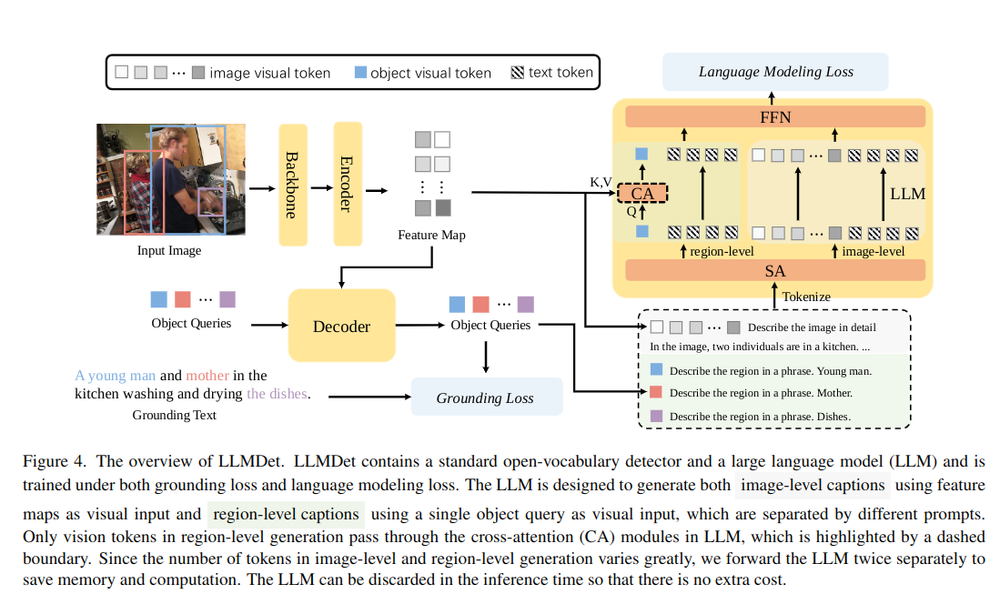
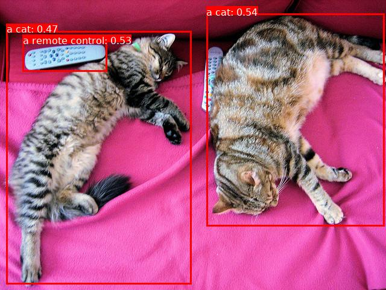

# 4.2.11 开放词汇检测

## 功能概述

LLMDet 是一种面向开放词汇目标检测（Open-Vocabulary Object Detection, OVOD） 的创新模型架构。其核心思想是将大语言模型（LLM）的语义知识与传统视觉检测器相结合，从而显著提升模型对未知类别目标的识别能力。

## LLMDet训练框架



### 架构组成

如上图所示，LLMDet 框架主要由以下三大部分构成：

- **视觉编码器（Backbone & Encoder）**：负责从输入图像中提取全局特征图（Feature Map）和图像级视觉标记。
- **区域解码器（Decoder）**：接收视觉特征与 Object Queries，预测目标区域并生成对应的区域级视觉标记。这是模型的核心检测模块。
- **大语言模型（LLM）**：作为语言生成组件，通过交叉注意力（Cross-Attention, CA） 接收视觉标记，在训练过程中生成图像及区域描述，从而将语义信息注入视觉特征中。

### 训练机制

LLMDet 采用 **双重损失协同优化** 机制，以同时提升检测精度和语义泛化能力：

- **Grounding Loss（定位损失）**：作用于 Decoder，用于约束检测器将 Object Queries 准确定位到 Grounding Text 所描述的区域，确保检测结果的空间准确性。
- **Language Modeling Loss（语言建模损失）**：作用于 LLM，指导其根据视觉标记生成精确描述文本，从而实现语言语义对检测器的知识迁移。

### 关键优势

- **语义增强**：利用 LLM 的语义知识，使检测器具备对未知类别的识别能力。
- **高效推理**：推理阶段可舍弃 LLM 部分，仅保留检测器（Backbone、Encoder、Decoder），在不牺牲性能的前提下显著降低计算成本。
- **轻量部署**：支持在边缘设备上快速推理，适合嵌入式或低算力场景。

## 下载代码

```text
git clone https://github.com/iSEE-Laboratory/LLMDet.git
```

## 环境安装

1. 下载预构建的虚拟环境压缩包：

```text
wget -O ~/llmdet_venv.tar.gz https://archive.spacemit.com/ros2/prebuilt/llmdet_venv.tar.gz
```

2. 解压虚拟环境：

```text
tar -zvxf ~/llmdet_venv.tar.gz -C ~
```

3. 激活环境：

```text
source ~/.llmdet_venv/bin/activate
```

## 运行LLMDet

1. 在项目目录下新建 `demo.py` 文件，并填入以下示例代码：

```text
import torch
from transformers import AutoModelForZeroShotObjectDetection, AutoProcessor
from transformers.image_utils import load_image
from PIL import Image, ImageDraw, ImageFont
import matplotlib.pyplot as plt

# 模型与处理器初始化
model_id = "iSEE-Laboratory/llmdet_tiny"
device = "cuda" if torch.cuda.is_available() else "cpu"
processor = AutoProcessor.from_pretrained(model_id)
model = AutoModelForZeroShotObjectDetection.from_pretrained(model_id).to(device)

# 准备输入
image_url = "http://images.cocodataset.org/val2017/000000039769.jpg"
image = load_image(image_url)
text_labels = [["a cat", "a remote control"]]
inputs = processor(images=image, text=text_labels, return_tensors="pt").to(device)

# 模型推理
with torch.no_grad():
    outputs = model(**inputs)

# 结果后处理
results = processor.post_process_grounded_object_detection(
    outputs,
    threshold=0.4,
    target_sizes=[(image.height, image.width)]
)
result = results[0]

# 绘制检测框
if not isinstance(image, Image.Image):
    image = Image.fromarray(image)
draw = ImageDraw.Draw(image)
try:
    font = ImageFont.truetype("DejaVuSans.ttf", 16)
except:
    font = ImageFont.load_default()

for box, score, label in zip(result["boxes"], result["scores"], result["labels"]):
    box = [round(x, 2) for x in box.tolist()]
    confidence = round(score.item(), 3)
    text = f"{label}: {confidence:.2f}"
    draw.rectangle(box, outline="red", width=3)
    text_size = draw.textbbox((0, 0), text, font=font)
    draw.rectangle(
        [box[0], box[1] - (text_size[3]-text_size[1]), box[0] + (text_size[2]-text_size[0]), box[1]],
        fill="red"
    )
    draw.text((box[0], box[1] - (text_size[3]-text_size[1])), text, fill="white", font=font)
    print(f"Detected {label} with confidence {confidence} at location {box}")

# 显示与保存检测结果
plt.imshow(image)
plt.axis("off")
plt.show()

image.save("detected_output.jpg")
print("\n✅ Detection image saved as: detected_output.jpg")
```

上述脚本实现了一个零样本目标检测示例：加载 `llmdet_tiny` 模型，对输入图像中的“a cat”和“a remote control”进行检测，输出检测框、类别与置信度，并生成可视化结果。

2. 在虚拟环境中执行：

```text
python demo.py
```

3. 终端输出示例：

```text
(.llmdet-venv) ➜  LLMDet git:(main) ✗ python demo.py
Detected a cat with confidence 0.535 at location [342.04, 22.53, 637.29, 374.89]
Detected a cat with confidence 0.47 at location [10.89, 51.23, 317.84, 470.8]
Detected a remote control with confidence 0.534 at location [37.78, 69.69, 177.31, 118.66]

✅ Detection image saved as: detected_output.jpg
```

4. 生成的检测结果示例：


