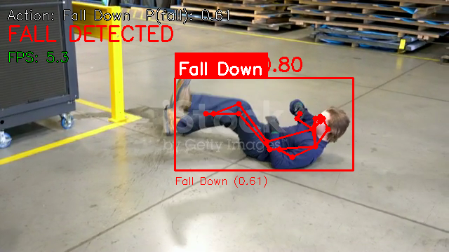

# 4.2.8 行为识别

## 1. 模块概述

- 主要功能：基于 STGCN（Spatial-Temporal Graph Convolutional Network）的骨架行为识别，输入连续 30 帧的人体关键点序列，输出动作类别概率。支持 7 类动作识别，包含跌倒检测（Fall Down）。通常与 YOLOv8-Pose 配合使用：先检测人体关键点，再将关键点序列送入 STGCN 进行动作分类。
- 规格或特性：
  - 支持模型：STGCN（TSSTG）
  - 输入：姿态模型每帧输出 17 个 COCO 关键点；选取鼻子及四肢的 13 个点，组成 30 帧序列。公开序列接口接收 1170 个 float32 值（30 × 13 × 3，按帧、关键点、x/y/可见度排列），坐标为原图像素坐标
  - 数据类型：fp32
  - 输出：7 类动作概率
  - 推理后端：ONNX Runtime + CPUExecutionProvider
  - 接口形态：C++（`vision_service.h`）、Python（`spacemit_vision` wheel：`VisionServiceNative`）
- 相关目录结构：

```text
src/deploy/stgcn/
├── cpp/stgcn_action_recognizer.h      # C++ 头文件
└── cpp/stgcn_action_recognizer.cpp    # C++ 实现
applications/fall_detection/
├── config/fall_detection.yaml         # 跌倒检测应用配置
├── config/pose.yaml                   # 姿态模型配置
├── config/stgcn.yaml                  # STGCN 模型配置
├── cpp/example_fall_detection.cpp     # C++ 跌倒检测示例
├── python/example_fall_detection.py   # Python 跌倒检测示例
└── scripts/download_models.sh         # 模型下载脚本
```

## 2. 环境准备

### 前置条件

SDK 源码获取和基础编译环境配置统一参考 2.3-构建编译。完成 SDK 初始化后，回到本文继续执行“构建编译”。

后续命令默认在 K1 设备的 `spacemit_robot` SDK 根目录执行。

### 构建编译

系统缺少依赖时先安装：
```bash
sudo apt install python3-spacemit-ort opencv-spacemit spacemit-onnxruntime \
    eigen-spacemit openblas-spacemit libeigen3-dev libyaml-cpp-dev \
    python3-venv python3-numpy libtesseract5
```

在 SDK 根目录加载构建环境，选择 K1 target，然后编译视觉组件：
```bash
cd /root/spacemit_robot
source build/envsetup.sh
lunch k1-muse-pipro-ai-cubpet

cd components/model_zoo/vision
mm
```

SDK 集成构建会把 `example_fall_detection` 等示例程序安装到 `output/staging/bin`。

### 安装 Python 接口

运行 Python 示例前，先创建并激活虚拟环境：
```bash
cd /root/spacemit_robot/components/model_zoo/vision
if [ ! -d /root/.comm-env ]; then
    /usr/bin/python3 -m venv /root/.comm-env
fi
source /root/.comm-env/bin/activate
```

安装 Python 构建工具和运行依赖：
```bash
python3 -m pip install -U pybind11 build setuptools wheel
python3 -m pip install pyyaml
```

K1 当前厂商 OpenCV 需配合 NumPy 1.x 使用。将系统 Python 包目录和厂商 OpenCV 加入搜索路径，优先使用系统提供的 NumPy：
```bash
export PYTHONPATH="/usr/lib/python3/dist-packages:/opt/opencv-spacemit/lib/python3.12/dist-packages/cv2/python-3${PYTHONPATH:+:$PYTHONPATH}"
```

构建并安装 `spacemit_vision` wheel：
```bash
cmake -S . -B build \
    -DPython3_EXECUTABLE=/root/.comm-env/bin/python3
cmake --build build -j4

python3 -m pip install --force-reinstall --no-deps src/python/dist/*.whl

python3 -c \
'import cv2, numpy, yaml; from spacemit_vision import VisionServiceNative; print("ok")'
```

输出 `ok` 表示 Python 接口安装及导入检查成功。每次新开终端运行 Python 示例时，需重新激活虚拟环境并执行上述 `export PYTHONPATH` 命令。

模型权重默认存放路径为 `~/.cache/models/vision/stgcn/` 与 `~/.cache/models/vision/yolov8_pose/`。运行示例前须执行对应模型的下载脚本；模型缺失时程序会报错 `Model file not found`。

## 3. 示例使用（从 0 跑通）

STGCN 行为识别通过跌倒检测应用（`applications/fall_detection/`）演示，该应用组合 YOLOv8-Pose 姿态估计与 STGCN 动作分类，每帧选择置信度最高的人体进行识别。

K1 上的推理线程数需根据所用后端的资源限制设置，不能直接按 CPU 总核数配置。本节采用以下适配配置：**姿态模型使用 `SpaceMITExecutionProvider`、2 个推理线程；STGCN 使用 `stgcn.fp32.onnx`、`CPUExecutionProvider`、2 个 CPU 推理线程**。Python 和 C++ 示例共用对应 YAML 配置，修改后无需重新编译。

### 3.1 跌倒检测应用（Python）

**前置**：第 2 节的依赖及 Python 接口已安装，当前终端已激活虚拟环境并设置 `PYTHONPATH`。

**步骤 1**：下载模型

```bash
cd /root/spacemit_robot/components/model_zoo/vision
bash applications/fall_detection/scripts/download_models.sh
bash examples/yolov8_pose/scripts/download_models.sh
```

预期现象：模型下载至 `~/.cache/models/vision/stgcn/` 与 `~/.cache/models/vision/yolov8_pose/`；本节使用 `stgcn.fp32.onnx` 和 `yolov8n-pose.q.onnx`。

**步骤 2**：下载测试素材

```bash
bash scripts/download_assets.sh
```

预期现象：测试视频位于 `~/.cache/assets/video/002_fall.mp4`。

**步骤 3**：调整 K1 配置

```bash
sed -i.bak -E 's/(num_threads:)[[:space:]]*[0-9]+/\1 2/' \
    applications/fall_detection/config/pose.yaml

sed -i.bak -E \
    -e 's#stgcn.dynq.onnx#stgcn.fp32.onnx#' \
    -e 's/SpaceMITExecutionProvider/CPUExecutionProvider/' \
    -e 's/(num_threads:)[[:space:]]*[0-9]+/\1 2/' \
    applications/fall_detection/config/stgcn.yaml
```

`sed -i.bak` 将本次修改前的配置保存为同名 `.bak` 文件。线程参数位于 `pose.yaml` 和 `stgcn.yaml`，入口 `fall_detection.yaml` 只引用这些文件。

**步骤 4**：运行跌倒检测

摄像头窗口需要可用的图形显示环境。从开发电脑查看画面时，在**电脑本地桌面终端**建立 X11 转发连接，将 `K1_IP` 替换为 K1 的实际地址：

```bash
ssh -S none -Y root@K1_IP
```

电脑需有可用的 X11/XWayland 会话，K1 的 SSH 服务需支持 X11 转发。登录后在同一终端加载本节开头的运行环境，再执行下面的命令。`DISPLAY` 由 SSH 自动设置，保持该连接打开；单独 `export DISPLAY` 不会建立 X11 转发。

```bash
python3 applications/fall_detection/python/example_fall_detection.py
```

预期现象：打开 `Fall Detection` 视频窗口，显示人体骨架和动作名称，视频播放结束后退出。在视频窗口中按 `q` 可提前退出。程序先积累 30 帧有效关键点，再按 `stgcn_wait_frames` 指定的间隔执行 STGCN

### 3.2 跌倒检测应用（C++）

**前置**：第 2 节已完成 C++ 构建；第 3.1 节步骤 1–3 已完成模型、素材和配置准备；当前终端已加载 SDK 环境且有可用显示连接。

```bash
cd /root/spacemit_robot/components/model_zoo/vision
example_fall_detection applications/fall_detection/config/fall_detection.yaml
```

预期现象：出现视频窗口，输出跌倒提示，播放结束或在视频窗口中按 `q` 后退出。该命令不需要激活 Python 虚拟环境。

### 3.3 运行结果示例

**终端输出示例**：

```text
SpaceMIT EP initialized: /root/.cache/models/vision/yolov8_pose/yolov8n-pose.q.onnx
Start processing... press 'q' to quit.
Single-target: highest-score person + STGCN (30-frame sequence).
End of stream.
```

**可视化结果**：



图中展示了人体骨架、动作类别和跌倒提示。跌倒告警经过平滑，因此当前动作类别与告警状态可能短暂不一致。示例视频用于验证调用流程，不代表识别准确率评测。

## 4. 应用开发

本章面向应用开发者，说明如何在自己的 C++ 或 Python 应用中集成行为识别组件。完整接口定义以 `include/vision_service.h` 和 `src/python/spacemit_vision/vision_service_native.py` 为准；本节介绍常用公开接口和典型调用方式。

### 4.1 接口说明

行为识别组件基于 STGCN（时空图卷积网络）模型，需要输入连续 30 帧的人体关键点序列进行动作分类。应用侧通常先使用姿态估计模型提取关键点，再送入 STGCN 进行行为识别。

#### 4.1.1 常用数据结构

| 类型 | 说明 |
| --- | --- |
| vision::Action | 行为识别结果（在 `namespace vision`），包含动作类别 ID（label）、置信度（score）、全部类别概率（class_scores）。 |
| vision::Pose | 姿态估计结果（在 `namespace vision`），包含边界框（bbox）、置信度（score）、关键点（keypoints）。 |
| VisionServiceRequest | 统一推理输入，图像模型填 image；序列模型（如 STGCN）填 sequence_pts、sequence_count、sequence_width、sequence_height。 |
| VisionServiceResponse | 统一推理输出，results 为 `vision::Result` 变体列表（如 vision::Pose / vision::Action）。 |

#### 4.1.2 服务初始化

**C++ 接口**

| 接口 | 说明 | 参数 | 返回值 |
| --- | --- | --- | --- |
| VisionService::Create | 从 YAML 配置文件创建 STGCN 服务实例 | config_path：YAML 配置文件路径 | VisionService 智能指针 |
| GetClassNames | 获取所有动作类别名称（由模型配置的 label_file_path 加载） | 无 | 类别名称向量 |

跌倒类别索引（fall_down_index）不再由服务接口提供，而是作为应用策略从 fall detection 应用配置（`fall_detection.yaml`）的 `fall_down_index` 字段读取。

**Python 接口**

| 接口 | 说明 | 参数 | 返回值 |
| --- | --- | --- | --- |
| VisionServiceNative.create | 从 YAML 创建 STGCN 服务 | config_path：YAML 路径 | VisionServiceNative 实例 |
| get_class_names | 获取动作类别名称列表 | 无 | 字符串列表 |
| get_fall_down_class_index | 兼容接口，读取当前服务配置中的 fall_down_index；本节 STGCN 配置未设置该字段，应用应直接读取 fall_detection.yaml | 无 | int（未配置为 -1） |

#### 4.1.3 行为识别

**C++ 接口**

| 接口 | 说明 | 参数 | 返回值 |
| --- | --- | --- | --- |
| Infer（图像） | 对单帧图像（如姿态估计）进行推理 | image：cv::Mat；response：输出 VisionServiceResponse | VisionServiceStatus（== VISION_SERVICE_OK 表示成功） |
| Infer（序列） | 对 30 帧关键点序列进行动作分类 | request：VisionServiceRequest（填 sequence_pts/count/width/height）；response：输出 VisionServiceResponse | VisionServiceStatus |
| Draw | 将推理结果绘制到图像（无状态，需显式传入 response） | image：输入图像；response：推理结果；out_image：输出图像 | VisionServiceStatus |

**Python 接口**

| 接口 | 说明 | 参数 | 返回值 |
| --- | --- | --- | --- |
| infer_sequence | 对关键点序列进行动作分类 | pts：长度 1170 的一维连续 float32 ndarray（30 × 13 × 3），像素坐标；image_width/height：原图宽高 | (VisionServiceStatus, class_scores 列表) |
| infer_image | 对单帧图像推理（姿态估计等） | image：BGR numpy 数组 | (VisionServiceStatus, results 列表) |
| last_error | 获取最近一次推理错误 | 无 | 错误描述字符串 |

#### 4.1.4 性能监控

**C++ 接口**

| 接口 | 说明 | 参数 | 返回值 |
| --- | --- | --- | --- |
| SetTimingOptions | 启用/禁用性能计时 | options：VisionServiceTimingOptions（enabled 字段） | void |
| GetLastTiming | 获取最近一次推理的各阶段耗时 | 无 | VisionServiceTiming 结构体（含 sequence_ms、model_infer_ms、infer_ms 等字段） |

### 4.2 典型调用流程

以下代码在 Vision 组件目录运行，先完成第 3.1 节的 K1 配置调整。姿态模型读取应用目录的 `pose.yaml`，STGCN 读取同目录的 `stgcn.yaml`；测试视频使用已下载的 `002_fall.mp4`，窗口显示环境见第 3.1 节步骤 4。关键点映射与当前 SDK 保持一致：去掉眼睛和耳朵，保留鼻子及四肢。Python 序列接口要求先将数组展平为一维连续的 float32 数组。

#### 4.2.1 C++ 跌倒检测应用

```cpp
#include "vision_service.h"
#include <opencv2/opencv.hpp>
#include <yaml-cpp/yaml.h>
#include <algorithm>
#include <iostream>
#include <deque>
#include <variant>

int main() {
    // 1. 加载应用配置（fall_down_index 是应用策略，存在应用配置中，非模型属性）
    YAML::Node app_cfg = YAML::LoadFile("applications/fall_detection/config/fall_detection.yaml");
    const int fall_down_index = app_cfg["fall_down_index"].as<int>();  // 6

    // 2. 创建姿态估计服务与 STGCN 服务
    auto pose_service  = VisionService::Create("applications/fall_detection/config/pose.yaml");
    if (!pose_service) {
        std::cerr << VisionService::LastCreateError() << std::endl;
        return -1;
    }
    auto stgcn_service = VisionService::Create("applications/fall_detection/config/stgcn.yaml");
    if (!stgcn_service) {
        std::cerr << VisionService::LastCreateError() << std::endl;
        return -1;
    }

    // 3. 获取动作类别名称（模型属性，由 label_file_path 加载）
    const auto class_names = stgcn_service->GetClassNames();

    // 4. 关键点序列缓冲区（30 帧 × 13 点 × 3 通道）
    std::deque<std::vector<float>> keypoint_buffer;

    cv::VideoCapture cap("/root/.cache/assets/video/002_fall.mp4");
    if (!cap.isOpened()) return -1;
    cv::Mat frame;
    while (cap.read(frame)) {
        // 5. 姿态推理
        VisionServiceResponse pose_response;
        if (pose_service->Infer(frame, &pose_response) != VISION_SERVICE_OK) {
            std::cerr << pose_service->LastError() << std::endl;
            return -1;
        }

        if (!pose_response.results.empty()) {
            // 6. 选得分最高的人
            int best_idx = 0;
            for (size_t i = 1; i < pose_response.results.size(); ++i) {
                if (vision::get_score(pose_response.results[i]) >
                    vision::get_score(pose_response.results[best_idx]))
                    best_idx = i;
            }
            const vision::Pose* cr = std::get_if<vision::Pose>(&pose_response.results[best_idx]);
            if (cr && cr->keypoints.size() >= 17) {
                // 映射 COCO-17 -> TSSTG-13，构造单帧 float 数组（13×3）
                static constexpr int MAP13[] = {0,5,6,7,8,9,10,11,12,13,14,15,16};
                std::vector<float> frame_pts(13 * 3);
                for (int i = 0; i < 13; ++i) {
                    const auto& kp = cr->keypoints[MAP13[i]];
                    frame_pts[i*3+0] = kp.x;
                    frame_pts[i*3+1] = kp.y;
                    frame_pts[i*3+2] = kp.visibility;
                }
                keypoint_buffer.push_back(frame_pts);
                if (keypoint_buffer.size() > 30) keypoint_buffer.pop_front();
            } else {
                keypoint_buffer.clear();
            }
        } else {
            keypoint_buffer.clear();
        }

        // 7. 累积满 30 帧后进行 STGCN 序列推理
        if (keypoint_buffer.size() == 30) {
            // 展平为连续 float 数组
            std::vector<float> pts;
            pts.reserve(30 * 13 * 3);
            for (const auto& f : keypoint_buffer)
                pts.insert(pts.end(), f.begin(), f.end());

            VisionServiceRequest seq_req;
            seq_req.sequence_pts    = pts.data();
            seq_req.sequence_count  = static_cast<int>(pts.size());
            seq_req.sequence_width  = frame.cols;
            seq_req.sequence_height = frame.rows;

            VisionServiceResponse seq_resp;
            if (stgcn_service->Infer(seq_req, &seq_resp) != VISION_SERVICE_OK) {
                std::cerr << stgcn_service->LastError() << std::endl;
                return -1;
            }
            if (!seq_resp.results.empty()) {
                const vision::Action* act =
                    std::get_if<vision::Action>(&seq_resp.results[0]);
                if (act && static_cast<int>(act->class_scores.size()) > fall_down_index) {
                    int pred = static_cast<int>(
                        std::max_element(act->class_scores.begin(),
                                         act->class_scores.end())
                        - act->class_scores.begin());
                    float fall_prob = act->class_scores[fall_down_index];
                    std::string action = (pred < static_cast<int>(class_names.size()))
                                         ? class_names[pred] : std::to_string(pred);
                    if (pred == fall_down_index)
                        std::cout << "Fall detected! action=" << action
                                  << " score=" << fall_prob << "\n";
                }
            }
        }

        cv::imshow("Fall Detection", frame);
        if (cv::waitKey(1) == 'q') break;
    }
    cap.release();
    cv::destroyAllWindows();
    return 0;
}
```

#### 4.2.2 Python 跌倒检测应用

```python
import yaml
import cv2
import numpy as np
from collections import deque
from pathlib import Path
from spacemit_vision import VisionServiceNative, VisionServiceStatus

COCO17_TO_TSSTG13 = [0, 5, 6, 7, 8, 9, 10, 11, 12, 13, 14, 15, 16]
STGCN_LEN = 30

with open("applications/fall_detection/config/fall_detection.yaml") as f:
    app_cfg = yaml.safe_load(f)
fall_down_index = int(app_cfg["fall_down_index"])
config_dir = Path("applications/fall_detection/config")

pose_svc = VisionServiceNative.create(str(config_dir / app_cfg["pose_model"]))
stgcn_svc = VisionServiceNative.create(str(config_dir / app_cfg["stgcn_model"]))
class_names = stgcn_svc.get_class_names()
keypoint_buffer = deque(maxlen=STGCN_LEN)

cap = cv2.VideoCapture("/root/.cache/assets/video/002_fall.mp4")
if not cap.isOpened():
    raise RuntimeError("Cannot open test video")
while True:
    ret, frame = cap.read()
    if not ret:
        break
    h, w = frame.shape[:2]

    status, results = pose_svc.infer_image(frame)
    if status != VisionServiceStatus.OK:
        raise RuntimeError(pose_svc.last_error())
    if results:
        best = max(results, key=lambda r: r.score)
        if len(best.keypoints) >= 17:
            kps = [(kp.x, kp.y, kp.visibility) for kp in best.keypoints]
            keypoint_buffer.append(kps)
        else:
            keypoint_buffer.clear()
    else:
        keypoint_buffer.clear()

    if len(keypoint_buffer) == STGCN_LEN:
        arr = np.array(keypoint_buffer, dtype=np.float32)
        pts = arr[:, COCO17_TO_TSSTG13, :].copy()
        pts_1d = np.ascontiguousarray(pts.ravel(), dtype=np.float32)
        st, scores = stgcn_svc.infer_sequence(pts_1d, w, h)
        if st != VisionServiceStatus.OK:
            raise RuntimeError(stgcn_svc.last_error())
        if st == VisionServiceStatus.OK:
            pred = int(np.argmax(scores))
            if pred == fall_down_index:
                print(f"Fall detected! {class_names[pred]} P={scores[pred]:.4f}")

    cv2.imshow("Fall Detection", frame)
    if cv2.waitKey(1) & 0xFF == ord('q'):
        break

cap.release()
cv2.destroyAllWindows()
```

### 4.3 配置说明

#### 4.3.1 STGCN 模型配置

```yaml
# STGCN 模型文件路径（fp32 格式）
model_path: ~/.cache/models/vision/stgcn/stgcn.fp32.onnx

# 部署类名（C++ 模型工厂注册名，Python 通过 yaml 路径间接使用）
class: deploy.stgcn.StgcnActionRecognizer

# 动作类别名称
label_file_path: assets/labels/stgcn.txt

# 推理参数
default_params:
  # K1 本节采用 2 个 CPU 推理线程
  num_threads: 2

  # 是否延迟加载模型
  lazy_load: false

  # 推理后端（K1 本节使用 CPU 备选配置）
  providers:
    - CPUExecutionProvider
```

#### 4.3.2 跌倒检测应用配置

```yaml
# 姿态估计模型配置（相对于本配置文件目录）
pose_model: pose.yaml

# STGCN 模型配置（相对于本配置文件目录）
stgcn_model: stgcn.yaml

# 测试视频路径
test_video: ~/.cache/assets/video/002_fall.mp4

# 关键点可见度阈值
kp_threshold: 0.3

# 官方示例在积累满 30 帧后，每隔多少个有效帧执行一次 STGCN
stgcn_wait_frames: 10

# 预测平滑窗口（用于减少误报）
stgcn_smooth_window: 5

# 摄像头设备号示例（--use-camera 时生效，对应 /dev/videoN 中的 N）
# 使用摄像头时按实际采集节点调整；本节验证使用上述视频
camera_id: 0

# 应用策略：哪个 STGCN 输出类别算作"跌倒"事件
# 这是本应用的业务决策，不属于模型属性
fall_down_index: 6
```

**支持的动作类别**（来自 `assets/labels/stgcn.txt`，共 7 类）：

- 0: Standing（站立）
- 1: Walking（行走）
- 2: Sitting（坐着）
- 3: Lying Down（躺下）
- 4: Stand up（站起）
- 5: Sit down（坐下）
- 6: **Fall Down（跌倒）**

**参数调优建议**：

- **fall_down_index**：应用策略字段，指定哪个 STGCN 输出类别为跌倒事件（默认 6，与 `assets/labels/stgcn.txt` 的 "Fall Down" 行对应）。存在 fall detection 应用配置中，不是模型属性。
- **stgcn_wait_frames**：官方示例在积累满 30 帧后，按此间隔执行 STGCN。增大可减少调用次数，但会增加动作更新延迟。第 4.2 节的简化代码满 30 帧后每帧执行一次，不读取此参数。
- **stgcn_smooth_window**：官方示例按最近若干次预测的多数结果判断跌倒。增大可减少抖动，但会增加告警延迟。第 4.2 节简化代码未实现平滑。
- **kp_threshold**：官方示例绘制骨架时使用的可见度阈值，当前实现不会按此阈值过滤 STGCN 输入关键点。
- **providers**：本节使用 FP32 STGCN 与 CPU 后端，绕过当前 K1 动态量化模型在 SpaceMIT 后端的 TCM 获取失败；姿态模型仍使用 SpaceMIT 后端。
- **num_threads**：本节姿态模型与 CPU STGCN 均采用 2 个线程。CPU 后端线程不申请 SpaceMIT AI 核配额，两个参数不应当视为同一资源池。

### 4.4 性能监控

通过启用性能计时，可以分析推理各阶段的耗时，用于性能优化和瓶颈定位。

**C++ 示例**：

```cpp
VisionServiceTimingOptions timing_opts;
timing_opts.enabled = true;
stgcn_service->SetTimingOptions(timing_opts);

stgcn_service->Infer(seq_req, &seq_resp);

auto timing = stgcn_service->GetLastTiming();
std::cout << "Sequence inference: " << timing.sequence_ms << " ms" << std::endl;
std::cout << "Model infer: "        << timing.model_infer_ms << " ms" << std::endl;
```

序列模型的总耗时读取 `sequence_ms`；当前 STGCN 序列调用不填充通用图像计时字段 `infer_ms`。

**性能优化建议**：

- 使用第 4.4 节的计时接口分别测量姿态和 STGCN 耗时。本次 K1 CPU FP32 STGCN 单次推理明显超过 50 ms，不能沿用其他平台的耗时结论。
- 选择较小的姿态模型（如 yolov8n-pose）可减少前端计算量，整体性能仍需结合 STGCN 调用频率评估。
- 减少推理频率：不必每帧都进行 STGCN 推理，可每隔几帧推理一次。

**参考 demo 路径**：`applications/fall_detection/`

## 5. 调试指南

- 本节姿态模型采用 SpaceMIT 后端，STGCN 采用 FP32 模型与 CPU 后端；核对两个模型配置，避免只修改入口 `fall_detection.yaml`。
- 启用 `VisionServiceTimingOptions`，分别查看姿态和 STGCN 的模型推理时间；序列调用的 `sequence_ms` 是序列接口耗时，`model_infer_ms` 才是 ONNX 模型执行时间。
- `fall_down_index` 在应用配置中设置，默认 6，与动作标签文件顺序一致。
- 先确认姿态模型输出 17 个关键点，再使用鼻子及四肢的 13 个点构建连续 30 帧序列。不要将眼睛、耳朵误当作下肢关键点。
- 当前流程按每帧最高分选择一人，并不保证跨帧身份一致；多人场景需结合跟踪和按 ID 分别维护序列。
- 示例演示推理调用和可视化，未进行跌倒准确率、多人跟踪或安全监护可靠性评测。

## 6. 常见问题

| 现象 | 可能原因 | 处理 |
| --- | --- | --- |
| `Model file not found` | STGCN 或姿态模型未下载 | 执行第 3.1 节的模型下载脚本，核对配置路径 |
| `No module named 'spacemit_vision'`、`cv2` 或 `yaml` | wheel、虚拟环境或 Python 搜索路径未准备好 | 按第 2 节安装并激活环境、设置 `PYTHONPATH` |
| NumPy 1.x / 2.x 不兼容 | 厂商 OpenCV 使用 NumPy 1.x 编译 | 按第 2 节优先加载系统 NumPy |
| `required 6, available 4` | 姿态模型默认线程数超过当前后端可用配额 | 修改应用目录的 `pose.yaml` 为 2 个线程 |
| `required 2, available 0` | 姿态模型占用全部可用 SpaceMIT 配额，STGCN 无法初始化 | 按第 3.1 节调整姿态线程并切换 STGCN CPU 后端 |
| `tcm buffer acquire failed for core id 2` | SpaceMIT 运行时无法获取 TCM 缓冲区，具体内部原因未确认 | 使用 `stgcn.fp32.onnx` 与 `CPUExecutionProvider`；本节已验证该备选配置 |
| `pts must be a 1-D float32 array` | Python 序列接口收到三维数组 | 使用 `np.ascontiguousarray(pts.ravel(), dtype=np.float32)` 展平 |
| 动作显示 `???` 或尚未分类 | 初始占位符字体不支持，或有效关键点不足 30 帧 | 等待积累有效序列，并检查是否出现动作名称；不能只凭骨架判断 STGCN 成功 |
| `Can't initialize GTK backend` | 当前终端没有可用显示连接 | 建立第 3.1 节的 X11 转发，或使用 K1 本机桌面 |
| 跌倒检测延迟高 | 序列需要 30 帧，CPU STGCN 推理、调用间隔及平滑也增加延迟 | 分别计时；结合实际场景调整调用间隔和平滑窗口 |
| 动作分类不准确 | 关键点质量、映射、序列连续性或目标切换 | 核对 13 点映射，确保同一人的连续序列；多人场景增加跟踪 |

## 附录：性能与测试数据

以下数据于 2026-10-09 在 K1 上实测。测试环境：Linux 6.6.63、`spacemit-onnxruntime 2.0.3-bpo1`，CPU 调频策略为 `performance`。纯模型测试不包含关键点提取、图像或序列预处理、后处理、绘制和窗口显示，不代表跌倒检测流水线的实时帧率。

### 前端姿态估计

使用 SpaceMITExecutionProvider，4 个 EP 推理线程、1 个 ORT intra-op 线程、单并发；每个模型执行 3 轮，每轮 200 次，取帧率中位数。此处 4 线程基准是姿态模型独立运行，应用示例的姿态模型采用 2 线程。

| 模型大类 | 具体模型 | 输入大小 | 数据类型 | 帧率（4 线程） |
| --- | --- | --- | --- | ---: |
| yolov8-pose | yolov8n-pose | [1,3,640,640] | int8 | 12.6 |
| yolov8-pose | yolov8s-pose | [1,3,640,640] | int8 | 5.9 |
| yolov8-pose | yolov8m-pose | [1,3,640,640] | int8 | 2.8 |

`int8` 指量化模型；ONNX 输入张量为 float32。

**复现方法**：

```bash
for size in n s m; do
    for round in 1 2 3; do
        onnxruntime_perf_test \
            "$HOME/.cache/models/vision/yolov8_pose/yolov8${size}-pose.q.onnx" \
            -e spacemit -m times -r 200 -x 1 -S 1 -s -I -c 1 \
            -i 'SPACEMIT_EP_INTRA_THREAD_NUM|4'
    done
done
```

### STGCN 模型

FP32 STGCN 使用 CPUExecutionProvider、单并发；每种线程配置测试 3 轮，每轮 20 次，取中位数。模型有两路 ONNX 输入：位置 `[1,3,30,14]` 和运动 `[1,2,30,14]`，服务内部由 13 个关键点生成第 14 个肩部中心点。

| 模型 | 位置输入 / 运动输入 | 数据类型 | 后端 | CPU 推理线程数 | 平均耗时中位数（ms） | 帧率中位数 |
| --- | --- | --- | --- | ---: | ---: | ---: |
| STGCN | [1,3,30,14] / [1,2,30,14] | fp32 | CPU | 1 | 1422.6 | 0.70 |
| STGCN | [1,3,30,14] / [1,2,30,14] | fp32 | CPU | 2 | 746.0 | 1.34 |

**复现方法**：

```bash
for threads in 1 2; do
    for round in 1 2 3; do
        onnxruntime_perf_test "$HOME/.cache/models/vision/stgcn/stgcn.fp32.onnx" \
            -e cpu -m times -r 20 -x "$threads" -S 1 -s -I -c 1
    done
done
```

`-x 1` 用于 CPU 单线程基准，`-x 2` 对应本节应用中的 STGCN 配置。两者都是普通 CPU 后端，不是 SpaceMIT AI 核配额。以上测试使用生成的模型输入，仅衡量性能，不衡量动作识别准确率。
