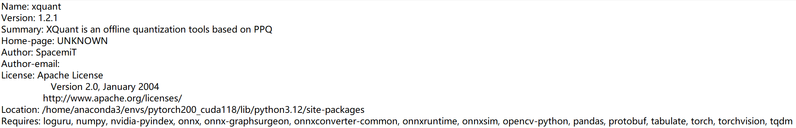

# 4.8.4 YOLOv8训练部署全流程

本文以 **YOLOv8** 为例，详细介绍从**模型训练**、**量化** 到最终 **推理** 部署的完整流程。

## 模型训练

### 训练环境安装

1. **获取源代码**：

   ```shell
   git clone https://github.com/ultralytics/ultralytics
   ```

2. **安装依赖**：

   ```shell
   cd ultralytics
   pip install -e .
   ```

   如遇依赖项不能下载安装，可以采用镜像网站来下载安装 [https://pypi.tuna.tsinghua.edu.cn/simple/](https://pypi.tuna.tsinghua.edu.cn/simple/)

### 模型训练及导出

以下代码示例展示了如何使用 YOLOv8 进行模型训练并导出为 ONNX 格式：

```python
from ultralytics import YOLO
#Load a COCO-pretrained YOLOv8n model
model = YOLO("yolov8n.yaml")
#Load a pretrained YOLO model (recommended for training)
model = YOLO("yolov8n.pt")
#Train the model using the 'coco8.yaml' dataset for 100 epochs
results = model.train(data="coco8.yaml", epochs=100)
#Export the model to ONNX format
success = model.export(format="onnx",imgsz=(320,320),simplify=True,opset=13)
```

**关键参数说明**：

- `yolov8n.yaml`：模型结构配置文件。
- `coco8.yaml`：训练数据集配置文件，需包含以下两部分：
  - `images`：存放训练集以及验证集的图像数据。
  - `labels`：存放训练集以及验证集的图像数据对应的标注文件。

**标注文件（`labels`）格式**（每行表示一个目标）：

```text
<class_id> <x_center> <y_center> <width> <height>
```

示例：

```text
0 0.445688 0.480615 0.075125 0.117295
0 0.640086 0.471742 0.0508281 0.0814344
20 0.643211 0.558852 0.129828 0.097623
```

- `class_id`：第目标类别编号（整数）。
- 后续四个浮点数表示该目标的归一化**坐标信息**，这四个浮点数的排列顺序为：
  - `x_center`：（归一化后的）目标中心点的 x 坐标
  - `y_center`：（归一化后的）目标中心点的 y 坐标
  - `width`：（归一化后的）目标框 x 方向的大小
  - `height`：（归一化后的）目标框 y 方向的大小

> **注意**：若需在私有数据集上训练微调，建议先加载预训练模型，并参照 `coco8.yaml` 格式准备数据。

## 模型量化 （x86 平台）

> **注意**：量化操作需在 x86 平台进行。

### 量化工具安装

1. **下载量化工具**：
   [xquant-1.2.1 下载地址](https://git.spacemit.com/api/v4/projects/33/packages/pypi/files/3bb98cbb937d30f9797032bb44a5779fc01e8b20d2e45e32796c4129ca695704/xquant-1.2.1-py3-none-any.whl)

2. **安装工具**：

   ```shell
   pip install xquant-1.2.1-py3-none-any.whl
   ```

3. **验证安装**：

   ```shell
   pip show xquant
   ```

   成功安装后输出（示例）如下：
   

### 量化文件配置

**校准数据下载**：
[Calibration 数据集](https://archive.spacemit.com/spacemit-ai/BRDK/Model_Zoo/Datasets/Coco/Coco.tar.gz)

量化配置文件示例：

```json
{
  "model_parameters": {
    "onnx_model": "path/yolov8n.onnx",
    "working_dir": "yolov8",
    "skip_onnxsim": false
  },
  "calibration_parameters": {
    "input_parameters": [
      {
        "mean_value": [0, 0, 0],
        "std_value": [255, 255, 255],
        "color_format": "rgb",
        "data_list_path": "path/calib_list.txt"
      }
    ]
  },
  "quantization_parameters": {
    "truncate_var_names": [
      "/model.22/Reshape_output_0",
      "/model.22/Reshape_1_output_0",
      "/model.22/Reshape_2_output_0"
    ]
  }
}
```

**参数说明**：

- `onnx_model`：待量化的 ONNX 模型路径。
- `mean_value` 和 `std_value`：图像归一化参数，需与训练配置保持一致。
- `color_format`：图像通道顺序（如 RGB/BGR）。
- `data_list_path`：校准图像路径列表文件。
- `truncate_var_names`：量化截断节点名称（防止后处理量化误差）。

**校准列表文件示例**（`calib_list.txt`）：

```text
path/000000428562.jpg
path/000000000632.jpg
path/000000157756.jpg
path/000000044279.jpg
```

- `path` 可为相对路径或者绝对路径。

> **注意**：建议校准数据选自模型训练集的子集，并保持数据分布一致。

### 截断节点确认

`truncate_var_names` 为指定量化**截断点**，YOLOv8n 模型中包含后处理（坐标解码）逻辑，建议对模型在后处理节点前进行**截断**，防止量化误差。

示例如下：

```json
"truncate_var_names": [
  "/model.22/Reshape_output_0",
  "/model.22/Reshape_1_output_0",
  "/model.22/Reshape_2_output_0"
]
```

使用 [Netron](https://netron.app/) 可视化工具打开 `yolov8n.onnx` 模型，查找并确认需要截断或排除量化的节点名称。


### 执行量化

运行以下命令进行量化：

```shell
python3 -m xquant --config path/yolov8_xquant_config.json
```

量化成功后生成文件示例 `yolov8n.q.onnx`

## 模型推理

1. **下载示例模型推理代码**

   ```shell
   git clone https://gitee.com/bianbu/spacemit-demo.git
   ```

2. **进入 YOLOv8 目录**

   ```shell
   cd spacemit-demo/examples/CV/yolov8
   ```

3. **环境准备（示例）**

   ```shell
   # 进入示例目录的 python 子目录
   cd python
   sudo apt install python3-pip python3-venv

   # 创建虚拟环境并激活
   python3 -m venv name(虚拟环境名)
   source name/bin/activate

   # 安装依赖
   pip install -r requirements.txt --index-url https://git.spacemit.com/api/v4/projects/33/packages/pypi/simple
   ```

4. **执行推理**

   ```shell
   python test_yolov8.py --model 量化模型路径 --image 测试图片路径
   ```

   **示例命令:**

   ```shell
   python test_yolov8.py --model ./yolov8n.q.onnx --image ./test_image.jpg
   ```

   执行成功后，通常会输出检测结果图像（如 `result.jpg`）并在终端打印检测到的目标信息。
