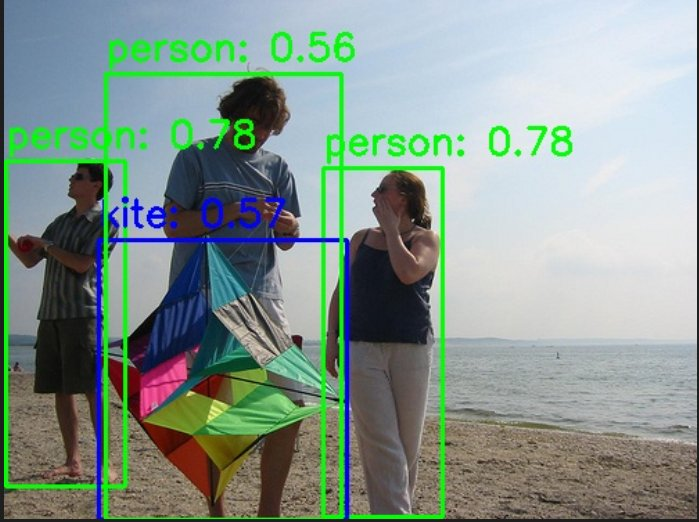
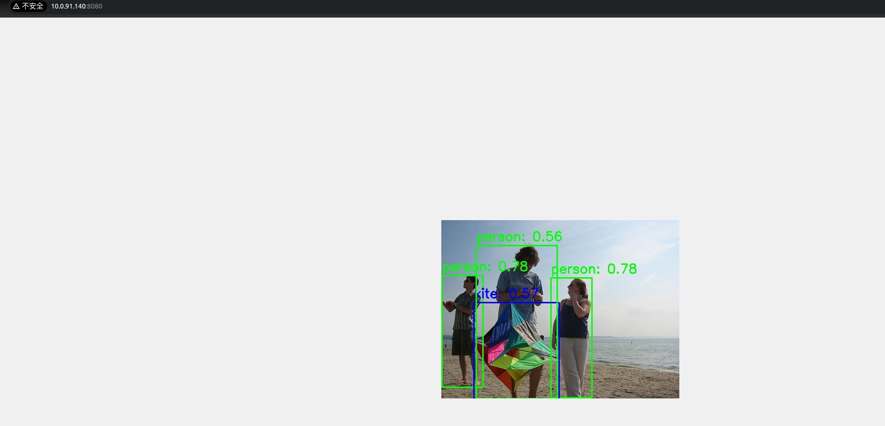
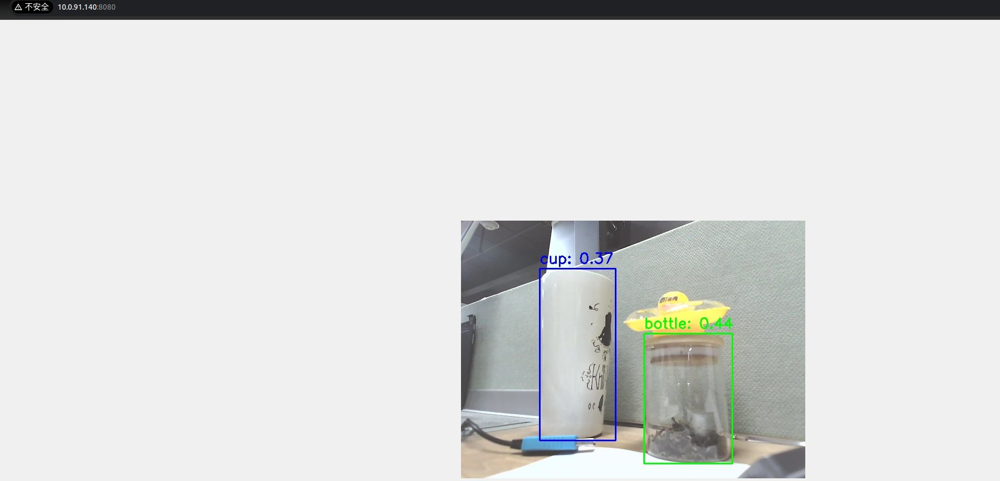

# 5.1.1 目标检测

## YOLO 模型简介

本示例展示如何基于 SpacemiT 智算核，使用图片或视频流作为输入，执行 YOLO 系列目标检测模型的推理，并通过 ROS 2 发布检测结果（包括目标类别与边界框坐标）。

### 支持模型版本

- YOLOv5
- YOLOv6
- YOLOv8
- YOLOv11 等

ONNX 格式模型可通过 [⭐ AI Demo Zoo ](https://gitee.com/bianbu/spacemit-demo#cv%E6%A8%A1%E5%9E%8B%E6%80%A7%E8%83%BD) 下载获取，所有模型基于 [COCO 数据集](http://cocodataset.org/) 训练，支持 80 类常见目标，如人物、动物、水果、交通工具等。

### 应用优势

- 推理速度快
- 精度高，泛化能力强
- 部署简单，资源占用低

### 应用场景

- 自动驾驶：行人和车辆识别
- 智能家居：垃圾分类、监控识别
- 智慧安防：异常行为检测、跌倒识别

## 环境准备

### 平台要求

**SpacemiT RISC-V：**

- 已烧录 ROS2_LXQT  系统镜像

### 安装依赖

```bash
sudo apt install python3-opencv ros-humble-cv-bridge ros-humble-camera-info-manager \
ros-humble-image-transport python3-spacemit-ort python3-yaml libyaml-dev python3-numpy
```

### 导入 ROS2 环境

```bash
source /opt/bros/humble/setup.bash
```


## 模型配置查看

可执行以下命令，查看当前系统中已支持的模型配置：

```bash
ros2 launch rdk_perception infer_info.launch.py | grep 'detection'
```

示例输出：

```text
  - config/detection/yolov8.yaml
  - config/detection/yolov6.yaml
  - config/detection/yolov11_640.yaml
  - config/detection/yolov5.yaml
  - config/detection/yolov11_320.yaml
```

后续推理时，将 `config_path` 设置为相应的 `.yaml` 文件路径，即可使用对应 YOLO 模型。

## 图片推理

**准备图片**

```bash
cp /opt/bros/humble/share/jobot_infer_py/data/detection/test.jpg .
```

### **本地保存推理结果**

```bash
ros2 launch rdk_perception infer_img.launch.py \
  config_path:='config/detection/yolov6.yaml' \
  img_path:='./test.jpg'
```

输出结果将保存在当前目录的 `det_result.jpg` 中，如图所示。



### Web 可视化推理结果

启动推理发布节点（终端 1）：

```bash
ros2 launch rdk_perception infer_img.launch.py \
  config_path:='config/detection/yolov6.yaml' \
  img_path:='./test.jpg' \
  publish_result_img:=true \
  result_img_topic:='result_img' \
  result_topic:='/inference_result'
```

启动 Web 可视化服务（终端 2）：

```bash
ros2 launch rdk_visualization websocket_cpp.launch.py image_topic:='/result_img'
```

终端提示访问地址：

```text
...
Please visit in your browser: http://<IP>:8080
...
```

打开浏览器输入 `http://<IP>:8080`，即可查看实时推理图像结果。

可以通过追加 port:=xxxx 参数来指定端口号，以避免端口冲突





### 消息查看与订阅

推理结果通过 `/inference_result` 话题发布，可执行下述命令订阅查看：

```bash
ros2 topic echo /inference_result
```

输出如下：

```bash
header:
  stamp:
    sec: 1745571001
    nanosec: 597668762
  frame_id: camera_link
results:
- x_min: 109
  y_min: 99
  width: 149
  height: 316
  label: bottle
  conf: 0.4000000059604645
- x_min: 270
  y_min: 209
  width: 150
  height: 249
  label: bottle
  conf: 0.4000000059604645
- x_min: -1
  y_min: 424
  width: 326
  height: 55
  label: sink
  conf: 0.30000001192092896
---
```

**查看消息格式定义**

```bash
ros2 interface show jobot_interfaces/msg/DetectionResultArray
```

结构示例：

```yaml
std_msgs/Header header
    builtin_interfaces/Time stamp
        int32 sec
        uint32 nanosec
    string frame_id

jobot_interfaces/DetectionResult[] results
    int32 x_min
    int32 y_min
    int32 width
    int32 height
    string label
    float32 conf
```

**Python 订阅推理结果示例**

```python
from rclpy.node import Node
from std_msgs.msg import Header
from jobot_interfaces.msg import DetectionResultArray, DetectionResult
import rclpy

class DetectionSubscriber(Node):
    def __init__(self):
        super().__init__('detection_sub')
        self.subscription = self.create_subscription(
            DetectionResultArray,
            '/inference_result',
            self.listener_callback,
            10)

    def listener_callback(self, msg: DetectionResultArray):
        self.get_logger().info(f"Frame: {msg.header.frame_id}")
        for det in msg.results:
            self.get_logger().info(
                f"[{det.label}] ({det.x_min},{det.y_min}) "
                f"{det.width}x{det.height} conf={det.conf:.2f}"
            )

def main(args=None):
    rclpy.init(args=args)
    node = DetectionSubscriber()
    rclpy.spin(node)
    node.destroy_node()
    rclpy.shutdown()

main()
```

### 参数说明

**infer_img.launch.py 的参数说明**

| **参数名称**       | 作用                                                   | 默认值                       |
| ------------------ | ------------------------------------------------------ | ---------------------------- |
| config_path        | 配置推理时使用的模型                                   | config/detection/yolov6.yaml |
| img_path           | 推理时使用的图片路径                                   | data/detection/test.jpg      |
| publish_result_img | 是否以图像消息的形式发布推理结果                       | false                        |
| result_img_topic   | 发布的渲染图像消息名，publish_result_img为true时才有效 | /result_img                  |
| result_topic       | 发布的推理结果消息名                                   | /inference_result            |


## 视频流推理

### 启动相机（USB 示例）

```bash
ros2 launch rdk_sensors usb_cam.launch.py video_device:="/dev/video20"
```

### 启动推理并发布结果

启动推理（终端 1）：

```bash
ros2 launch rdk_perception infer_video.launch.py \
  config_path:='config/detection/yolov6.yaml' \
  sub_image_topic:='/image_raw' \
  publish_result_img:=true \
  result_topic:='/inference_result'
```

Web 显示（终端 2）：

```bash
ros2 launch rdk_visualization websocket_cpp.launch.py image_topic:='/result_img'
```

终端提示访问地址：

```text
...
Please visit in your browser: http://<IP>:8080
...
```

打开浏览器输入 `http://<IP>:8080`，即可查看实时推理图像结果。


可以通过追加 port:=xxxx 参数来指定端口号，以避免端口冲突




**无可视化（仅数据输出）**

如果你只想要拿到模型推理的结果，运行下述命令：

```bash
ros2 launch rdk_perception infer_video.launch.py \
  config_path:='config/detection/yolov6.yaml' \
  sub_image_topic:='/image_raw' \
  publish_result_img:=false \
  result_topic:='/inference_result'
```

通过 `ros2 topic echo /inference_result` 话题获取数据。

### 消息查看和订阅

打印/inference_result话题：

```text
ros2 topic echo /inference_result
header:
  stamp:
    sec: 1745571001
    nanosec: 597668762
  frame_id: camera_link
results:
- x_min: 109
  y_min: 99
  width: 149
  height: 316
  label: bottle
  conf: 0.4000000059604645
- x_min: 270
  y_min: 209
  width: 150
  height: 249
  label: bottle
  conf: 0.4000000059604645
- x_min: -1
  y_min: 424
  width: 326
  height: 55
  label: sink
  conf: 0.30000001192092896
---
```


**查看消息格式定义** (`ros2 interface show jobot_interfaces/msg/DetectionResultArray`):

```text
bianbu@bianbu:~$ ros2 interface show jobot_interfaces/msg/DetectionResultArray
std_msgs/Header header
    builtin_interfaces/Time stamp
        int32 sec
        uint32 nanosec
    string frame_id

jobot_interfaces/DetectionResult[] results
    int32 x_min
    int32 y_min
    int32 width
    int32 height
    string label
    float32 conf
```

**python 订阅调用示例**

```text
from rclpy.node import Node
from std_msgs.msg import Header
from jobot_interfaces.msg import DetectionResultArray, DetectionResult
import rclpy

class DetectionSubscriber(Node):
    def __init__(self):
        super().__init__('detection_sub')
        self.subscription = self.create_subscription(
            DetectionResultArray,
            '/inference_result',
            self.listener_callback,
            10)

    def listener_callback(self, msg: DetectionResultArray):
        self.get_logger().info(f"Frame: {msg.header.frame_id}")
        for det in msg.results:
            self.get_logger().info(
                f"[{det.label}] ({det.x_min},{det.y_min}) "
                f"{det.width}x{det.height} conf={det.conf:.2f}"
            )

def main(args=None):
    rclpy.init(args=args)
    node = DetectionSubscriber()
    rclpy.spin(node)
    node.destroy_node()
    rclpy.shutdown()

main()
```


### 参数说明

**infer_video.launch.py 的参数说明**

| **参数名称**       | 作用                                                   | 默认值                       |
| ------------------ | ------------------------------------------------------ | ---------------------------- |
| config_path        | 配置推理时使用的模型                                   | config/detection/yolov6.yaml |
| sub_image_topic    | 订阅的图像消息话题名                                   | /image_raw                   |
| publish_result_img | 是否以图像消息的形式发布推理结果                       | false                        |
| result_img_topic   | 发布的渲染图像消息名，publish_result_img为true时才有效 | /result_img                  |
| result_topic       | 发布的推理结果消息名                                   | /inference_result            |
