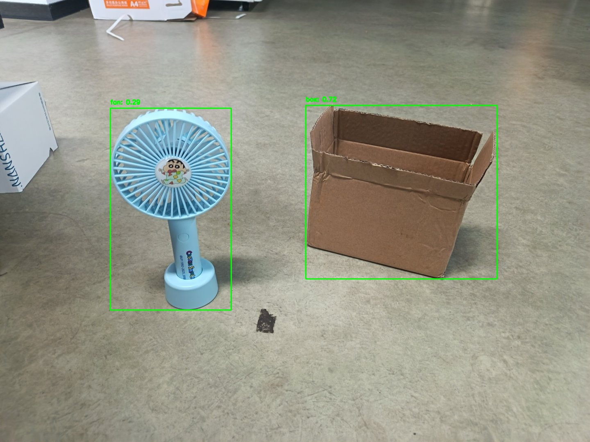
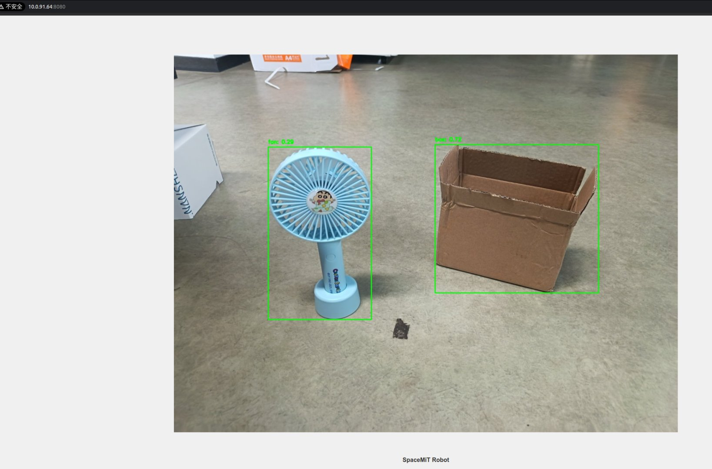
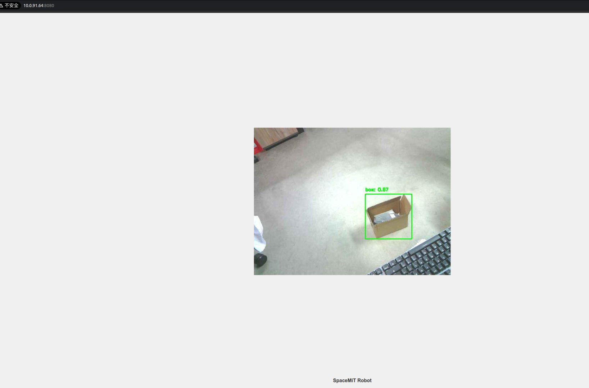

# 5.1.12 YOLO-World

```text
最新版本：2025/09/12
```

## YOLO-World 模型简介

YOLO-World 是腾讯 AI Lab（AI 实验室）提出的一种实时 开放词汇（Open-Vocabulary）零样本物体检测 模型，首次发表于 2024 年初，它基于快速高效的 YOLO 系列（尤其是 Ultralytics 的 YOLOv8）架构，并结合了视觉–语言（Vision-Language）融合技术，实现无需针对每个类别单独训练即可检测任意描述的对象

本示例展示如何基于 SpacemiT 智算核，使用图片或视频流作为输入，执行 YOLO-World 模型的推理，并通过 ROS 2 发布检测结果。

## 环境准备

### 安装依赖

```bash
sudo apt install python3-venv python3-pip ros-humble-camera-info-manager \
ros-humble-image-transport python3-spacemit-ort
```

### 导入 ROS2 环境

```bash
source /opt/bros/humble/setup.bash
```

### 准备虚拟环境

```text
python3 -m venv ~/test3
source ~/test3/bin/activate
pip install -r /opt/bros/humble/share/jobot_yolo_world/data/requirements.txt
```

```text
export PYTHONPATH="$HOME/test3/lib/python3.12/site-packages":$PYTHONPATH
```

## 图片推理

**准备图片**

```bash
cp /opt/bros/humble/share/jobot_yolo_world/data/test2.jpg .
```

### **本地保存推理结果**

```bash
ros2 launch rdk_perception yoloworld_infer_img.launch.py \
  img_path:='./test2.jpg' \
  class_names:="[fan, box]"
```

输出结果将保存在当前目录的 `yoloworld_result.jpg` 中，如图所示。



终端打印如下

```text
(test3) bianbu@bianbu:~$ ros2 launch rdk_perception yoloworld_infer_img.launch.py   img_path:='./test2.jpg' class_names:="[fan, box]"
[INFO] [launch]: All log files can be found below /home/bianbu/.ros/log/2025-08-13-16-09-04-608187-bianbu-217760
[INFO] [launch]: Default logging verbosity is set to INFO
[INFO] [yoloworld_img_node-1]: process started with pid [217761]
[yoloworld_img_node-1] /home/bianbu/test3/lib/python3.12/site-packages/clip/clip.py:6: UserWarning: pkg_resources is deprecated as an API. See https://setuptools.pypa.io/en/latest/pkg_resources.html. The pkg_resources package is slated for removal as early as 2025-11-30. Refrain from using this package or pin to Setuptools<81.
[yoloworld_img_node-1]   from pkg_resources import packaging
[yoloworld_img_node-1] All model files already exist and do not need to be downloaded
[yoloworld_img_node-1] conf_threshold: 0.2, iou_threshold: 0.45, class_names: ['fan', 'box']
[yoloworld_img_node-1] Init Model ..................
[yoloworld_img_node-1] all time cost:0.697995662689209
[yoloworld_img_node-1] x_min:980, y_min:469, width:466, height:424, label:box, confidence:0.72
[yoloworld_img_node-1] x_min:417, y_min:510, width:294, height:493, label:fan, confidence:0.29
[yoloworld_img_node-1] The object detection results are saved in: det_result.jpg
[INFO] [yoloworld_img_node-1]: process has finished cleanly [pid 217761]
```

### Web 可视化推理结果

启动推理发布节点（终端 1）：

```bash
ros2 launch rdk_perception yoloworld_infer_img.launch.py \
  publish_result_img:=true \
  img_path:='./test2.jpg' \
  class_names:="[fan, box]"
```

启动 Web 可视化服务（终端 2）：

```bash
ros2 launch rdk_visualization websocket_cpp.launch.py image_topic:='/result_img'
```

终端提示访问地址：

```text
...
Please visit in your browser: http://<IP>:8080
...
```

打开浏览器输入 `http://<IP>:8080`，即可查看实时推理图像结果。


还可以通过追加 port:=xxxx 参数来指定端口号，以避免端口冲突



### 结果订阅

输入 `ros2 topic echo /inference_result` 查看推理结果话题

使用以下代码实现简单的话题订阅

```text
from rclpy.node import Node
from std_msgs.msg import Header
from jobot_interfaces.msg import DetectionResultArray, DetectionResult
import rclpy

class DetectionSubscriber(Node):
    def __init__(self):
        super().__init__('detection_sub')
        self.subscription = self.create_subscription(
            DetectionResultArray,
            '/inference_result',
            self.listener_callback,
            10)

    def listener_callback(self, msg: DetectionResultArray):
        self.get_logger().info(f"Frame: {msg.header.frame_id}")
        for det in msg.results:
            self.get_logger().info(
                f"[{det.label}] ({det.x_min},{det.y_min}) "
                f"{det.width}x{det.height} conf={det.conf:.2f}"
            )

def main(args=None):
    rclpy.init(args=args)
    node = DetectionSubscriber()
    rclpy.spin(node)
    node.destroy_node()
    rclpy.shutdown()

main()
```

### 参数说明

**yoloworld_infer_img.launch.py 的参数说明**

| **参数名称**       | 作用                                                         | 默认值                  |
| ------------------ | ------------------------------------------------------------ | ----------------------- |
| img_path           | 推理时使用的图片路径                                         | data/detection/test.jpg |
| publish_result_img | 是否以图像消息的形式发布推理结果                             | false                   |
| result_img_topic   | 发布的渲染图像消息名，publish_result_img为true时才有效       | /result_img             |
| result_topic       | 发布的推理结果消息名                                         | /inference_result       |
| conf_threshold     | 控制**检测结果可信度**的最低标准（过滤低分框）               | 0.2                     |
| iou_threshold      | 控制**去重规则**的严格程度（处理重叠框）                     | 0.45                    |
| class_names        | 控制**检测目标的范围**（可以是常规类别，也可以是自然语言描述） | "[people]"              |


## 视频流推理

### 启动相机（USB 示例）

```bash
ros2 launch rdk_sensors usb_cam.launch.py video_device:="/dev/video20"
```

### 启动推理并发布结果

启动推理（终端 1）：

```bash
ros2 launch rdk_perception yoloworld_infer_video.launch.py \
  sub_image_topic:='/image_raw' \
  publish_result_img:=true \
  result_topic:='/inference_result' \
  class_names:="[box]"
```

Web 显示（终端 2）：

```bash
ros2 launch rdk_visualization websocket_cpp.launch.py image_topic:='/result_img'
```

终端提示访问地址：

```text
...
Please visit in your browser: http://<IP>:8080
...
```

打开浏览器输入 `http://<IP>:8080`，即可查看实时推理图像结果。


还可以通过追加 port:=xxxx 参数来指定端口号，以避免端口冲突



**无可视化（仅数据输出）**

如果你只想要拿到模型推理的结果，运行下述命令：

```bash
ros2 launch rdk_perception yoloworld_infer_video.launch.py \
  sub_image_topic:='/image_raw' \
  publish_result_img:=false \
  result_topic:='/inference_result' \
  class_names:="[box]"
```

### 结果订阅

输入 `ros2 topic echo /inference_result` 查看推理结果话题

使用以下代码实现简单的话题订阅

```text
from rclpy.node import Node
from std_msgs.msg import Header
from jobot_interfaces.msg import DetectionResultArray, DetectionResult
import rclpy

class DetectionSubscriber(Node):
    def __init__(self):
        super().__init__('detection_sub')
        self.subscription = self.create_subscription(
            DetectionResultArray,
            '/inference_result',
            self.listener_callback,
            10)

    def listener_callback(self, msg: DetectionResultArray):
        self.get_logger().info(f"Frame: {msg.header.frame_id}")
        for det in msg.results:
            self.get_logger().info(
                f"[{det.label}] ({det.x_min},{det.y_min}) "
                f"{det.width}x{det.height} conf={det.conf:.2f}"
            )

def main(args=None):
    rclpy.init(args=args)
    node = DetectionSubscriber()
    rclpy.spin(node)
    node.destroy_node()
    rclpy.shutdown()

main()
```


### 参数说明

**yoloworld_infer_video.launch.py 的参数说明**

| **参数名称**       | 作用                                                         | 默认值            |
| ------------------ | ------------------------------------------------------------ | ----------------- |
| sub_image_topic    | 订阅的图像消息话题名                                         | /image_raw        |
| publish_result_img | 是否以图像消息的形式发布推理结果                             | false             |
| result_img_topic   | 发布的渲染图像消息名，publish_result_img为true时才有效       | /result_img       |
| result_topic       | 发布的推理结果消息名                                         | /inference_result |
| conf_threshold     | 控制**检测结果可信度**的最低标准（过滤低分框）               | 0.2               |
| iou_threshold      | 控制**去重规则**的严格程度（处理重叠框）                     | 0.45              |
| class_names        | 控制**检测目标的范围**（可以是常规类别，也可以是自然语言描述） | "[people]"        |
