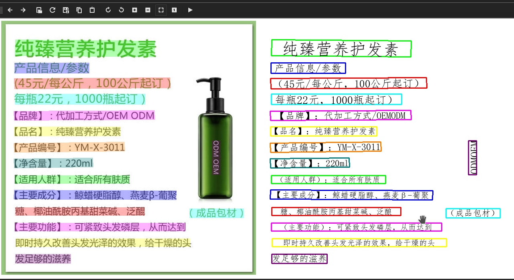
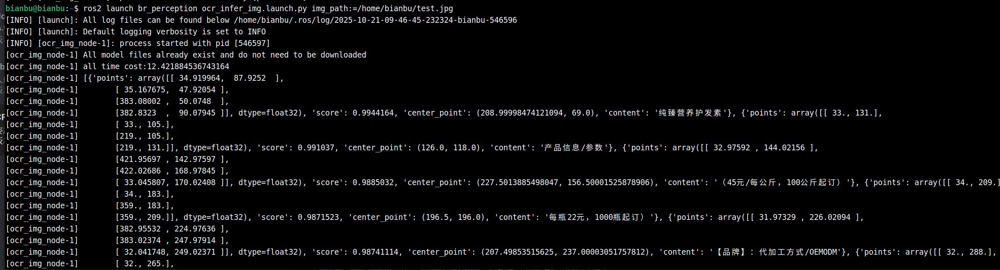
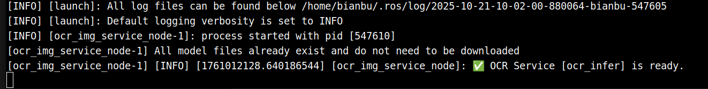
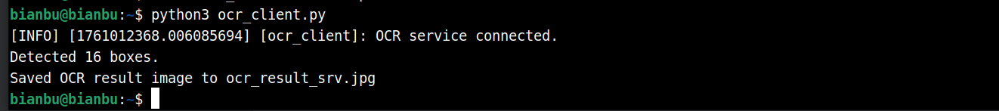

# 5.1.13 OCR


## PaddleOCR 简介

PaddleOCR（简称 **PPOCR**）是由百度飞桨（PaddlePaddle）团队开源的一个**端到端文字识别（OCR）系统**，致力于提供**“从文本检测 → 方向分类 → 文本识别 → 后处理”** 的完整解决方案。
 它不仅支持中英文、多语言场景，还广泛适用于文档、票据、路牌、车牌、自然场景等 OCR 应用。

本示例展示如何基于 SpacemiT 智算核，使用图片或ROS2消息作为输入，执行 OCR 模型的推理，并通过 ROS 2 发布检测结果。

## 环境准备

建议使用 ROS2_LXQT 系统，并确保已经安装了开发依赖

### 安装依赖

```bash
sudo apt install python3-opencv ros-humble-cv-bridge ros-humble-camera-info-manager \
ros-humble-image-transport python3-spacemit-ort python3-pyclipper
```

### 导入 ROS2 环境

```bash
source /opt/bros/humble/setup.bash
```


## 图片推理

**准备图片**

```bash
cp /opt/bros/humble/share/jobot_ppocr_py/data/test.jpg .
```

### **本地保存推理结果**

```bash
ros2 launch rdk_perception ocr_infer_img.launch.py img_path:=/home/bianbu/test.jpg
```

输出结果将保存在当前目录的 `ocr_result.jpg` 中，如图所示。



终端打印如下




### 参数说明

**ocr_infer_img.launch.py 的参数说明**

| **参数名称** | 作用                 | 默认值        |
| ------------ | -------------------- | ------------- |
| img_path     | 推理时使用的图片路径 | data/test.jpg |


## 使用推理服务

推理服务接受原始图像消息并返回OCR推理结果，可以通过 `ros2 interface show jobot_interfaces/srv/OCRInfer` 查看服务定义。

### 开启服务

```text
ros2 launch rdk_perception ocr_service.launch.py
```

终端打印：



### 客户端代码

编写客户端代码

```text
import rclpy
from rclpy.node import Node
from sensor_msgs.msg import Image
from jobot_interfaces.srv import OCRInfer
import cv2
import numpy as np


class OCRClient(Node):
    def __init__(self):
        super().__init__('ocr_client')
        self.client = self.create_client(OCRInfer, 'ocr_infer')
        while not self.client.wait_for_service(timeout_sec=1.0):
            self.get_logger().info('Waiting for OCR service...')
        self.get_logger().info('OCR service connected.')

    def send_request(self, img_path):
        req = OCRInfer.Request()

        img = cv2.imread(img_path)
        img_msg = Image()
        img_msg.height, img_msg.width, _ = img.shape
        img_msg.encoding = 'bgr8'
        img_msg.step = img_msg.width * 3
        img_msg.data = img.tobytes()

        req.image = img_msg

        future = self.client.call_async(req)
        rclpy.spin_until_future_complete(self, future)
        resp = future.result()

        print(f"Detected {len(resp.result.boxes)} boxes.")
        result_img = self.ros_img_to_cv2(resp.result_img)
        cv2.imwrite('ocr_result_srv.jpg', result_img)
        print("Saved OCR result image to ocr_result_srv.jpg")

    def ros_img_to_cv2(self, ros_img: Image):
        img = np.frombuffer(ros_img.data, dtype=np.uint8).reshape(ros_img.height, ros_img.width, 3)
        return img


def main():
    rclpy.init()
    client = OCRClient()
    client.send_request('test.jpg')
    client.destroy_node()
    rclpy.shutdown()


if __name__ == '__main__':
    main()
```

注意确保这里的图像路径正确。

### 请求服务

客户端代码保存为 ocr_client.py

然后执行：

```text
python3 ocr_client.py
```

终端打印：



结果可视化文件保存在 ocr_result_srv.jpg
