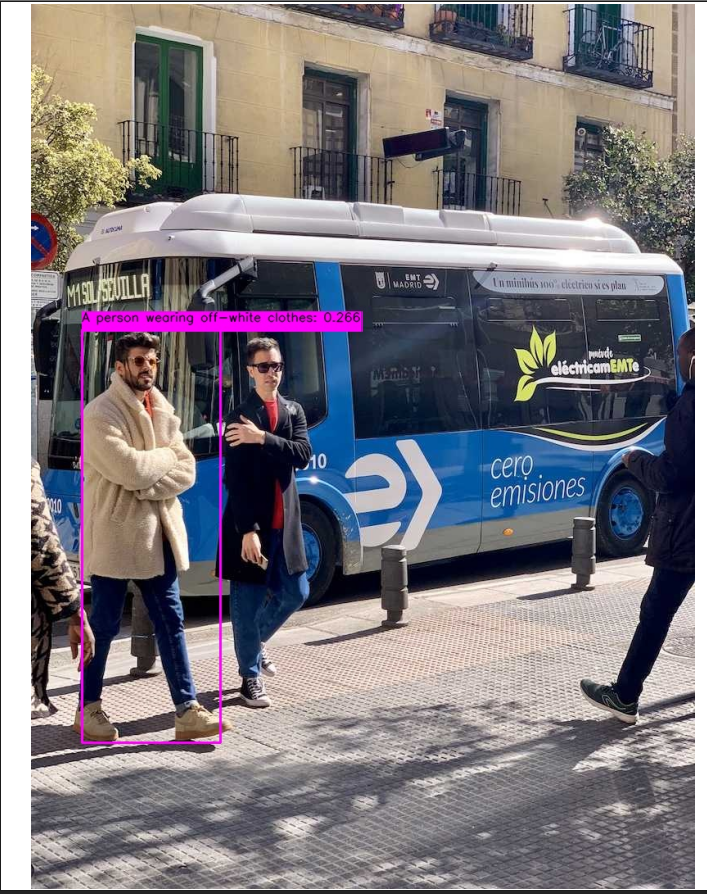
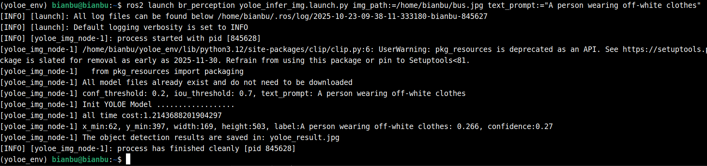
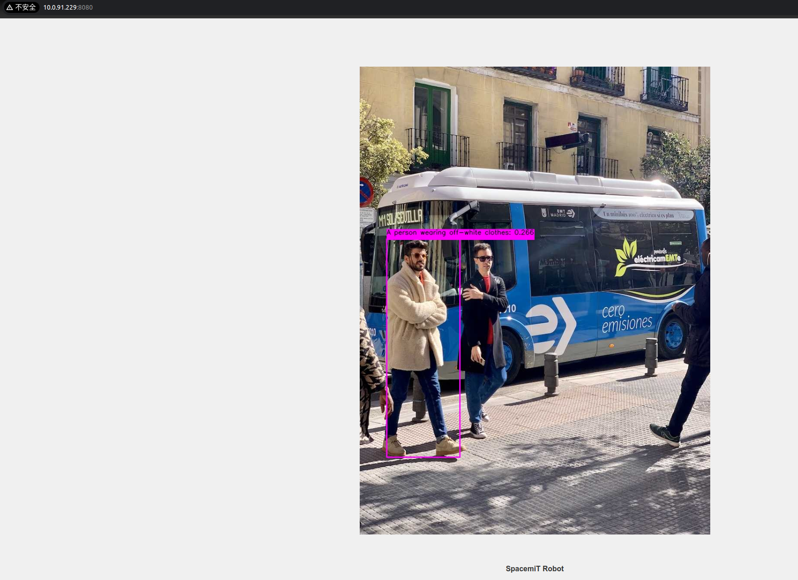
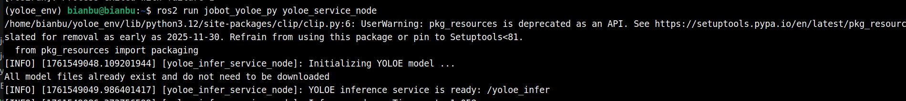
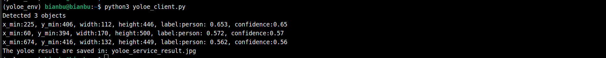

# 5.1.14 YOLOE

```text
最新版本：2025/09/12
```

## YOLOE 简介

[YOLOE (Real-Time Seeing Anything)](https://arxiv.org/html/2503.07465v1) 是零样本、可提示 YOLO 模型的一项新进展，专为 **开放词汇表** 检测和分割而设计。 与之前仅限于固定类别的 YOLO 模型不同，YOLOE 使用文本、图像或内部词汇表提示，从而能够实时检测任何对象类别。 YOLOE 基于 YOLOv10 构建，并受到 [YOLO-World](https://docs.ultralytics.com/zh/models/yolo-world/) 的启发，以最小的速度和准确性影响实现了 **最先进的零样本性能**。

本示例展示如何基于 SpacemiT 智算核，使用图片或视频流作为输入，执行 YOLOE 模型的推理，并通过 ROS 2 发布检测结果。

## 环境准备

### 安装依赖

```bash
sudo apt install python3-venv python3-pip ros-humble-camera-info-manager \
ros-humble-image-transport python3-spacemit-ort
```

### 导入 ROS2 环境

```bash
source /opt/bros/humble/setup.bash
```

### 准备虚拟环境

```text
python3 -m venv ~/yoloe_env
source ~/yoloe_env/bin/activate
pip install -r /opt/bros/humble/share/jobot_yoloe_py/data/requirements.txt
```

```text
export PYTHONPATH="$HOME/yoloe_env/lib/python3.12/site-packages":$PYTHONPATH
```

## 图片推理

**准备图片**

```bash
cp /opt/bros/humble/share/jobot_yoloe_py/data/bus.jpg .
```

### **本地保存推理结果**

```bash
ros2 launch rdk_perception yoloe_infer_img.launch.py \
img_path:=/home/bianbu/bus.jpg \
text_prompt:="A person wearing off-white clothes"
```

输出结果将保存在当前目录的 `yoloe_result.jpg` 中，如图所示。



终端打印如下



### Web 可视化推理结果

启动推理发布节点（终端 1）：

```bash
ros2 launch rdk_perception yoloe_infer_img.launch.py \
publish_result_img:=true \
img_path:=/home/bianbu/bus.jpg \
text_prompt:="A person wearing off-white clothes"
```

启动 Web 可视化服务（终端 2）：

```bash
ros2 launch rdk_visualization websocket_cpp.launch.py image_topic:='/result_img'
```

终端提示访问地址：

```text
...
Please visit in your browser: http://<IP>:8080
...
```

打开浏览器输入 `http://<IP>:8080`，即可查看实时推理图像结果。


还可以通过追加 port:=xxxx 参数来指定端口号，以避免端口冲突



### 结果订阅

输入 `ros2 topic echo /inference_result` 查看推理结果话题

使用以下代码实现简单的话题订阅

```text
from rclpy.node import Node
from std_msgs.msg import Header
from jobot_interfaces.msg import DetectionResultArray, DetectionResult
import rclpy

class DetectionSubscriber(Node):
    def __init__(self):
        super().__init__('detection_sub')
        self.subscription = self.create_subscription(
            DetectionResultArray,
            '/inference_result',
            self.listener_callback,
            10)

    def listener_callback(self, msg: DetectionResultArray):
        self.get_logger().info(f"Frame: {msg.header.frame_id}")
        for det in msg.results:
            self.get_logger().info(
                f"[{det.label}] ({det.x_min},{det.y_min}) "
                f"{det.width}x{det.height} conf={det.conf:.2f}"
            )

def main(args=None):
    rclpy.init(args=args)
    node = DetectionSubscriber()
    rclpy.spin(node)
    node.destroy_node()
    rclpy.shutdown()

main()
```

### 参数说明

**yoloe_infer_img.launch.py 的参数说明**

|    **参数名称**    |                             作用                             |      默认值       |
| :----------------: | :----------------------------------------------------------: | :---------------: |
|      img_path      |                     推理时使用的图片路径                     |   data//bus.jpg   |
| publish_result_img |               是否以图像消息的形式发布推理结果               |       false       |
|  result_img_topic  |    发布的渲染图像消息名，publish_result_img为true时才有效    |    /result_img    |
|    result_topic    |                     发布的推理结果消息名                     | /inference_result |
|   conf_threshold   |        控制**检测结果可信度**的最低标准（过滤低分框）        |        0.2        |
|   iou_threshold    |           控制**去重规则**的严格程度（处理重叠框）           |        0.7        |
|    text_prompt     | 控制**检测目标的范围**（常规类别，或物体的自然语言描述，以`,`分隔不同类别描述） |     "person"      |


## 使用推理服务

推理服务接受原始图像消息和文本提示并返回 YOLOE 推理结果，可以通过 `ros2 interface show jobot_interfaces/srv/YOLOEInfer` 查看服务定义。

### 开启服务

```text
source ~/yoloe_env/bin/activate
export PYTHONPATH="$HOME/yoloe_env/lib/python3.12/site-packages":$PYTHONPATH
```

```text
ros2 launch rdk_perception yoloe_service.launch.py
```

终端打印：



### 客户端代码

编写客户端代码

```text
import rclpy
from rclpy.node import Node
from jobot_interfaces.srv import YOLOEInfer
from sensor_msgs.msg import Image
import cv2
from jobot_perception_utils_py.cv_bridge import CvBridge

class TestClient(Node):
    def __init__(self):
        super().__init__('yoloe_test_client')
        self.cli = self.create_client(YOLOEInfer, '/yoloe_infer')
        while not self.cli.wait_for_service(timeout_sec=2.0):
            self.get_logger().info('Waiting for service /yoloe_infer...')
        self.req = YOLOEInfer.Request()
        self.bridge = CvBridge()

    def send_request(self, img_path, text_prompt="person"):
        img = cv2.imread(img_path)
        self.req.image = self.bridge.cv2_to_imgmsg(img, encoding='bgr8')
        self.req.text_prompt = text_prompt
        future = self.cli.call_async(self.req)
        rclpy.spin_until_future_complete(self, future)
        return future.result()

def main():
    rclpy.init()
    client = TestClient()
    resp = client.send_request('bus.jpg', 'person')
    print(f"Detected {len(resp.detections.results)} objects")

    for box in resp.detections.results:
        print(f'x_min:{box.x_min}, y_min:{box.y_min}, width:{box.width}, height:{box.height}, label:{box.label}, confidence:{box.conf:.2f}')

    # ROS Image -> OpenCV
    img_result = client.bridge.imgmsg_to_cv2(resp.result_img, desired_encoding='bgr8')

    cv2.imwrite('yoloe_service_result.jpg', img_result)
    print("The yoloe result are saved in: yoloe_service_result.jpg")

    client.destroy_node()
    rclpy.shutdown()

if __name__ == "__main__":
    main()

```

注意确保这里的图像路径正确。

### 请求服务

客户端代码保存为 yoloe_client.py

然后执行：

```text
source ~/yoloe_env/bin/activate
export PYTHONPATH="$HOME/yoloe_env/lib/python3.12/site-packages":$PYTHONPATH
```

```text
python3 yoloe_client.py
```

终端打印：



结果可视化文件保存在 yoloe_service_result.jpg


### 参数说明

**yoloe_service.launch.py 的参数说明**

|  **参数名称**  |                      作用                      | 默认值 |
| :------------: | :--------------------------------------------: | :----: |
| conf_threshold | 控制**检测结果可信度**的最低标准（过滤低分框） |  0.2   |
| iou_threshold  |    控制**去重规则**的严格程度（处理重叠框）    |  0.7   |
