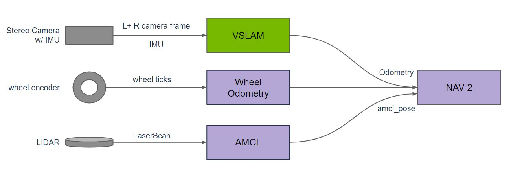
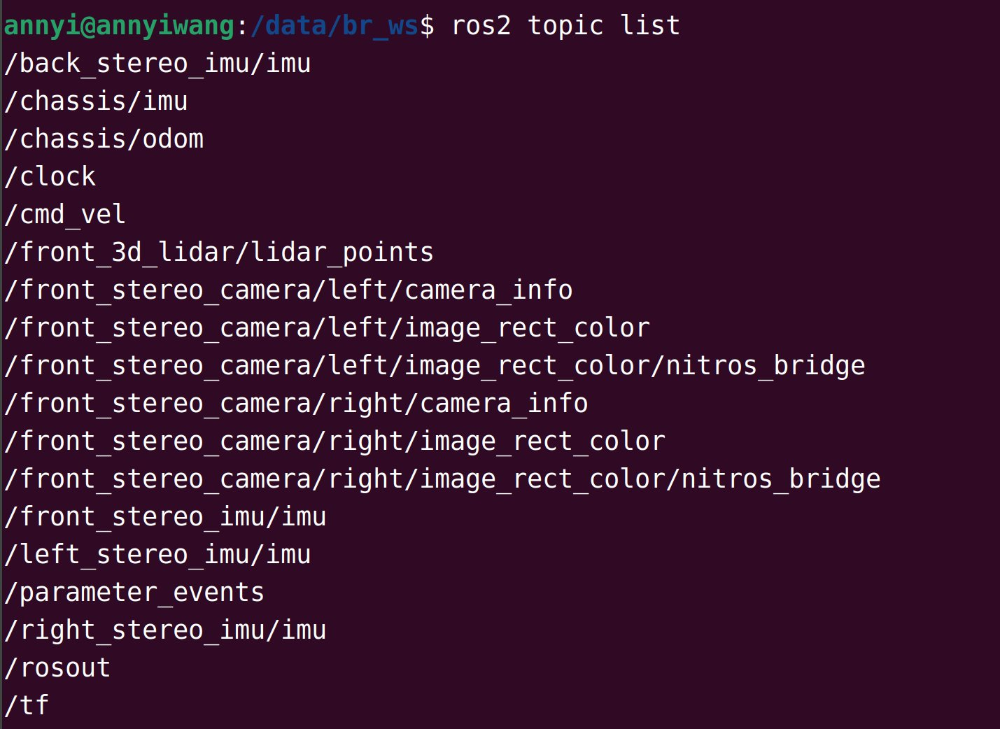
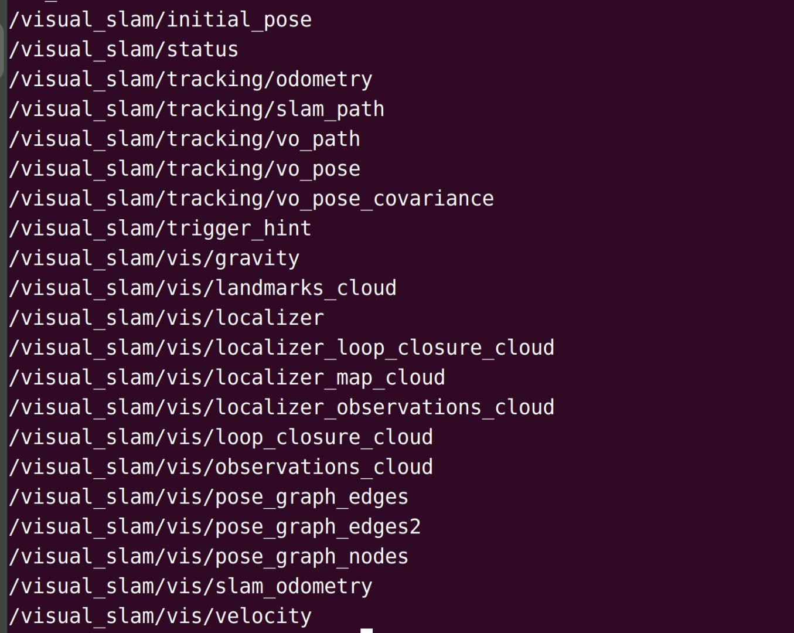
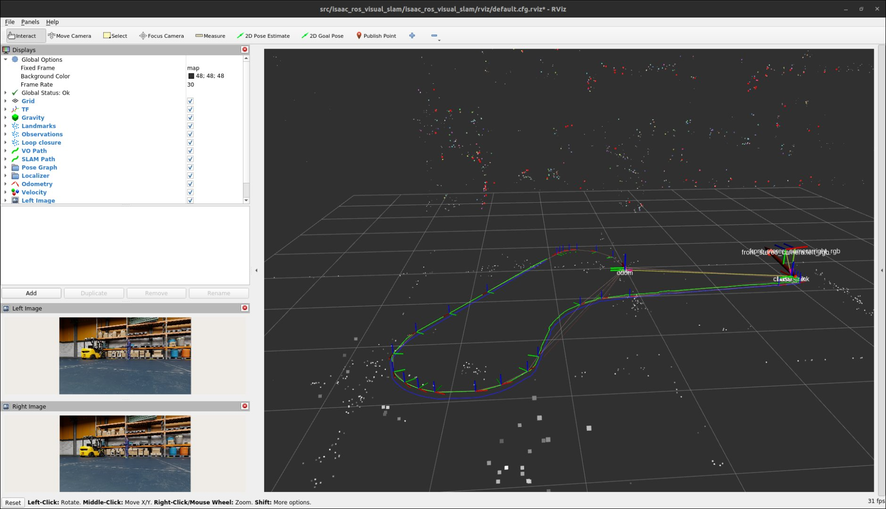
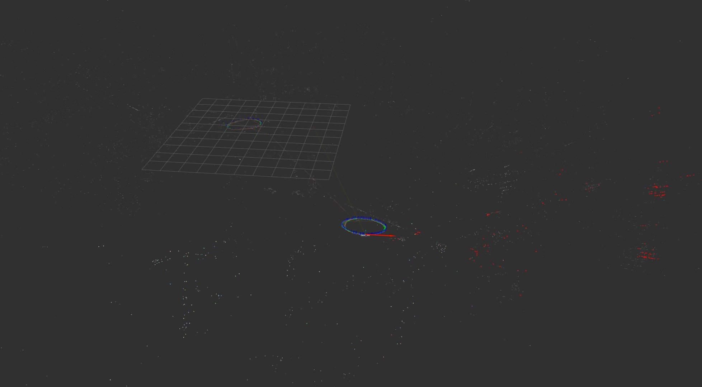
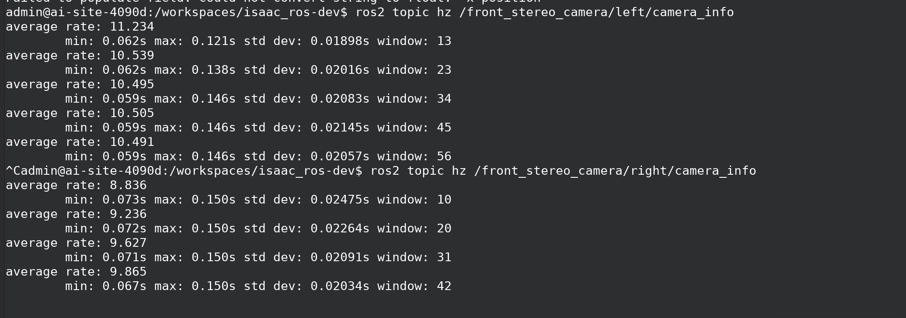

# 5.10.1 Isaac-Sim仿真建图

> ⚠️运行环境说明：
>
> - Isaac Sim运行在 GPU 服务器，Isaac ROS 运行在部署于 GPU 服务器的 Docker 容器（[isaac-ros-dev](https://nvidia-isaac-ros.github.io/concepts/docker_devenv/index.html#development-environment)）。
>
> - 官方教程：[Isaac ROS 官方示例](https://nvidia-isaac-ros.github.io/concepts/visual_slam/cuvslam/tutorial_isaac_sim.html)

## 简介



Isaac ROS 的 VSLAM 方案通过融合多传感器数据（Stereo Camera、IMU、编码器、LiDAR）提供导航所需的定位和里程计信息，用于驱动 ROS2 的导航栈（Nav2）。该系统的核心目标是生成精确的 `/odom` 和 `/amcl_pose` 消息。

- Stereo Camera + IMU：通过双目视觉 + 惯性测量，实现视觉里程计 + 重定位（定位）
- Wheel Encoder：通过车轮编码器计算的里程信息（增量位置）用于辅助定位
- LiDAR：自适应蒙特卡洛定位（粒子滤波法）使用 LaserScan + 地图进行全局定位

## 准备工作

### 下载离线资源

登录AI服务器，下载 issac-ros-vslam 案例配套的资源包：

```Bash
NGC_ORG="nvidia"
NGC_TEAM="isaac"
PACKAGE_NAME="isaac_ros_visual_slam"
NGC_RESOURCE="isaac_ros_visual_slam_assets"
NGC_FILENAME="quickstart.tar.gz"
MAJOR_VERSION=3
MINOR_VERSION=2
VERSION_REQ_URL="https://catalog.ngc.nvidia.com/api/resources/versions?orgName=$NGC_ORG&teamName=$NGC_TEAM&name=$NGC_RESOURCE&isPublic=true&pageNumber=0&pageSize=100&sortOrder=CREATED_DATE_DESC"
AVAILABLE_VERSIONS=$(curl -s \
    -H "Accept: application/json" "$VERSION_REQ_URL")
LATEST_VERSION_ID=$(echo $AVAILABLE_VERSIONS | jq -r "
    .recipeVersions[]
    | .versionId as \$v
    | \$v | select(test(\"^\\\\d+\\\\.\\\\d+\\\\.\\\\d+$\"))
    | split(\".\") | {major: .[0]|tonumber, minor: .[1]|tonumber, patch: .[2]|tonumber}
    | select(.major == $MAJOR_VERSION and .minor <= $MINOR_VERSION)
    | \$v
    " | sort -V | tail -n 1
)
if [ -z "$LATEST_VERSION_ID" ]; then
    echo "No corresponding version found for Isaac ROS $MAJOR_VERSION.$MINOR_VERSION"
    echo "Found versions:"
    echo $AVAILABLE_VERSIONS | jq -r '.recipeVersions[].versionId'
else
    mkdir -p ${ISAAC_ROS_WS}/isaac_ros_assets && \
    FILE_REQ_URL="https://api.ngc.nvidia.com/v2/resources/$NGC_ORG/$NGC_TEAM/$NGC_RESOURCE/\
versions/$LATEST_VERSION_ID/files/$NGC_FILENAME" && \
    curl -LO --request GET "${FILE_REQ_URL}" && \
    tar -xf ${NGC_FILENAME} -C ${ISAAC_ROS_WS}/isaac_ros_assets && \
    rm ${NGC_FILENAME}
fi
```

这些资源包括 issac ros vslam 案例的离线 bag 和接口配置文件，可用于离线测试 vslam 算法。

### 安装/编译 issac-ros-visul-slam

进入 issac-ros-dev，安装/编译 issac-ros-visual-slam 包。

- 安装预编译包：

```Plain
sudo apt-get update
sudo apt-get install -y ros-humble-isaac-ros-visual-slam
```

- 源码编译：

```Plain
cd ${ISAAC_ROS_WS}/src
git clone -b release-3.2 https://github.com/NVIDIA-ISAAC-ROS/isaac_ros_visual_slam.git isaac_ros_visual_slam

sudo apt-get update
rosdep update && rosdep install --from-paths ${ISAAC_ROS_WS}/src/isaac_ros_visual_slam/isaac_ros_visual_slam --ignore-src -y

cd ${ISAAC_ROS_WS}/
colcon build --symlink-install --packages-up-to isaac_ros_visual_slam --base-paths ${ISAAC_ROS_WS}/src/isaac_ros_visual_slam/isaac_ros_visual_slam

source install/setup.bash
```

## 启动仿真

在 GPU 服务器上启动仿真。

### 启动 IsaacSim

```Plain
cd issacsim
./isaac-sim.sh
```

### 加载场景和小车模型

参考：[https://nvidia-isaac-ros.github.io/getting_started/isaac_sim/index.html](https://nvidia-isaac-ros.github.io/getting_started/isaac_sim/index.html)


### 启动仿真过程

点击视图左边的 **PLAY** 按钮，这一步是使场景开始运行，机器人和传感器上电，传感器开始采集数据并发布话题，控制器准备监听订阅的话题（比如速度）。



## 启动 Issac ROS VSLAM

在 isaac-ros-dev 中启动 issac ros vslam。

### 启动 VSLAM 系统

```Plain
 ros2 launch isaac_ros_visual_slam isaac_ros_visual_slam_isaac_sim.launch.py
```

该命令启动 VSLAM 算法节点，自动订阅来自 Isaac Sim 的相机传感器数据和 TF 坐标变换信息，进行视觉里程计算与地图构建，并发布包括 odometry 里程计信息、点云地图等在内的定位与感知信息供后续模块使用。



### 发布 `/cmd_vel` 话题

启动一个 ROS2 窗口（可以是 issac-ros-dev/PC/K1，在同一个 ROS2 域即可），发送速度给小车：

```Plain
ros2 topic pub --once /cmd_vel geometry_msgs/msg/Twist "{linear: {x: 0.2, y: 0.0, z: 0.0}, angular: {x: 0.0, y: 0.0, z: 0.2}}"
```

上述命令发布 `/cmd_vel` 话题，Isaac Sim 的差分控制器订阅该话题驱动小车运动。具体地，给小车一个 0.2m/s 的线速度和 0.2rad/s 的角速度。使得小车原地绕半径为 1m 的圆逆时针匀速运动。

也可以启动 `teleop_twist_keyboard` 节点去控制小车运动：

```Plain
ros2 run teleop_twist_keyboard teleop_twist_keyboard
```

### RVIZ 可视化

重启一个 isaac-ros-dev 窗口，在 rviz2 中加载可视化配置文件：

```Plain
rviz2 -d $(ros2 pkg prefix isaac_ros_visual_slam --share)/rviz/isaac_sim.cfg.rviz
```

### 查看里程计信息

启动一个 ROS2 窗口（可以是 issac-ros-dev/PC/K1，同一个 ROS2 域即可），查看小车的里程计信息：

```Plain
ros2 topic echo /visual_slam/tracking/odometry
```

## 保存地图

### 判断地图是否建好



VSLAM 判断地图是否建好的标准可参考：

- 定位稳定，无跟丢/漂移。可通过查看 `/visual_slam/statu` 话题，没有报告 TRACK_LOST 或 TRACKING_WEAK 状态。
- 地图收敛，点云/关键帧稳定。实时监控 `/visual_slam/vis/landmarks_cloud` 的点云数量，建图后期新增特征点速率应显著下降。

### 保存地图到本地

Isaac ROS 调用自定义的 `save_map` 服务来保存地图：

```Plain
ros2 service call /visual_slam/save_map isaac_ros_visual_slam_interfaces/srv/FilePath "{file_path: /path/to/save/the/map}"
```

⚠️注意：/path/to/save/the/map 需要为空路径，因为它会覆盖该路径内容

生成的地图为 .mdb 格式，是 Isaac ROS 独有的地图数据格式：

```Plain
admin@ai-site-4090d:/workspaces/isaac_ros-dev$ ros2 service call /visual_slam/save_map isaac_ros_visual_slam_interfaces/srv/FilePath "{file_path: /tmp/map}"
requester: making request: isaac_ros_visual_slam_interfaces.srv.FilePath_Request(file_path='/tmp/map')

response:
isaac_ros_visual_slam_interfaces.srv.FilePath_Response(success=True)

admin@ai-site-4090d:/workspaces/isaac_ros-dev$ ls -al /tmp/map
total 26436
drwxr-xr-x 2 admin admin     4096 May 29 11:22 .
drwxrwxrwt 1 root  root      4096 May 29 11:22 ..
-rw-r--r-- 1 admin admin 27062272 May 29 11:22 data.mdb
```

## 使用地图

关闭 vslam节点并重启：

```Plain
 ros2 launch isaac_ros_visual_slam isaac_ros_visual_slam_isaac_sim.launch.py
```

加载地图并本地化（给一个初始位置）：

```Plain
ros2 service call /visual_slam/localize_in_map isaac_ros_visual_slam_interfaces/srv/LocalizeInMap "
  map_folder_path: '/path/to/save/the/map'
  pose_hint:
    position:
      x: x-position
      y: y-position
      z: z-position
    orientation:
      x: 0.0
      y: 0.0
      z: 0.0
      w: 1.0"
```

如果失败，则可能是由于该位置与地图其他位置相似，导致 VSLAM 判断失误，需换一个位置本地化。

## <!--问题-->

### <!--1. 跟丢/漂移-->

<!---->

<!--具体原因还未知。-->

### <!--2. 相机帧率较低-->

<!---->

<!--配的应该是60帧的相机。-->
