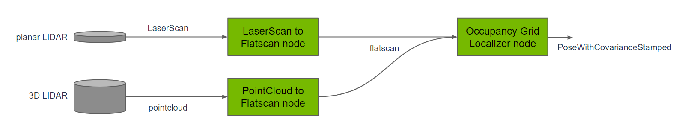
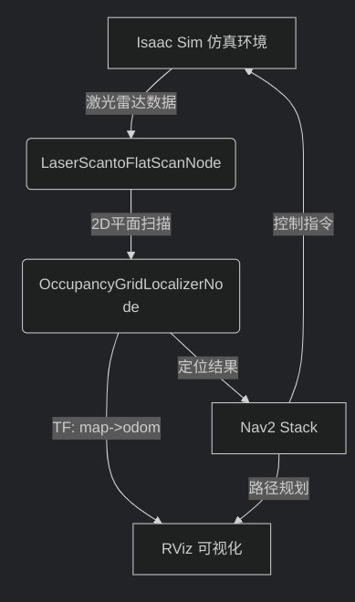
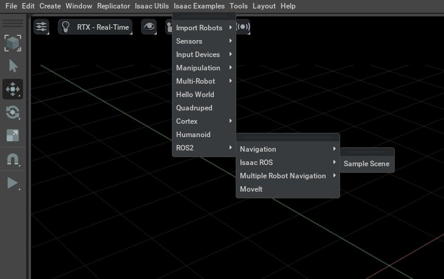
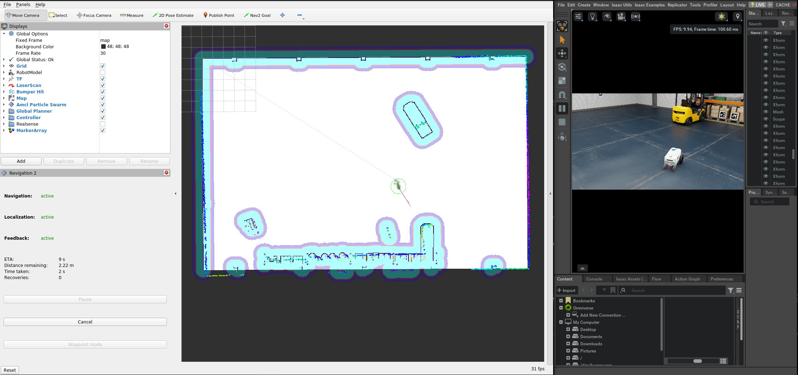

# 5.10.2 Isaac-Sim仿真导航

> ⚠️运行环境说明：
>
> - Isaac Sim运行在 GPU 服务器，Isaac ROS 运行在部署于 GPU 服务器的 Docker 容器（[isaac-ros-dev](https://nvidia-isaac-ros.github.io/concepts/docker_devenv/index.html#development-environment)）。
>
> - 官方教程：[Isaac ROS 官方示例](https://nvidia-isaac-ros.github.io/concepts/visual_slam/cuvslam/tutorial_isaac_sim.html)

## Isaac ROS Occupancy Grid Localizer 简介

该案例借助 [Isaac ROS Occupancy Grid Localizer](https://github.com/NVIDIA-ISAAC-ROS/isaac_ros_map_localization/tree/main) 实现地图本地化（定位），使用标准 Nav2 进行导航。

Occupancy Grid Localizer 是一个基于已知栅格地图和激光传感器数据来实现 2D 定位的模块，最终输出机器人在地图中的位姿。

Isaac ROS Occupancy Grid Localizer 定位器设计：



该定位器有两个主要节点：

- Occupancy Grid Localizer Node：NVIDIA 提供的占用栅格定位器（将激光雷达数据匹配到地图）
- Laser Scanto FlatScan Node：将平面2D/3D 激光雷达数据转换成 Issac ROS 内部标准格式

## 仿真流程



## 准备工作

### 下载离线资源

登录AI服务器，下载issac-ros-vslam案例配套的资源包：

```bash
NGC_ORG="nvidia"
NGC_TEAM="isaac"
PACKAGE_NAME="isaac_ros_occupancy_grid_localizer"
NGC_RESOURCE="isaac_ros_occupancy_grid_localizer_assets"
NGC_FILENAME="quickstart.tar.gz"
MAJOR_VERSION=3
MINOR_VERSION=2
VERSION_REQ_URL="https://catalog.ngc.nvidia.com/api/resources/versions?orgName=$NGC_ORG&teamName=$NGC_TEAM&name=$NGC_RESOURCE&isPublic=true&pageNumber=0&pageSize=100&sortOrder=CREATED_DATE_DESC"
AVAILABLE_VERSIONS=$(curl -s \
    -H "Accept: application/json" "$VERSION_REQ_URL")
LATEST_VERSION_ID=$(echo $AVAILABLE_VERSIONS | jq -r "
    .recipeVersions[]
    | .versionId as \$v
    | \$v | select(test(\"^\\\\d+\\\\.\\\\d+\\\\.\\\\d+$\"))
    | split(\".\") | {major: .[0]|tonumber, minor: .[1]|tonumber, patch: .[2]|tonumber}
    | select(.major == $MAJOR_VERSION and .minor <= $MINOR_VERSION)
    | \$v
    " | sort -V | tail -n 1
)
if [ -z "$LATEST_VERSION_ID" ]; then
    echo "No corresponding version found for Isaac ROS $MAJOR_VERSION.$MINOR_VERSION"
    echo "Found versions:"
    echo $AVAILABLE_VERSIONS | jq -r '.recipeVersions[].versionId'
else
    mkdir -p ${ISAAC_ROS_WS}/isaac_ros_assets && \
    FILE_REQ_URL="https://api.ngc.nvidia.com/v2/resources/$NGC_ORG/$NGC_TEAM/$NGC_RESOURCE/\
versions/$LATEST_VERSION_ID/files/$NGC_FILENAME" && \
    curl -LO --request GET "${FILE_REQ_URL}" && \
    tar -xf ${NGC_FILENAME} -C ${ISAAC_ROS_WS}/isaac_ros_assets && \
    rm ${NGC_FILENAME}
fi
```

### 安装/编译 Isaac ROS Occupancy Grid Localizer

进入 issac-ros-dev，安装/编译 issac-ros-visual-slam 包。

- 安装预编译包：

```Plain
sudo apt-get update
sudo apt-get install -y ros-humble-isaac-ros-occupancy-grid-localizer
```

- 源码编译：

```Plain
cd ${ISAAC_ROS_WS}/src
git clone -b release-3.2 https://github.com/NVIDIA-ISAAC-ROS/isaac_ros_map_localization.git isaac_ros_map_localization

sudo apt-get update
rosdep update && rosdep install --from-paths ${ISAAC_ROS_WS}/src/isaac_ros_map_localization/isaac_ros_occupancy_grid_localizer --ignore-src -y

cd ${ISAAC_ROS_WS}
colcon build --symlink-install --packages-up-to isaac_ros_occupancy_grid_localizer --base-paths ${ISAAC_ROS_WS}/src/isaac_ros_map_localization/isaac_ros_occupancy_grid_localizer

source install/setup.bash
```

## 启动仿真

在 GPU 服务器上启动仿真。

### 启动 IsaacSim

```Plain
cd issacsim
./isaac-sim.sh
```

### 加载场景和小车模型

参考：[https://nvidia-isaac-ros.github.io/getting_started/isaac_sim/index.html](https://nvidia-isaac-ros.github.io/getting_started/isaac_sim/index.html)



### 修改话题名称

在视图右部 Stage 栏目，选择 /World/Nova_Carter_ROS/ros_lidars/publish_front_2d_lidar_scan，将 2D 雷达发布的话题名称修改为 `/scan`，这是为了与 Nav2 导航栈的标准接口兼容。

### 启用雷达

在视图右部 Stage 栏目，选择 /World/Nova_Carter_ROS/ros_lidars/front_2d_lidar_render_product，在Inputs属性里面勾选 enabled，启用 2D 雷达输出，让 ROS2 驱动节点可以从仿真中接收到模拟的 2D 激光雷达数据。

### 启动仿真过程

点击视图左边的 **PLAY** 按钮，这一步是使场景开始运行，机器人和传感器上电，雷达开始采集数据并发布话题，控制器准备监听订阅的话题（比如速度）。

## 启动导航

```text
ros2 launch isaac_ros_occupancy_grid_localizer isaac_ros_occupancy_grid_localizer_nav2.launch.py
```

上述脚本启动 isaac_ros_occupancy_grid_localizer 的导航脚本，启动以下节点和功能：

| 节点/组件                    | 功能描述                                                     |
| ---------------------------- | ------------------------------------------------------------ |
| `rviz_launch`                | 启动 RViz 并加载预配置的可视化界面                           |
| `nav2_bringup_launch`        | 启动 Nav2 核心组件，包括控制器、全局/局部规划器等            |
| `OccupancyGridLocalizerNode` | NVIDIA 提供的占用栅格定位器，将激光数据匹配到栅格地图实现定位 |
| `LaserScantoFlatScanNode`    | 将 3D/2D激光雷达数据转化成FlatScan格式供定位器使用           |
| `static_transform_publisher` | 发布 `base_link` 到 `base_footprint` 的静态 TF               |

导航启动之后，需要初始化起始位置，执行下列命令触发本地化服务：

```text
ros2 service call /trigger_grid_search_localization std_srvs/srv/Empty {}
```

此时，机器人已经进行本地化，可以在 RVIZ 视图中点击 Nav2 Goal，选择地图上的一个点，Nav2 会规划导航路线，控制器会驱动机器人沿航线运动：


