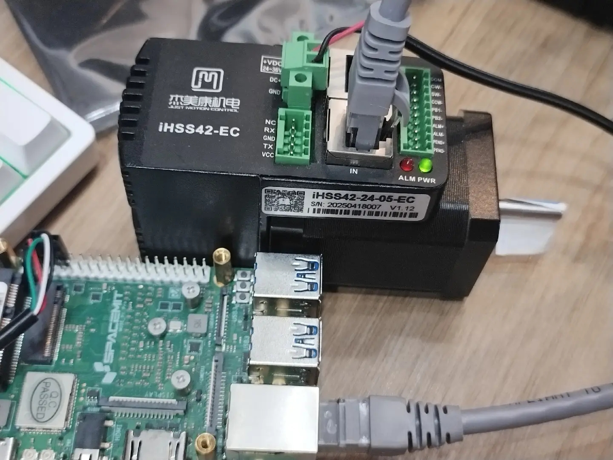

# 5.2.6 EtherCAT电机控制

本文档介绍如何基于Ethercat协议控制一体化伺服电机，以杰美康IHSS42-24-05-EC为例

## 硬件连接


如图所示，接入电机电源，网线一端连接电机IN口，另一端插入开发板网口，
电源指示灯常亮表示电机正常工作

## 环境说明

bianbu-ROS固件已集成Ethercat环境，在启动前执行以下步骤确认服务是否启用

**接线完成后，查看设备节点是否出现**

```bash
ls /dev/EtherCAT0
```

如果出现，跳转到[下载软件包](#下载软件包)小节进行下一步

如果节点没有出现，跳转到[启用Ethercat](#启用ethercat)小节进行设置

### 启用Ethercat

#### 1. 打开设备树文件夹

```bash
cd /boot/spacemit/6.6.63/
```

#### 2. 获取开发板dts文件

```bash
sudo dtc -I dtb -O dts -o k1-x_MUSE-Pi-Pro.dts k1-x_MUSE-Pi-Pro.dtb


#如果没有dtc工具执行此命令下载
sudo apt install device-tree-compiler
```

注意：本例使用MUSE-Pi-Pro开发板，如果使用其他类型开发板，请将命令行中的设备树文件名替换为实际使用的板型

#### 3. 修改dts

```bash
vi k1-x_MUSE-Pi-Pro.dts
```

* 找到 **&eth0(同ethernet@cac80000)** 节点

  **修改compatiable属性为 spacemit,k1x-ec-emac**

```bash
 ethernet@cac80000 {
        compatible = "spacemit,k1x-ec-emac";
        reg = <0x00 0xcac80000 0x00 0x420>;
        k1x,apmu-base-reg = <0xd4282800>;
        ctrl-reg = <0x3e4>;
        dline-reg = <0x3e8>;
        clocks = <0x03 0xa5 0x03 0xa6>;
        clock-names = "emac-clk\0ptp-clk";
        resets = <0x1d 0x5d>;
        reset-names = "emac-reset";
        interrupts-extended = <0x1e 0x83>;
        mac-address = [00 00 00 00 00 00];
        ptp-support;
        ptp-clk-rate = <0x989680>;
        power-domains = <0x20 0x00>;
        clk,pm-runtime,no-sleep;
        cpuidle,pm-runtime,sleep;
        interconnects = <0x42>;
        interconnect-names = "dma-mem";
        status = "okay";
        pinctrl-names = "default";
        pinctrl-0 = <0x43>;
        emac,reset-gpio = <0x32 0x6e 0x00>;
        emac,reset-active-low;
        emac,reset-delays-us = <0x00 0x2710 0x186a0>;
        tx-threshold = <0x5ee>;
        rx-threshold = <0x0c>;

```

* 找到 **&ec_master(同ethercat_master)**

  修改 **compatible = "igh,k1x-ec-master";**

  修改 **status = "okay";**

```bash
ethercat_master {
        compatible = "igh,k1x-ec-master";
        run-on-cpu = <0x01>;
        debug-level = <0x00>;
        master-count = <0x01>;
        ec-devices = <0x40 0x41>;
        master-indexes = <0x00 0x00>;
        modes = "ec_main\0ec_backup";
        status = "okay";
        };

```

#### 4. 编译新的dtb

```bash
sudo dtc -I dts -O dtb -o k1-x_MUSE-Pi-Pro.dtb k1-x_MUSE-Pi-Pro.dts
```

#### 5. 重启开发板

```bash
sudo reboot
```

重启后更改生效

#### 6. 修改设备节点权限

```bash
sudo chown bianbu:bianbu /dev/EtherCAT0
```

设备节点默认权限为root, 普通用户操作需要手动更改权限，每次重启都需要手动输入该命令获取权限

此时再次查看Ethercat0设备

```bash
bianbu@bianbu:~$ ls -l /dev/EtherCAT0
crw------- 1 bianbu bianbu 240, 0 Sep 29 20:32 /dev/EtherCAT0
```

### 下载软件包

**注：如果从本步骤开始切换至root用户执行操作，在启动节点时将不会报错，无需修改任何文件**

#### 1. 创建工作区

```bash
mkdir -p ~/ros2_ws/src
cd ~/ros2_ws/src

#创建ros2功能包
ros2 pkg create motor_driver --build-type ament_cmake --dependencies ethercat_driver_ros2 rclcpp std_msg
```

#### 2. 下载路径

```bash
cd ~

# 克隆整个仓库
git clone https://gitlab.dc.com:8443/bianbu/bianbu-robot/brdk.git

# 复制资源到工作区
cp -r brdk/core_pkgs/jobot_bringup_pkgs/jobot_protocol_bringup ~/ros_ws/src/
```

#### 3. 安装编译环境

```bash
cd ~/ros2_ws

#安装编译环境
apt install -y colcon python3-rosdep gcc g++

#安装依赖
apt install -y ros-humble-control-msgs ros-humble-hardware-interface

apt install -y ros-humble-hardware-interface \
ros-humble-xacro \
ros-humble-imu-sensor-broadcaster \
ros-humble-diff-drive-controller  \
ros-humble-position-controllers  \
ros-humble-gripper-controllers  \
ros-humble-joint-state-broadcaster  \
ros-humble-joint-trajectory-controller  \
ros-humble-controller-manager \
ros-humble-velocity-controllers \
ros-humble-ros2-control
```

#### 4. ros2 ethercat编译

```bash

cd ~/ros2_ws/

sudo rosdep init    #非root用户，需要加sudo
rosdep update
rosdep install --ignore-src --from-paths . -y -r

colcon build

```

## 启动与控制

### 1. 启动 ethercat master服务

```bash
sudo igh_driver          #bianbu-ROS已集成，直接运行
```

如果您下载烧录的固件版本未集成igh_driver

```bash
cd brdk/core_pkgs/jobot_bringup_pkgs/jobot_protocol_bringup/resource
```

在此路径下已预备可执行文件

执行

```bash
sudo chmod +x igh_driver

./igh_driver
```

可通过此命令查看主站、从站状态

```bash
ethercat master
#输出
Master0
  Phase: Idle
  Active: no
  Slaves: 1
  Ethernet devices:
    Main: fe:fe:fe:ab:82:c0 (attached)
      Link: UP
      Tx frames:   10316433
      Tx bytes:    643986548
      Rx frames:   10316432
      Rx bytes:    643986488
      Tx errors:   0
      Tx frame rate [1/s]:    116    119    119
      Tx rate [KByte/s]:      6.8    7.0    7.0
      Rx frame rate [1/s]:    116    119    119
      Rx rate [KByte/s]:      6.8    7.0    7.0
    Common:
      Tx frames:   10316433
      Tx bytes:    643986548
      Rx frames:   10316432
      Rx bytes:    643986488
      Lost frames: 0
      Tx frame rate [1/s]:    116    119    119
      Tx rate [KByte/s]:      6.8    7.0    7.0
      Rx frame rate [1/s]:    116    119    119
      Rx rate [KByte/s]:      6.8    7.0    7.0
      Loss rate [1/s]:          0      0      0
      Frame loss [%]:         0.0    0.0    0.0
  Distributed clocks:
    Reference clock:   Slave 0
    DC reference time: 0
    Application time:  0
                       2000-01-01 00:00:00.000000000


ethercat slaves
#输出
0  0:0  PREOP  +  IHSS42-EC
```

### 2. 启动节点

```bash
cd ~/ros2_ws
source install/setup.bash
ros2 launch jobot_protocol_bringup motor_drive.launch.py
```

注：以root用户操作将不会出现以下报错或警告

* 如果启动失败，请检查设备节点权限

```bash
ls -l /dev/EtherCAT0

如果为root权限，执行此命令修改为普通用户可用

sudo chown bianbu:bianbu /dev/EtherCAT0
```

* 如果因为节点实时调度警告启动失败，请修改文件并重启开发板

```bash
sudo vi /etc/security/limits.conf


在 #@student        -       maxlogins       4    下
添加

bianbu - rtprio 99
bianbu - memlock unlimited
bianbu - nice -20

# End of file
```

### 3. 控制电机

打开一个新终端

```bash
#持续发送position位置
cd ~/ros2_ws

source install/setup.bash
#每次打开新终端都要执行source命令以设置ROS环境变量

ros2 topic pub -r 0.2 /trajectory_controller/joint_trajectory trajectory_msgs/msg/JointTrajectory '{header: {stamp: {sec: 0, nanosec: 0}, frame_id: ""}, joint_names: ["joint_1"], points: [{positions: [100.0], velocities: [0.0], accelerations: [0.0], time_from_start: {sec: 1, nanosec: 0}},{positions: [10000.0], velocities: [0.0], accelerations: [0.0],time_from_start: {sec: 5, nanosec: 0}}]}'
```

电机以固定频率转动

**参数说明**

```bash
1.
- ros2 topic pub

  ---  发布话题

2.
- -r 0.2

  ---  指定以0.2 Hz的速率发布（即5s一次）

3.
- /trajectory_controller/joint_trajectory

--- 话题名
  由控制器名称trajectory_controller + 功能joint_trajectory组成
  需与控制器配置文件（controllers.yaml）中匹配

4.
- trajectory_msgs/msg/JointTrajectory

--- ROS2中用于描述关节轨迹的标准消息类型

5.
##消息内容，格式在ROS中定义
- {header: {stamp: {sec: 0, nanosec: 0}, frame_id: ""}

--- 消息头部，携带元数据

参数：
        - stamp: {sec: 0, nanosec: 0} --- 消息时间戳，（0,0）表示使用控制器接收消息的当前时间作为轨迹开始时间
        - frame_id: ""    --- 参考坐标系名称，空字符串表示不指定


6.
- joint_names: ["joint_1"]

--- 需要控制的关节名称列表，与控制器配置文件中定义的关节名必须完全一致


7.
- points: [
{positions: [100.0], velocities: [0.0], accelerations: [0.0], time_from_start: {sec: 1, nanosec: 0}},

{positions: [10000.0], velocities: [0.0], accelerations: [0.0],time_from_start: {sec: 5, nanosec: 0}}
]

--- 轨迹点列表，每个点定义了关节在某个时刻的状态

参数：
      - positions: [100.0]      --- 关节目标位置
      - velocities: [0.0]       --- 关节到达该点时的目标速度
      - accelerations: [0.0]    --- 关节到达该点时的目标加速度
      - time_from_start: {sec: 1, nanosec: 0}   --- 从轨迹开始~到达该点的时间
```

### 4. 读取位置信息

打开一个新终端

```bash
cd ~/ros_ws
source install/setup.bash
ros2 topic echo /joint_states
```

**参数说明**

```bash
ros3 topic echo --- 打印实时话题内容

/joint_states   --- 话题名
```
