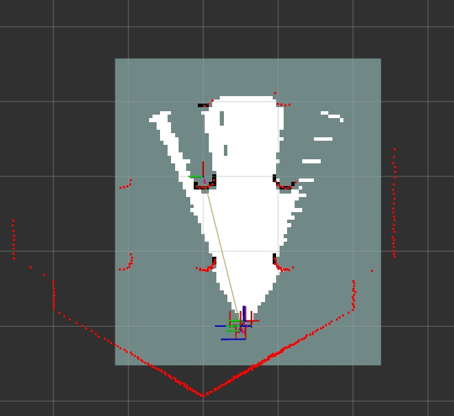
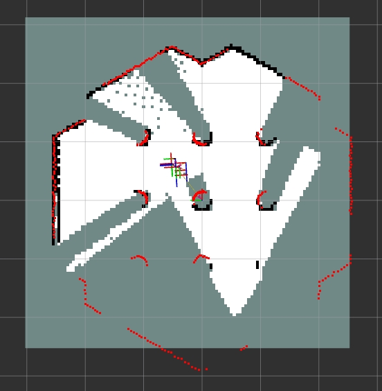
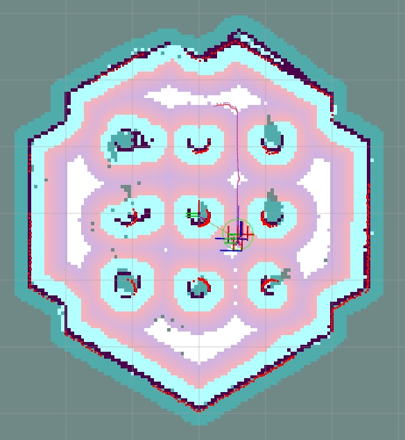

# 5.3.3 rtabmap

```text
最新版本：2025/10/23
```

## 简介

RTAB‐Map (Real‐time appearance‐based mapping) 是一种基于外观的闭环检测方法，具有良好的内存管理，以满足处理大场景和在线长周期管理要求。RTAB‐Map集成了视觉和激光雷达SLAM方案，提供了构建三维地图、在未知环境中进行实时定位与导航的一套完整的解决方案。

本章节演示在k1上运行RTAB‐Map、并在同网段的PC运行gazebo仿真环境的VSLAM示例。

## 准备工作
1. SpacemiT 板子烧录 ROS2_LXQT 系统镜像 。
2. PC 端安装 ros-humble 及 RDK。

## 使用介绍

### PC端

**安装gazebo仿真环境**

在pc打开终端，输入以下命令安装Gazebo。

```shell
sudo apt install ros-humble-gazebo*
sudo apt install ros-humble-turtlebot3
sudo apt install ros-humble-turtlebot3-gazebo
sudo apt install ros-humble-turtlebot3-bringup
sudo apt install ros-humble-turtlebot3-simulations
```

**搭建RTAB‐Map环境**

打开文件`/opt/ros/humble/share/turtlebot3_gazebo/models/turtlebot3_waffle/model.sdf`，按照下述步骤修改以添加深度相机：

1. 添加以下内容
```xml
<joint name="camera_rgb_optical_joint" type="fixed">
<parent>camera_rgb_frame</parent>
<child>camera_rgb_optical_frame</child>
<pose>0 0 0 -1.57079632679 0 -1.57079632679</pose>
<axis>
    <xyz>0 0 1</xyz>
</axis>
</joint>
```
2. 修改 `<link name="camera_rgb_frame">` 为 `<link name="camera_rgb_optical_frame">`。
3. 添加 `<link name="camera_rgb_frame"/>`。
4. 修改 `<sensor name="camera" type="camera">` 为 `<sensor name="camera" type="depth">`。
5. 修改分辨率`1920x1080` 为 `640x480`。
```xml
<width>640</width>
<height>480</height>
```

### K1端

**安装RTAB‐Map**

在k1打开终端，输入以下命令安装RTAB‐Map与nav2。

```shell
sudo apt install ros-humble-rtabmap*
sudo apt install ros-humble-navigation2
sudo apt install ros-humble-nav2-bringup
```

打开文件`/opt/ros/humble/share/rtabmap_demos/launch/turtlebot3/turtlebot3_rgbd.launch.py`，注释viz节点。
```python
#        Node(
#            package='rtabmap_viz', executable='rtabmap_viz', output='screen',
#            parameters=[parameters],
#            remappings=remappings),
```

### 运行VSLAM

1. 在pc端打开终端，输入以下命令启动gazebo。

```shell
source /opt/ros/humble/setup.bash
source /usr/share/gazebo/setup.sh
export TURTLEBOT3_MODEL=waffle
ros2 launch turtlebot3_gazebo turtlebot3_world.launch.py
```

2. 在k1打开终端，输入以下命令启动RTAB‐Map。

```shell
source /opt/ros/humble/setup.bash
ros2 launch rtabmap_demos turtlebot3_rgbd.launch.py
```

3. pc端打开一个新终端，输入命令打开rviz可视化RTAB‐Map运行效果。

```shell
source /opt/ros/humble/setup.bash
ros2 launch nav2_bringup rviz_launch.py
```



4. 打开键盘控制节点，控制小车运动进行视觉建图。
```shell
source /opt/ros/humble/setup.bash
ros2 run teleop_twist_keyboard teleop_twist_keyboard
```



### 运行nav2视觉导航

在完成VSLAM建立完整环境地图之后，按照以下步骤运行基于RTAB‐Map的nav2视觉导航。

1. 在pc端打开终端，输入以下命令启动gazebo。

```shell
source /opt/ros/humble/setup.bash
source /usr/share/gazebo/setup.sh
export TURTLEBOT3_MODEL=waffle
ros2 launch turtlebot3_gazebo turtlebot3_world.launch.py
```

2. 在k1打开终端，输入以下命令启动纯定位模式的RTAB‐Map。

```shell
source /opt/ros/humble/setup.bash
ros2 launch rtabmap_demos turtlebot3_rgbd.launch.py localization:=true
```

3. k1打开一个新终端，输入以下命令启动nav2。

```shell
source /opt/ros/humble/setup.bash
ros2 launch nav2_bringup navigation_launch.py params_file:=/opt/ros/humble/share/rtabmap_demos/params/turtlebot3_rgbd_nav2_params.yaml use_sime_time:=true
```

4. pc端打开一个新终端，输入命令打开rviz可视化，点击2D Pose Estimate按钮，按照gazebo环境初始化机器人定位。

```shell
source /opt/ros/humble/setup.bash
ros2 launch nav2_bringup rviz_launch.py
```


4. 点击Nav2 Goal按钮，下发导航目标，进行视觉导航。


