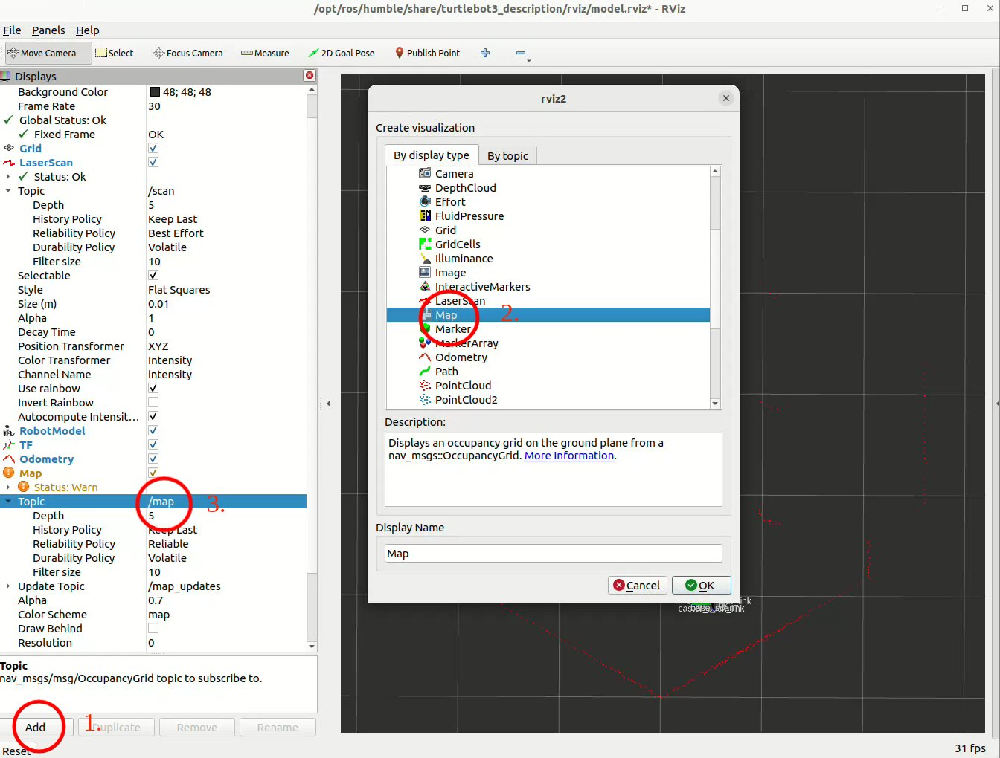
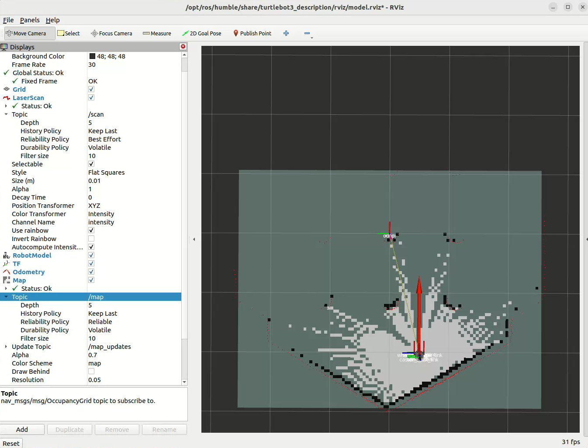
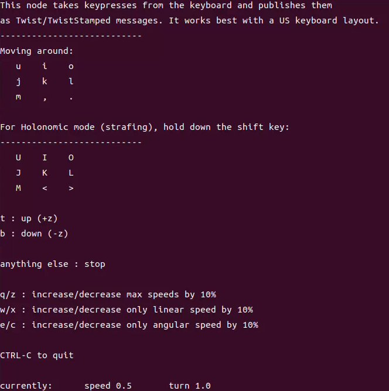
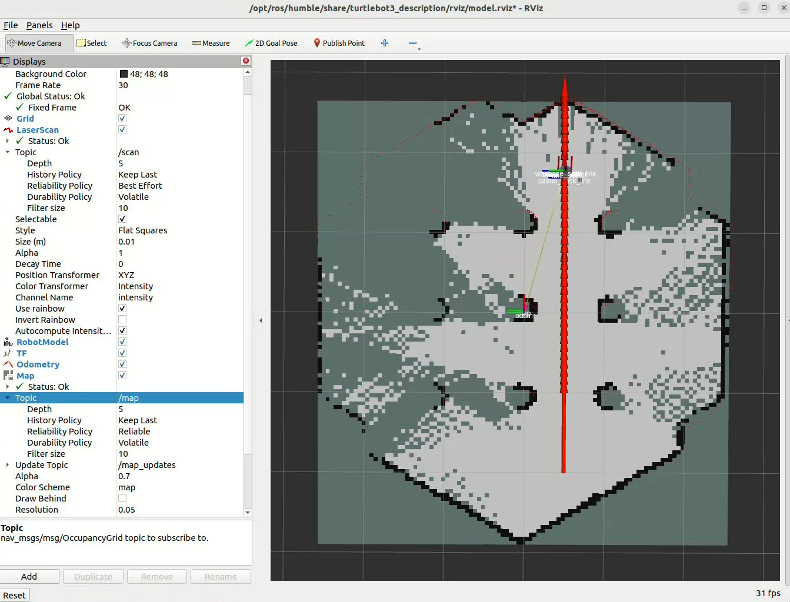
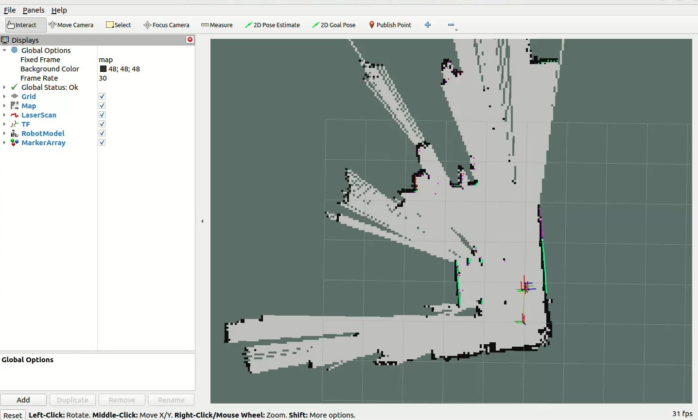

# 5.3.6 SLAM建图

```text
最新版本：2025/09/12
```

## 简介
SLAM（Simultaneous Localization and Mapping）即同时定位与建图，通过传感器数据对环境进行实时建模并构建地图，同时估计机器人的位置和姿态，为机器人导航提供感知信息。

本示例演示在仿真环境与实车运行两种场景下实现 SLAM 建图。

## 仿真建图
本小节基于仿真机器人小车模型，使用 SLAM 算法进行建图，并通过 Gazebo 与 rviz 观察机器人小车运行与建图效果。

其中 SLAM 算法运行在 SpacemiT RISC-V 系列板子上，仿真机器人小车模型、Gazebo仿真环境、rviz 可视化运行在与板子同一网段的PC上。

SpacemiT 板子上已配置了 slam_gmapping、slam_toolbox、cartographer 三种 SLAM 算法的一键启动流程，可任选其一实现建图功能。

三种SLAM算法的对比：

| 对比项 | slam_gmapping | slam_toolbox | cartographer |
|--------------|---------------|--------------|--------------|
| 建图精度      | 中             | 高           | 高           |
| 图优化/回环检测| 无             | 有           | 有           |
| 重定位支持    | 无             | 有           | 有           |
| 资源占用      | 低             | 中等         | 高           |
| 适用地图范围   | 小            | 中等          | 大           |
| 适用机器人类型 | 小型           | 中/大型       | 中/大型       |
| 累计误差      | 高             | 低           | 低           |

### 准备工作
1. SpacemiT 板子烧录 ROS2_LXQT 系统镜像 。
2. PC 端安装 ros-humble 及 RDK。

### 使用介绍

#### 启动仿真环境

在 PC 端打开终端，输入以下命令安装机器人小车模型与 Gazebo 仿真环境。

```shell
sudo apt install ros-humble-gazebo*
sudo apt install ros-humble-turtlebot3
sudo apt install ros-humble-turtlebot3-gazebo
sudo apt install ros-humble-turtlebot3-bringup
sudo apt install ros-humble-turtlebot3-simulations
```

安装完毕后，输入以下命令加载机器人模型，并启动 Gazebo 仿真环境。

```shell
source /opt/ros/humble/setup.bash
source /usr/share/gazebo/setup.sh
export TURTLEBOT3_MODEL=burger
ros2 launch turtlebot3_gazebo turtlebot3_world.launch.py
```

成功启动后，仿真环境如下图所示：


PC 端打开另一个终端，输入以下命令启动 rviz 可视化运行。

```shell
source /opt/ros/humble/setup.bash
ros2 launch turtlebot3_bringup rviz2.launch.py
rviz2
```

按照下图所示顺序，依次点击add、选择map、修改话题格式为/map：



机器人仿真环境启动完毕后，在 SpacemiT 板子上根据需求选择任一 SLAM 算法进行建图，三种 SLAM 算法的启动方式如下。

#### slam_gmapping 建图

gmapping 是一种基于粒子滤波（Particle Filter）的 2D SLAM 算法，基于激光雷达数据在未知环境中构建地图，同时估计机器人位姿。

github地址：https://github.com/ros-perception/slam_gmapping

slam_gmapping 算法已预装在 SpacemiT 板子内，直接打开 SpacemiT 板子终端输入以下命令启动 slam_gmapping 建图

```shell
source /opt/bros/humble/setup.bash
ros2 launch rdk_localization slam_gmapping_sim.launch.py
```

#### slam_toolbox 建图

slam_toolbox 是一套用于 ROS 2 的 2D 同时定位与建图（SLAM）工具包，适合实时建图、离线优化、闭环检测和持久地图管理。

github地址：https://github.com/SteveMacenski/slam_toolbox

SpacemiT 板子打开终端输入以下命令安装 slam_toolbox 算法

```shell
sudo apt install ros-humble-slam-toolbox
```

输入以下命令启动 slam_toolbox 建图

```shell
source /opt/bros/humble/setup.bash
ros2 launch rdk_localization slam_toolbox_sim.launch.py
```

#### **cartographer建图**

Cartographer 是 Google 开源的一个可跨多个平台和传感器配置，以2D/3D 形式提供实时同时定位和建图的系统。

github地址：https://github.com/cartographer-project/cartographer

SpacemiT 板子打开终端输入以下命令安装 cartographer 算法

```shell
sudo apt install ros-humble-cartographer
sudo apt install ros-humble-cartographer-ros
```

输入以下命令启动 cartographer 建图

```shell
source /opt/bros/humble/setup.bash
ros2 launch rdk_localization slam_cartographer_sim.launch.py
```

#### PC端可视化

使用以上任一算法启动 SLAM 建图，观察 PC 端 rviz 窗口，可以看到已经有了初始地图：



PC 端打开一个新终端，运行键盘控制节点

```shell
sudo apt install ros-humble-teleop-twist-keyboard
source /opt/ros/humble/setup.bash
ros2 run teleop_twist_keyboard teleop_twist_keyboard
```



使用```u i o j k l m , . ```控制小车运动，在 rviz 中可以观察到建图效果：



## 实车建图
本小节基于搭载了 SpacemiT RISC-V 系列板子的实车机器人进行 SLAM 建图，并通过 PC 端 rviz 可视化建图效果。

### 准备工作
1. SpacemiT 板子烧录 ROS2_LXQT 系统镜像 。

2. PC 端安装 ros-humble 及 RDK。

### 使用介绍

按照以下命令，即可一键启动实车机器人模型参数配置文件与相应的 SLAM 建图算法

#### slam_gmapping 建图

```shell
source /opt/bros/humble/setup.bash
ros2 launch rdk_localization slam_gmapping.launch.py
```

#### slam_toolbox 建图

```shell
source /opt/bros/humble/setup.bash
ros2 launch rdk_localization slam_toolbox.launch.py
```

#### cartographer 建图

```shell
source /opt/bros/humble/setup.bash
ros2 launch rdk_localization slam_cartographer.launch.py
```

#### PC 端可视化

使用以上任一算法启动SLAM建图，PC端打开终端，运行键盘控制节点

```shell
sudo apt install ros-humble-teleop-twist-keyboard
source /opt/ros/humble/setup.bash
ros2 run teleop_twist_keyboard teleop_twist_keyboard
```

打开一个新终端，运行以下命令启动rviz，通过键盘节点控制小车运动，即可在rviz中可视化查看建图效果

```shell
source /opt/ros/humble/setup.bash
source ~/ros2_demo_ws/install/setup.bash
ros2 launch rdk_visualization display_slam.launch.py
```



#### 保存地图

建图完成后，SpacemiT 板子打开终端运行以下命令，将构建的环境地图保存至`rdk_navigation/map` 目录下

```shell
sudo apt install ros-humble-nav2-map-server
cd ~/opt/bros/humble/share/rdk_navigation/map
source /opt/bros/humble/setup.bash
ros2 run nav2_map_server map_saver_cli -t map -f spacemit_map1
```

成功运行后，我们可以得到以下两个文件

```shell
.
├── spacemit_map1.pgm
└── spacemit_map1.yaml

0 directories, 2 files

```

其中，`spacemit_map1.pgm` 为地图文件，`spacemit_map1.yaml` 为地图配置文件。

通过 SLAM 我们构建了机器人导航所需的环境地图信息，接下来即可配置 navigation2 进行导航。
