# 5.4 nav2

```text
最新版本：2025/09/12
```

## 简介
Navigation2 项目是适配于 ROS2 的机器人导航框架，力求以安全的方式让移动机器人从 A 点移动到 B 点，集成了机器人导航所需的位姿定位、行为决策、路径规划、避障控制等多个模块。

Github 地址：https://github.com/ros-navigation/navigation2

本示例演示如何在**仿真环境**和**实车**两种场景下运行 Navigation2。

## 仿真导航

本小节基于仿真机器人小车模型，使用 Navigation2 进行建图，并通过 Gazebo 与 rviz 观察机器人小车导航效果。

其中 Navigation2 导航算法运行在 SpacemiT RISC-V 系列板子上，仿真机器人小车模型、Gazebo 仿真环境、rviz 可视化运行在与板子同一网段的 PC 上。

### 准备工作
1. SpacemiT 板子烧录 **ROS2_LXQT 系统镜像**。
2. PC 端安装 **ros-humble** 与 **RDK**。

### 使用介绍

#### 启动仿真环境

在 PC 端打开终端，输入以下命令安装机器人小车模型与 Gazebo 仿真环境。

```shell
sudo apt install ros-humble-gazebo*
sudo apt install ros-humble-turtlebot3
sudo apt install ros-humble-turtlebot3-gazebo
sudo apt install ros-humble-turtlebot3-bringup
sudo apt install ros-humble-turtlebot3-simulations
```

安装完毕后，输入以下命令加载机器人模型，并启动 Gazebo 仿真环境。

```shell
source /opt/ros/humble/setup.bash
source /usr/share/gazebo/setup.sh
export TURTLEBOT3_MODEL=burger
ros2 launch turtlebot3_gazebo turtlebot3_world.launch.py
```

成功启动后，仿真环境如下图所示：

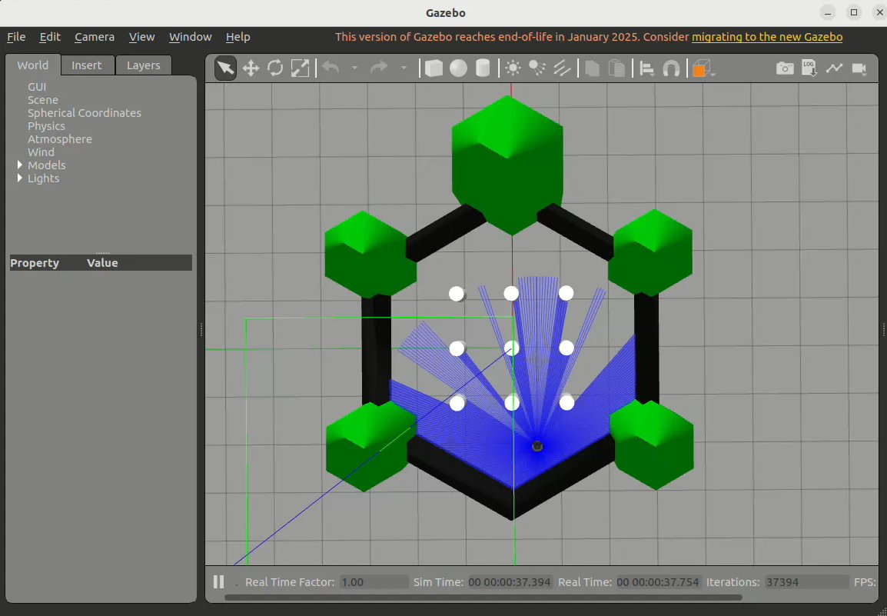

#### **启动navigation2导航**

接下来在 SpacemiT 板子上启动 Navigation2，实现机器人自主导航。

输入以下命令在 SpacemiT 板子上安装 Navigation2

```shell
sudo apt install ros-humble-navigation2
sudo apt install ros-humble-nav2-bringup
```

安装完毕后，在终端输入以下命令启动 Navigation2

```shell
source /opt/bros/humble/setup.bash
ros2 launch nav2_bringup bringup_launch.py use_sim_time:=True map:=/opt/ros/humble/share/nav2_bringup/maps/turtlebot3_world.yaml
```

#### PC端可视化

PC 端打开一个新终端，输入以下命令启动 rviz 可视化运行。

```shell
source /opt/ros/humble/setup.bash
source ~/ros2_demo_ws/install/setup.bash
ros2 launch rdk_visualization display_navigation.launch.py
rviz2
```
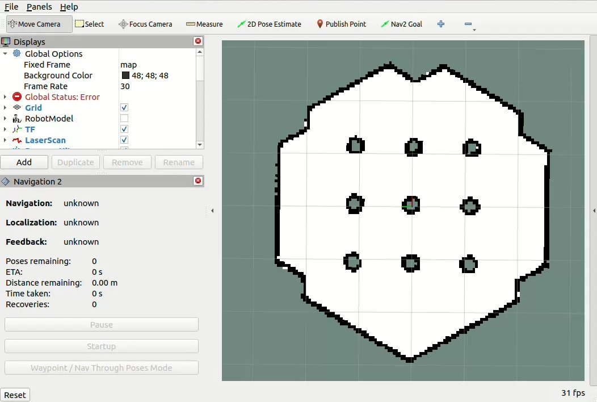

此时我们只能看到一个空旷的环境地图，是因为还没有设置机器人的初始位置。在 rviz2 中点击 **2D Pose Estimate** 设置机器人的初始位置和方向：

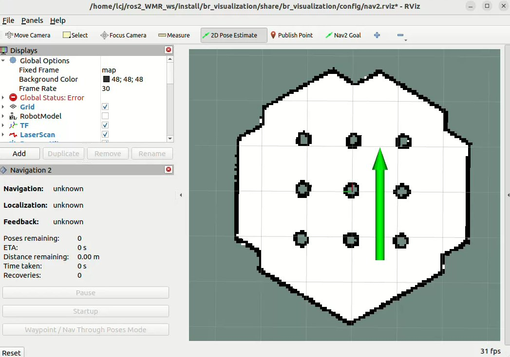

设置完毕后，可以观察到 rviz 加载出了机器人相关坐标系与代价地图信息：

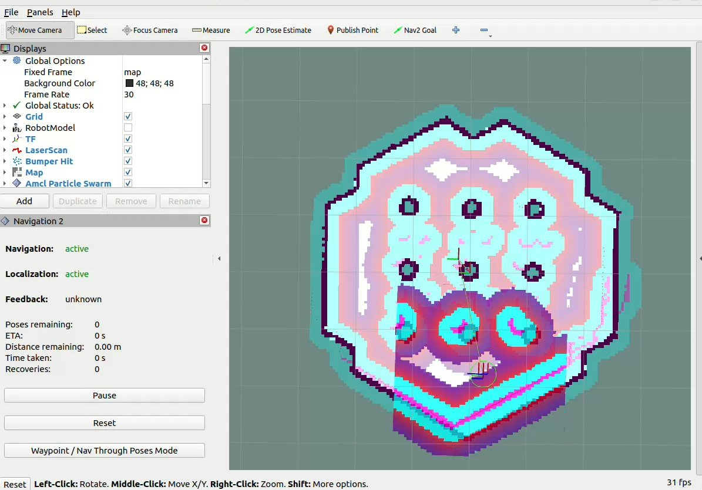

通过rviz设置导航目的地，点击 **2D Nav Goal** 设置目标点：

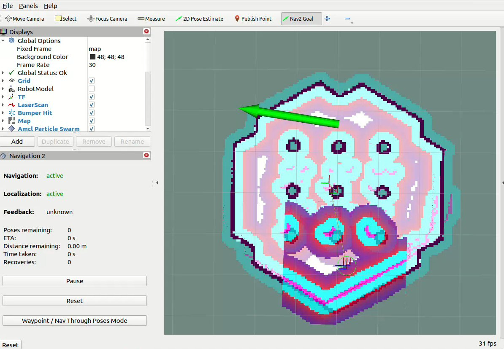

可以观察到机器人小车导航运行状态如下：

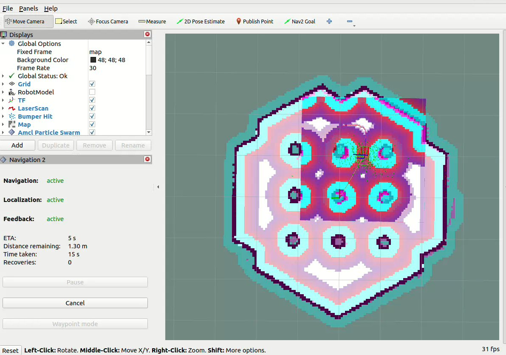

## 实车导航

本小节建立在使用 [SLAM](../5.3-定位导航/5.3.6-SLAM建图.md) 构建并保存好环境地图后，在搭载了 SpacemiT RISC-V 的实际机器人小车上启动并实现 navigation2 自主导航，并通过PC端可视化。

### 准备工作
1. SpaceMiT 板子烧录 **bianbu desktop 24.04** 系统镜像并安装 **RDK**。
2. PC 端安装 **ros-humble** 与 **RDK**。
3. 按照 [SLAM](../5.3-定位导航/5.3.6-SLAM建图.md) 构建并保存好环境地图文件

### 使用介绍

#### 安装 navigation2

```shell
sudo apt install ros-humble-navigation2
sudo apt install ros-humble-nav2-bringup
```

#### 启动 navigation2 导航

按照以下命令，即可一键启动实车机器人模型参数配置文件与 navigation2 导航算法。

```shell
source /opt/bros/humble/setup.bash
ros2 launch rdk_navigation nav2.launch.py
```

#### PC 端可视化

PC 端打开一个新终端，输入以下命令启动 rviz 可视化运行。

```shell
ros2 launch rdk_visualization display_navigation.launch.py
```
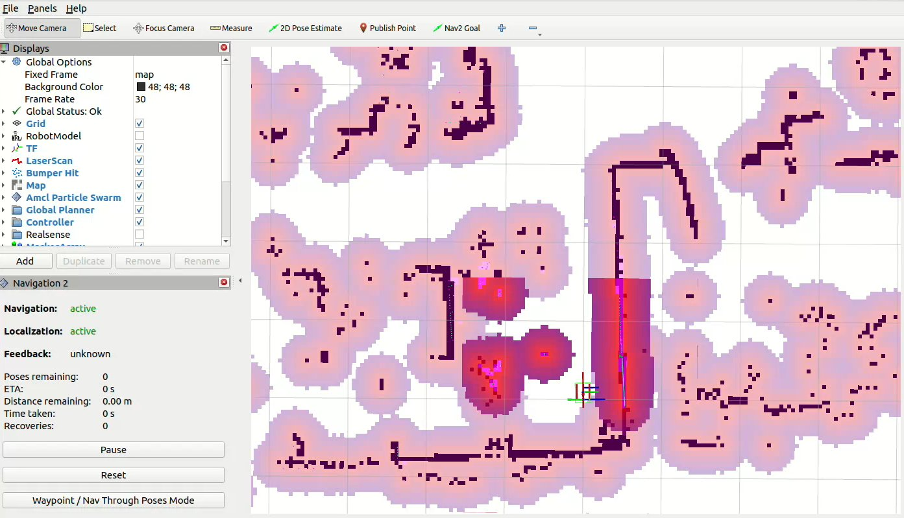

启动文件已配置机器人初始位置为SLAM建图原点，也可以再次点击```2D Pose Estimate```调整机器人位姿

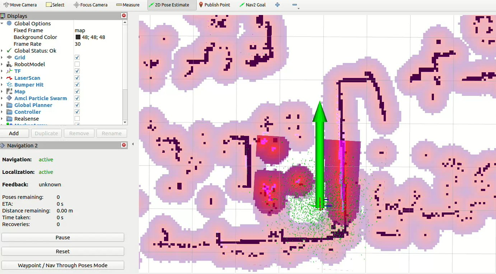

点击```2D Nav Goal```设置导航目标点，可在PC端rviz2中监控导航状态

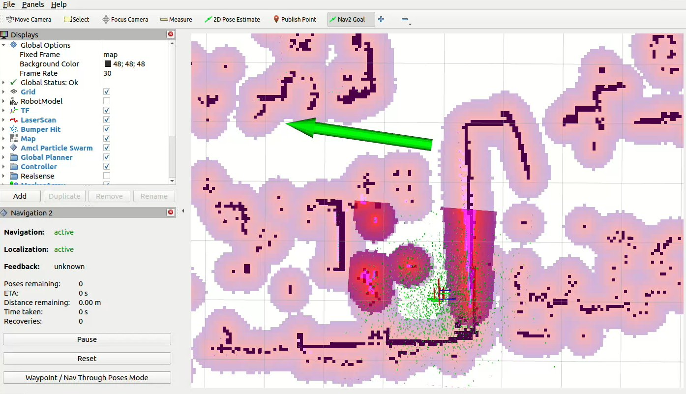

## 同时 slam + navigation2

如果没有事先建立地图，也可以运行以下命令，即可实现在未知地图环境中同时运行 slam + navigation2，在导航过程中自动更新地图。

```shell
ros2 launch rdk_navigation nav2_for_slam.launch.py
```

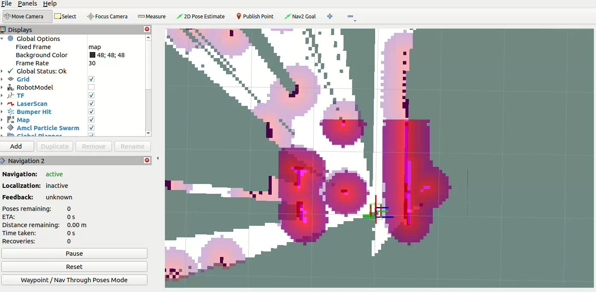

点击 **2D Nav Goal**，即可在未知环境中进行navigation2导航与SLAM建图。

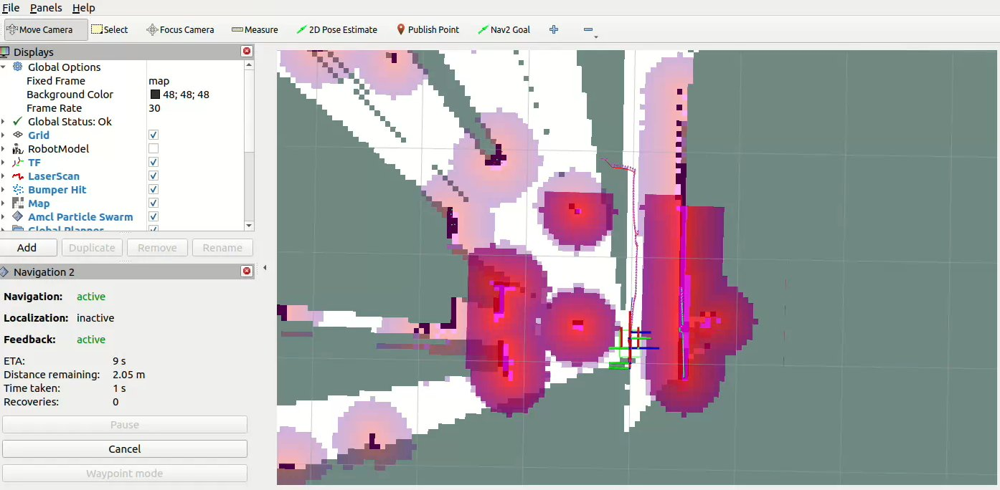
