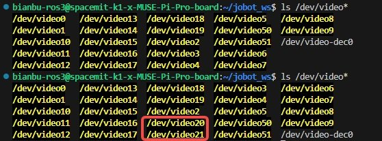
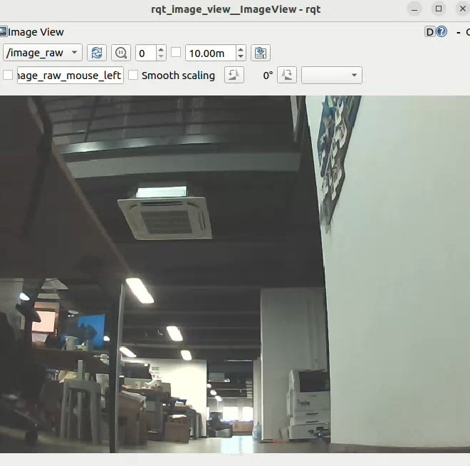
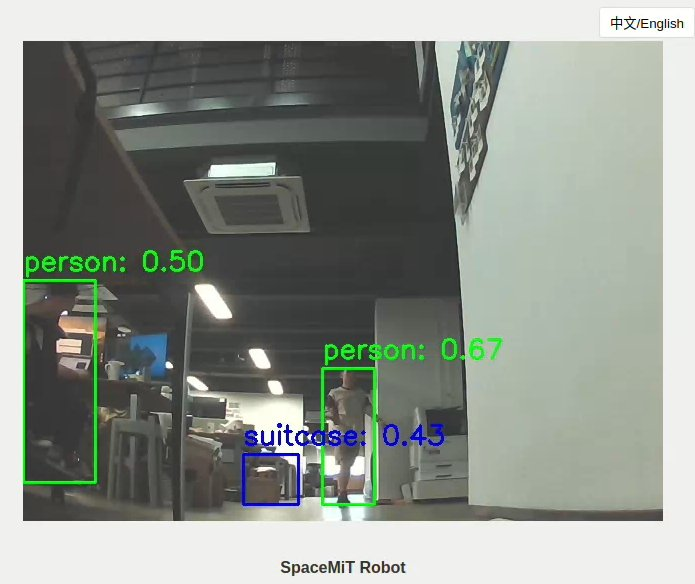
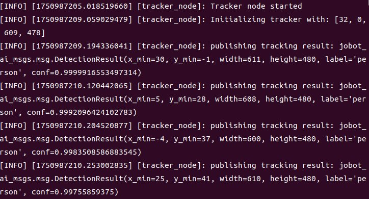
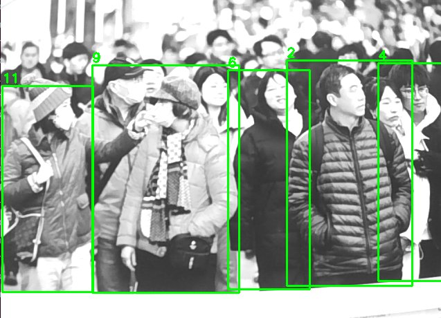
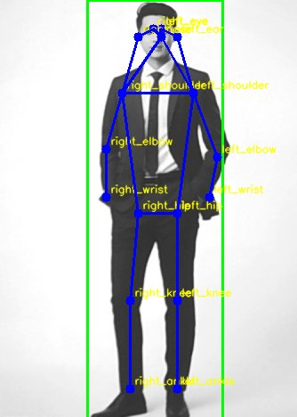
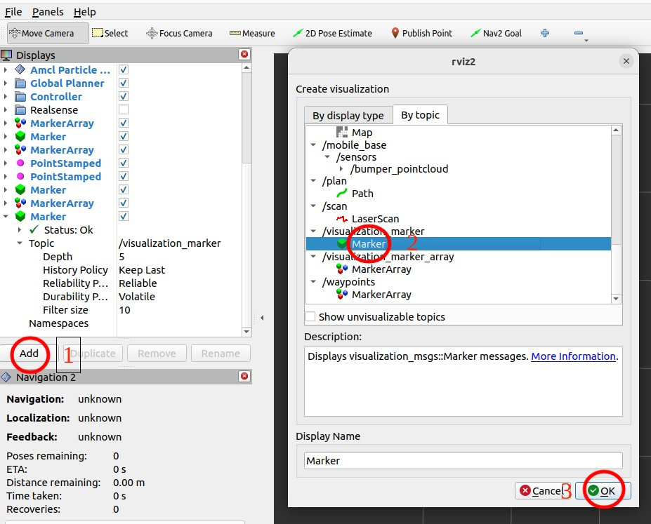
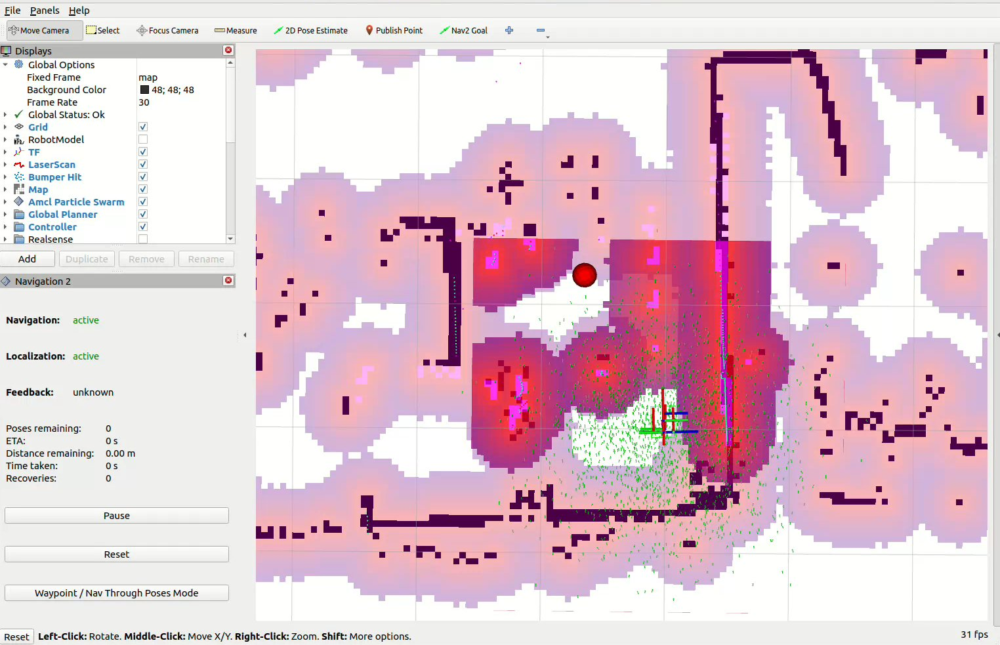
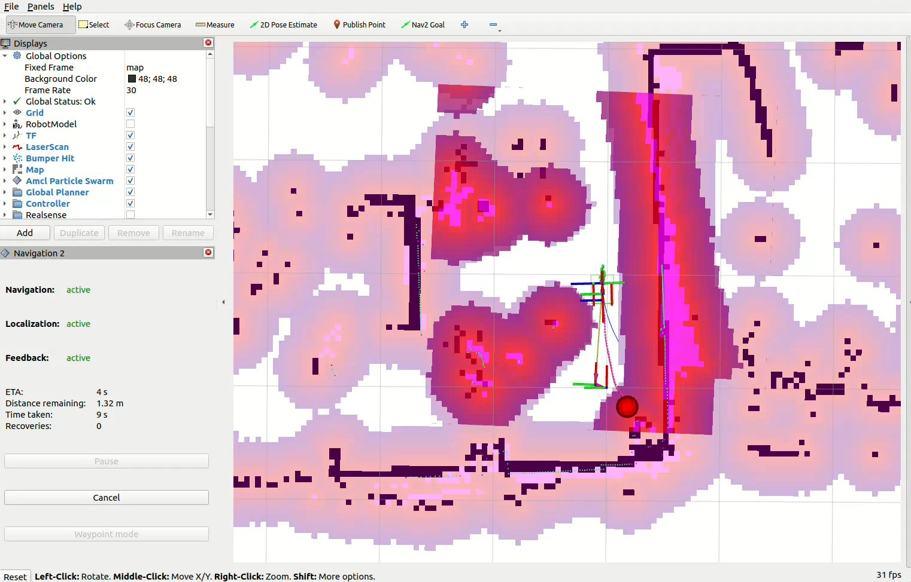

# 5.4.1 动态目标跟随

```text
最新版本：2025/09/12
```

## 简介

本示例演示在搭载了 SpacemiT RISC-V 的实际机器人小车上，通过相机 AI 视觉检测人像并实现 Navigation2 动态跟随。

SpacemiT RISC-V 中提供了**四种方案**实现机器人动态跟随人像目标：

| 对比项 | yolov6 检测跟随 | nanotrack 跟随 | bytetrack 跟随 | yolov8pose 跟随 |
|---------|------------ |--------------|--------------|---------------|
| 目标检测 |    yolov6   |yolov6(仅初始化)|   yolov8    |  yolov8-pose   |
| 人像跟踪 |     /       |  nano-track   | byte-track  |       /        |
| 位置估计 | 人像框解算    | 人像框解算     |  人像框解算   |    关节点解算    |
| 动态跟随 | follow_point| follow_point  | follow_point|  follow_point  |
| 运行负载 |     较低     |     中等      |      较高    |      中等      |
| 运行负载 |     较低     |     中等      |      较高    |      中等      |

## 准备工作

1. SpacemiT 板子烧录 ROS2_LXQT 系统镜像 。

2. PC 端安装 ros-humble、RDK。

## 使用介绍

### 配置 USB 相机传感器

插拔相机 USB 接口，输入以下命令对比查看新增端口号，即为该相机输入端口

```shell
ls /dev/video*
```



### 安装 Navigation2

```shell
sudo apt install ros-humble-navigation2
sudo apt install ros-humble-nav2-bringup
```

### 启动相机检测节点

输入以下命令打开 USB 相机，端口号替换为实际相机输入端口号。

```shell
source /opt/bros/humble/setup.bash
ros2 run jobot_usb_cam jobot_usb_cam_node_exe --ros-args -p video_device:=/dev/video20
```

PC 端打开一个终端，输入以下命令查看相机图像：

```shell
source /opt/ros/humble/setup.bash
ros2 run rqt_image_view rqt_image_view
```



完成以上准备工作后，根据需求选择以下一种方案即可实现动态跟随人像目标。

> 以下操作如未特殊说明在 PC 端运行，均直接在 SpacemiT 板子上启动终端并运行相关命令。

### 目标检测、跟踪与位置解算

下述**四种方案**均可独立实现机器人动态跟随人像目标，可根据需求自行选择。

#### 方案 1：yolov6 检测跟随

该方案通过 yolov6 检测人像目标获取人像框，通过像框像素值与预设参数解算人像目标位置，并使用 navigation2-follow-point 导航行为树实现动态跟随。

**启动视觉推理节点**

运行以下命令启动 yolov6 视觉推理节点，该节点会根据相机获取的图像信息，对人像目标进行持续检测和推理分类。

一个终端

```shell
source /opt/bros/humble/setup.bash
ros2 launch rdk_perception infer_video.launch.py config_path:='config/detection/yolov6.yaml' sub_image_topic:='/image_raw' publish_result_img:='true' result_topic:='/inference_result'
```

另一个终端

```shell
source /opt/bros/humble/setup.bash
ros2 launch rdk_visualization websocket_cpp.launch.py image_topic:='/result_img'
```

终端打印如下

```text
[INFO] [launch]: Default logging verbosity is set to INFO
[INFO] [websocket_cpp_node-1]: process started with pid [276081]
[websocket_cpp_node-1] Please visit in your browser: 10.0.90.219:8080
[websocket_cpp_node-1] [INFO] [1745548855.705411901] [websocket_cpp_node]: WebSocket Stream Node has started.
[websocket_cpp_node-1] [INFO] [1745548855.706897013] [websocket_cpp_node]: Server running on http://0.0.0.0:8080
[websocket_cpp_node-1] [INFO] [1745548856.281858684] [websocket_cpp_node]: WebSocket client connected.
```

查看 websocket_cpp 终端的 "Please visit in your browser:"，PC 端打开浏览器访问 `10.0.90.219:8080`（不同的 IP 这个会变） 即可看到推理结果。


还可以通过追加 port:=xxxx 参数来指定端口号，以避免端口冲突



**启动更新动态目标位置节点**

打开一个新终端，运行以下命令启动更新动态跟随目标节点。

该节点会根据 AI 视觉检测模块获取的人像目标像素框，解算目标位置并更新机器人的导航目标点，同时可以在 rviz2 中可视化跟随目标。

```shell
source /opt/bros/humble/setup.bash
ros2 launch nav_goal_send goal_update_follow_point.launch.py
```

相机安装于小车的前部，并根据实际情况调整合适的仰角大小，要注意过小的仰角设置不利于 yolo 模型的人像检测。

打开参数配置文件 `/opt/bros/humble/share/nav_goal_send/config/params_follow_point.yaml`，查看参数如下：

```yaml
pixel_w: 640    # 像素宽度
pixel_h: 480    # 像素高度
person_h: 1.7   # 人像身高
distance: 0.8   # 标定距离
width: 0.6      # 标定宽度
theta_h: 0.35   # 仰角高度
theta_d: 0.76   # 仰角距离
```

**标定参数解释**

- 标定距离 `distance`:人像头顶与相机视野上侧重合时,人距离小车正前方x轴的距离
- 标定宽度 `width`: 在 `x=distance` 时, 人朝小车y轴方向移动到人像与相机视野侧边重合, 此时y轴方向的偏移宽度
- 仰角高度 `theta_h`: 用于标定相机下视场线仰角的参照物高度
- 仰角距离 `theta_d`: 将参照物在小车 x 轴方向移动, 当相机视野下侧开始出现参照物时的距离

对于不同的相机安装位置和跟随目标，可以根据实际测量结果，通过修改上述参数配置文件来实现位置估计解算。

**启动navigation2动态目标跟随**

运行以下命令，即可启动 follow_point 模式 navigation2 导航，该导航模式会持续跟随相机检测到的目标位置。

```shell
source /opt/bros/humble/setup.bash
ros2 launch rdk_navigation nav2_follow_point.launch.py
```

可以通过修改 `/opt/bros/humble/share/rdk_navigation/config/behavior_trees/follow_point.xml` 行为树的参数`distance` 调整跟随距离，默认值为 **0.5m**，即机器人跟随目标中心位置的最近距离。

```xml
<Sequence>
    <GoalUpdater input_goal="{goal}" output_goal="{updated_goal}">
    <RetryUntilSuccessful num_attempts="3" >
        <ComputePathToPose goal="{updated_goal}" path="{path}" planner_id="GridBased"/>
    </RetryUntilSuccessful>
    </GoalUpdater>
    <TruncatePath distance="0.5" input_path="{path}" output_path="{truncated_path}"/>
</Sequence>
```

#### 方案 2：nanotrack 跟随

第二种跟随方案通过 yolo 模型检测到所需跟踪的人像后，发送给 nanotrack 模块进行初始化，之后进行人像跟踪并发布跟踪结果，通过人像框像素值与预设参数解算人像目标位置，并使用 navigation2-follow-point 导航行为树实现动态跟随。

**视觉追踪节点初始化**

nanotrack 模型需要通过 yolo 检测的人像框进行初始化，同时只需要初始化一次，之后跟踪模块会自动跟踪该人像。

相机节点 jobot_usb_cam 启动后，首先运行以下命令启动 yolo 检测推理，获取初始化人像框信息：

```shell
source /opt/bros/humble/setup.bash
ros2 launch rdk_perception infer_video.launch.py config_path:='config/detection/yolov6.yaml' sub_image_topic:='/image_raw' publish_result_img:='true' result_topic:='/inference_result_for_nanotrack'
```

之后运行以下命令启动 nanotrack 视觉追踪节点：

```shell
source /opt/bros/humble/setup.bash
ros2 launch nanotrack_ros2 nanotrack.launch.py det_topic:='/inference_result_for_nanotrack' result_topic:='/inference_result'
```

yolo 推理节点检测到可靠的人像信息后，会自动初始化 nanotrack 模块，当 nanotrack 节点窗口出现以下连续信息打印时，即表示模块初始化成功。



nanotrack 模块初始化后，即可关闭 yolov6 检测推理，在终端内使用 **Ctrl+C** 关闭该节点。

> **注意：** nanotrack 为单目标跟踪模型，初始化后需要保证相机视野中有人像不丢失，否则可能会出现跟踪失败。

**启动更新动态目标位置节点**

打开一个新终端，运行以下命令启动更新动态跟随目标节点。

该节点会根据AI视觉检测模块获取的人像目标像素框，解算目标位置并更新机器人的导航目标点，同时可以在 rviz2 中可视化跟随目标。

```shell
source /opt/bros/humble/setup.bash
ros2 launch nav_goal_send goal_update_follow_point.launch.py
```

> 参考 [yolov6 检测](#方案-1yolov6-检测跟随) 小节中的说明来调整跟随目标位置估计解算的参数配置，这里不再赘述。

**启动navigation2动态目标跟随**

运行以下命令，即可启动 follow_point 模式 navigation2 导航，该导航模式会持续跟随相机检测到的目标位置。

```shell
source /opt/bros/humble/setup.bash
ros2 launch rdk_navigation nav2_follow_point.launch.py
```

> 参考[yolov6 检测](#方案-1yolov6-检测跟随) 小节中的说明来调整跟随距离参数配置，这里不再赘述。

#### 方案 3：bytetrack 跟随

第三种方案为 bytetrack 跟踪，该方案在实现目标跟踪时需连续运行 yolo 人像推理检测模型，同时可以实现多目标跟踪。

**启动yolov8检测+bytetrack跟踪节点**

安装 bytetrack 检测所需的依赖

```shell
sudo apt install python3-scipy
sudo apt install python3-pip
sudo apt install python3-venv
```

创建一个虚拟环境，安装三方 python 包依赖

```shell
python3 -m venv ~/myenv
source ~/myenv/bin/activate
pip3 install lap cython_bbox
pip3 uninstall numpy
pip3 install numpy==1.26.4
```

配置环境变量

```shell
source /opt/bros/humble/setup.bash
export PYTHONPATH=~/myenv/lib/python3.12/site-packages:$PYTHONPATH
```

完成上述步骤并启动相机节点 jobot_usb_cam 后，在终端输入以下命令，即可一键启动 yolov8n 检测节点 + bytetrack 跟踪节点。

```shell
ros2 launch bytetrack_ros2 bytetrack.launch.py result_topic:='/inference_result'
```

bytetrack 方案会同时检测并跟踪多个目标，每个目标都有自己的id识别信息。



> **注意：** 当人像信息在相机视野内丢失，再次出现时id会发生变化。

**启动更新动态目标位置节点**

打开一个新终端，运行以下命令启动更新动态跟随目标节点。

该节点会根据AI视觉检测模块获取的人像目标像素框，解算目标位置并更新机器人的导航目标点，同时可以在rviz2中可视化跟随目标。

```shell
source /opt/bros/humble/setup.bash
ros2 launch nav_goal_send goal_update_follow_point.launch.py
```

> 参考[yolov6检测](#方案-1yolov6-检测跟随)中的说明来调整跟随目标位置估计解算的参数配置，这里不再赘述。

**启动 navigation2 动态目标跟随**

运行以下命令，即可启动 follow_point 模式 navigation2 导航，该导航模式会持续跟随相机检测到的目标位置。

```shell
source /opt/bros/humble/setup.bash
ros2 launch rdk_navigation nav2_follow_point.launch.py
```

> 参考[yolov6 检测](#方案-1yolov6-检测跟随) 小节中的说明来调整跟随距离参数配置，这里不再赘述。

#### 方案 4：yolov8pose 跟随

第四种方案为更加标准化的人像关节点检测+关节点解算+跟随。相较于yolov6的纯人像框位置估计解算，这种方案解算出来的跟随目标位置更加精准。

**相机外参标定**

针对不同的相机仰角安装位置，需要重新标定相机外参。

相机外参标定需要使用棋盘格标定板，内参与标定板尺寸参数需要在 `/opt/bros/humble/share/nav_goal_send/nav_goal_send/track_chessboard.py` 代码中设置。

```python
# 提取相机内参参数
file_dir = get_package_share_directory('nav_goal_send')
yaml_path = os.path.join(file_dir, 'config/mono_params_k1.yaml')
with open(yaml_path, 'r') as f:
    data = yaml.safe_load(f)
K_compact = data['Camera']['K']  # [fx, fy, cx, cy]
D = np.array(data['Camera']['D'])  # distortion

# 棋盘格大小
pattern_size = (8, 6)
square_size = 0.025
```

其中相机内参文件在 `/opt/bros/humble/share/nav_goal_send/config/mono_params_k1.yaml` 中提前标定。

```yaml
Camera:
  K: [603.664482, 603.032498, 323.936504, 210.723506]
  D: [-0.458825, 0.233490, 0.000000, 0.000000]
```

运行 `track_chessboard.py` 文件，即可实现对相机外参(Rcam2car)的标定。

```shell
python3 /opt/bros/humble/share/nav_goal_send/nav_goal_send/track_chessboard.py
```

标定后的结果会自动保存在 yolov8pose 方案的参数配置文件 `/opt/bros/humble/share/nav_goal_send/config/params_pose.yaml` 中。

**启动yolov8pose跟踪节点**

相机启动后，运行以下命令，即可启动yolov8pose跟踪节点。

```shell
source /opt/bros/humble/setup.bash
ros2 launch yolov8pose_ros2 yolov8pose.launch.py result_topic:='/inference_result'
```

yolov8pose 节点会检测人像，并将人像关节信息匹配到对应的关节点上。关节点列表：

```python
    KP_NAMES = [
        "nose", "left_eye", "right_eye", "left_ear", "right_ear",
        "left_shoulder", "right_shoulder", "left_elbow", "right_elbow",
        "left_wrist", "right_wrist", "left_hip", "right_hip",
        "left_knee", "right_knee", "left_ankle", "right_ankle"
    ]
```

在相机的检测结果里，可以观察人像关节点与对应的关节点名称。



**启动跟随目标位置关节点解算节点**

标定好相机外参后，即可启动关节点解算节点计算跟随目标的位置。

该节点会根据 yolov8pose 视觉检测模块获取的人像关节点，解算目标位置并更新机器人的导航目标点，同时可以在 rviz2 中可视化跟随目标。

```shell
source /opt/bros/humble/setup.bash
ros2 launch nav_goal_send goal_update_pose.launch.py
```

打开参数配置文件 `/opt/bros/humble/share/nav_goal_send/config/params_pose.yaml`，对于不同的相机安装位置，需要重新标定相机外参，跟随人像目标的预设参数也可以自行配置。

```yaml
goal_update_pose_node:
  ros__parameters:
    Rcam2car:
    - 0.9983763694763184
    - 0.03929898142814636
    - -0.04123289883136749
    - -0.04364486411213875
    - 0.9929260611534119
    - -0.1104220449924469
    - 0.03660174459218979
    - 0.1120423674583435
    - 0.9930291175842285
    person_h: 0.6 # 人高度(nose-center)
```

**标定参数解释**
- `Rcam2car` 即为标定后的相机外参，每一次调整完相机仰角都需要重新标定。
- `person_h` 为人像关节点参考实际高度，假定人像从 nose 关节点到 center(left_hip 与 right_hip 的中点)关节点的距离为`person_h`。

**启动navigation2动态目标跟随**

运行以下命令，即可启动 follow_point 模式 navigation2 导航，该导航模式会持续跟随相机检测到的目标位置。

```shell
source /opt/bros/humble/setup.bash
ros2 launch rdk_navigation nav2_follow_point.launch.py
```

> 参考[yolov6 检测](#方案-1yolov6-检测跟随) 小节中的说明来调整跟随距离参数配置，这里不再赘述。

### PC端可视化动态跟随效果

通过[AI 检测与跟踪](#方案-1yolov6-检测跟随) 小节中的任意一种方案启动跟随模式后，可以在 PC 端通过 rviz2 实时可视化跟随效果。

PC 端打开新终端，输入以下命名启动 rivz：

```shell
source /opt/ros/humble/setup.bash
source ~/ros2_demo_ws/install/setup.bash
ros2 launch rdk_visualization display_navigation.launch.py
```

按照下图所示顺序，依次点击 **Add**、选择 **By topic** 中 **/visualization_marker** 话题下的 **Marker**



此时在 rivz 界面中即可实时显示检测到的人像信息，红色点即为解算出来的跟随目标位置：



点击 **2D Nav Goal** 设置任意位置导航目标点，即可开启跟随模式 navigation2。目标移动后，机器人会自动连续跟随该目标。


