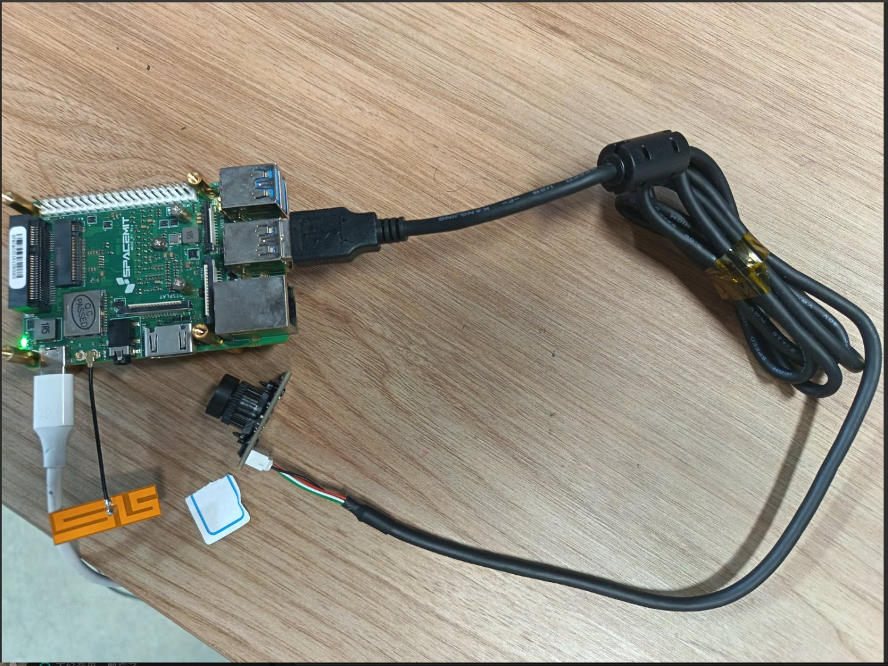

# 5.6.1.1 USB相机节点

## 支持的硬件与协议

- 兼容性：所有遵循 **UVC (USB Video Class)** 且支持 Linux `v4l2` 驱动的 USB2.0 / USB3.0 摄像头均可工作（常见的 YUYV、MJPEG、H264 等格式）。
- 带宽与端口选择：高分辨率（≥720p）或高帧率（≥30fps）强烈建议使用 **USB3.0** 摄像头；使用 **USB2.0** 连接时容易出现丢帧或带宽竞争。
- 电源要求：某些高性能摄像头或自带灯光的模块对 USB 供电敏感，建议主机电源能力充足（例如 5V/3A 以上，视主板与外设总和而定），或使用有源 USB 集线器。
- 驱动与模块：常见内核模块 `uvcvideo`，必要时检查内核版本、固件与内核日志（`dmesg`）以确认驱动加载和带宽协商无误。

## 软硬件环境

请使用 ROS2_LXQT 的系统，硬件建议使用 SpacemiT 的 MUSE Pi Pro

常用测试工具（开发/调试阶段）：

- `lsusb`, `dmesg | grep uvc`, `v4l2-ctl --list-devices`, `v4l2-ctl --list-formats-ext -d /dev/videoX`
- ROS2：`ros2 topic hz`, `rqt_image_view`

## 传感器连接示意



## 查找设备号

1. 输入： `ls /dev/video*`，输出如下：

   

2. 拔掉相机，再次输入 `ls /dev/video*`

   

   可以确认设备号为 `/dev/video20` 和 `/dev/video21` ，对于一般 USB 相机，使用数值较小的设备号即可，本示例中为 `/dev/video20`

**或者使用 v4l2 的工具查看**

1. 终端输入：`v4l2-ctl --list-devices`

   出现如下输出：

   

2. 使用 `v4l2-ctl -d /dev/video20 --all` 查看 `/dev/video20` 的详细信息

   输出带有 Format Video Capture 字段一般是用于视频帧捕获的节点

   

3. 使用 `v4l2-ctl -d /dev/video21 --all` 查看 `/dev/video21` 的详细信息

   

   出现：**UVC Payload Header Metadata 捕获接口** —— 即 **视频元数据捕获接口**，它不用于视频图像帧本身

## 启动文件

`rdk_sensors/usb_cam.launch.py`


## 软件依赖

```Shell
sudo apt install ros-humble-cv-bridge ros-humble-camera-info-manager ros-humble-image-transport \
ros-humble-image-transport-plugins python3-pydantic ffmpeg libopencv-dev
```


## 启动命令

```text
ros2 launch rdk_sensors usb_cam.launch.py video_device:="/dev/video20"
```

这将发布图像原始数据到 `/image_raw` 话题


## 参数详解

|       参数名       |  类型  |   默认值    |          候选值/范围          |             说明             |
| :----------------: | :----: | :---------: | :---------------------------: | :--------------------------: |
|    camera_name     | string | default_cam |          任意字符串           |           相机名称           |
|  camera_info_url   | string |     ""      |          有效的 URL           | 相机内参文件路径（URL 格式） |
|     framerate      | double |    30.0     |      相机支持的其它帧率       |         相机采集帧率         |
|      frame_id      | string | default_cam |          任意字符串           |        相机坐标系 ID         |
|    image_height    |  int   |     480     |            正整数             |       图像高度（像素）       |
|    image_width     |  int   |     640     |            正整数             |       图像宽度（像素）       |
|     io_method      | string |    mmap     |      mmap, read, userptr      |     视频采集的 I/O 方式      |
|    pixel_format    | string |    yuyv     |    mjpeg, yuyv, mjpeg2rgb     |           像素格式           |
|  av_device_format  | string |   YUV422P   | YUV422P, 其他 FFmpeg 支持格式 |       底层 AV 设备格式       |
|    video_device    | string | /dev/video0 |          /dev/videoX          |         视频设备路径         |
|     brightness     |  int   |     50      |    0 ~ 255 或设备支持范围     |             亮度             |
|      contrast      |  int   |     -1      |         -1 或 0 ~ 255         |    对比度（-1 表示默认）     |
|     saturation     |  int   |     -1      |         -1 或 0 ~ 255         |    饱和度（-1 表示默认）     |
|     sharpness      |  int   |     -1      |         -1 或 0 ~ 255         |     锐度（-1 表示默认）      |
|        gain        |  int   |     -1      |       -1 或设备支持范围       |   增益（-1 表示自动/默认）   |
| auto_white_balance |  bool  |    true     |          true, false          |      是否启用自动白平衡      |
|   white_balance    |  int   |    4000     |          2000 ~ 7000          |       白平衡色温（K）        |
|    autoexposure    |  bool  |    true     |          true, false          |       是否启用自动曝光       |
|      exposure      |  int   |     30      |           40 ~ 1000           |           曝光时间           |
|     autofocus      |  bool  |    false    |          true, false          |       是否启用自动对焦       |
|       focus        |  int   |     -1      |       -1 或设备支持范围       | 对焦参数（-1 表示自动/默认） |


## 订阅的消息

无，直接从 **USB** 相机获取数据


## 发布的消息

- pixel_format = yuyv

    话题名：/image_raw

​	`ros2 interface show sensor_msgs/msg/Image`

- pixel_format = mjpeg

    话题名：/image_raw/compressed

​	`ros2 interface show sensor_msgs/msg/CompressedImage`


## 注意事项

1. **丢帧问题**：多因 USB 带宽耗尽、CPU 解码不足、内存不足、或使用了被动集线器引起。排查顺序：`dmesg`、`v4l2-ctl` 流状态、`top`/`htop`、更换到不同的物理 USB 根端口、尝试降低分辨率或改用 MJPG。
2. **自动参数抖动**：当 `auto_exposure` / `auto_gain` 开启时，图像亮度在帧间可能剧烈变化，影响检测与跟踪。生产环境建议关闭并锁定一组参数。
3. **设备节点不稳定**：插拔或顺序变化会导致 `/dev/videoX` 号变化。使用 `udev` 基于序列号或 USB 路径创建持久命名（示例 udev 规则见下）。
4. **权限问题**：容器或系统服务运行用户无 `video` 组权限会无法打开设备。检查并配置 `udev`、用户组与 systemd 服务 User/Group 设置。
5. **热量与物理固定**：长时间高负载摄像头可能过热并触发 AOI / FPS 降级。为摄像头和主板提供良好散热与稳定机械固定以减少震动影响标定。
6. **带宽规划**：多相机系统设计时提前做带宽预算（每台相机的压缩率、分辨率、帧率），并根据主板的 USB 控制器拓扑合理分配端口。
7. **固件与合规更新**：仅使用厂商官方固件进行升级；测试升级对驱动兼容性的影响后再在生产设备上部署。


## udev 持久命名（示例）

> 使用设备的 `serial`、`idVendor` 和 `idProduct` 建立稳定 symlink，例如 `/dev/video-muse-0`。

```text
# /etc/udev/rules.d/80-muse-camera.rules
SUBSYSTEM=="video4linux", ATTRS{idVendor}=="AAAA", ATTRS{idProduct}=="BBBB", \
  ATTRS{serial}=="MUSE123456", SYMLINK+="video-muse-0", MODE="0666", GROUP="video"
```

（用 `lsusb -v` 或 `udevadm info -a -p /sys/class/video4linux/video0` 得到具体属性值并替换 `AAAA/BBBB/MUSE123456`。）


## 常见故障排查

- 无法识别设备：`lsusb`、`dmesg`
- 列表中看不到期望格式：`v4l2-ctl -d /dev/videoX --list-formats-ext`
- ROS 无图像：`ros2 topic list` → 查看 `/image_raw` 是否存在；`ros2 topic echo /image_raw` 或 `ros2 topic hz /image_raw`；用 `rqt_image_view` 可视化。
- 丢帧或冻结：检查 `dmesg`（USB 带宽、错误）、CPU/IO 瓶颈、是否用了被动集线器、尝试降低分辨率/帧率。
- 校准不准确：重复标定并保证棋盘格相对相机的不同角度和距离覆盖良好，记录并固定相机的物理安装位置。
