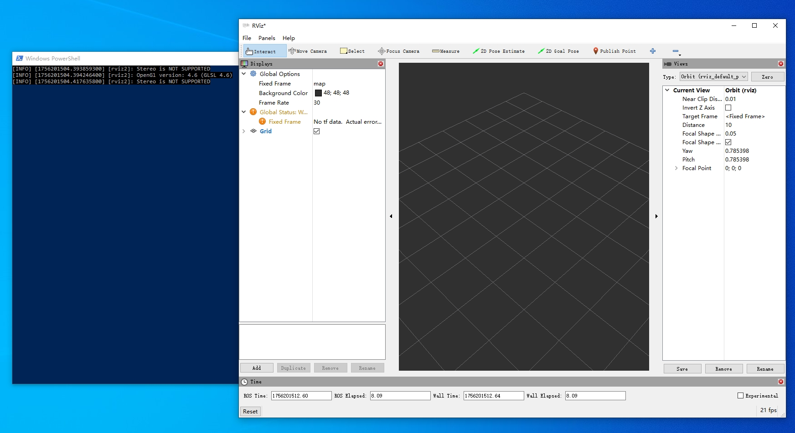

# 5.7.3 Windows-RViz2

## 简介

rivz2 是 ROS 2 官方的三维可视化工具，用于查看机器人模型、传感器数据（点云、激光雷达、相机）、路径规划等。

开源地址：[ros2/rviz2](https://github.com/ros2/rviz)

使用 rviz2 需要先安装 ROS 2，除了直接使用 Linux 系统安装 ROS 2 外，还可以选择在 windows 中安装，主要有以下几种方案：

| 方案         | 特点                           |
|-------------|--------------------------------|
| **虚拟机** | - 类似原生 Linux，兼容性最好<br/> - 开发与实际部署环境统一 |
| **windows原生安装** | - 与 Windows 系统直接集成<br/> - 需管理员权限，环境变量配置较复杂 |
| **WSL2** | - 接近原生 Linux <br/> - 需要管理员权限，与 Windows 文件交互复杂|
| **Pixi** | - 生态较新，需自行适配开发环境<br/> - 无需管理员权限，轻量化|

下面介绍如何使用 pixi 在 windows 10 中安装 ROS 2，并运行 rviz2 可视化程序。

## 安装 Pixi

打开 pixi 的官方release 页面：[pixi](https://github.com/prefix-dev/pixi/releases/tag/v0.53.0)

下载 `pixi-x86_64-pc-windows-msvc.zip` 文件，解压，并将其中的 `pixi.exe` 放到 `C:\Users\用户名\.pixi\bin` 目录下。

## 配置环境变量

右键此电脑 -> 属性 -> 高级系统设置 -> 环境变量 -> 系统变量 -> Path -> 编辑 -> 新建，输入 `C:\Users\用户名\.pixi\bin`，点击确定。

打开 PowerShell，输入 `pixi --version`，验证是否配置成功。

## 安装ROS2

**win+R** 打开运行框，输入 cmd 打开命令行窗口，输入以下命令：

```text
pixi init pixi-ros2 -c https://prefix.dev/conda-forge -c "https://prefix.dev/robostack-humble"
cd pixi-ros2
pixi add ros-humble-desktop
```

安装完成后，输入以下命令启动rviz2可视化程序：

```text
pixi run rviz2
```


