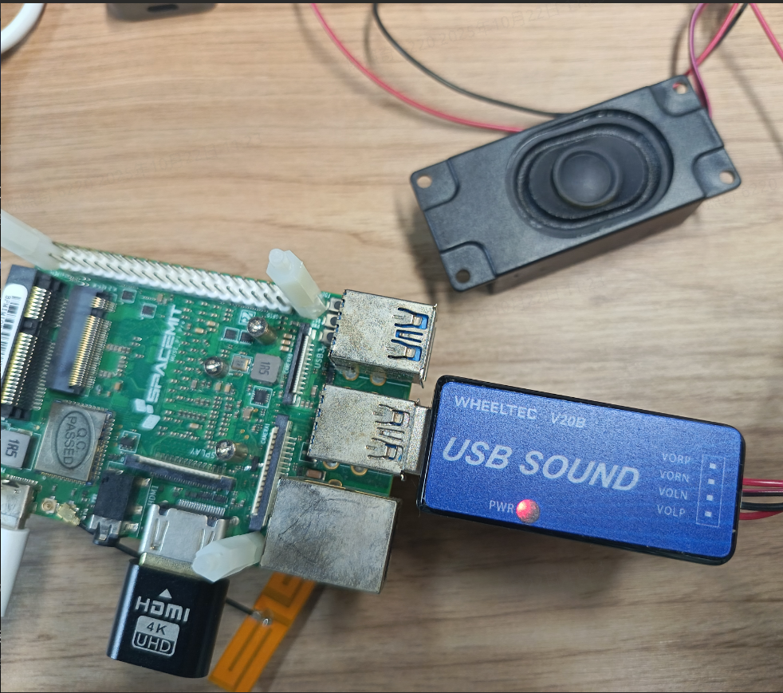
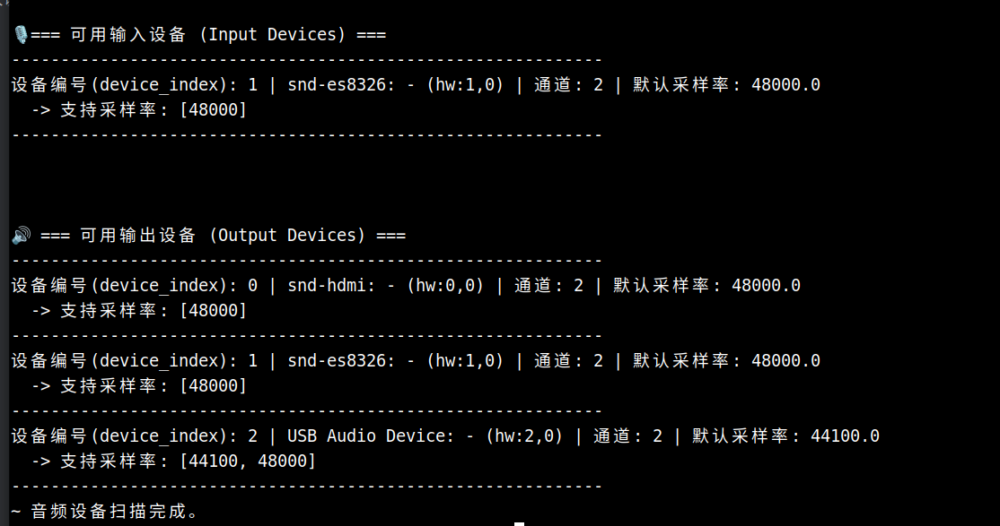
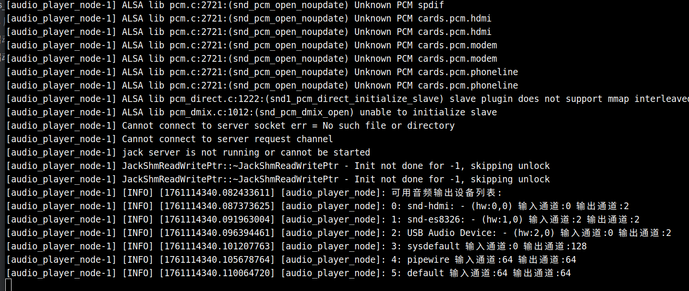

# 5.8.6 ROS2文字转语音

## 功能简介

TTS（Text-To-Speech，文本转语音）是一种将输入的文字自动转换为可听语音的技术。它通过语言学分析、声学建模和语音合成等步骤，将自然语言文本生成流畅、自然的人声输出。TTS 技术在智能语音助手、服务机器人、人机交互、无障碍阅读等场景中具有广泛应用。

本示例使用 SpacemiT 智算核进行 TTS 模型推理，并将计算结果通过 ROS2 消息发布。

## 环境准备

- 建议使用 ROS2_LXQT 操作系统
- 请确保所有终端默认已经执行了 `source /opt/bros/humble/setup.bash`

### 硬件连接



这里使用的是轮趣科技的 USB 声卡 + 扬声器来验证 TTS 生成的音频，也可以使用其他 USB 扬声器设备。

设备选型注意：

- 设备应可在 Linux ALSA/PipeWire 下即插即用，无需额外驱动。
- 需至少支持 44.1 kHz 与 48 kHz 两种采样率，以兼容常见语音模型与音频库（如 PortAudio、PyAudio、librosa 等）。


### 安装系统依赖项

```bash
sudo apt update
sudo apt install -y libopenblas-dev \
	portaudio19-dev libsndfile1-dev libcurl4-openssl-dev libfftw3-dev espeak-ng \
	python3-dev \
	ffmpeg \
	python3-spacemit-ort \
	libcjson-dev \
	libasound2-dev \
	python3-pip \
	python3-venv
```

###

### 查看播放设备信息

```bash
audioscan
```

输出示例：



- 输出设备中 USB Audio Device 为 USB 声卡接口，提供标准双通道（立体声）播放能力，支持 44.1kHz 与 48kHz 两种常用采样率。
- 注意：在更换 USB 接口或重新插拔设备后，请重新运行设备扫描以确认编号是否发生变化。

## TTS 保存到音频文件

### 启动 TTS

运行以下命令启动 TTS 示例，输出的音频保存到 .wav 文件

```bash
ros2 launch rdk_hri tts_to_file.launch.py text:="你好，今天天气怎么样。" save_audio_path:=output.wav
```

文件保存到当前目录的 output.wav

终端输出示例：

```bash
bianbu@bianbu:~$ ros2 launch rdk_hri tts_to_file.launch.py text:="你好，今天天气怎么样。" save_audio_path:=output.wav
[INFO] [launch]: All log files can be found below /home/bianbu/.ros/log/2025-10-22-14-10-58-405826-bianbu-809614
[INFO] [launch]: Default logging verbosity is set to INFO
[INFO] [tts_file_node-1]: process started with pid [809615]
[tts_file_node-1] [INFO] [1761113459.092624901] [tts_file_node]: Initializing TTS model...
[tts_file_node-1] All TTS models for zh are ready!
[tts_file_node-1] Found cppjieba dictionary at: /opt/third_party/cppjieba/dict
[tts_file_node-1] Warming up TTS models...
[tts_file_node-1] TTS models warmed up successfully in 1822ms
[tts_file_node-1] TTS model initialized (sample rate: 22050Hz)
[tts_file_node-1] Generating TTS for text: 你好，今天天气怎么样。
[tts_file_node-1] [INFO] [1761113480.808658349] [tts_file_node]: Generating speech for: "你好，今天天气怎么样。"
[tts_file_node-1] Saving audio to: output.wav
[tts_file_node-1] Successfully saved 59648 samples to output.wav
[tts_file_node-1] [INFO] [1761113482.394660633] [tts_file_node]: Audio saved to output.wav
[INFO] [tts_file_node-1]: process has finished cleanly [pid 809615]
```

##

### tts_to_file.launch.py 参数说明

|      参数名称       |                       说明                        |     候选值      |             默认值             |
| :-----------------: | :-----------------------------------------------: | :-------------: | :----------------------------: |
|       `text`        |             传入的需要转为语音的文字              |     自定义      | `你好，这是一个语音合成测试。` |
|  `save_audio_path`  |            结果音频文件的保存完整路径             |     自定义      |         `/tmp/tts.wav`         |
|     `tts_type`      |                     语言种类                      |   `zh`、`en`    |              `zh`              |
|     `tts_speed`     |   语速，1.0 为正常速度，＞1.0 加快，＜1.0 放慢    |     ＞ 0.0      |             `1.0`              |
|  `tts_speaker_id`   |                  说话人 id 标识                   |   0、1、2 ...   |              `0`               |
|    `target_rms`     |                   目标 RMS 音量                   |  `0.05 ~ 0.2`   |             `0.1`              |
| `compression_ratio` |        动态范围压缩，用来平衡音量高低差异         |   `1.0 ~ 4.0`   |             `3.0`              |
|   `use_peak_norm`   | 是否对整个生成音频做 RMS 归一化，保持整体音量稳定 | `true`、`false` |            `false`             |


## TTS 服务节点

TTS 服务节点可以接受文本请求，将文本转为音频消息后发布，可以配合音频播放节点实现实时转录播放的效果。

### 启动服务节点

```text
ros2 launch rdk_hri tts_service.launch.py
```

终端打印：

```text
bianbu@bianbu:~$ ros2 launch rdk_hri tts_service.launch.py
[INFO] [launch]: All log files can be found below /home/bianbu/.ros/log/2025-10-22-14-23-33-672288-bianbu-809960
[INFO] [launch]: Default logging verbosity is set to INFO
[INFO] [tts_service_node-1]: process started with pid [809961]
[tts_service_node-1] All TTS models for zh are ready!
[tts_service_node-1] Found cppjieba dictionary at: /opt/third_party/cppjieba/dict
[tts_service_node-1] Warming up TTS models...
[tts_service_node-1] TTS models warmed up successfully in 1867ms
[tts_service_node-1] TTS model initialized (sample rate: 22050Hz)
[tts_service_node-1] [INFO] [1761114236.444587109] [tts_service_node]: ✅ TTS service node ready. Waiting for text requests...
```

### 启动播放节点

```text
ros2 launch rdk_hri player.launch.py \
output_device_index:=2 \
sub_topic:=/tts/audio_frame \
target_sample_rate:=48000
```

终端打印部分示例：



### 调用服务

**终端快速调用：**

```text
ros2 service call /tts_service jobot_interfaces/srv/TTSInfer "{text: '你好'}"
```

扬声器有语音输出即为正常。

**python代码调用：**

```python
import rclpy
from rclpy.node import Node
from jobot_interfaces.srv import TTSInfer

class TTSClient(Node):
    def __init__(self):
        super().__init__('tts_client')
        self.cli = self.create_client(TTSInfer, 'tts_service')
        while not self.cli.wait_for_service(timeout_sec=1.0):
            self.get_logger().info('Service not available, waiting...')

    def send_request(self, text):
        req = TTSInfer.Request()
        req.text = text
        future = self.cli.call_async(req)
        rclpy.spin_until_future_complete(self, future)
        return future.result()

def main(args=None):
    rclpy.init(args=args)
    client = TTSClient()
    response = client.send_request('你好')
    print('Response:', response)  # 根据 TTSInfer 的定义，这里可能是 audio path 或字节数据
    client.destroy_node()
    rclpy.shutdown()

if __name__ == '__main__':
    main()

```


### tts_service.launch.py 参数说明

|      参数名称       |                       说明                        |     候选值      |       默认值       |
| :-----------------: | :-----------------------------------------------: | :-------------: | :----------------: |
|     `pub_topic`     |                 发布的音频流话题                  |     自定义      | `/tts/audio_frame` |
|     `tts_type`      |                     语言种类                      |   `zh`、`en`    |        `zh`        |
|     `tts_speed`     |   语速，1.0 为正常速度，＞1.0 加快，＜1.0 放慢    |     ＞ 0.0      |       `1.0`        |
|  `tts_speaker_id`   |                  说话人 id 标识                   |   0、1、2 ...   |        `0`         |
|    `target_rms`     |                   目标 RMS 音量                   |  `0.05 ~ 0.2`   |       `0.1`        |
| `compression_ratio` |        动态范围压缩，用来平衡音量高低差异         |   `1.0 ~ 4.0`   |       `3.0`        |
|   `use_peak_norm`   | 是否对整个生成音频做 RMS 归一化，保持整体音量稳定 | `true`、`false` |      `false`       |
