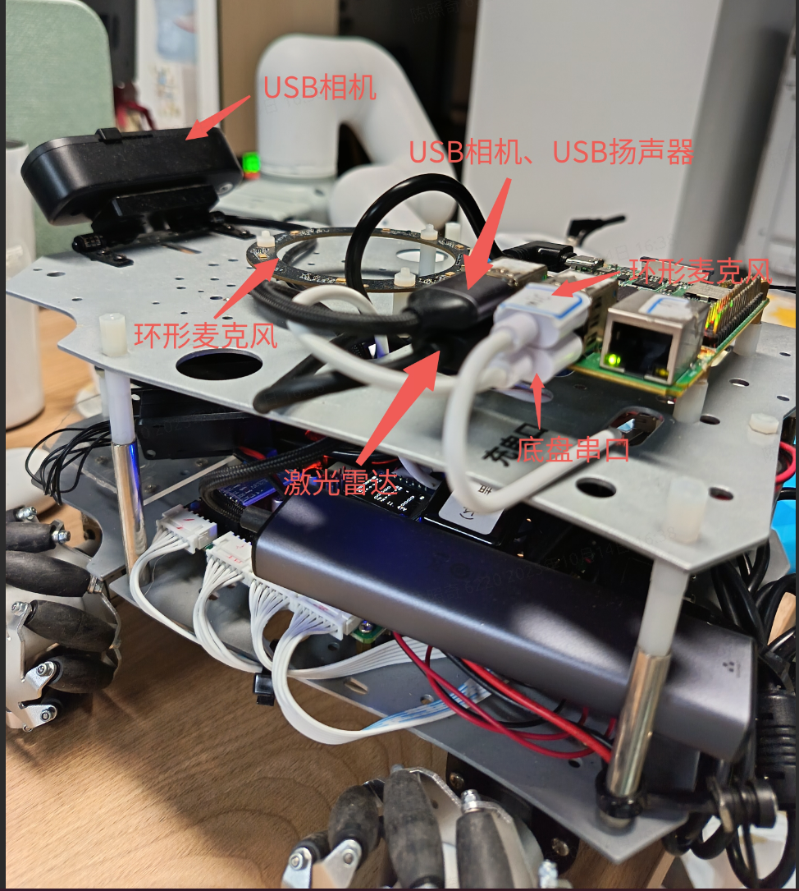
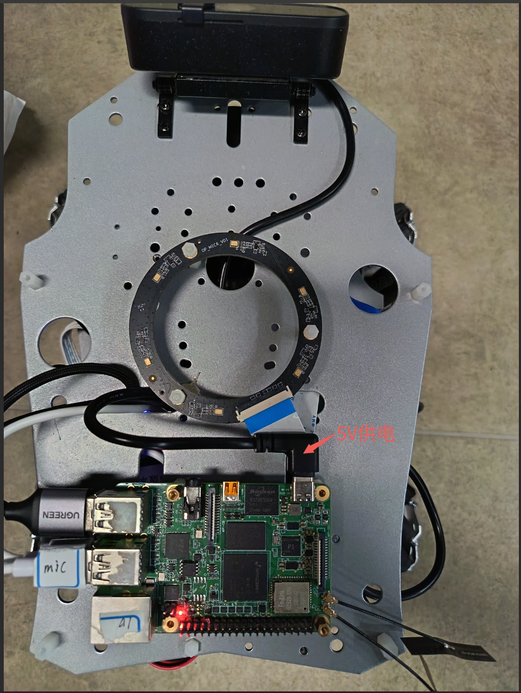
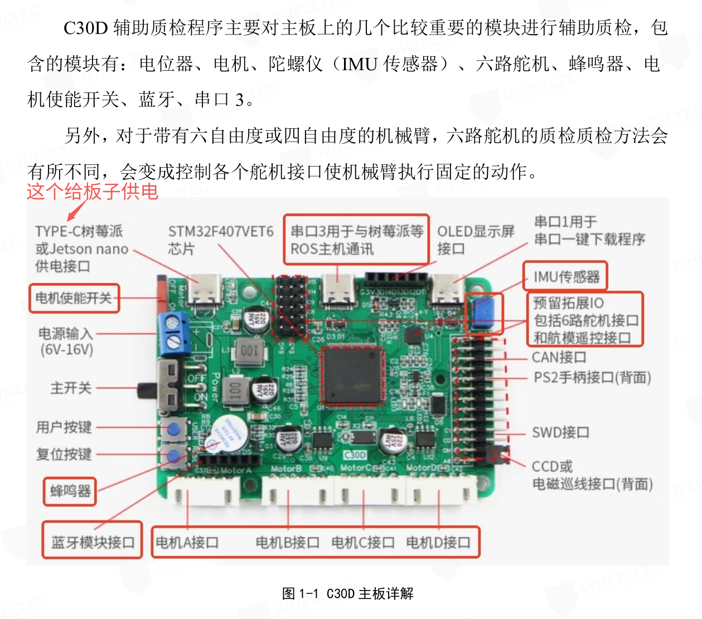
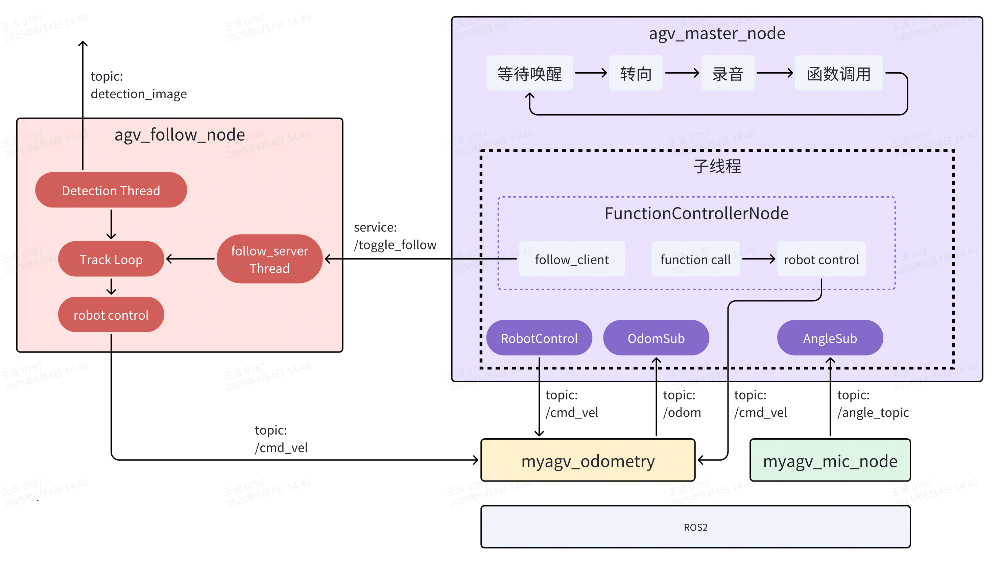

# 5.9.1 小车跟随及语音交互

[点击观看视频](https://archive.spacemit.com/ros2/Video_examples/agv-follow.mp4)

## 案例简介

本案例展示了 K1 平台驱动 AGV 小车完成多模态交互与自主移动的能力。系统通过深度集成 ROS2 框架。采用 Function Call 技术架构，支持用户通过自然语音指令与 AGV 小车进行实时交互，构建了智能化的人机协作系统。该解决方案充分融合了环境感知、运动控制和语音交互等关键技术，展现了家庭服务和工业级 AGV 的智能化应用前景。

## 硬件清单

- 基于 K1 芯片的开发板一块，建议使用 Muse Pi Pro
- 轮趣教育版 ROS2 麦轮小车一辆
- USB 单目相机一个
- 环形麦克风（科大讯飞联名远场麦克风阵列六麦M260C板语音交互模块）
- USB 扬声器一个
- YDLIDAR X3 Pro 激光雷达（选配）


## 硬件连接图



激光雷达在本案例中未使用。

**俯视图**



供电使用底板单片机的5V供电输出，见：




## 案例框架和控制流程



上图展示了 AGV 小车跟随案例在 ROS2 系统中的整体框架与流程控制，主要由以下四个节点组成：

1）`agv_master_node`：主控节点，负责整体流程控制。

- 监听 `/angle_topic` 话题获取是否唤醒和唤醒角度信息；
- 发送 `/cmd_vel` 话题控制小车转向目标角度；
- 调用 `spacemit_audio/record.py` 执行录音，根据录音执行函数调用（由 FunctionControllerNode 节点管理）；
- 根据语音结果决定是否启动跟随（通过服务 `/toggle_follow` 触发）；
- 其它控制指令直接通过 `/cmd_vel` 发布。

2）`agv_follow_node`：视觉跟随节点，实现对目标行人的跟踪控制。

- 视觉线程检测图像中最接近中心的人，发布 `/detection_image` 话题给主线程；
- 主线程根据监测信息计算并发布 `/cmd_vel` 控制速度；
- 服务线程监听 `/toggle_follow` 服务来控制是否启用跟随。

3）`myagv_mic_node`：麦克风节点，进行声源定位和语音唤醒。

- 进行声源检测，发布 `/angle_topic`（包含角度 + 是否唤醒）。

4）`myagv_odometry`：底盘节点，提供小车位置（`/odom`）和接受控制（`/cmd_vel`）。

- 根据 `/cmd_vel` 控制小车移动；
- 发布 `/odom` 供主控节点判断方向；
- 可替换为真实或仿真底盘控制模块。

## 环境搭建

建议使用 ROS2_LXQT 系统

### 安装系统依赖

```text
sudo apt install ros-dev-tools ros-humble-ros-base \
python3-numpy 'ros-humble-cartographer*' 'ros-humble-nav*' libpcap0.8-dev libuvc-dev \
ros-humble-filters ros-humble-turtlesim ros-humble-camera-info-manager  ros-humble-pcl-ros \
ros-humble-image-common ros-humble-image-geometry ros-humble-robot-localization \
ros-humble-joint-state-publisher \
ros-humble-tf-transformations \
libopenblas-dev \
portaudio19-dev \
python3-dev python3-venv python3-pip \
ffmpeg \
python3-spacemit-ort \
libcjson-dev \
libasound2-dev \
python3-pyaudio python3-soundfile python3-jieba
```

```text
sudo apt install python3-opencv ros-humble-cv-bridge ros-humble-camera-info-manager \
   ros-humble-image-transport python3-spacemit-ort python3-yaml libyaml-dev python3-numpy
```

### **配置雷达包**

```text
git clone https://github.com/YDLIDAR/YDLidar-SDK.git
cd YDLidar-SDK
mkdir build && cd build
cmake ..
cmake --build . -- -j8
sudo cmake --install .
```


### **构建小车的 ROS 包**

```text
mkdir -p ~/agv_mec_ws/src
cd ~/agv_mec_ws/src
wget https://archive.spacemit.com/ros2/code/agv_ai_pipeline/agv_mec.tar.gz
tar xzvf agv_mec.tar.gz

cd ~/agv_mec_ws/
colcon build
```

### 配置 udev

1）配置udev规则将硬件设备映射到系统设备索引

```text
sudo su
```

小车底盘

```bash
echo  'KERNEL=="ttyACM*", ATTRS{serial}=="0002", ATTRS{idVendor}=="1a86", ATTRS{idProduct}=="55d4", MODE:="0777",SYMLINK+="wheeltec_controller"' >/etc/udev/rules.d/wheeltec_base.rules
```

环形麦克风

```bash
echo  'KERNEL=="ttyACM*", ATTRS{serial}=="0004", ATTRS{idVendor}=="1a86", ATTRS{idProduct}=="55d4", MODE:="0777",SYMLINK+="wheeltec_mic"' >/etc/udev/rules.d/wheeltec_mic.rules
```

雷达

```bash
echo 'KERNEL=="ttyUSB*", ATTRS{idVendor}=="10c4", ATTRS{idProduct}=="ea60", MODE:="0777",SYMLINK+="lidar"' > /etc/udev/rules.d/wheeltec_lidar2.rules
```

```text
exit
```

2）使设置生效

```text
sudo udevadm control --reload-rules
sudo udevadm trigger
```


### 安装 Python 依赖

下载源码

```text
cd ~
wget https://archive.spacemit.com/ros2/code/agv_ai_pipeline/agv-ai-pipeline.tar.gz
tar xzvf agv-ai-pipeline.tar.gz
```

1）配置 pip 源为进迭时空镜像源

```text
pip config set global.index-url https://mirrors.aliyun.com/pypi/simple/
pip config set global.extra-index-url https://git.spacemit.com/api/v4/projects/33/packages/pypi/simple
```

2）创建 Python 虚拟环境

```text
python3 -m venv ~/ai-env
```

3）安装 Python 依赖

```text
source ~/ai-env/bin/activate
pip install pip -U
pip install -r ~/agv-ai-pipeline/spacemit_audio/requirements.txt
```

###

## 启动程序

### 启动底盘

1）获取 ROS 环境

```Bash
source ~/agv_mec_ws/install/setup.bash
```

2）启动底盘控制系统

```Bash
ros2 launch turn_on_wheeltec_robot turn_on_robot_no_lidar.launch.py
```

3）启动语音唤醒服务

```Bash
ros2 run jobot_mic myagv_mic_node
```

### 启动跟随节点

在 SpacemiT RISC-V 板子上启动 人体跟随算法，启动前请确保 USB 相机已经接入。

小车跟随策略是选择距离中心最近的目标，直到跟随到较近的距离后停止，线速度默认 0.1 m/s，角速度默认 0.37 rad/s，可以通过 launch 文件参数配置。

设备号可以如下查看：

```text
➜  ~ ls /dev/video*
/dev/video0  /dev/video10  /dev/video12  /dev/video14  /dev/video16  /dev/video18  /dev/video2   /dev/video21  /dev/video4  /dev/video50  /dev/video6  /dev/video8  /dev/video-dec0
/dev/video1  /dev/video11  /dev/video13  /dev/video15  /dev/video17  /dev/video19  /dev/video20  /dev/video3   /dev/video5  /dev/video51  /dev/video7  /dev/video9
```

反复插拔一下即可确认设备号，程序内默认的设备号是 /dev/video20

**确认导入环境，ROS2_LXQT 默认导入**

```text
# 导入 bros 环境, ros2 环境被随之导入
source /opt/bros/humble/setup.bash
```

**启动相机节点**

```text
ros2 launch rdk_sensors usb_cam.launch.py video_device:="/dev/video20"
```

**启动跟随节点**

```text
ros2 launch rdk_application agv_person_follow.launch.py
```

输出如下：

```text
[INFO] [launch]: All log files can be found below /home/zq-pi/.ros/log/2025-06-12-16-07-34-737169-spacemit-k1-x-MUSE-Pi-board-89537
[INFO] [launch]: Default logging verbosity is set to INFO
[INFO] [agv_follow_node-1]: process started with pid [89544]
[agv_follow_node-1] [INFO] [1749715663.222242636] [agv_follow_node]: AI 跟踪控制服务已启动, 当前状态为暂停
```

**为了适应多任务处理的场景，跟随节点启动了一个可以控制是否跟随的服务。**

你可以在终端快速开启该服务：

```text
source /opt/bros/humble/setup.bash
ros2 service call /toggle_follow std_srvs/srv/SetBool "{data: true}"
```

跟踪节点会打印：

```text
[agv_follow_node-1] [INFO] [1749715842.691932191] [agv_follow_node]: 收到请求: data=True -> AI 跟踪模块已开启
```

关闭服务可以使用：

```text
ros2 service call /toggle_follow std_srvs/srv/SetBool "{data: false}"
```


### 启动 Python 节点

1）获取 ROS 环境

```Bash
source ~/agv_mec_ws/install/setup.bash
```

2）激活 Python 虚拟环境

```text
source ~/ai-env/bin/activate
export PYTHONPATH=~/ai-env/lib/python3.12/site-packages/:$PYTHONPATH
```

3）启动AI pipeline节点

```Bash
cd ~/agv-ai-pipeline
python agv_master_node.py
```

### 交互方式

- 唤醒词：小微小微
  每次唤醒时，小车会先停止当前运动，然后旋转到用户方向，随后开始录音，录音的最大时长 5 秒。

- 提示词：跟我走、停止跟随、原地旋转、向前走、向后走、向前走两步、向后走两步、向左转、向右转
