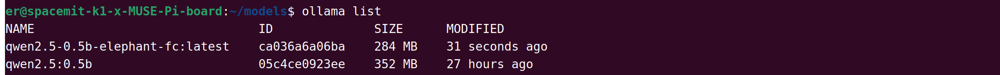

# 5.9.2 机械臂智慧零售

[点击观看视频](https://archive.spacemit.com/ros2/Video_examples/smart-retail.mp4)

## 案例简介

该 Demo 展示了 K1 平台驱动大象机械臂在智慧零售中的应用，集成了 Function Call 大模型、YOLOv8 目标检测和 OCR 文字识别技术。机械臂通过目标检测精确识别商品，利用 OCR 完成扫码结算，提供高效、智能的购物体验。系统支持语音交互，显著提升了购物的自动化和便捷性，展示了未来零售业的智能化发展方向。

## 硬件清单

- 基于 K1 芯片的开发板一块（配套电源）
- 大象 myCobot 280 系列机械臂一台（配套法兰摄像头、吸泵）
- 大象 Aikits 人工智能套件一套
- USB 麦克风一个
- USB 声卡或者扬声器一个

## 模块清单

本案例包含以下核心模块：

- **智能商品识别模块**
  融合语音交互与计算机视觉技术，通过 Function Call 大模型精准解析用户"帮我拿一个橘子"等语音指令，并驱动 Yolov8 实时检测算法在摄像头画面中锁定目标商品。系统可同时识别多个商品的类别及其二维图像坐标。
- **机械臂运动控制模块**
  负责机械臂的关节控制、角度控制、吸泵控制。将 Yolov8 检测的二维图像坐标转换为三维机械臂关节角度。
- **商品扫码模块**
  通过法兰摄像头通过扫描商品二维码来获取目标商品价格。
- **付钱结算模块**
  采用 Paddle OCR 引擎识别支付券。

## 环境搭建

### 下载代码

```text
git clone https://github.com/elephantrobotics/jobot-ai-elephant.git ~/
```

### 安装系统依赖

```text
sudo apt update
sudo apt install -y \
    spacemit-ollama-toolkit \
    portaudio19-dev \
    python3-dev \
    libopenblas-dev \
    ffmpeg \
    python3-venv \
    python3-spacemit-ort \
    libceres-dev \
    libopencv-dev
```

### 安装Python依赖

1）创建 Python 虚拟环境

```text
virtualenv ~/asr-env
```

2）配置 pip 源为进迭时空镜像源

```text
pip config set global.extra-index-url https://git.spacemit.com/api/v4/projects/33/packages/pypi/simple
```

3）安装项目依赖

```text
cd ~/jobot-ai-elephant
source ~/asr-env/bin/activate
pip install -r requirements.txt
```

### 下载大模型并部署到Ollama

1）创建并进入模型存储目录

```text
mkdir -p ~/models && cd ~/models
```

2）下载模型和配置文件

```text
# Download the Qwen2.5 0.5B model
wget -c https://archive.spacemit.com/spacemit-ai/gguf/Qwen2.5-0.5B-Instruct-Q4_0.gguf --no-check-certificate
wget -c https://archive.spacemit.com/spacemit-ai/modelfile/qwen2.5:0.5b.modelfile --no-check-certificate

# Download the Qwen2.5 0.5B-FC model
wget -c https://archive.spacemit.com/spacemit-ai/gguf/qwen2.5-0.5b-f16-elephant-fc-Q4_0.gguf --no-check-certificate
wget -c https://archive.spacemit.com/spacemit-ai/modelfile/qwen2.5-0.5b-elephant-fc.modelfile --no-check-certificate
```

3）将模型部署到 Ollama

```text
ollama create qwen2.5:0.5b -f qwen2.5:0.5b.modelfile
ollama create qwen2.5-0.5b-elephant-fc -f qwen2.5-0.5b-elephant-fc.modelfile
```

4）检查模型是否部署成功

部署完成之后，执行 `ollama list` 命令查看服务，如图所示：



5）模型部署完成之后，删掉模型存储目录以节省空间

```text
rm -rf ~/models
```

### 音频权限设置

执行下述命令将当前用户加入 audio 用户组，从而赋予用户访问和管理音频设备的权限：

```text
sudo usermod -aG audio $USER
```

## 音频模块使用指南

### 麦克风设备检测与配置

执行以下命令查看系统识别的麦克风设备列表：
```bash
arecord -l
```

典型输出示例：
```text
**** List of CAPTURE Hardware Devices ****
card 1: Camera [USB Camera], device 0: USB Audio [USB Audio]
    Subdevices: 1/1
    Subdevice #0: subdevice #0
card 2: Camera_1 [USB 2.0 Camera], device 0: USB Audio [USB Audio]
    Subdevices: 1/1
    Subdevice #0: subdevice #0
card 3: Device [USB PnP Sound Device], device 0: USB Audio [USB Audio]
    Subdevices: 1/1
    Subdevice #0: subdevice #0
```

注意识别带有 "Camera" 字段的设备属于摄像头麦克风，不建议选用。上例中应选择 `card3` 作为主麦克风设备。对应地，修改配置文件路径：`~/jobot-ai-pipeline/smart_main_asr.py`

```python
record_device = 3  # 录音设备索引号，需根据实际检测结果修改
rec_audio = RecAudioThreadPipeLine(
    vad_mode=1,
    sld=2,
    max_time=2,
    channels=1,
    rate=48000,
    device_index=record_device
)
```

### 扬声器设备检测与配置

执行以下命令检测可用扬声器设备：
```bash
aplay -l
```

典型输出示例：
```text
card 0: sndes8326 [snd-es8326], device 0: i2s-dai0-ES8326 HiFi ES8326 HiFi-0 []
    Subdevices: 1/1
    Subdevice #0: subdevice #0
card 2: Device [USB Audio Device], device 0: USB Audio [USB Audio]
    Subdevices: 1/1
    Subdevice #0: subdevice #0
```

需要修改以下文件的播放设备参数：

1）`~/jobot-ai-pipeline/smart_main_asr.py`

```python
play_device='plughw:2,0'  # 播放设备设置
```

2）`~/jobot-ai-pipeline/spacemit_audio/play.py`

```python
play_device='plughw:2,0'  # 播放设备设置
```

### 录音参数配置

1）最大录音时长设置

```python
rec_audio.max_time_record = 3  # 设置最大录音时长（单位：秒）
```

2）录音模式说明

- 默认采用非阻塞模式录音
- 如需同步等待录音完成，请使用 `join()方法：
```python
# 开始录音
rec_audio.max_time_record = 3
rec_audio.frame_is_append = True
rec_audio.start_recording()
rec_audio.thread.join()  # 等待录音完成
```

## 启动程序

```bash
cd ~/jobot-ai-elephant
source ~/asr_env/bin/activate
python smart_main_asr.py
```

使用说明：

- 直接按 Enter 键进入录音模式
- 默认录音时长为 3 秒
- 支持模糊指令匹配（如："拿橙子"、"拿苹果"、"结账"等）
- 大语言模型支持的自然语言指令：
  - "给我一个苹果"、"还要一个橙子"等
  - 可识别各类物体名称
