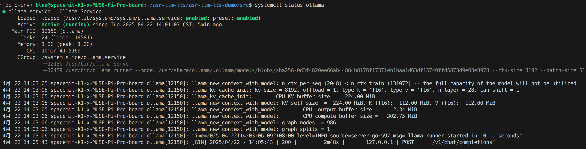

# 5.9.4 AI聊天机器人

[点击观看视频](https://archive.spacemit.com/ros2/Video_examples/ai-chat.mp4)

## 案例简介

本方案实现了一个完全本地化运行的智能语音助手系统，整合了语音识别、自然语言处理和语音合成技术链。所有AI模型均经过 ONNX 格式转换和量化优化，充分利用 K1 芯片的硬件加速能力，在保证交互质量的同时实现快速响应。

## 硬件要求

### 兼容开发板

- Muse Book
- Muse Pi
- Muse Pi Pro
- Banana Pi（K1 版本）

### 系统要求

- 操作系统：Bianbu OS 2.0 或更高版本
- 存储空间：至少 8GB 可用空间
- 推荐内存：4GB 及以上

## 模块清单

本案例包含以下核心模块：

- **语音采集模块**
   通过外接 USB 麦克风采集语音输入。

- **ASR 模块（自动语音识别）**
   本地部署 ASR模型，将语音转换为文本，作为后续处理的输入。

- **LLM 模块（大语言模型）**
   本地部署 Deepseek R1 模型，对输入文本进行推理与理解，并生成输出结果。

- **TTS 模块（语音合成）**
   本地部署语音合成模型，将 LLM 模块生成的文本输出转化为语音。

- **语音播放模块**
   通过外接扬声器播放语音输出，完成语音交互。

## 环境搭建

### 下载代码

下载源码压缩包：[asr-llm-tts.zip](https://archive.spacemit.com/ros2/code/asr-llm-tts.zip)

解压命令：

```bash
unzip asr-llm-tts.zip -d ~/asr-llm-tts
```

### 安装系统依赖

```text
sudo apt update
sudo apt install -y python3-spacemit-ort spacemit-ollama-toolkit virtualenv wget
```

### 安装 Python 依赖

1）创建 Python 虚拟环境

```text
virtualenv ~/demo-env
```

2）配置 pip 源为进迭时空镜像源

```text
pip config set global.extra-index-url https://git.spacemit.com/api/v4/projects/33/packages/pypi/simple
```

3）安装项目依赖

```text
cd ~/asr-llm-tts
source ~/demo-env/bin/activate
pip install -r requirements.txt
```

### 将 LLM 模型部署到 Ollama

**1）确保 Ollama 服务在后台运行**

执行以下命令检查服务状态：

```text
systemctl status ollama
```

输出应该如下所示：



若状态为 `inactive`，则使用以下命令启动服务：

```text
systemctl start ollama
```

**2）下载Deepseek模型及配置文件**

```text
mkdir -p ~/my-ollama
cd ~/my-ollama
wget https://archive.spacemit.com/spacemit-ai/openwebui/deepseek-r1-1.5b.modelfile
wget https://www.modelscope.cn/models/ggml-org/DeepSeek-R1-Distill-Qwen-1.5B-Q4_0-GGUF/resolve/master/deepseek-r1-distill-qwen-1.5b-q4_0.gguf
```

**3）将模型加载至 Ollama**

```text
ollama create deepseek-r1-1.5b -f deepseek-r1-1.5b.modelfile
```

**4）复制 NLTK 数据**

```text
cp -r ~/asr-llm-tts/nltk_data ~/
```

## 启动命令

- 进入项目目录并激活虚拟环境

```text
cd ~/asr-llm-tts/src
source ~/demo-env/bin/activate
```

- 启动语音输出版本

```text
python main_tts.py
```

- 启动文本输出版本

```text
python main.py
```
