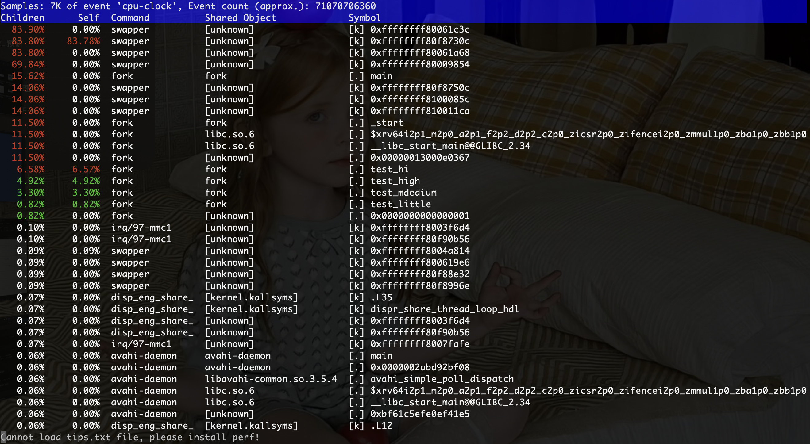
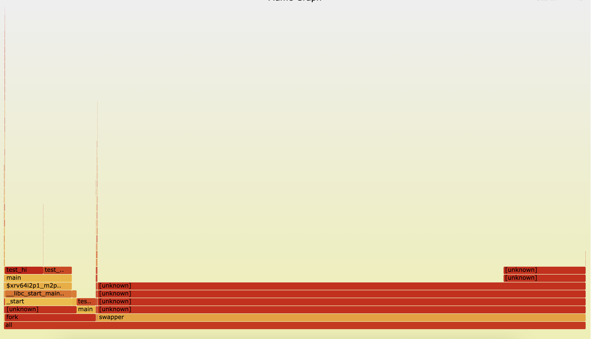

# 6.2 perf-+-FlameGraph-使用教程

```text
最新版本：2025/09/22
```

## 工具简介

### perf

`perf` 是 Linux 内核自带的性能分析工具，能够对系统或应用程序的运行时性能进行采样和分析。其核心功能包括：

- CPU 使用率和函数调用栈采集
- 热点函数识别与性能瓶颈定位
- 系统调用、上下文切换及缓存命中率分析

**官方文档**：[perf wiki](https://perfwiki.github.io/main/)

### FlameGraph

FlameGraph（火焰图）是 Brendan Gregg 提出的一种性能可视化方法，能够直观展示函数调用的 CPU 消耗情况。

**图形特征**：

- **X 轴**：函数占用 CPU 时间比例（宽度越大，消耗越多）
- **Y 轴**：调用栈层级（底部为入口函数，向上为调用链）
- **方块宽度**：表示函数执行时间或 CPU 消耗大小

## 准备工作

### 安装 perf

在大多数 Linux 发行版中，perf 随内核提供。可执行以下命令安装：

```text
sudo apt update
sudo apt install linux-tools-common linux-tools-$(uname -r)
```

验证安装：

```text
perf --version
```

安装完成后，需要调整内核配置以允许 perf 采样：

```text
sudo sh -c 'echo "kernel.perf_event_paranoid=-1" >> /etc/sysctl.conf'
sudo sysctl -p
```

### 安装 FlameGraph

FlameGraph 是 Brendan Gregg 写的一个 Perl 工具包，用来将 perf 采样数据可视化。

```bash
git clone https://github.com/brendangregg/FlameGraph.git
cd FlameGraph
```

里面有几个主要脚本：

- `stackcollapse-perf.pl`：将 perf 的原始栈信息折叠
- `flamegraph.pl`：生成 SVG 火焰图
- `difffolded.pl`：比较两次 profile 的差异火焰图

## perf 数据采集

### 系统级采样

实时监控系统或程序的 CPU 使用情况，并显示函数调用栈

```text
perf top --call-graph fractal
```

> ⚠️ 在 RISC-V 平台，`perf list` 输出的硬件事件可能不完全支持，需要通过 `-e` 指定可用硬件事件。详见 [Bianbu 官方说明](https://bianbu.spacemit.com/development/perf)。

### 单命令性能分析

使用 perf 统计工具运行 `ls -lt` 命令

```text
sudo perf stat ls -lt
```

### 程序级采样

假设目标程序为 `my_program`，采样命令示例：

```text
perf record -F 99 -a -g -e hw-event ./my_program
```

参数解释：

- `-F 99`：采样频率 99Hz（常见选择）
- `-a`：全局采样（不加则只分析当前进程）
- `-g`：收集调用栈
- `-e hw-event`：采样事件，替换为支持的硬件事件
- `./my_program`：后面是要运行的程序

采样完成后会生成 `perf.data` 文件，可使用以下命令查看报告：

```text
sudo perf report --call-graph none
```

#### 示例：Fork 测试程序

创建 `fork.c`，内容如下：

```c++
#include <stdio.h>
#include <unistd.h>
#include <sys/wait.h>

void test_little() { for(int i=0,j;i<30000000;i++) j=i; }
void test_mmedium() { for(int i=0,j;i<60000000;i++) j=i; }
void test_high() { for(int i=0,j;i<90000000;i++) j=i; }
void test_hi() { for(int i=0,j;i<120000000;i++) j=i; }

int main() {
    int pid, result;
    for(int i=0;i<2;i++) {
        result=fork();
        if(result>0)
            printf("i=%d parent=%d current=%d child=%d\n", i, getppid(), getpid(), result);
        else
            printf("i=%d child parent=%d current=%d\n", i, getppid(), getpid());

        if(i==0) { test_little(); sleep(1); }
        else { test_mmedium(); sleep(1); }
    }
    pid=wait(NULL); test_high(); printf("pid=%d wait=%d\n", getpid(), pid);
    sleep(1);
    pid=wait(NULL); test_hi(); printf("pid=%d wait=%d\n", getpid(), pid);
    return 0;
}
```

编译：

```text
gcc fork.c -o fork -g -O0
```

采样：

```text
sudo perf record -F 99 -a -g -e cpu-clock ./fork
```

> `-e cpu-clock` 用于指定采集 CPU 时钟事件，即每当 CPU 时钟滴答时记录一次采样。这是一种 软件事件，适用于大多数平台，包括 RISC-V，不依赖特定硬件性能计数器。

查看报告：

```text
sudo perf report --call-graph none
```

输出如图所示：



### 对已运行进程采样

假设目标进程 PID 为 1234：

```text
sudo perf record -F 99 -g -p 1234
```

采集过程中按 `Ctrl+C` 停止。

## 生成火焰图

### 生成可读的调用栈

```bash
perf script > out.perf
```

### 折叠调用栈

```bash
./FlameGraph/stackcollapse-perf.pl out.perf > out.folded
```

### 生成火焰图

```bash
./FlameGraph/flamegraph.pl out.folded > flame.svg
```

用浏览器打开 `flame.svg` 就能交互式查看。

对于此示例，生成的火焰图如下图所示：



### 火焰图解读

- **X 轴**：函数占用 CPU 的比例（越宽代表越耗时）。
- **Y 轴**：调用栈层级（底部是入口函数，向上是调用链）。
- **每个方块**：一个函数。
- **热点代码**：宽方块表示占用 CPU 时间多，是优化重点。

例如：

- 如果某个函数在底部很宽，说明它本身 CPU 占用高；
- 如果某个函数在上面很宽，说明它被频繁调用（热点路径）。

## 差异火焰图

差异火焰图用于比较优化前后性能。

1. 采集优化前后数据：：

   ```bash
   perf script > before.perf
   perf script > after.perf
   ```

2. 折叠：

   ```bash
   ./FlameGraph/stackcollapse-perf.pl before.perf > before.folded
   ./FlameGraph/stackcollapse-perf.pl after.perf > after.folded
   ```

3. 生成差异火焰图：

  ```bash
   ./FlameGraph/difffolded.pl before.folded after.folded | ./FlameGraph/flamegraph.pl > diff.svg
  ```

红色表示优化后 **更耗时**，蓝色表示 **减少耗时**。

## 常见问题

- **需要符号解析**：安装 `-dbg` 包，否则火焰图只显示地址。

  ```bash
  sudo apt install libc6-dbg
  ```

- **内核态函数没有名字**：需要调试内核符号 `linux-image-$(uname -r)-dbgsym`

- **频率过高影响性能**：建议 `-F 99` 或 `-F 199`，太高会拖慢程序。
