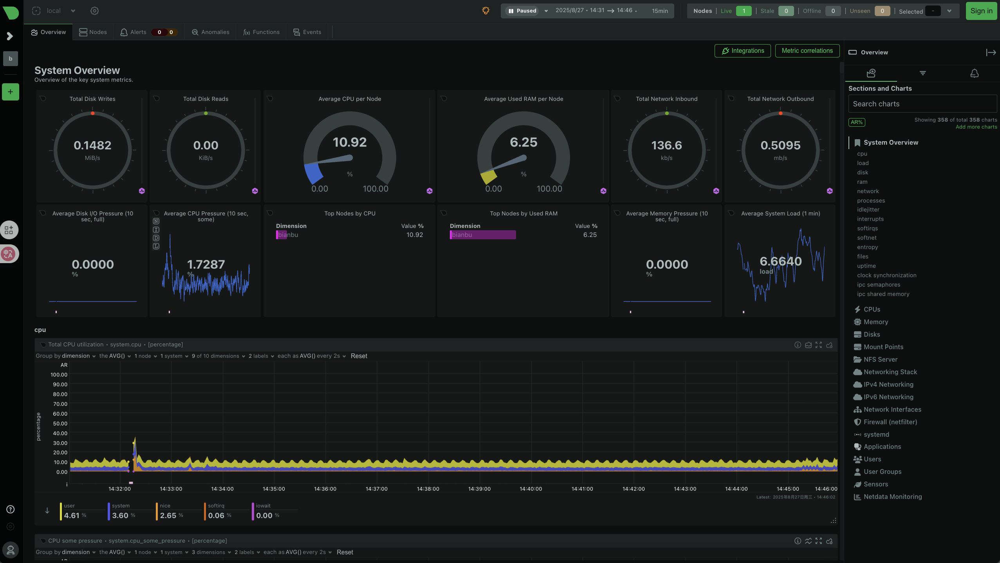

# 6.3 Netdata-使用教程

## 工具概述

Netdata 是一款实时性能监控和可视化工具，支持系统级和应用级指标监控。特点包括：

- **实时监控**：秒级刷新系统和应用指标
- **可视化丰富**：提供 Web 界面、图表和告警
- **轻量级**：低开销，不影响生产系统性能
- **支持多平台**：Linux、BSD、Docker 等

常用场景：

- 系统资源监控（CPU、内存、磁盘、网络）
- 服务性能分析（Web 服务器、数据库等）
- 异常检测和告警

官方文档：[https://learn.netdata.cloud](https://learn.netdata.cloud/)



## 安装 Netdata

```bash
sudo apt update
sudo apt install netdata
```

## 启动与访问

### 启动服务

```bash
sudo systemctl start netdata
sudo systemctl enable netdata
```

### 停止与重启

```bash
sudo systemctl stop netdata
sudo systemctl restart netdata
```

### 访问 Web 界面

#### 本地访问

Netdata 默认监听端口 **19999**，在安装完成后可通过浏览器访问：

```text
http://localhost:19999/
```

Web 界面可以实时查看 CPU、内存、磁盘、网络、进程等各类指标。

#### 局域网访问

如果希望局域网内其他机器访问该服务器的 Netdata，可以修改配置文件：

```text
sudo vim /etc/netdata/netdata.conf
```

找到配置项：

```text
bind socket to IP = 127.0.0.1
```

修改为：

```text
bind socket to IP = 0.0.0.0
```

然后重启服务生效：

```text
sudo systemctl restart netdata
```

浏览器导航到 `http://<服务器IP>:19999/` 进行访问。

## 基本监控指标

Netdata 默认监控以下系统资源：

| 类别 | 指标示例                               |
| ---- | -------------------------------------- |
| CPU  | 使用率、负载、频率、上下文切换         |
| 内存 | 使用量、缓存、交换空间                 |
| 磁盘 | I/O 读写速率、延迟、磁盘队列           |
| 网络 | 带宽、流量、丢包                       |
| 系统 | 进程数量、文件句柄、用户登录信息       |
| 服务 | Web 服务器、数据库、容器指标（需插件） |

### 进程监控

在 Web 界面可查看每个进程的 CPU、内存、线程数量，支持排序和筛选。

### 应用监控（插件）

Netdata 支持通过插件监控应用程序，如：

- Nginx / Apache
- MySQL / PostgreSQL
- Docker / Kubernetes

安装插件后，指标会自动显示在 Web 界面。

## 配置 Netdata

### 配置文件位置

Netdata 配置文件默认在：

```text
/etc/netdata/netdata.conf
```

常用配置项：

- `bind socket to IP = 127.0.0.1`
   指定 Web 界面监听的地址。
  - 默认值 `127.0.0.1`：仅允许本机访问
  - 改为 `0.0.0.0`：允许局域网内任意 IP 访问
- `run as user = netdata`
   指定运行 Netdata 服务的用户。默认是 `netdata`，保证最小权限运行，提升安全性。
- `web files owner = root`
   指定 Web 界面文件的属主。通常设置为 `root`，避免被普通用户篡改。
- `web files group = root`
   指定 Web 界面文件的属组。默认 `root`，与 `owner` 搭配使用。

修改配置后重启服务：

```bash
sudo systemctl restart netdata
```

### 告警配置

告警配置文件：

```text
/etc/netdata/health.d/
```

可自定义阈值，例如：

```ini
alarm: high_cpu
on: system.cpu
calc: $usage > 90
every: 10s
warn: $usage > 80
info: CPU 使用率超过阈值
```

> 当 CPU 使用率超过 90% 时触发告警，可通过邮件或 Slack 通知。

## 高级功能

### 多节点监控

- 支持 **Master / Child** 模式
- Master 收集多个节点数据，实现集中管理

### 数据导出

- 支持 Prometheus、Graphite 等第三方数据接收器
- 可通过 API 获取历史数据或自定义报表
