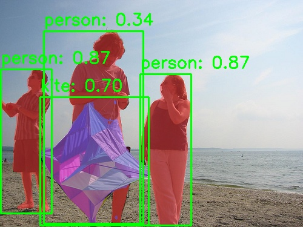

# 视觉 · 实例分割

## 1. 模块概述

- 主要功能：基于 YOLOv8-Seg 的实例分割，在检测目标边界框的同时输出每个实例的像素级掩码（mask），可区分同类不同个体。
- 规格或特性：
  - 支持模型：YOLOv8n-seg、YOLOv8s-seg、YOLOv8m-seg
  - 输入尺寸：`[1, 3, 640, 640]`
  - 量化类型：int8
  - 输出：边界框 + 置信度 + 类别 + 实例掩码
  - 推理后端：ONNX Runtime + SpaceMITExecutionProvider
  - 接口形态：C++（`vision_service.h`）、Python（`spacemit_vision` wheel：`VisionServiceNative`）
- 相关目录结构：

```
examples/yolov8_seg/
├── config/yolov8_seg.yaml   # 配置文件
├── cpp/yolov8_seg.cpp       # C++ 示例
├── python/yolov8_seg.py     # Python 示例
└── scripts/                 # 模型下载脚本
src/deploy/yolov8_seg/       # 部署实现（C++ / Python）
```

## 2. 环境准备

### 前置条件

SDK 源码获取和基础编译环境配置统一参考 2.3-构建编译。完成 SDK 初始化后，回到本文继续执行“构建编译”。

后续命令默认在 K1 设备的 `spacemit_robot` SDK 根目录执行。

### 构建编译

系统缺少依赖时先安装：

```bash
sudo apt install python3-spacemit-ort opencv-spacemit spacemit-onnxruntime \
    eigen-spacemit openblas-spacemit libeigen3-dev libyaml-cpp-dev \
    python3-venv python3-numpy libtesseract5
```

在 SDK 根目录加载构建环境，选择 K1 target，然后编译视觉组件：

```bash
cd /root/spacemit_robot
source build/envsetup.sh
lunch k1-muse-pipro-ai-cubpet

cd components/model_zoo/vision
mm
```

SDK 集成构建会把本模块示例程序安装到 `output/staging/bin`。

### 安装 Python 接口

运行 Python 示例前，先创建并激活虚拟环境：

```bash
cd /root/spacemit_robot/components/model_zoo/vision
if [ ! -d /root/.comm-env ]; then
    /usr/bin/python3 -m venv /root/.comm-env
fi
source /root/.comm-env/bin/activate
```

安装 Python 构建工具和运行依赖：

```bash
python3 -m pip install -U pybind11 build setuptools wheel
python3 -m pip install pyyaml
```

K1 当前厂商 OpenCV 需配合 NumPy 1.x 使用。将系统 Python 包目录和厂商 OpenCV 加入搜索路径，优先使用系统提供的 NumPy：

```bash
export PYTHONPATH="/usr/lib/python3/dist-packages:/opt/opencv-spacemit/lib/python3.12/dist-packages/cv2/python-3${PYTHONPATH:+:$PYTHONPATH}"
```

构建并安装 `spacemit_vision` wheel：

```bash
cmake -S . -B build \
    -DPython3_EXECUTABLE=/root/.comm-env/bin/python3
cmake --build build -j4

python3 -m pip install --force-reinstall --no-deps src/python/dist/*.whl

python3 -c "import cv2, numpy, yaml; from spacemit_vision import VisionServiceNative; print(\"ok\")"
```

输出 `ok` 表示 Python 接口安装及导入检查成功。每次新开终端运行 Python 示例时，需重新激活虚拟环境并执行上述 `export PYTHONPATH` 命令。

模型权重默认存放路径以本模块第 3 节为准。运行示例前须执行对应模型的下载脚本；模型缺失时程序会报错 `Model file not found`。

## 3. 示例使用（从 0 跑通）

示例配置默认使用 `num_threads: 8`。当前 K1 运行时报告可用 AI 核为 4，需将**推理线程数**改为 `4`；下面各示例均包含修改命令，Python 和 C++ 共用对应 YAML，无需重新编译。`sed -i.bak` 会将本次修改前的配置保存为同名 `.bak` 文件。

### 3.1 YOLOv8-Seg 实例分割（Python）

**前置**：见 §2。

**步骤 1**：下载模型

```bash
cd components/model_zoo/vision
bash examples/yolov8_seg/scripts/download_models.sh
```

预期现象：模型文件下载至 `~/.cache/models/vision/yolov8_seg/yolov8n-seg.q.onnx`。

**步骤 2**：下载测试素材

```bash
bash scripts/download_assets.sh
```

**步骤 3**：运行推理

```bash
sed -i.bak 's/num_threads: 8/num_threads: 4/' examples/yolov8_seg/config/yolov8_seg.yaml

python3 examples/yolov8_seg/python/yolov8_seg.py --config examples/yolov8_seg/config/yolov8_seg.yaml
```

**步骤 4**（可选）：使用摄像头实时分割

先确认摄像头设备号（`--camera-id` 为 `/dev/videoN` 中的 `N`，默认为0）：

```bash
v4l2-ctl --list-devices
ls /dev/video*
```

摄像头窗口需要可用的图形显示环境。从开发电脑查看画面时，在电脑本地桌面终端建立 X11 转发连接，将 `K1_IP` 替换为 K1 的实际地址：

```bash
ssh -S none -Y root@K1_IP
```

登录后在同一终端运行示例；`DISPLAY` 由 SSH 自动设置。若没有 X11 转发或本机图形会话，OpenCV 会报 `Can't initialize GTK backend`。

若 `--camera-id 0` 无法打开，请根据输出选择实际采集节点（例如 `/dev/video20` 对应 `--camera-id 20`）。需要时可执行 `v4l2-ctl -d /dev/videoN --all` 查看节点详情。

```bash
python3 examples/yolov8_seg/python/yolov8_seg.py --config examples/yolov8_seg/config/yolov8_seg.yaml --use-camera --camera-id 0
```

### 3.2 YOLOv8-Seg 实例分割（C++）

**前置**：见 §2，C++ 编译完成。

**步骤 1**：下载模型（同 §3.1 步骤 1）

**步骤 2**：运行推理

```bash
sed -i.bak 's/num_threads: 8/num_threads: 4/' examples/yolov8_seg/config/yolov8_seg.yaml

yolov8_seg examples/yolov8_seg/config/yolov8_seg.yaml
```

**步骤 3**（可选）：使用摄像头实时分割

设备号查询方式见 §3.1 步骤 4。

```bash
yolov8_seg examples/yolov8_seg/config/yolov8_seg.yaml --use-camera --camera-id 0
```

### 3.3 运行结果示例

**终端输出示例**：

```
Detected 4 objects with segmentation masks
Result image saved to: yolov8_seg_result.jpg
```

**可视化结果**：



图中展示了检测到的目标边界框和彩色实例掩码，不同实例使用不同颜色区分。

## 4. 应用开发

本章面向应用开发者，说明如何在自己的 C++ 或 Python 应用中集成实例分割组件。完整接口定义以 `include/vision_service.h` 和 `src/python/spacemit_vision/vision_service_native.py` 为准；本节介绍常用公开接口和典型调用方式。

### 4.1 接口说明

实例分割组件的核心入口是 `VisionService`（C++）和 `VisionServiceNative`（Python，`spacemit_vision` wheel）。应用侧通过这些接口加载 YOLOv8-Seg 模型，并发起图像或视频流的实例分割请求。

#### 4.1.1 常用数据结构

| 类型 | 说明 |
| --- | --- |
| vision::Segmentation | 分割结果（位于 `namespace vision`），字段：边界框 `bbox`（`vision::BoundingBox`，含 x1/y1/x2/y2）、置信度 `score`、类别 ID `label`、实例掩码 `mask`（`std::shared_ptr<cv::Mat>`，可能为空）。 |
| vision::Result | 统一结果 variant（`std::variant<Detection, Classification, Pose, Segmentation, ...>`）。分割任务实际持有 `vision::Segmentation`。可用访问器 `vision::get_label`、`vision::get_score`、`vision::get_bbox` 读取公共字段。 |
| VisionServiceResponse | 推理响应，`results` 为 `vision::ResultList`（即 `std::vector<vision::Result>`），并含 `ok`、`error_message`。 |

#### 4.1.2 服务初始化

**C++ 接口**

| 接口 | 说明 | 参数 | 返回值 |
| --- | --- | --- | --- |
| VisionService::Create | 从 YAML 配置文件创建分割服务实例 | config_path：YAML 配置文件路径 | VisionService 智能指针 |
| VisionService::LastCreateError | 获取最近一次创建失败的错误信息 | 无 | 错误描述字符串 |

**Python 接口**

| 接口 | 说明 | 参数 | 返回值 |
| --- | --- | --- | --- |
| VisionServiceNative.create | 从 YAML 配置文件创建分割服务实例 | config_path：YAML 路径；model_path_override：可选覆盖模型路径 | VisionServiceNative 实例 |
| VisionServiceNative.last_create_error | 获取最近一次创建失败的错误信息 | 无 | 错误描述字符串 |

#### 4.1.3 实例分割

**C++ 接口**

| 接口 | 说明 | 参数 | 返回值 |
| --- | --- | --- | --- |
| Infer | 对图像文件进行实例分割 | image_path：图像文件路径；response：输出响应 | VisionServiceStatus（`VISION_SERVICE_OK` 为成功） |
| Infer | 对 cv::Mat 图像进行实例分割 | image：OpenCV Mat 对象；response：输出响应 | VisionServiceStatus（`VISION_SERVICE_OK` 为成功） |
| Draw | 在图像上绘制分割结果（边界框、标签、掩码），无状态，需显式传入 response | image：输入图像；response：推理响应；out_image：输出图像 | VisionServiceStatus |
| LastError | 获取最近一次推理的错误信息 | 无 | 错误描述字符串 |

**Python 接口**

| 接口 | 说明 | 参数 | 返回值 |
| --- | --- | --- | --- |
| infer_image | 对图像进行实例分割 | image_or_path：BGR numpy 数组或图像路径；conf/iou：可选阈值 | (VisionServiceStatus, results 列表；每项含 label、score、x1~y2、mask) |
| draw | 绘制最近一次推理结果（含掩码） | image：BGR numpy 数组 | (VisionServiceStatus, 绘制后图像) |
| supports_draw | 当前模型是否支持 C++ 侧绘制 | 无 | bool |
| last_error | 获取最近一次推理错误 | 无 | 错误描述字符串 |

#### 4.1.4 性能监控

**C++ 接口**

| 接口 | 说明 | 参数 | 返回值 |
| --- | --- | --- | --- |
| SetTimingOptions | 启用/禁用性能计时 | options：`VisionServiceTimingOptions`（设置 `enabled` 等） | void |
| GetLastTiming | 获取最近一次推理的各阶段耗时 | 无 | `VisionServiceTiming` 结构体（preprocess_ms、model_infer_ms、postprocess_ms、infer_ms 等） |

### 4.2 典型调用流程

#### 4.2.1 C++ 单图分割

```cpp
#include "vision_service.h"
#include <opencv2/opencv.hpp>
#include <iostream>
#include <variant>

int main() {
    // 1. 创建服务
    auto service = VisionService::Create("examples/yolov8_seg/config/yolov8_seg.yaml");
    if (!service) {
        std::cerr << "Failed to create service: " 
                  << VisionService::LastCreateError() << std::endl;
        return -1;
    }

    // 2. 启用性能计时（可选）
    VisionServiceTimingOptions timing_options;
    timing_options.enabled = true;
    service->SetTimingOptions(timing_options);

    // 3. 执行推理
    VisionServiceResponse response;
    VisionServiceStatus ret = service->Infer("test.jpg", &response);
    if (ret != VISION_SERVICE_OK) {
        std::cerr << "Inference failed: " << service->LastError() << std::endl;
        return -1;
    }

    // 4. 处理结果
    std::cout << "Detected " << response.results.size() << " objects with masks:" << std::endl;
    for (const auto& result : response.results) {
        vision::BoundingBox box = vision::get_bbox(result);
        std::cout << "  Class " << vision::get_label(result)
                  << ", Score: " << vision::get_score(result)
                  << ", Box: [" << box.x1 << "," << box.y1 << ","
                  << box.x2 << "," << box.y2 << "]";

        // 访问实例掩码（分割结果具体类型为 vision::Segmentation）
        if (const vision::Segmentation* seg = std::get_if<vision::Segmentation>(&result)) {
            if (seg->mask && !seg->mask->empty()) {
                std::cout << ", Mask size: " << seg->mask->size() << std::endl;
            } else {
                std::cout << ", No mask" << std::endl;
            }
        } else {
            std::cout << std::endl;
        }
    }

    // 5. 绘制结果（包含掩码，需显式传入 response）
    cv::Mat image = cv::imread("test.jpg");
    cv::Mat output;
    service->Draw(image, response, &output);
    cv::imwrite("result.jpg", output);

    // 6. 查看性能指标（可选）
    VisionServiceTiming timing = service->GetLastTiming();
    std::cout << "Preprocess: " << timing.preprocess_ms << " ms" << std::endl;
    std::cout << "Inference: " << timing.model_infer_ms << " ms" << std::endl;
    std::cout << "Postprocess: " << timing.postprocess_ms << " ms" << std::endl;

    return 0;
}
```

#### 4.2.2 C++ 视频流分割

```cpp
#include "vision_service.h"
#include <opencv2/opencv.hpp>

int main() {
    auto service = VisionService::Create("examples/yolov8_seg/config/yolov8_seg.yaml");
    cv::VideoCapture cap(20);  // 打开摄像头
    cv::Mat frame, output;

    while (cap.read(frame)) {
        VisionServiceResponse response;
        VisionServiceStatus ret = service->Infer(frame, &response);
        if (ret != VISION_SERVICE_OK) break;
        service->Draw(frame, response, &output);

        cv::imshow("Segmentation", output);
        if (cv::waitKey(1) == 'q') break;
    }

    return 0;
}
```

#### 4.2.3 Python 单图分割

```python
import cv2
from spacemit_vision import VisionServiceNative, VisionServiceStatus

svc = VisionServiceNative.create("examples/yolov8_seg/config/yolov8_seg.yaml")
image = cv2.imread("test.jpg")

status, results = svc.infer_image(image)
if status != VisionServiceStatus.OK:
    raise RuntimeError(svc.last_error())

print(f"Detected {len(results)} objects with masks:")
for r in results:
    print(f"  Class {r.label}, Score: {r.score:.4f}, "
          f"Box: [{r.x1:.1f},{r.y1:.1f},{r.x2:.1f},{r.y2:.1f}]")
    if r.mask is not None and getattr(r.mask, 'size', 0):
        print(f"    Mask shape: {r.mask.shape}")

if svc.supports_draw():
    st, output = svc.draw(image)
    if st == VisionServiceStatus.OK:
        cv2.imwrite("result.jpg", output)
```

#### 4.2.4 Python 视频流分割

```python
import cv2
from spacemit_vision import VisionServiceNative, VisionServiceStatus

svc = VisionServiceNative.create("examples/yolov8_seg/config/yolov8_seg.yaml")
cap = cv2.VideoCapture(20)

while True:
    ret, frame = cap.read()
    if not ret:
        break
    status, _ = svc.infer_image(frame)
    if status != VisionServiceStatus.OK:
        break
    output = frame
    if svc.supports_draw():
        st, output = svc.draw(frame)
    cv2.imshow("Segmentation", output)
    if cv2.waitKey(1) & 0xFF == ord('q'):
        break

cap.release()
cv2.destroyAllWindows()
```

### 4.3 配置说明

YAML 配置文件是模型加载和推理参数的核心，以下是完整配置项说明：

```yaml
# 模型文件路径（必须是 -seg 后缀的分割模型）
model_path: ~/.cache/models/vision/yolov8_seg/yolov8n-seg.q.onnx

# 测试图像路径（用于示例程序）
test_image: ~/.cache/assets/image/006_test.jpg

# 类别标签文件路径（COCO 80 类）
label_file_path: assets/labels/coco.txt

# 模型输入尺寸 [height, width]
image_size: [640, 640]

# 部署类名（C++ 模型工厂注册名，Python 通过 yaml 路径间接使用）
class: deploy.yolov8_seg.YOLOv8SegDetector

# 推理参数
default_params:
  # 置信度阈值（0.0-1.0），低于此值的检测框将被过滤
  conf_threshold: 0.25
  
  # IOU 阈值（0.0-1.0），用于 NMS 非极大值抑制
  iou_threshold: 0.45
  
  # 推理线程数（K1 当前运行时可用 AI 核为 4）
  num_threads: 4
  
  # 推理后端（优先使用 SpaceMITExecutionProvider）
  providers:
    - SpaceMITExecutionProvider
    - CPUExecutionProvider  # 备用后端
```

**参数调优建议**：

- **conf_threshold**：提高可减少误检，降低可增加召回率。本次测试为 20.25 适用于大多数场景。
- **iou_threshold**：提高可保留更多重叠框，降低可减少冗余检测。本次测试为 20.45 平衡效果。
- **num_threads**：示例配置默认值为 8；K1 当前运行时报告可用 AI 核为 4，运行前需改为 4。该参数控制推理线程数，不表示 Linux CPU 核总数。
- **providers**：优先使用 SpaceMITExecutionProvider 以获得最佳性能，CPUExecutionProvider 作为备用。
- **image_size**：保持 [640, 640] 以获得最佳分割精度，降低分辨率会导致掩码边界粗糙。

### 4.4 性能监控

通过启用性能计时，可以分析推理各阶段的耗时，用于性能优化和瓶颈定位。

**C++ 示例**：

```cpp
VisionServiceTimingOptions timing_options;
timing_options.enabled = true;
service->SetTimingOptions(timing_options);

VisionServiceResponse response;
service->Infer("test.jpg", &response);

VisionServiceTiming timing = service->GetLastTiming();
std::cout << "Preprocess: " << timing.preprocess_ms << " ms" << std::endl;
std::cout << "Inference: " << timing.model_infer_ms << " ms" << std::endl;
std::cout << "Postprocess: " << timing.postprocess_ms << " ms" << std::endl;
std::cout << "Total: " << timing.infer_ms << " ms" << std::endl;
```

**性能优化建议**：

- 预处理耗时高：检查图像尺寸是否过大，考虑降低输入分辨率（但会影响掩码质量）。
- 推理耗时高：确认使用 SpaceMITExecutionProvider，检查线程数设置。实例分割比目标检测慢 20-30%。
- 后处理耗时高：掩码生成和 NMS 是主要开销，适当提高 conf_threshold 可减少处理对象数量。

**参考 demo 路径**：`examples/yolov8_seg/`

## 5. 调试指南

- 启用计时：通过 `SetTimingOptions` 查看预处理、推理、后处理各阶段耗时
- 掩码为空：确认使用的是 `-seg` 后缀的模型文件，普通检测模型不输出掩码
- 检查模型加载：`VisionService::LastCreateError()` 获取错误详情

## 6. 常见问题

| 现象 | 可能原因 | 处理 |
| --- | --- | --- |
| `Model file not found` | 模型未下载 | 执行 `bash examples/yolov8_seg/scripts/download_models.sh` |
| `No module named 'spacemit_vision'` | wheel 未安装 | 按 §2 编译并 `pip install src/python/dist/*.whl` |
| 掩码结果为空 | 使用了非 seg 模型 | 确认 `model_path` 指向 `yolov8n-seg.q.onnx` |
| 分割边界粗糙 | 输入分辨率不足 | 确认 `image_size` 为 `[640, 640]` |

## 附录：性能与测试数据

以下为在 K1 上实测的纯 ONNX 模型推理结果，不包含图像预处理、后处理、摄像头采集、绘制和窗口显示，因此不等同于实时视频窗口帧率。

### K1 平台

| 具体模型 | 输入大小 | 数据类型 | 帧率（4 个 EP 推理线程） |
| --- | --- | --- | ---: |
| yolov8n-seg | [1,3,640,640] | int8 | 11.6 |
| yolov8s-seg | [1,3,640,640] | int8 | 5.5 |
| yolov8m-seg | [1,3,640,640] | int8 | 2.4 |

**复现方法**：使用 `onnxruntime_perf_test`，每个模型执行 3 轮、每轮 200 次，设置 4 个 EP 推理线程，取三轮帧率中位数：

```bash
onnxruntime_perf_test ~/.cache/models/vision/yolov8_seg/yolov8n-seg.q.onnx \
    -e spacemit -r 200 -x 1 -S 1 -s -I -c 1 \
    -i "SPACEMIT_EP_INTRA_THREAD_NUM|4"
```
