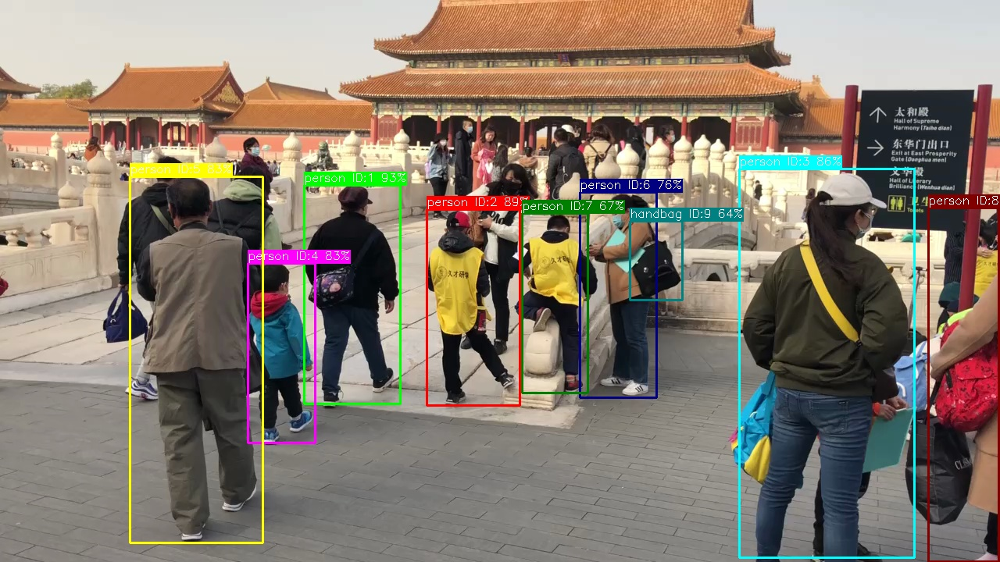

# 视觉 · 多目标跟踪

## 1. 模块概述

- 主要功能：基于检测器 + 跟踪器的多目标跟踪（MOT），在视频流中为每个目标分配唯一 ID 并维持跨帧关联。支持 ByteTrack 和 OC-SORT 两种跟踪算法，均以 YOLOv8 作为前端检测器。
- 规格或特性：
  - 支持跟踪器：ByteTrack、OC-SORT
  - 前端检测器：YOLOv8n
  - 检测器输入尺寸：`[1, 3, 640, 640]`
  - 量化类型：int8（检测器）
  - 输出：边界框 + 置信度 + 类别 + 跟踪 ID（track_id）
  - 推理后端：ONNX Runtime + SpaceMITExecutionProvider
  - 接口形态：C++（`vision_service.h`）、Python（`spacemit_vision` wheel：`VisionServiceNative`）
- 相关目录结构：

```
examples/bytetrack/
├── config/bytetrack.yaml    # ByteTrack 配置
├── cpp/bytetrack.cpp        # C++ 示例
├── python/bytetrack.py      # Python 示例
└── scripts/                 # 模型下载脚本
examples/ocsort/
├── config/ocsort.yaml       # OC-SORT 配置
├── cpp/ocsort.cpp           # C++ 示例
├── python/ocsort.py         # Python 示例
└── scripts/                 # 模型下载脚本
src/deploy/bytetrack/        # ByteTrack 部署实现
src/deploy/ocsort/           # OC-SORT 部署实现
```

## 2. 环境准备

### 前置条件

SDK 源码获取和基础编译环境配置统一参考 2.3-构建编译。完成 SDK 初始化后，回到本文继续执行“构建编译”。

后续命令默认在 K1 设备的 `spacemit_robot` SDK 根目录执行。

### 构建编译

系统缺少依赖时先安装：

```bash
sudo apt install python3-spacemit-ort opencv-spacemit spacemit-onnxruntime \
    eigen-spacemit openblas-spacemit libeigen3-dev libyaml-cpp-dev \
    python3-venv python3-numpy libtesseract5
```

在 SDK 根目录加载构建环境，选择 K1 target，然后编译视觉组件：

```bash
cd /root/spacemit_robot
source build/envsetup.sh
lunch k1-muse-pipro-ai-cubpet

cd components/model_zoo/vision
mm
```

SDK 集成构建会把本模块示例程序安装到 `output/staging/bin`。

### 安装 Python 接口

运行 Python 示例前，先创建并激活虚拟环境：

```bash
cd /root/spacemit_robot/components/model_zoo/vision
if [ ! -d /root/.comm-env ]; then
    /usr/bin/python3 -m venv /root/.comm-env
fi
source /root/.comm-env/bin/activate
```

安装 Python 构建工具和运行依赖：

```bash
python3 -m pip install -U pybind11 build setuptools wheel
python3 -m pip install pyyaml
```

K1 当前厂商 OpenCV 需配合 NumPy 1.x 使用。将系统 Python 包目录和厂商 OpenCV 加入搜索路径，优先使用系统提供的 NumPy：

```bash
export PYTHONPATH="/usr/lib/python3/dist-packages:/opt/opencv-spacemit/lib/python3.12/dist-packages/cv2/python-3${PYTHONPATH:+:$PYTHONPATH}"
```

构建并安装 `spacemit_vision` wheel：

```bash
cmake -S . -B build \
    -DPython3_EXECUTABLE=/root/.comm-env/bin/python3
cmake --build build -j4

python3 -m pip install --force-reinstall --no-deps src/python/dist/*.whl

python3 -c "import cv2, numpy, yaml; from spacemit_vision import VisionServiceNative; print(\"ok\")"
```

输出 `ok` 表示 Python 接口安装及导入检查成功。每次新开终端运行 Python 示例时，需重新激活虚拟环境并执行上述 `export PYTHONPATH` 命令。

模型权重默认存放路径以本模块第 3 节为准。运行示例前须执行对应模型的下载脚本；模型缺失时程序会报错 `Model file not found`。

## 3. 示例使用（从 0 跑通）

示例配置默认使用 `num_threads: 8`。当前 K1 运行时报告可用 AI 核为 4，需将**推理线程数**改为 `4`；下面各示例均包含修改命令，Python 和 C++ 共用对应 YAML，无需重新编译。`sed -i.bak` 会将本次修改前的配置保存为同名 `.bak` 文件。

### 3.1 ByteTrack 多目标跟踪（Python）

**前置**：见 §2。

**步骤 1**：下载模型

```bash
cd components/model_zoo/vision
bash examples/bytetrack/scripts/download_models.sh
```

预期现象：模型文件下载至 `~/.cache/models/vision/yolov8/yolov8n_no_dfl.q.onnx`。

**步骤 2**：下载测试素材

```bash
bash scripts/download_assets.sh
```

预期现象：测试视频下载至 `~/.cache/assets/video/003_palace.mp4`。

**步骤 3**：运行跟踪

```bash
sed -i.bak 's/num_threads: 8/num_threads: 4/' examples/bytetrack/config/bytetrack.yaml

python3 examples/bytetrack/python/bytetrack.py --config examples/bytetrack/config/bytetrack.yaml
```

预期现象：视频窗口显示带有跟踪 ID 的检测框，终端输出每帧的跟踪结果与 FPS。

**步骤 4**（可选）：使用摄像头

先确认摄像头设备号（`--camera-id` 为 `/dev/videoN` 中的 `N`，默认为 `0`）：

```bash
v4l2-ctl --list-devices
ls /dev/video*
```

摄像头窗口需要可用的图形显示环境。从开发电脑查看画面时，在电脑本地桌面终端建立 X11 转发连接，将 `K1_IP` 替换为 K1 的实际地址：

```bash
ssh -S none -Y root@K1_IP
```

登录后在同一终端运行示例；`DISPLAY` 由 SSH 自动设置。若没有 X11 转发或本机图形会话，OpenCV 会报 `Can't initialize GTK backend`。

若 `--camera-id 0` 无法打开，请根据输出选择实际采集节点（例如 `/dev/video20` 对应 `--camera-id 20`）。需要时可执行 `v4l2-ctl -d /dev/videoN --all` 查看节点详情。

```bash
# Python ByteTrack（可选摄像头设备号，本次测试为 20）
python3 examples/bytetrack/python/bytetrack.py --config examples/bytetrack/config/bytetrack.yaml --use-camera --camera-id 20

# Python OC-SORT（可选摄像头设备号，本次测试为 20）
python3 examples/ocsort/python/ocsort.py --config examples/ocsort/config/ocsort.yaml --use-camera --camera-id 20

# C++ ByteTrack（可选摄像头设备号，本次测试为 20）
bytetrack examples/bytetrack/config/bytetrack.yaml --use-camera --camera-id 0

# C++ OC-SORT（可选摄像头设备号，本次测试为 20）
ocsort examples/ocsort/config/ocsort.yaml --use-camera --camera-id 0
```

### 3.2 OC-SORT 多目标跟踪（Python）

**步骤 1**：下载模型

```bash
bash examples/ocsort/scripts/download_models.sh
```

**步骤 2**：运行跟踪

```bash
sed -i.bak 's/num_threads: 8/num_threads: 4/' examples/ocsort/config/ocsort.yaml

python3 examples/ocsort/python/ocsort.py --config examples/ocsort/config/ocsort.yaml
```

**步骤 3**（可选）：使用摄像头实时跟踪

设备号查询方式见 §3.1 步骤 4。

```bash
python3 examples/ocsort/python/ocsort.py --config examples/ocsort/config/ocsort.yaml --use-camera --camera-id 0
```

### 3.3 ByteTrack / OC-SORT（C++）

```bash
# ByteTrack
sed -i.bak 's/num_threads: 8/num_threads: 4/' examples/bytetrack/config/bytetrack.yaml
bytetrack examples/bytetrack/config/bytetrack.yaml

# OC-SORT
sed -i.bak 's/num_threads: 8/num_threads: 4/' examples/ocsort/config/ocsort.yaml
ocsort examples/ocsort/config/ocsort.yaml
```

### 3.4 运行结果示例

**终端输出示例**（以 ByteTrack 为例）：

```
bytetrack examples/bytetrack/config/bytetrack.yaml
Opening video: /root/.cache/assets/video/003_palace.mp4
Real-time display. Press 'q' to quit.
SpaceMIT EP initialized successfully!
```

**可视化结果**：



图中展示了视频帧中的目标检测框和跟踪 ID，相同 ID 在不同帧中保持一致。

## 4. 应用开发

本章面向应用开发者，说明如何在自己的 C++ 或 Python 应用中集成多目标跟踪组件。完整接口定义以 `include/vision_service.h` 和 `src/python/spacemit_vision/vision_service_native.py` 为准；本节介绍常用公开接口和典型调用方式。

### 4.1 接口说明

多目标跟踪组件支持 ByteTrack 和 OC-SORT 两种算法，均基于检测 + 跟踪范式。应用侧逐帧输入视频帧，组件输出检测框和跨帧唯一的跟踪 ID。

#### 4.1.1 常用数据结构

| 类型 | 说明 |
| --- | --- |
| vision::Tracking | 跟踪结果具体类型（位于 `namespace vision`），字段包含边界框 `bbox`（BoundingBox，含 x1/y1/x2/y2）、置信度 `score`、类别 ID `label`、跟踪 ID `track_id`、跟踪状态 `state`（Tentative/Confirmed/Lost）。 |
| VisionServiceResponse | 推理响应，`results` 字段为 variant 列表 `vision::ResultList`，承载本次推理的所有结果（跟踪场景为 `vision::Tracking`）。 |
| vision::get_track_id / get_bbox / get_label / get_score | 读取 variant 结果共有字段的便捷函数；`track_id` 用 `vision::get_track_id(result)` 读取。 |

#### 4.1.2 服务初始化

**C++ 接口**

| 接口 | 说明 | 参数 | 返回值 |
| --- | --- | --- | --- |
| VisionService::Create | 从 YAML 配置文件创建跟踪服务实例 | config_path：YAML 配置文件路径 | VisionService 智能指针 |
| VisionService::LastCreateError | 获取最近一次创建失败的错误信息 | 无 | 错误描述字符串 |

**Python 接口**

| 接口 | 说明 | 参数 | 返回值 |
| --- | --- | --- | --- |
| VisionServiceNative.create | 从 YAML 配置文件创建服务实例 | config_path：YAML 路径；model_path_override：可选覆盖模型路径 | VisionServiceNative 实例 |
| VisionServiceNative.last_create_error | 获取最近一次创建失败的错误信息 | 无 | 错误描述字符串 |

#### 4.1.3 多目标跟踪

**C++ 接口**

| 接口 | 说明 | 参数 | 返回值 |
| --- | --- | --- | --- |
| Infer | 对图像文件进行检测和跟踪 | image_path：图像文件路径；response：输出响应 | VisionServiceStatus |
| Infer | 对 cv::Mat 图像进行检测和跟踪 | image：OpenCV Mat 对象；response：输出响应 | VisionServiceStatus |
| Draw | 在图像上绘制跟踪结果（边界框、跟踪 ID、类别）。无状态，需显式传入结果 | image：输入图像；response：推理响应；out_image：输出图像 | VisionServiceStatus |
| LastError | 获取最近一次推理的错误信息 | 无 | 错误描述字符串 |

**Python 接口**

| 接口 | 说明 | 参数 | 返回值 |
| --- | --- | --- | --- |
| infer_image | 对图像进行推理 | image_or_path：BGR numpy 数组或图像路径；conf/iou：可选阈值（<=0 用 yaml 默认） | (VisionServiceStatus, results 列表) |
| draw | 绘制最近一次推理结果 | image：BGR numpy 数组 | (VisionServiceStatus, 绘制后图像) |
| supports_draw | 当前模型是否支持 C++ 侧绘制 | 无 | bool |
| last_error | 获取最近一次推理错误 | 无 | 错误描述字符串 |

#### 4.1.4 性能监控

**C++ 接口**

| 接口 | 说明 | 参数 | 返回值 |
| --- | --- | --- | --- |
| SetTimingOptions | 启用/禁用性能计时 | options：VisionServiceTimingOptions（含 enabled、print_to_stdout） | void |
| GetLastTiming | 获取最近一次推理的各阶段耗时 | 无 | VisionServiceTiming 结构体（跟踪管线含 detect_ms、track_ms、infer_ms；通用图像管线含 preprocess_ms、model_infer_ms、postprocess_ms） |

### 4.2 典型调用流程

#### 4.2.1 C++ 视频跟踪（ByteTrack）

```cpp
#include "vision_service.h"
#include <opencv2/opencv.hpp>
#include <iostream>
#include <variant>

int main() {
    // 1. 创建跟踪服务
    auto tracker = VisionService::Create("examples/bytetrack/config/bytetrack.yaml");
    if (!tracker) {
        std::cerr << "Failed to create tracker: "
                  << VisionService::LastCreateError() << std::endl;
        return -1;
    }

    // 2. 启用性能计时（可选）
    VisionServiceTimingOptions timing_options;
    timing_options.enabled = true;
    tracker->SetTimingOptions(timing_options);

    // 3. 打开视频
    cv::VideoCapture cap("video.mp4");
    cv::Mat frame, output;

    while (cap.read(frame)) {
        // 4. 执行跟踪
        VisionServiceResponse response;
        VisionServiceStatus ret = tracker->Infer(frame, &response);
        if (ret != VISION_SERVICE_OK) {
            std::cerr << "Tracking failed: " << tracker->LastError() << std::endl;
            continue;
        }

        // 5. 处理结果（response.results 为 vision::ResultList 变体列表）
        std::cout << "Frame: " << cap.get(cv::CAP_PROP_POS_FRAMES)
                  << ", Tracked objects: " << response.results.size() << std::endl;

        for (const auto& result : response.results) {
            vision::BoundingBox box = vision::get_bbox(result);
            // 读取跟踪状态需取具体类型 vision::Tracking
            const vision::Tracking* trk = std::get_if<vision::Tracking>(&result);
            std::cout << "  Track ID: " << vision::get_track_id(result)
                      << ", Class: " << vision::get_label(result)
                      << ", Score: " << vision::get_score(result)
                      << ", Box: [" << box.x1 << "," << box.y1 << ","
                      << box.x2 << "," << box.y2 << "]";
            if (trk) {
                std::cout << ", State: " << static_cast<int>(trk->state);
            }
            std::cout << std::endl;
        }

        // 6. 绘制结果（无状态，显式传入 response）
        tracker->Draw(frame, response, &output);
        cv::imshow("Tracking", output);

        if (cv::waitKey(1) == 'q') break;
    }

    // 7. 查看性能指标（可选）
    auto timing = tracker->GetLastTiming();
    std::cout << "Detection: " << timing.detect_ms << " ms" << std::endl;
    std::cout << "Tracking: " << timing.track_ms << " ms" << std::endl;

    return 0;
}
```

#### 4.2.2 C++ 实时摄像头跟踪

```cpp
#include "vision_service.h"
#include <opencv2/opencv.hpp>

int main() {
    auto tracker = VisionService::Create("examples/bytetrack/config/bytetrack.yaml");
    cv::VideoCapture cap(20);  // 打开摄像头
    cv::Mat frame, output;

    while (cap.read(frame)) {
        VisionServiceResponse response;
        if (tracker->Infer(frame, &response) != VISION_SERVICE_OK) continue;
        tracker->Draw(frame, response, &output);

        cv::imshow("Real-time Tracking", output);
        if (cv::waitKey(1) == 'q') break;
    }

    return 0;
}
```

#### 4.2.3 Python 视频跟踪（ByteTrack）

```python
import cv2
from spacemit_vision import VisionServiceNative, VisionServiceStatus

tracker = VisionServiceNative.create("examples/bytetrack/config/bytetrack.yaml")
cap = cv2.VideoCapture("video.mp4")

while True:
    ret, frame = cap.read()
    if not ret:
        break

    status, tracks = tracker.infer_image(frame)
    if status != VisionServiceStatus.OK:
        raise RuntimeError(tracker.last_error())

    for r in tracks:
        print(f"Track ID: {r.track_id}, Class: {r.label}, Score: {r.score:.4f}")

    output = frame
    if tracker.supports_draw():
        st, output = tracker.draw(frame)
    cv2.imshow("Tracking", output)
    if cv2.waitKey(1) & 0xFF == ord('q'):
        break

cap.release()
cv2.destroyAllWindows()
```

#### 4.2.4 Python 跟踪轨迹记录

```python
import cv2
from collections import defaultdict
from spacemit_vision import VisionServiceNative, VisionServiceStatus

tracker = VisionServiceNative.create("examples/bytetrack/config/bytetrack.yaml")
cap = cv2.VideoCapture("video.mp4")
trajectories = defaultdict(list)

while True:
    ret, frame = cap.read()
    if not ret:
        break

    status, tracks = tracker.infer_image(frame)
    if status != VisionServiceStatus.OK:
        break

    for r in tracks:
        cx, cy = (r.x1 + r.x2) / 2, (r.y1 + r.y2) / 2
        trajectories[r.track_id].append((cx, cy))

    output = frame.copy()
    if tracker.supports_draw():
        st, drawn = tracker.draw(frame)
        if st == VisionServiceStatus.OK:
            output = drawn
    for track_id, points in trajectories.items():
        for i in range(1, len(points)):
            cv2.line(output,
                     (int(points[i-1][0]), int(points[i-1][1])),
                     (int(points[i][0]), int(points[i][1])),
                     (0, 255, 0), 2)

    cv2.imshow("Tracking with Trajectories", output)
    if cv2.waitKey(1) & 0xFF == ord('q'):
        break

cap.release()
cv2.destroyAllWindows()
```

### 4.3 配置说明

#### 4.3.1 ByteTrack 配置

```yaml
# 检测模型路径（YOLOv8）
model_path: ~/.cache/models/vision/yolov8/yolov8n_no_dfl.q.onnx

# 测试视频路径（用于示例程序）
test_video: ~/.cache/assets/video/003_palace.mp4

# 模型输入尺寸 [height, width]
image_size: [640, 640]

# 类别标签文件路径（COCO 80 类）
label_file_path: assets/labels/coco.txt

# 部署类名（C++ 模型工厂注册名，Python 通过 yaml 路径间接使用）
class: deploy.bytetrack.ByteTrackTracker

# 推理参数
default_params:
  # 检测置信度阈值
  conf_threshold: 0.25
  
  # NMS IOU 阈值
  iou_threshold: 0.45
  
  # 目标丢失后保留帧数
  track_buffer: 30
  
  # 视频帧率（用于速度估计）
  frame_rate: 30
  
  # 推理线程数（K1 当前运行时可用 AI 核为 4）
  num_threads: 4
  
  # 推理后端（优先使用 SpaceMITExecutionProvider）
  providers:
    - SpaceMITExecutionProvider
    - CPUExecutionProvider  # 备用后端
```

#### 4.3.2 OC-SORT 配置

```yaml
# 检测模型路径（YOLOv8）
model_path: ~/.cache/models/vision/ocsort/yolov8n_no_dfl.q.onnx

# 测试视频路径（用于示例程序）
test_video: ~/.cache/assets/video/003_palace.mp4

# 类别标签文件路径（COCO 80 类）
label_file_path: assets/labels/coco.txt

# 部署类名（C++ 模型工厂注册名，Python 通过 yaml 路径间接使用）
class: deploy.ocsort.OCSortTracker

# 推理参数
default_params:
  # 检测置信度阈值
  conf_threshold: 0.25
  
  # NMS IOU 阈值
  iou_threshold: 0.45
  
  # 推理线程数（K1 当前运行时可用 AI 核为 4）
  num_threads: 4
  
  # 推理后端
  providers:
    - SpaceMITExecutionProvider
  
  # OC-SORT 特有参数
  track_thresh: 0.6        # 跟踪置信度阈值
  track_iou_thresh: 0.3    # 跟踪 IoU 阈值
  track_buffer: 60          # 目标丢失后保留帧数
  min_hits: 3               # 最少命中次数
  delta_t: 3                # 速度估计时间间隔
  asso_func: "iou"          # 关联函数（iou 或 giou）
  inertia: 0.2              # 惯性系数
  use_byte: false            # 是否使用 ByteTrack 策略
```

**ByteTrack vs OC-SORT 选择**：

- **ByteTrack**：参数简单，适合一般场景，跟踪速度快，适合实时应用。
- **OC-SORT**：参数更丰富，在遮挡和非线性运动场景下表现更好，适合复杂场景。

**参数调优建议**：

- **track_buffer**：目标丢失后保留帧数，增大可减少 ID 切换，但会增加内存占用。
- **frame_rate**：必须与实际视频帧率一致，否则速度估计不准确。
- **conf_threshold**：检测置信度阈值，过高会导致跟踪丢失。
- **track_thresh**（OC-SORT）：跟踪置信度阈值，降低可减少 ID 切换。
- **num_threads**（检测器）：示例配置默认值为 8；K1 当前运行时报告可用 AI 核为 4，运行前需改为 4。该参数控制检测器推理线程数，不表示 Linux CPU 核总数。

### 4.4 性能监控

通过启用性能计时，可以分析推理各阶段的耗时，用于性能优化和瓶颈定位。

**C++ 示例**：

```cpp
VisionServiceTimingOptions timing_options;
timing_options.enabled = true;
tracker->SetTimingOptions(timing_options);

VisionServiceResponse response;
tracker->Infer(frame, &response);

auto timing = tracker->GetLastTiming();
std::cout << "Detection: " << timing.detect_ms << " ms" << std::endl;
std::cout << "Tracking: " << timing.track_ms << " ms" << std::endl;
std::cout << "Total: " << timing.infer_ms << " ms" << std::endl;
```

**性能优化建议**：

- 检测耗时高：检测是主要瓶颈，使用更轻量的检测模型（yolov8n 而非 yolov8m）。
- 跟踪耗时高：跟踪算法耗时通常很低（< 5ms），如果过高检查 track_buffer 是否过大。
- 整体帧率低：降低输入分辨率或使用更快的检测模型。

**参考 demo 路径**：
- `examples/bytetrack/`、`examples/ocsort/`
- 应用案例：`applications/intrusion_detection/`（入侵检测，检测 + 跟踪联合应用）

## 5. 调试指南

- 启用计时：通过 `SetTimingOptions` 查看 `detect_ms`（检测耗时）和 `track_ms`（跟踪耗时）
- ID 频繁切换：增大 `track_buffer`，降低 `track_thresh`
- 跟踪丢失：确认检测器 `conf_threshold` 不要过高，保证检测连续性
- 视频帧率不匹配：确认 `frame_rate` 与实际视频帧率一致

## 6. 常见问题

| 现象 | 可能原因 | 处理 |
| --- | --- | --- |
| `Model file not found` | 模型未下载 | 执行对应示例的 `download_models.sh` |
| `No module named 'spacemit_vision'` | wheel 未安装 | 按 §2 编译并 `pip install src/python/dist/*.whl` |
| 跟踪 ID 频繁跳变 | `track_buffer` 过小或检测不稳定 | 增大 `track_buffer`，降低 `conf_threshold` |
| 视频无法打开 | 测试视频未下载 | 执行 `bash scripts/download_assets.sh` |
| 跟踪速度慢 | 检测器推理慢 | 确认使用 SpaceMITExecutionProvider |
| `Can't initialize GTK backend` | 当前 SSH 会话没有可用的图形显示转发 | 从开发电脑使用 `ssh -S none -Y root@K1_IP` 登录，并保持该 SSH 会话打开后运行窗口示例 |

## 附录：性能与测试数据

多目标跟踪的整体性能主要取决于前端检测器（YOLOv8n）的推理速度，跟踪算法本身开销很小。以下为K1 上测得的前端检测器纯 ONNX 推理结果，不包含视频读取、跟踪、绘制和窗口显示。

### K1 平台

| 具体模型 | 输入大小 | 数据类型 | 帧率（4 个 EP 推理线程） |
| --- | --- | --- | ---: |
| yolov8n | [1,3,640,640] | int8 | 14.8 |

**复现方法**：执行 3 轮、每轮 200 次，设置 4 个 EP 推理线程，取三轮帧率中位数：

```bash
onnxruntime_perf_test ~/.cache/models/vision/yolov8/yolov8n_no_dfl.q.onnx \
    -e spacemit -r 200 -x 1 -S 1 -s -I -c 1 \
    -i "SPACEMIT_EP_INTRA_THREAD_NUM|4"
```
